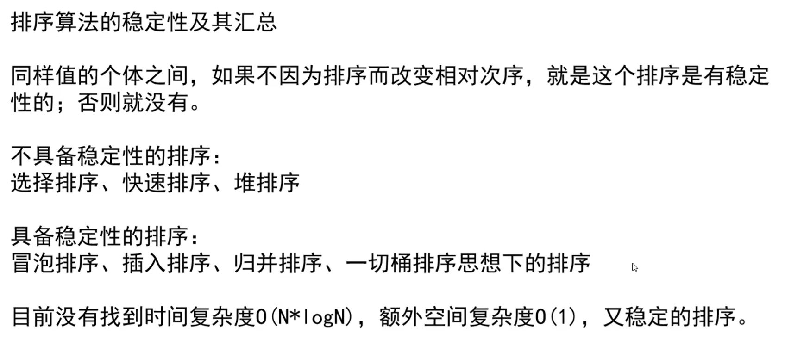

[TOC]

# 对数器

1. 有一个想要测的方法a。
2. 实现复杂度不好但是容易实现的方法b。
3. 实现一个随机样本产生器。
4. 把方法a和方法b跑相同的随机样本，看看得到的结果是否一样。
5. 如果有一个随机样本使得比对结果不一致，打印样本进行人工干预，改对方法a或者方法b。
6. 当样本数量很多时对比测试依然正确，可以确定方法a已经正确。

# 递归

master公式求解规模等量的递推时间复杂度：T(N)=a*T(N/b)+O(N^c^)

- log~b~a > d -> 时间复杂度：O(N^log(b,a)^)
- log~b~a = d -> 时间复杂度：O(N^d^ * logN)
- log~b~a < d -> 时间复杂度：O(N^d^)

