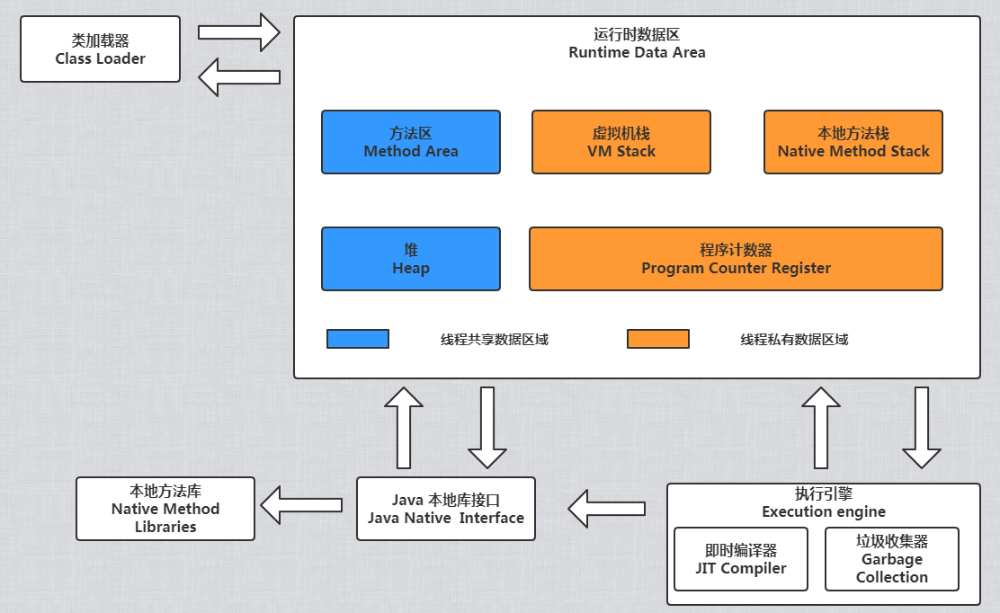

[TOC]

# 1. JVM体系架构

JVM包括四个模块：

- Class loader(类装载)：根据给定的全限定名类名(如：java.lang.Object)来装载class文件到Runtime data area中的method area。
- Execution engine（执行引擎）：执行classes中的指令。
- Native Interface(本地接口)：与native libraries交互，是其它编程语言交互的接口。
- Runtime data area(运行时数据区域)：这就是我们常说的JVM的内存。

Java源文件（.java文件）将通过java编译器（javac命令）编译为字节码（.class文件），类加载器会将字节码加载到内存中，放在运行时数据区的方法区中，而字节码文件只是 JVM 的一套指令集规范，并不能直接交给底层操作系统去执行，因此需要特定的命令解析器执行引擎（Execution Engine），将字节码翻译成底层系统指令，再交由 CPU 去执行，而这个过程中需要调用其他语言的本地库接口（Native Interface）来实现整个程序的功能。

## 1.1 程序计数器

> 内存空间小，线程私有。字节码解释器工作是就是通过改变这个计数器的值来选取下一条需要执行指令的字节码指令，分支、循环、跳转、异常处理、线程恢复等基础功能都需要依赖计数器完成。

如果线程正在执行一个 Java 方法，这个计数器记录的是正在执行的虚拟机字节码指令的地址；如果正在执行的是 Native 方法，这个计数器的值则为 (Undefined)。此内存区域是唯一一个在 Java 虚拟机规范中没有规定任何OOM( OutOfMemoryError )情况的区域。

## 1.2 虚拟机栈

> 线程私有，生命周期和线程一致。描述的是 Java 方法执行的内存模型：每个方法在执行时都会创建一个栈帧(Stack Frame)用于存储`局部变量表`、`操作数栈`、`动态链接`、`方法出口`等信息。每一个方法从调用直至执行结束，就对应着一个栈帧从虚拟机栈中入栈到出栈的过程。

