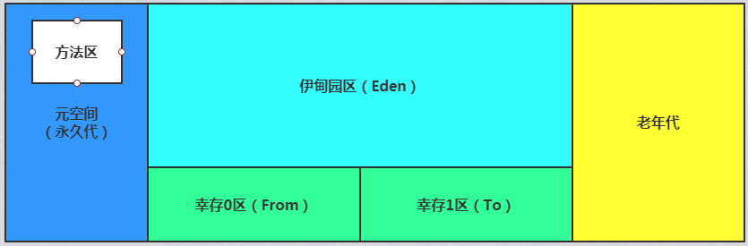

[TOC]

# 1. JVM体系架构


JVM包括四个模块：

- Class loader(类装载)：根据给定的全限定名类名(如：java.lang.Object)来装载class文件到Runtime data area中的method area。
- Execution engine（执行引擎）：执行classes中的指令。
- Native Interface(本地接口)：与native libraries交互，是其它编程语言交互的接口。
- Runtime data area(运行时数据区域)：这就是我们常说的JVM的内存。

Java源文件（.java文件）将通过java编译器（javac命令）编译为字节码（.class文件），类加载器会将字节码加载到内存中，放在运行时数据区的方法区中，而字节码文件只是 JVM 的一套指令集规范，并不能直接交给底层操作系统去执行，因此需要特定的命令解析器执行引擎（Execution Engine），将字节码翻译成底层系统指令，再交由 CPU 去执行，而这个过程中需要调用其他语言的本地库接口（Native Interface）来实现整个程序的功能。

## 1.1 程序计数器

> 内存空间小，线程私有。字节码解释器工作是就是通过改变这个计数器的值来选取下一条需要执行指令的字节码指令，分支、循环、跳转、异常处理、线程恢复等基础功能都需要依赖计数器完成。

如果线程正在执行一个 Java 方法，这个计数器记录的是正在执行的虚拟机字节码指令的地址；如果正在执行的是 Native 方法，这个计数器的值则为 (Undefined)。此内存区域是唯一一个在 Java 虚拟机规范中没有规定任何OOM( OutOfMemoryError )情况的区域。

## 1.2 虚拟机栈

> 线程私有，生命周期和线程一致。描述的是 Java 方法执行的内存模型：每个方法在执行时都会创建一个栈帧(Stack Frame)用于存储`局部变量表`、`操作数栈`、`返回地址`、`动态链接` 的信息。每一个方法从调用直至执行结束，就对应着一个栈帧从虚拟机栈中入栈到出栈的过程。

局部变量表：存放了编译期可知的各种基本类型(boolean、byte、char、short、int、float、long、double)、对象引用(reference 类型)和 returnAddress 类型(指向了一条字节码指令的地址)

StackOverflowError：线程请求的栈深度大于虚拟机所允许的深度。
OutOfMemoryError：如果虚拟机栈可以动态扩展，而扩展时无法申请到足够的内存。

栈：八大基本类型+对象引用+实例的方法

## 1.3 本地方法栈

> 线程私有。区别于 Java 虚拟机栈的是，Java 虚拟机栈为虚拟机执行 Java 方法(也就是字节码)服务，而本地方法栈则为虚拟机使用到的 native 方法服务，登记native 关键字标识的接口，最终通过调用JNI执行。也会有 StackOverflowError 和 OutOfMemoryError 异常。

## 1.4 堆

> 线程共享，主要是存放对象实例和数组。对于绝大多数应用来说，这块区域是 JVM 所管理的内存中最大的一块。内部会划分出多个线程私有的分配缓冲区(Thread Local Allocation Buffer, TLAB)。可以位于物理上不连续的空间，但是逻辑上要连续。

OutOfMemoryError：如果堆中没有内存完成实例分配，并且堆也无法再扩展时，抛出该异常。

## 1.5 方法区

> 属于共享内存区域，所有字段和方法字节码以及一些特殊方法，如构造函数，接口代码也在此定义，简单说，所有定义的方法的信息都保存在该区域。

==静态变量、常量、类信息（构造方法，接口定义）、运行时的常量池、即时编译器编译后的代码存在方法区中，但是实例变量存在堆内存中，与方法区无关。==

static 、 final 、 Class  、运行时常量池

## 1.6 直接内存

> 非虚拟机运行时数据区的部分。

在 JDK 1.4 中新加入 NIO (New Input/Output) 类，引入了一种基于通道(Channel)和缓存(Buffer)的 I/O 方式，它可以使用 Native 函数库直接分配堆外内存，然后通过一个存储在 Java 堆中的 DirectByteBuffer 对象作为这块内存的引用进行操作。可以避免在 Java 堆和 Native 堆中来回的数据耗时操作。
OutOfMemoryError：会受到本机内存限制，如果内存区域总和大于物理内存限制从而导致动态扩展时出现该异常。

# 2. 类加载器

加载器的类型为：

1. 虚拟机自带的加载器
2. 启动类（根）加载器(BootStrap)
3. 扩展类加载器(Ext)
4. 应用程序（系统类）加载器(APP)
5. 用户自定义加载器

>  双亲委派机制：类加载器收到类加载请求时，将这个请求转交给父类加载器加载，一直到启动类加载器（Bootstrap）；启动类加载器确认是否能加载，能加载就结束，使用当前加载器，否则抛出异常然后委派给子类加载，直到应用程序加载器。所有加载器都无法加载时抛出ClassNotFoudException。

#  3.沙箱安全机制

组成是沙箱的基本组件：

- 字节码校验器（bytecode verifier）：确保Java类文件遵循Java语言规范，这样可以帮助Java程序实现内存保护。但并不是所有的类文件都会经过字节码校验，如核心类。

- 类装载器（class loader）:其中类装载器在3个方面对Java沙箱器作用：

  - 防止恶意代码去干涉善意的代码；

  - 守护了被信任的类库边界；
  - 将代码归入保护域，确定了代码可以进行哪些操作。

类装载器采用的机制是双亲委派模式。

1. 从最内侧JVM自带的类加载器开始加载，防止恶意同名类得不到加载从而无法使用；
2. 由于严格通过包来区分了访问域，外层恶意的类通过内置代码也无法获得权限访问到内层类，破坏代码。

- 存取控制器（access controller）：存取控制器可以控制核心API对操作系统的存取权限，而这个控制的策略设定，可以由用户指定。

- 安全管理器（security manager）：是核心API和操作系统之间的主要接口。实现权限控制，比存取控制器优先级高。

- 安全软件包（security package）：java.security下的类和扩展包下的类，允许用户为自己的应用增加新的安全特性，包括：

  - 安全提供者
  - 消息摘要
  - 数字签名
  - 加密
  - 鉴别

  

# 4. JVM类型

- Sun 公司 HotSpot（TM）64-Bit Server VM （build 25.181-b13，mixed mode）
- BEA JRockit
- IBM j9vm JIT 编译器

# 5.堆详解

Heap，一个JVM只有一个堆内存，堆内存的大小是可以调节的。

类加载器读取了类文件后，一般会将类，方法，常量，变量（所有引用类型的真实对象）放到堆中。

堆内存中还要细分为三个区域：

- 新生代YoungGeneration（Eden、Survivor(From)、Survivor(To) ）
- 老年代OldGeneration
- 永久代

GC 垃圾回收，主要是在伊甸园和老年代。

在JDK8以后，永久代改名为元空间。

**永久代**

这个区域是常驻内存的。用来存放JDK自身携带的Class对象。Interface元数据，存储Java运行时的环境或类信息，这个区域不存在垃圾回收，关闭虚拟机就会释放这个区域的内存。

一个启动类加载了大量的第三方jar包，Tomcat部署了太多的应用，大量动态生成的反射类不断被加载，直到内存满就会出现OOM。

- jdk1.6之前：永久代，常量池是在方法区；
- jdk1.7：永久代，但是慢慢退化了，`去永久代`，字符串常量池在堆中；
- jdk1.8之后，无永久代，常量池在元空间；



元空间：逻辑上存在，物理上不存在。

默认情况下：分配的总内存是电脑内存的1/4（Runtime.getRuntime().maxMemory()），而初始化的内存：1/64（Runtime.getRuntime().totoalMemory()）。调整内存参数：

``` -Xms1024m -Xmx1024m -XX:+PrintGCDetails```

内存快照分析工具：MAT，Jprofiler等，作用：1.分析Dump内存文件，快速定位内存泄漏；2.获得堆中的数据；3.获得大的对象......

``` +HeapDumpOnOutOfMemoryError ```

