[TOC]

# 1. JVM和Java体系架构

##  1.1 JVM所处位置

JVM（程序虚拟机）是运行在操作系统之上的，它与硬件没有直接的交互。

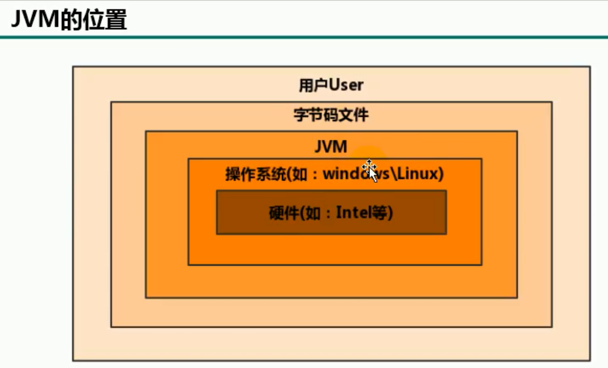

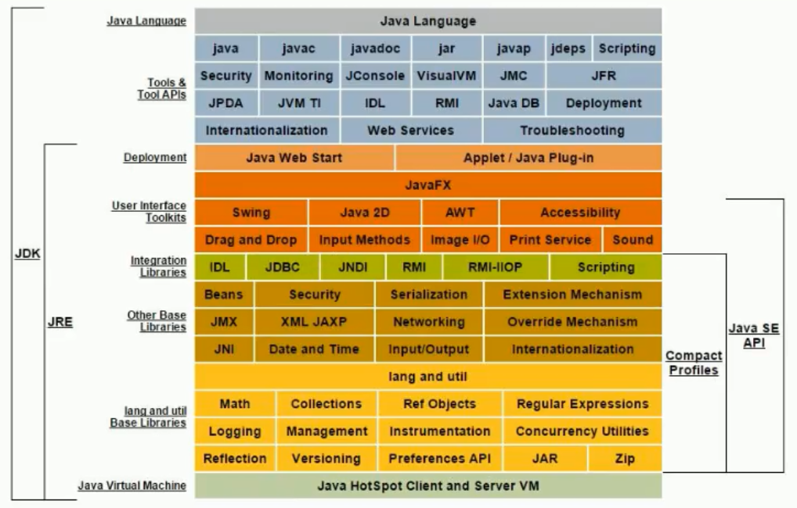

## 1.2 JVM整体结构

HotSpot VM 采用解释器与即时编译器并存的架构。

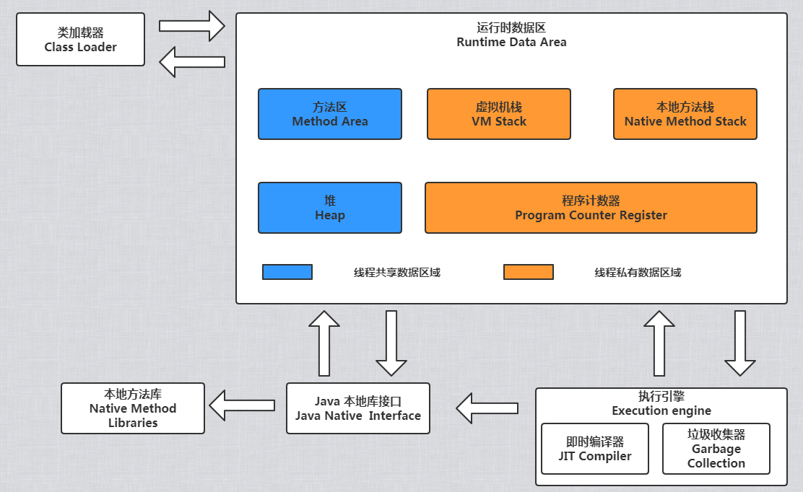

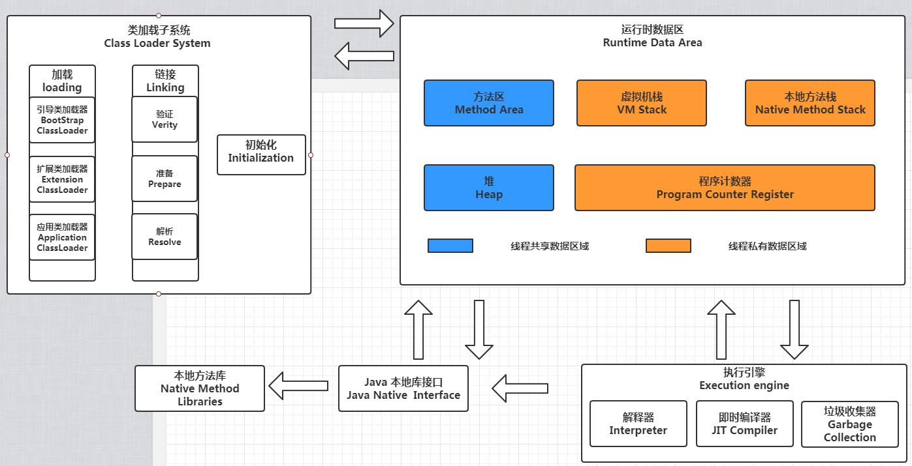

##  1.3 Java代码执行流程

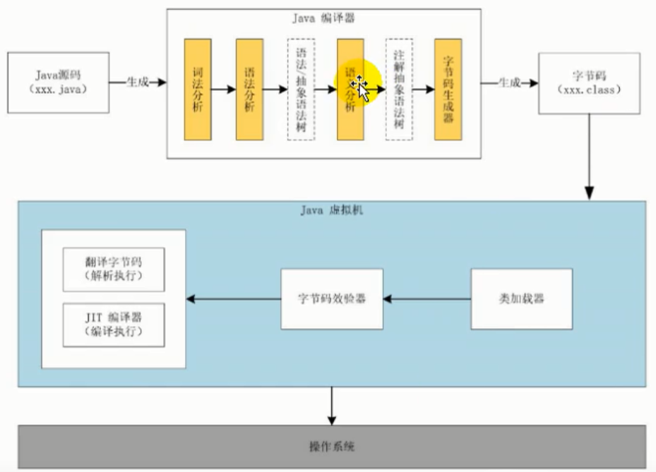

## 1.4 JVM的结构模型

Java 编译器输入的指令流基本上是一种基于栈的指令集架构，另外一种指令集架构则是基于寄存器的指令集架构。

具体来说，两种架构之间的区别：

- 基于栈示架构的特点
  - 设计和实现更简单，适用于资源受限的系统。
  - 避开了寄存器的分配难题：使用零地址指令方式分配。
  - 指令流中的指令大部分是零地址指令，其执行过程依赖于操作栈。指令集更小，编译器容易实现。
  - 不需要硬件支持，可移植性更好，更好实现跨平台。
- 基于寄存器架构的特点
  - 典型的应用是X86的二进制指令集：比如传统的PC以及安卓的Davlik虚拟机。
  - 指令集架构则完全依赖硬件，可移植性差。
  - 性能优秀、执行更高效。
  - 花费更少的指令去完成一项操作。
  - 大部分情况下，基于寄存器架构的指令集往往都以一地址指令，二地址指令和三地址指令为主，而基于栈式架构的指令集却是以零地址为主。

```
Java 反编译命令 javap -v xxx.class
```

## 1.5 JVM的生命周期

**JVM虚拟机启动**

Java虚拟机的启动时通过引导类加载器（bootstrap class loader ）创建的一个初始类（initial class）来完成的，这个类是由虚拟机的具体实现指定的。

**虚拟机的执行**

- 一个运行中的Java虚拟机有着一个清晰的任务：执行Java程序。
- 程序开始执行时他才运行，程序结束时他就停止。
- ==执行一个所谓的Java程序的时候，真真正正在执行的是一个叫Java虚拟机的进程。==

**虚拟机的退出**

有如下几种情况：

- 程序正常执行结束。
- 程序在执行过程中遇到了异常或错误而异常终止。
- 由于操作系统出现错误而导致Java虚拟机进程终止。
- 某线程调用Runtime类或System类的exit方法，或Runtime类的halt方法，并且Java安全管理器也允许这次exit或者halt操作。
- 除此之外，JNI规范中描述了用JNI Invocation API来加载或卸载Java虚拟机时，Java虚拟机退出的情况。

## 1.6 虚拟机发展史

**Sun Classic VM**

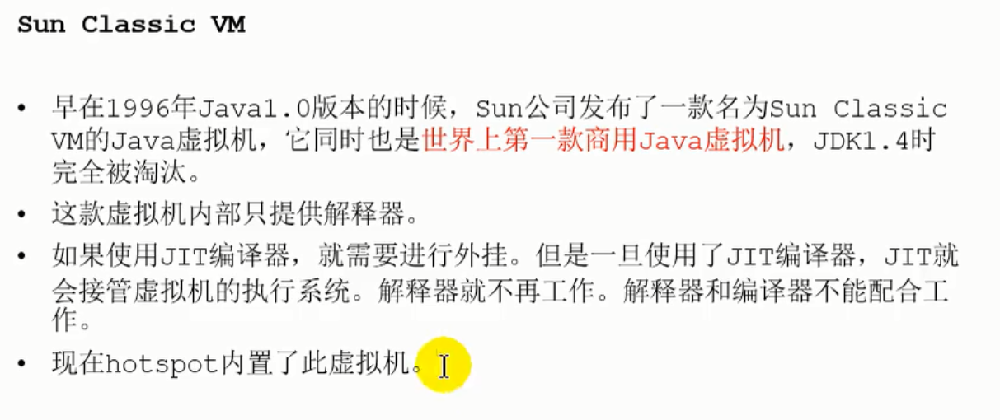

**Exact VM**

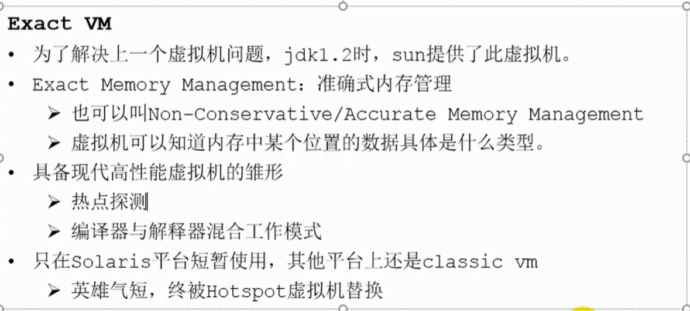

**HotSpot VM**

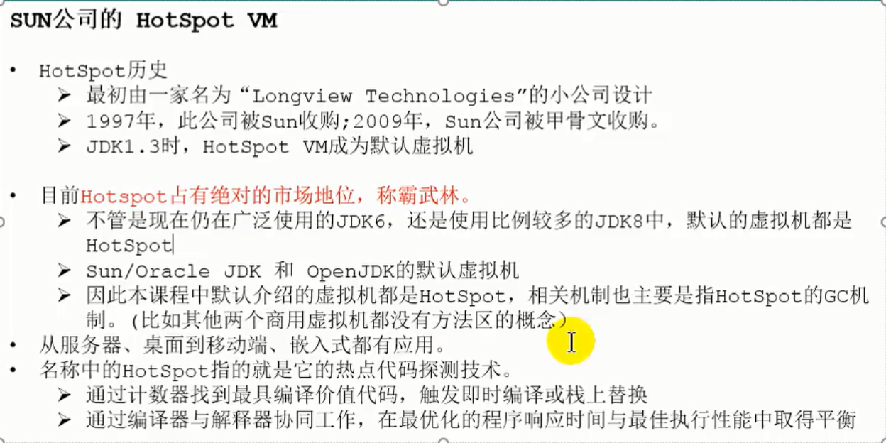

**JRockit**

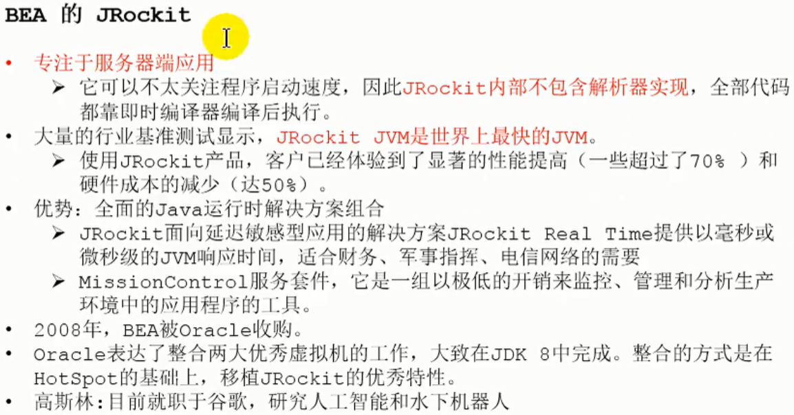

**J9**

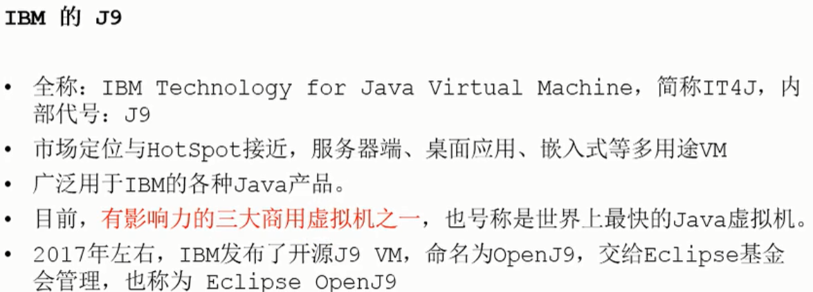

# 2.类加载子系统

**类加载器子系统作用**

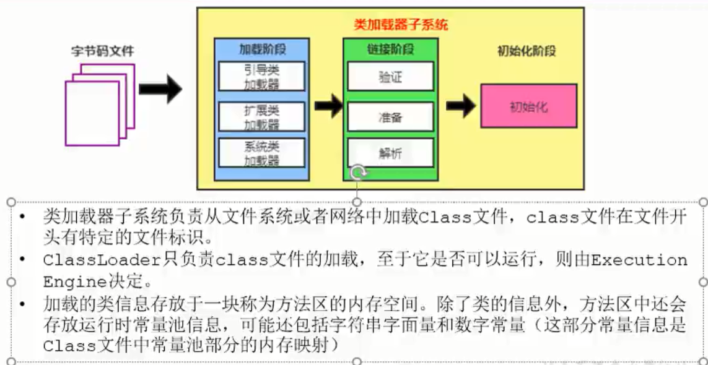

**类加载器的角色**

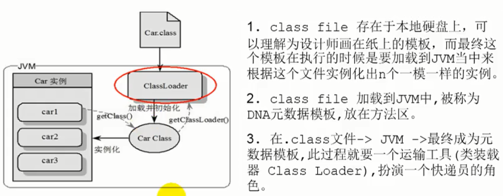

## 2.1 加载(loading)

加载：

1. 通过一个类的全限定名获取定义此类的二进制字节流。
2. 将这个字节流所代表的的静态存储结构转化为方法区的运行时数据结构。
3. 在==内存中生成一个代表这个类的java.lang.Class对象==，作为方法区中这个类的各种参数的访问入口。

加载.class文件的方式：

- 从本地系统中直接加载
- 通过网络获取，典型场景:Web Applet
- 从zip压缩包中读取，成为日后jar、war格式的基础
- 运行时计算生成，使用最多的是：动态代理技术
- 由其他文件生成，典型场景：JSP应用
- 从专有数据库中提取.class文件，比较少见
- 从加密文件中获取，典型的防Class文件被反编译的保护措施

## 2.2 链接（Linking)

链接阶段：

1. 验证（Verity)
   - 目的在于确保Class文件的字节流中包含信息符合当前虚拟机要求，保证被加载类的正确性，不会危害虚拟机自身安全。
   - 主要包括四种验证，文件格式验证，元数据验证，字节码验证，符号引用验证。

2. 准备（Prepare)

   - 为类变量分配内存并设置该类变量的默认初始值，即零值。

     >默认初始值 数字类型 整型为0，浮点型为0.0 char类型为\u0000,布尔类型为false, 引用类型为null。

   - 这里不包含用final修饰的static，因为final在编译时就会分配，准备阶段会显式初始化。

   - 这里不会为实例变量分配初始化，类变量会分配在方法区中，而实例变量是会随着对象一起分配到Java堆中。

3. 解析（Resolve）
   - 将常量池内的符号引用转换为直接引用的过程。
   - 事实上，解析操作往往会伴随着JVM在执行完初始化之后再执行。
   - 符号引用就是一组符号来描述所引用的目标。符号引用的字面量形式明确定义在《java虚拟机规范》的Class文件格式中。直接引用就是直接指向目标的指针、相对偏移量或一个间接定位到目标的句柄。
   - 解析动作主要针对类或接口、字段、类方法、接口方法、方法类型等。对应常量池中的CONSTANT_Class_info、CONSTANT_Filederf_info、CONSTANT_Methodref_info等。

## 2.3 初始化（initialization）

初始化：

- 初始化阶段就是执行类构造器方法<clinit>()的过程。
- 此方法不需要定义，是javac编译器自动收集类中的所有类变量的赋值动作和静态代码块中的语句合并而来。
- 构造器方法中指令按语句在源文件中出现的顺序执行。
- <clinit>()不同于类的构造器。（关联：构造器是虚拟机视角下的<init>()）
- 若该类具有父类，JVM会保证子类的<clinit>()执行前，父类的<clinit>()已经执行完毕。
- 虚拟机必须保证一个类的<clinit>()方法在多线程下被同步加锁。

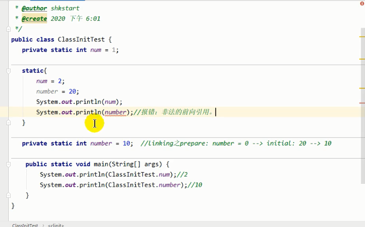

## 2.4 类加载器的分类

- JVM 支持两种类型的加载器，分别为引导类加载器（Bootstrap ClassLoader）和自定义类加载器（User-Defined ClassLoader）。
- 从概念上来讲，自定义加载器一般指的是程序中由开发人员自定义的一类加载器，但是Java虚拟机规范却没有这么定义，而是==将所有派生于抽象类ClassLoader的类加载器都划分为自定义类加载器。==
- Extension ClassLoader 和 System ClassLoader 继承自  URLClassLoader

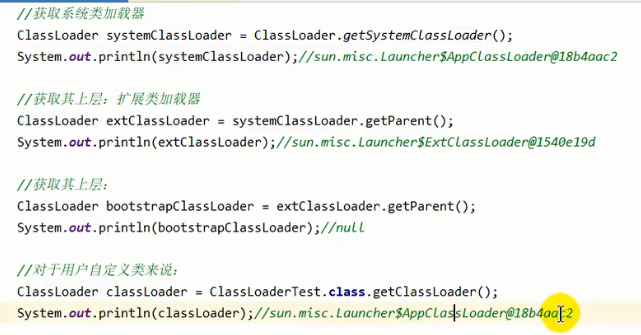

### 2.4.1 启动类加载器

启动类加载器（引导类加载器，Bootstrap ClassLoader）

- 这个类加载使用C/C++语言实现的，嵌套在JVM内部。
- 它用来加载Java的核心库（JAVA_HOME/jre/lib/rt.jar、resource.jar或sun.boot.class.path路径下的内容），用于提供JVM自身需要的类。
- 并不继承自java.lang.ClassLoader，没有上层加载器。
- 加载扩展类和应用程序类加载器，并指定为他们的上层加载器。
- 出于安全考虑，Bootstrap启动类加载器只加载包名为java，javax，sun等开头的类。

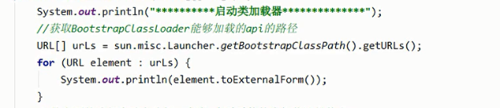

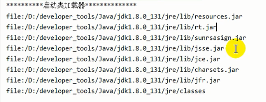

### 2.4.2 扩展类加载器

扩展类加载器（Extension ClassLoader）

- Java 语言编写，由sun.misc.Launcher$ExtClassLoader实现。
- 派生于ClassLoader类。
- 上层加载器为启动类加载器。
- 从java.ext.dirs系统属性所指定的目录中加载类库，或从JDK的安装目录的jre/lib/ext子目录（扩展目录）下加载类库。如果用户创建的JAR放在此目录下，也会自动由扩展类加载器加载。

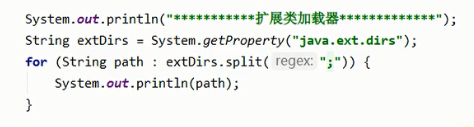

### 2.4.3 应用程序类加载器

应用程序类加载器（系统类加载器，AppClassLoader）

- Java语言编写，由sun.misc.Launcher$AppClassLoader实现。
- 派生于ClassLoader类。
- 上层加载器为扩展类加载器
- 它负责加载环境变量classpath或系统属性java.class.path指定路径下的类库。
- 该类加载是程序中默认的类加载器，一般来说，Java应用类都是由它来完成加载。
- 通过ClassLoader#getSystemClassLoader()方法可以获取到该类加载器。

## 2.5 用户自定义类加载器

为什么要自定义类加载器：

- 隔离加载类
- 修改类加载的方式
- 扩展加载源
- 防止源码泄漏

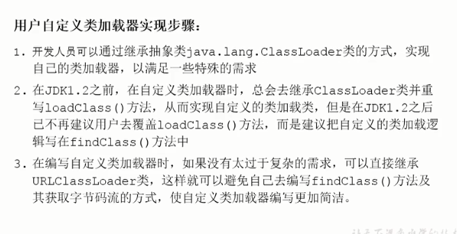

## 2.6 双亲委派机制

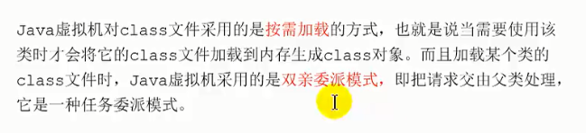

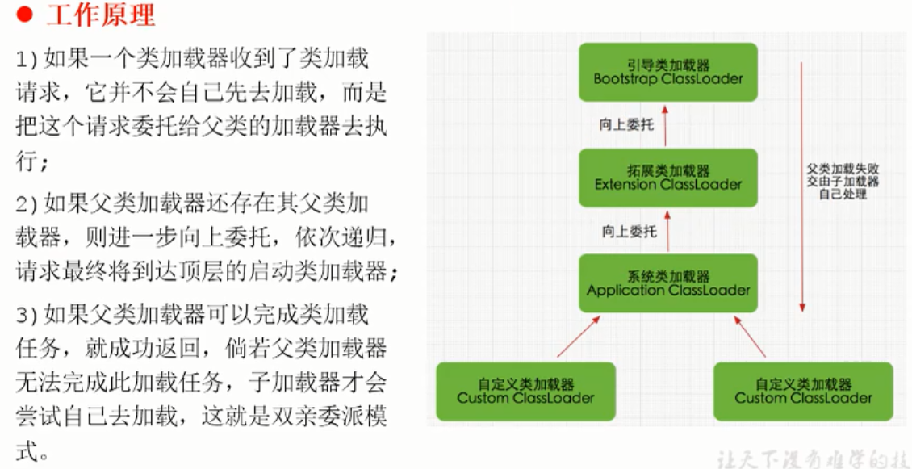

优势：

- 避免类的重复加载
- 保护程序安全，防止核心API被篡改。

## 2.7 沙箱安全机制

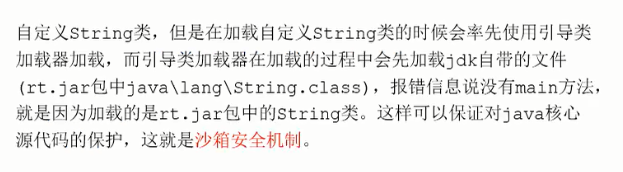

## 2.8 其他

在JVM中表示两个class对象是否为同一个类存在两个条件：

- 类的完整类名必须一致，包括包名。
- 加载这个类的CLassLoader必须相同。

**对类加载器的引用**

JVM必须知道一个类型是由启动类加载器加载的还是由用户类加载器加载的。如果一个类型是由用户类加载器加载的，那么JVM中会==将这个类加载器的一个引用作为类型信息的一部分保存在方法区中==。当分析一个类型到另一个类型的引用的时候，JVM需要保证这两个类型的类加载器是相同的。

**Java程序对类的使用方式分为：主动使用和被动使用。**

- 主动使用分为七种情况：

  - 创建类的实例

  - 访问某个类或接口的静态变量，或者对该静态变量赋值

  - 调用类的静态方法

  - 反射（如：Class.forName("")）

  - 初始化一个类的子类

  - Java虚拟机启动时被标明为启动类的类

  - JDK 7 开始提供的动态语言支持：

    java.lang.invoke.MethodHandle实例的解析结果

    REF_getStatic、REF_putStatic、REF_invokeStatic句柄对应的类没有初始化，则初始化

- 除了以上七种情况，其他使用Java类的方式都被看作是对类的被动使用，都==不会导致类的初始化==。

# 3.运行时数据区

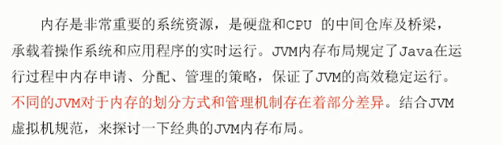

运行时数据区模型

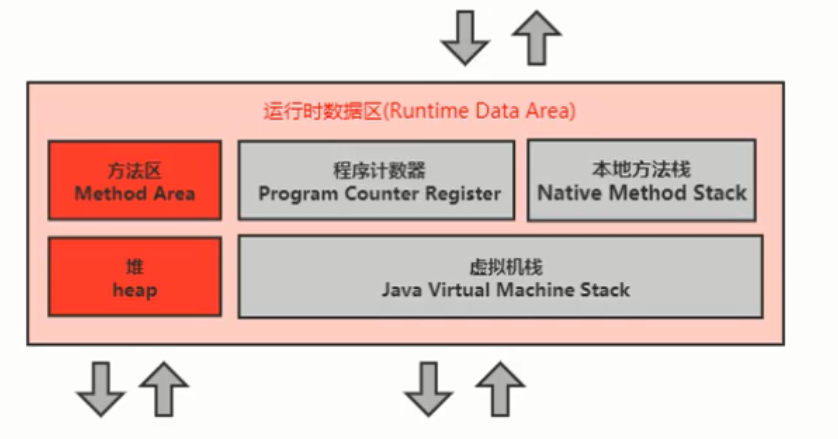

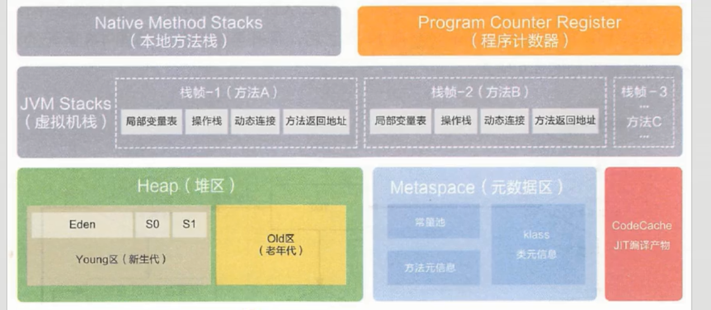

## 3.1 线程

- 线程是一个程序里的运行单元。JVM允许一个应用有多个线程并行的执行。
- 在HotSpot VM里，每个线程都与操作系统的本地线程直接映射。
  - 当一个Java线程准备好执行以后，此时一个操作系统的本地线程也同时创建。Java线程执行终止后，本地线程也会回收。
- 操作系统复制所有线程的安排调度到任何一个可用的CPU上。一旦本地线程初始化成功，他就会调用Java线程中的run（）方法。

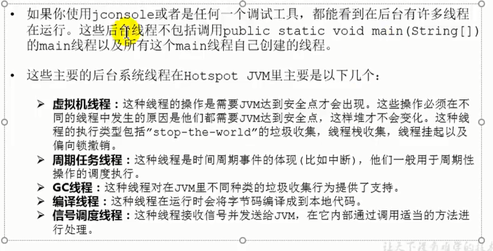

# 4. 程序计数器（PC 寄存器）

JVM 中的程序计数寄存器（Program Counter Register）中，Register 的命名源于CPU的寄存器，寄存器存储指令相关的现场信息。CPU只有把数据装载到寄存器才能运行。

这里并非广义上的物理寄存器，或许将其翻译为PC计数器（或指令计数器）会更加贴切，也称为程序钩子，并且不容易引起误会。JVM中的PC寄存器是对物理PC寄存器的一种抽象模拟。

>  作用:
>
> PC寄存器用来存储指向下一条指令的地址，也就是即将要执行的指令代码。由执行引擎读取下一条指令。

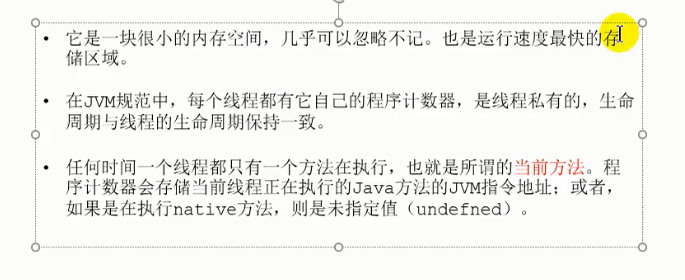

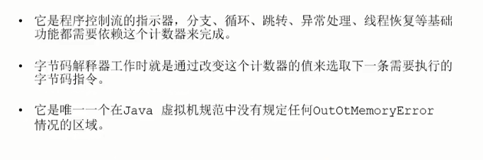

寄存器示例：

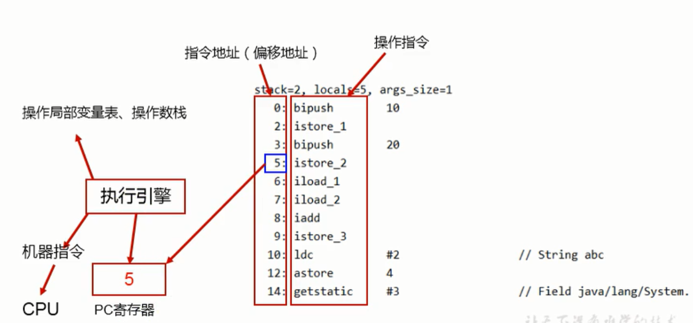


**两个常见问题**

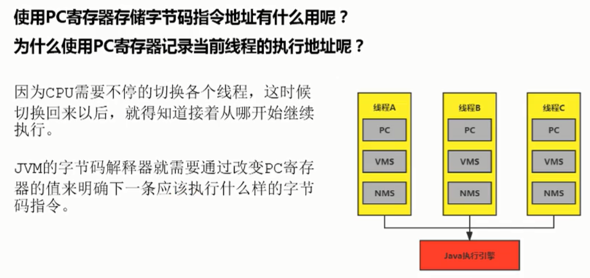

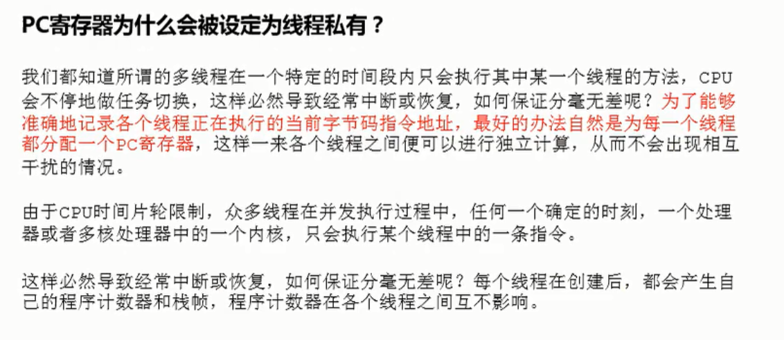

# 5.虚拟机栈

**堆与栈**

==栈是运行时的单位，而堆是存储的单位。==

即：栈解决程序的运行问题，即程序如何执行，或者说如何处理数据。堆解决的是数据存储的问题，即数据怎么放、放在哪。

- 每个线程都会创建一个虚拟机栈，其内部保存一个个的栈帧。
- 生命周期和线程一致。
- **作用** 主管Java程序的运行，保存方法的局部变量（8中基本数据类型、对象的引用地址）、部分结果。并参与方法的调用和返回。
  - 局部变量 vs 成员变量（属性）
  - 基本数据变量 vs 引用类型变量（类、数据、接口）

**栈的优点**

- 栈是一种快速有效的分配存储方式，访问速度仅次于程序计数器。
- JVM直接对Java栈的操作只有两个：
  - 每个方法执行，伴随着进栈（入栈，压栈）
  - 执行结束后的出栈工作
- 对于栈来说，==不存在垃圾回收问题。==

## 5.1 栈异常

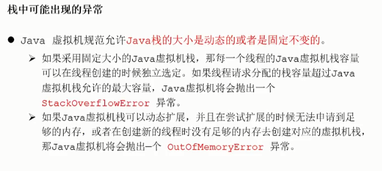

**设置栈内存大小**

使用-Xss 参数设置内存栈空间大小（in bytes）。 

## 5.2 栈的存储结构和运行原理

**栈中存储什么？**

- 每个线程都有自己的栈，栈中数据都是以栈帧（Stack Frame）的格式存在。
- 在这个线程上正在执行的每个方法都各自对应一个栈帧。
- 栈帧是一个内存区块，是一个数据集，维系着方法执行过程中的各种数据。

栈运行原理

- JVM直接对Java栈的操作只有压栈和出栈。
- 在一条活动的线程中，在一个时间点上，只会有一个活动的栈帧。即当前正在执行的方法的栈帧（栈顶栈帧）是有效的，这个栈帧被称为当前栈帧，与当前栈帧对应的方法就是当前方法，定义这个方法的类就是当前类。
- 执行引擎运行的所有字节码指令只针对当前栈帧进行操作。
- 如果在该方法中调用了其他方法，对应的新的栈帧会被创建出来放在栈的顶端，成为新的当前栈帧。
- 不同线程中所包含的栈帧是不允许存在相互引用的，即不可能在一个栈帧之中引用另外一个线程的栈帧。
- 如果当前方法调用了其他方法，方法返回之际，当前栈帧会传回次方法的执行结果给钱一个栈帧，接着，JVM会丢弃当前栈帧，使得前一个栈帧重新成为当前栈帧。
- Java方法有两种返回函数的方式：正常的函数返回，即return指令；抛出异常。不管使用哪种方式，都会导致栈帧被弹出。

## 5.3 栈帧的内部结构

栈帧存储着：

- 局部变量表（Local Variables）
- 操作数栈(Operand Stack)（或表达式栈）
- 动态链接(Dynamic Linking)（或指向运行时常量池的方法引用）
- 方法返回地址(Return Address)（或方法正常退出或者异常退出的定义）
- 一些附加信息

### 5.3.1 局部变量表

局部变量表（Local variables）：

- 局部变量表也被称之为局部变量数组或本地变量表
- ==定义为一个数字数组，主要用于存储方法参数和定义在方法体内的局部变量==，这些数据类型包括各类基本数据类型，对象引用以及returnAddress类型。
- 由于局部变量表是建立在线程的栈上，是线程私有数据，因此==不存在数据安全问题==。
- ==局部变量表所需的容量大小是在编译期确定下来的==，并保存在方法的Code属性maxium Local Variables数据项中。在方法运行期间是不会改变局部变量表的大小的。
- 方法嵌套的次数由栈的大小决定。一般来说，栈越大，方法嵌套调用次数越多。
- 局部变量表中的变量只在当前方法调用中有效。在方法执行时，虚拟机通过使用局部变量表完成参数值到参数变量列表的传递过程。当方法调用结束后，随着方法栈帧的销毁，局部变量表也会随之销毁。