[TOC]

# 1. JVM和Java体系架构

##  1.1 JVM所处位置

JVM（程序虚拟机）是运行在操作系统之上的，它与硬件没有直接的交互。


## 1.2 JVM整体结构

HotSpot VM 采用解释器与即时编译器并存的架构。


##  1.3 Java代码执行流程


## 1.4 JVM的结构模型

Java 编译器输入的指令流基本上是一种基于栈的指令集架构，另外一种指令集架构则是基于寄存器的指令集架构。

具体来说，两种架构之间的区别：

- 基于栈示架构的特点
  - 设计和实现更简单，适用于资源受限的系统。
  - 避开了寄存器的分配难题：使用零地址指令方式分配。
  - 指令流中的指令大部分是零地址指令，其执行过程依赖于操作栈。指令集更小，编译器容易实现。
  - 不需要硬件支持，可移植性更好，更好实现跨平台。
- 基于寄存器架构的特点
  - 典型的应用是X86的二进制指令集：比如传统的PC以及安卓的Davlik虚拟机。
  - 指令集架构则完全依赖硬件，可移植性差。
  - 性能优秀、执行更高效。
  - 花费更少的指令去完成一项操作。
  - 大部分情况下，基于寄存器架构的指令集往往都以一地址指令，二地址指令和三地址指令为主，而基于栈式架构的指令集却是以零地址为主。

```
Java 反编译命令 javap -v xxx.class
```

## 1.5 JVM的生命周期

**JVM虚拟机启动**

Java虚拟机的启动时通过引导类加载器（bootstrap class loader ）创建的一个初始类（initial class）来完成的，这个类是由虚拟机的具体实现指定的。

**虚拟机的执行**

- 一个运行中的Java虚拟机有着一个清晰的任务：执行Java程序。
- 程序开始执行时他才运行，程序结束时他就停止。
- ==执行一个所谓的Java程序的时候，真真正正在执行的是一个叫Java虚拟机的进程。==

**虚拟机的退出**

有如下几种情况：

- 程序正常执行结束。
- 程序在执行过程中遇到了异常或错误而异常终止。
- 由于操作系统出现错误而导致Java虚拟机进程终止。
- 某线程调用Runtime类或System类的exit方法，或Runtime类的halt方法，并且Java安全管理器也允许这次exit或者halt操作。
- 除此之外，JNI规范中描述了用JNI Invocation API来加载或卸载Java虚拟机时，Java虚拟机退出的情况。

## 1.6 虚拟机发展史

**Sun Classic VM**


**Exact VM**


**HotSpot VM**


**JRockit**


**J9**

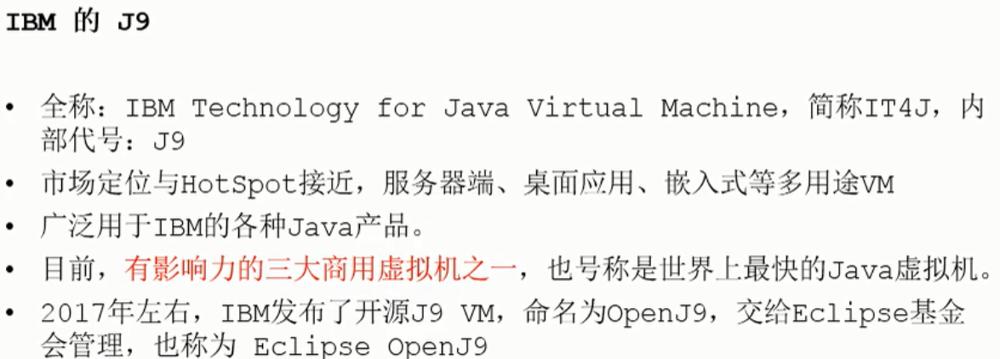

# 2.类加载子系统

**类加载器子系统作用**

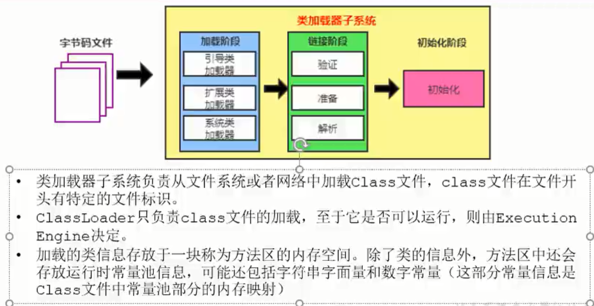

**类加载器的角色**


## 2.1 加载(loading)

加载：

1. 通过一个类的全限定名获取定义此类的二进制字节流。
2. 将这个字节流所代表的的静态存储结构转化为方法区的运行时数据结构。
3. 在==内存中生成一个代表这个类的java.lang.Class对象==，作为方法区中这个类的各种参数的访问入口。

加载.class文件的方式：

- 从本地系统中直接加载
- 通过网络获取，典型场景:Web Applet
- 从zip压缩包中读取，成为日后jar、war格式的基础
- 运行时计算生成，使用最多的是：动态代理技术
- 由其他文件生成，典型场景：JSP应用
- 从专有数据库中提取.class文件，比较少见
- 从加密文件中获取，典型的防Class文件被反编译的保护措施

## 2.2 链接（Linking)

链接阶段：

1. 验证（Verity)
   - 目的在于确保Class文件的字节流中包含信息符合当前虚拟机要求，保证被加载类的正确性，不会危害虚拟机自身安全。
   - 主要包括四种验证，文件格式验证，元数据验证，字节码验证，符号引用验证。

2. 准备（Prepare)

   - 为类变量分配内存并设置该类变量的默认初始值，即零值。

     >默认初始值 数字类型 整型为0，浮点型为0.0 char类型为\u0000,布尔类型为false, 引用类型为null。

   - 这里不包含用final修饰的static，因为final在编译时就会分配，准备阶段会显式初始化。

   - 这里不会为实例变量分配初始化，类变量会分配在方法区中，而实例变量是会随着对象一起分配到Java堆中。

3. 解析（Resolve）
   - 将常量池内的符号引用转换为直接引用的过程。
   - 事实上，解析操作往往会伴随着JVM在执行完初始化之后再执行。
   - 符号引用就是一组符号来描述所引用的目标。符号引用的字面量形式明确定义在《java虚拟机规范》的Class文件格式中。直接引用就是直接指向目标的指针、相对偏移量或一个间接定位到目标的句柄。
   - 解析动作主要针对类或接口、字段、类方法、接口方法、方法类型等。对应常量池中的CONSTANT_Class_info、CONSTANT_Filederf_info、CONSTANT_Methodref_info等。

## 2.3 初始化（initialization）

初始化：

- 初始化阶段就是执行类构造器方法<clinit>()的过程。
- 此方法不需要定义，是javac编译器自动收集类中的所有类变量的赋值动作和静态代码块中的语句合并而来。
- 构造器方法中指令按语句在源文件中出现的顺序执行。
- <clinit>()不同于类的构造器。（关联：构造器是虚拟机视角下的<init>()）
- 若该类具有父类，JVM会保证子类的<clinit>()执行前，父类的<clinit>()已经执行完毕。
- 虚拟机必须保证一个类的<clinit>()方法在多线程下被同步加锁。

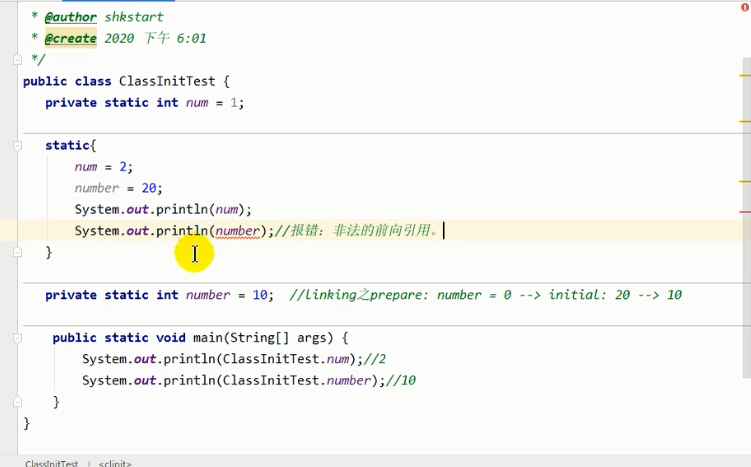

## 2.4 类加载器的分类

- JVM 支持两种类型的加载器，分别为引导类加载器（Bootstrap ClassLoader）和自定义类加载器（User-Defined ClassLoader）。
- 从概念上来讲，自定义加载器一般指的是程序中由开发人员自定义的一类加载器，但是Java虚拟机规范却没有这么定义，而是==将所有派生于抽象类ClassLoader的类加载器都划分为自定义类加载器。==
- Extension ClassLoader 和 System ClassLoader 继承自  URLClassLoader

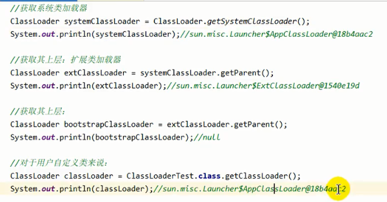

### 2.4.1 启动类加载器

启动类加载器（引导类加载器，Bootstrap ClassLoader）

- 这个类加载使用C/C++语言实现的，嵌套在JVM内部。
- 它用来加载Java的核心库（JAVA_HOME/jre/lib/rt.jar、resource.jar或sun.boot.class.path路径下的内容），用于提供JVM自身需要的类。
- 并不继承自java.lang.ClassLoader，没有上层加载器。
- 加载扩展类和应用程序类加载器，并指定为他们的上层加载器。
- 出于安全考虑，Bootstrap启动类加载器只加载包名为java，javax，sun等开头的类。


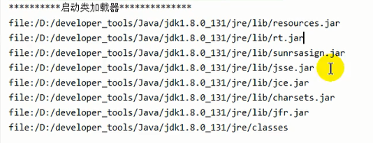

### 2.4.2 扩展类加载器

扩展类加载器（Extension ClassLoader）

- Java 语言编写，由sun.misc.Launcher$ExtClassLoader实现。
- 派生于ClassLoader类。
- 上层加载器为启动类加载器。
- 从java.ext.dirs系统属性所指定的目录中加载类库，或从JDK的安装目录的jre/lib/ext子目录（扩展目录）下加载类库。如果用户创建的JAR放在此目录下，也会自动由扩展类加载器加载。

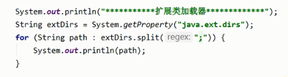

### 2.4.3 应用程序类加载器

应用程序类加载器（系统类加载器，AppClassLoader）

- Java语言编写，由sun.misc.Launcher$AppClassLoader实现。
- 派生于ClassLoader类。
- 上层加载器为扩展类加载器
- 它负责加载环境变量classpath或系统属性java.class.path指定路径下的类库。
- 该类加载是程序中默认的类加载器，一般来说，Java应用类都是由它来完成加载。
- 通过ClassLoader#getSystemClassLoader()方法可以获取到该类加载器。

## 2.5 用户自定义类加载器

为什么要自定义类加载器：

- 隔离加载类
- 修改类加载的方式
- 扩展加载源
- 防止源码泄漏

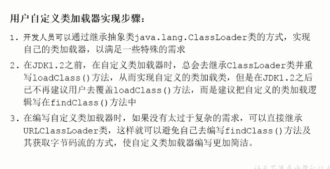

## 2.6 双亲委派机制

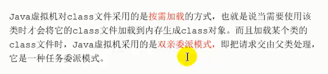

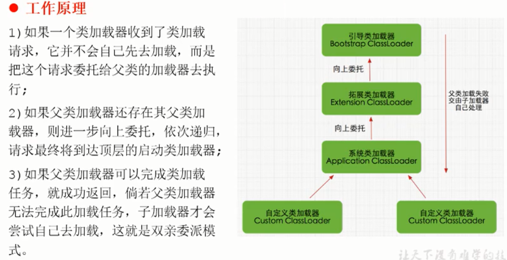

优势：

- 避免类的重复加载
- 保护程序安全，防止核心API被篡改。

## 2.7 沙箱安全机制

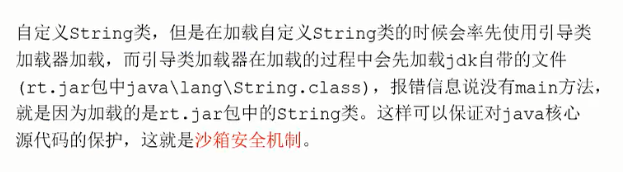

## 2.8 其他

在JVM中表示两个class对象是否为同一个类存在两个条件：

- 类的完整类名必须一致，包括包名。
- 加载这个类的CLassLoader必须相同。

**对类加载器的引用**

JVM必须知道一个类型是由启动类加载器加载的还是由用户类加载器加载的。如果一个类型是由用户类加载器加载的，那么JVM中会==将这个类加载器的一个引用作为类型信息的一部分保存在方法区中==。当分析一个类型到另一个类型的引用的时候，JVM需要保证这两个类型的类加载器是相同的。

**Java程序对类的使用方式分为：主动使用和被动使用。**

- 主动使用分为七种情况：

  - 创建类的实例

  - 访问某个类或接口的静态变量，或者对该静态变量赋值

  - 调用类的静态方法

  - 反射（如：Class.forName("")）

  - 初始化一个类的子类

  - Java虚拟机启动时被标明为启动类的类

  - JDK 7 开始提供的动态语言支持：

    java.lang.invoke.MethodHandle实例的解析结果

    REF_getStatic、REF_putStatic、REF_invokeStatic句柄对应的类没有初始化，则初始化

- 除了以上七种情况，其他使用Java类的方式都被看作是对类的被动使用，都==不会导致类的初始化==。

# 3.运行时数据区

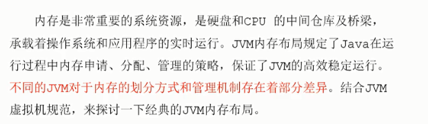

运行时数据区模型

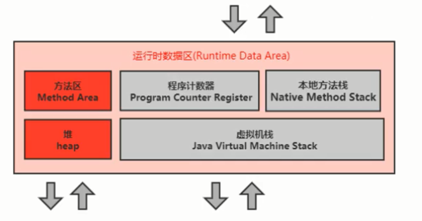

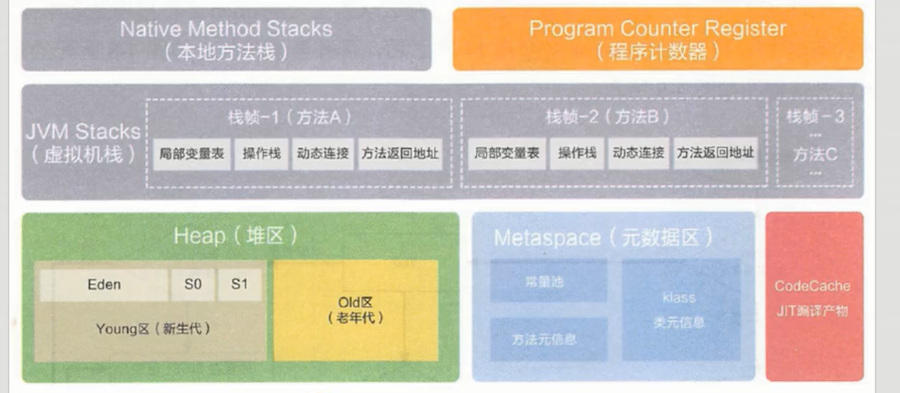

------

**线程**

- 线程是一个程序里的运行单元。JVM允许一个应用有多个线程并行的执行。
- 在HotSpot VM里，每个线程都与操作系统的本地线程直接映射。
  - 当一个Java线程准备好执行以后，此时一个操作系统的本地线程也同时创建。Java线程执行终止后，本地线程也会回收。
- 操作系统复制所有线程的安排调度到任何一个可用的CPU上。一旦本地线程初始化成功，他就会调用Java线程中的run（）方法。

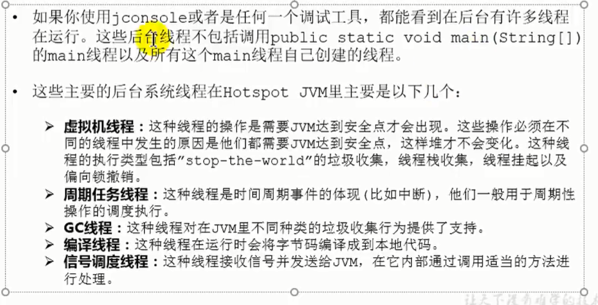

## 3.1 程序计数器（PC 寄存器）

JVM 中的程序计数寄存器（Program Counter Register）中，Register 的命名源于CPU的寄存器，寄存器存储指令相关的现场信息。CPU只有把数据装载到寄存器才能运行。

这里并非广义上的物理寄存器，或许将其翻译为PC计数器（或指令计数器）会更加贴切，也称为程序钩子，并且不容易引起误会。JVM中的PC寄存器是对物理PC寄存器的一种抽象模拟。

>  作用:
>
> PC寄存器用来存储指向下一条指令的地址，也就是即将要执行的指令代码。由执行引擎读取下一条指令。

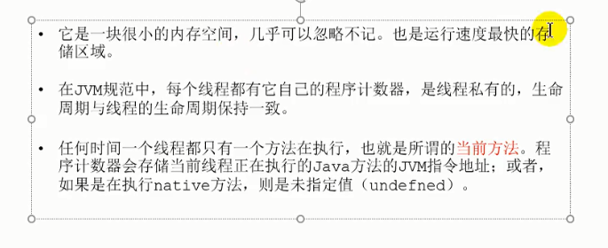

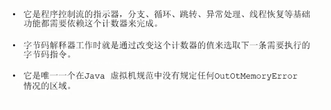

寄存器示例：

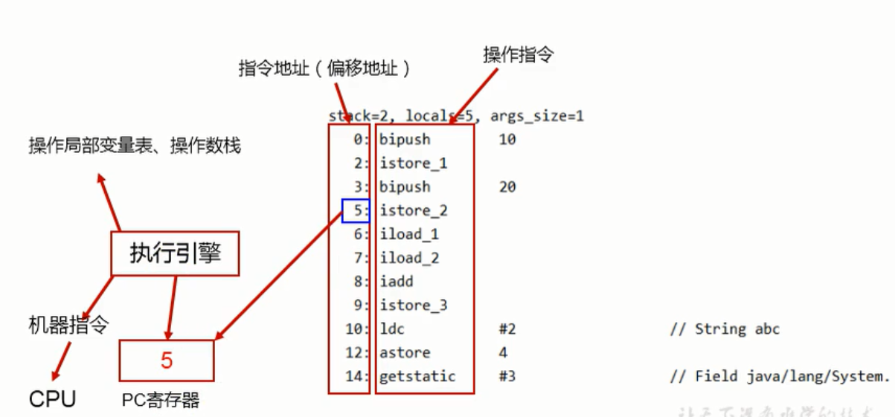


-----

**两个常见问题**

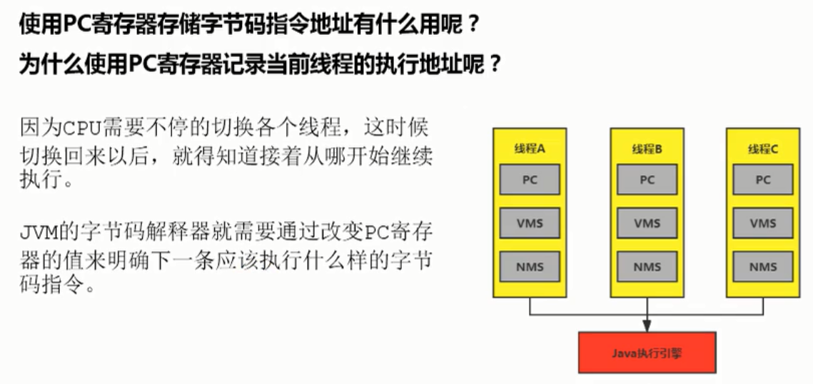

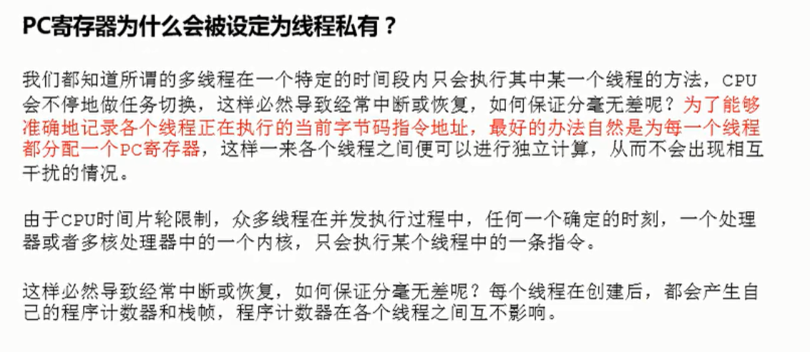

## 3.2虚拟机栈

**堆与栈**

==栈是运行时的单位，而堆是存储的单位。==

即：栈解决程序的运行问题，即程序如何执行，或者说如何处理数据。堆解决的是数据存储的问题，即数据怎么放、放在哪。

- 每个线程都会创建一个虚拟机栈，其内部保存一个个的栈帧。
- 生命周期和线程一致。
- **作用** 主管Java程序的运行，保存方法的局部变量（8中基本数据类型、对象的引用地址）、部分结果。并参与方法的调用和返回。
  - 局部变量 vs 成员变量（属性）
  - 基本数据变量 vs 引用类型变量（类、数据、接口）

**栈的优点**

- 栈是一种快速有效的分配存储方式，访问速度仅次于程序计数器。
- JVM直接对Java栈的操作只有两个：
  - 每个方法执行，伴随着进栈（入栈，压栈）
  - 执行结束后的出栈工作
- 对于栈来说，==不存在垃圾回收问题。==

### 3.2.1 栈异常

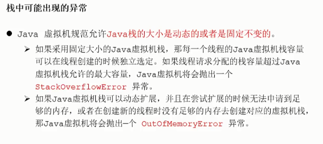

**设置栈内存大小**

使用-Xss 参数设置内存栈空间大小（in bytes）。 

### 3.2.2 栈的存储结构和运行原理

**栈中存储什么？**

- 每个线程都有自己的栈，栈中数据都是以栈帧（Stack Frame）的格式存在。
- 在这个线程上正在执行的每个方法都各自对应一个栈帧。
- 栈帧是一个内存区块，是一个数据集，维系着方法执行过程中的各种数据。

栈运行原理

- JVM直接对Java栈的操作只有压栈和出栈。
- 在一条活动的线程中，在一个时间点上，只会有一个活动的栈帧。即当前正在执行的方法的栈帧（栈顶栈帧）是有效的，这个栈帧被称为当前栈帧，与当前栈帧对应的方法就是当前方法，定义这个方法的类就是当前类。
- 执行引擎运行的所有字节码指令只针对当前栈帧进行操作。
- 如果在该方法中调用了其他方法，对应的新的栈帧会被创建出来放在栈的顶端，成为新的当前栈帧。
- 不同线程中所包含的栈帧是不允许存在相互引用的，即不可能在一个栈帧之中引用另外一个线程的栈帧。
- 如果当前方法调用了其他方法，方法返回之际，当前栈帧会传回次方法的执行结果给钱一个栈帧，接着，JVM会丢弃当前栈帧，使得前一个栈帧重新成为当前栈帧。
- Java方法有两种返回函数的方式：正常的函数返回，即return指令；抛出异常。不管使用哪种方式，都会导致栈帧被弹出。

### 3.2.3 栈帧的内部结构

栈帧存储着：

- 局部变量表（Local Variables）
- 操作数栈(Operand Stack)（或表达式栈）
- 动态链接(Dynamic Linking)（或指向运行时常量池的方法引用）
- 方法返回地址(Return Address)（或方法正常退出或者异常退出的定义）
- 一些附加信息

#### 3.2.3.1 局部变量表

局部变量表（Local variables）：

- 局部变量表也被称之为局部变量数组或本地变量表
- ==定义为一个数字数组，主要用于存储方法参数和定义在方法体内的局部变量==，这些数据类型包括各类基本数据类型，对象引用以及returnAddress类型。
- 由于局部变量表是建立在线程的栈上，是线程私有数据，因此==不存在数据安全问题==。
- ==局部变量表所需的容量大小是在编译期确定下来的==，并保存在方法的Code属性maxium Local Variables数据项中。在方法运行期间是不会改变局部变量表的大小的。
- 方法嵌套的次数由栈的大小决定。一般来说，栈越大，方法嵌套调用次数越多。
- 局部变量表中的变量只在当前方法调用中有效。在方法执行时，虚拟机通过使用局部变量表完成参数值到参数变量列表的传递过程。当方法调用结束后，随着方法栈帧的销毁，局部变量表也会随之销毁。

---

**关于Slot（变量槽）的理解**

- 参数值存放总是在局部变量数组的index0开始，代数组长度-1的索引结束。
- 局部变量表最基本的存储单位是Slot（变量槽）。
- 局部变量表中存放编译期可知的各种基本数据类型（8种），引用类型，returnAddress类型的变量。
- 在局部变量表里，32位以内的类型值占用一个Slot（包括returnAddress类型），64位的类型（long和double）占用两个slot。
  - byte、short、char在存储前被转换为int，boolean也被转换为int，0表示false，非0表示true。
  - long和double则占两个Slot。
- JVM会为局部变量表中的每一个Slot都分配一个访问索引，通过这个索引即可成功访问到局部变量表中指定的局部变量值。
- 当一个实例方法被调用的时候，它的方法参数和方法内部定义的局部变量将会**按照顺序被复制**到局部变量表中的每一个Slot上。
- 如果需要访问局部变量表中一个64bit的局部变量值时，只需要使用前一个索引即可。（long和double）
- 如果当前帧是由构造方法或者实例方法创建的，那么**当前对象引用（this）将会存放在index为0的slot处，其余的参数按照参数表顺序继续排列。**

**Slot的重复利用**

**栈帧中的局部变量表中的槽位是可以重用的**，如果一个局部变量过了其作用域，那么在其作用域之后申明的新的局部变量就很有可能会服用过期变量的槽位，**从而达到节省资源的目的**。

---

**静态变量和局部变量的对比**

变量的分类：

- 按数据类型分：
  - 基本数据类型
  - 引用数据类型
- 按类中声明的位置分：
  - 成员变量：在使用前都经历过默认初始化赋值。
    - 类变量（静态变量）：Lingking的prepare阶段：给类变量默认赋值--->initialization阶段：给类变量显示赋值即静态代码块赋值。
    - 实例变量：随着对象的创建，会在堆空间中分配实例变量空间，并进行默认赋值
  - 局部变量：在使用前必须要进行显示赋值的，否则编译不通过。

在栈帧中，与性能调优关系最为密切的部分就是前面提到的局部变量表。在方法执行时，虚拟机使用局部变量表完成方法的传递。

==局部变量表中的变量也是重要的垃圾回收根节点，只要被局部变量表中直接或间接引用的对象都不会被回收。==

#### 3.2.3.2 操作数栈

- 操作数栈在方法执行的过程中，根据字节码指令，往栈中写入数据或提取数据，即入栈和出栈。
  - 某些字节码指令将值压入操作数栈。
  - 其余的字节码指令将操作数取出栈。使用它们后再把结果压入栈。比如执行复制、交换、求和等操作。
- 操作数栈==主要用于保存计算过程的中间结果，同时作为计算过程中变量临时的存储空间。==
- 操作数栈就是JVM执行引擎的一个工作区，当一个方法刚开始执行的时候，一个新的栈帧也会随之被创建出来，==这个方法刚开始的操作数栈是空的。==
- 每个操作数栈都会拥有一个明确的栈深度用于存储数值，其所需的最大深度在编译期就定义好了，保存在方法的Code属性中，为max_stack的值。
- 栈中的任何一个元素都可以是任意的Java数据类型。
  - 32bit的类型占用一个栈单位深度
  - 64bit的类型占用两个栈单位深度
- 操作数栈==并非采用访问索引的方式来进行数据访问==的，而是只能通过标准的入栈和出栈操作来完成一个数据访问。
- ==如果被调用的方法带有返回值的话，其返回值将会被压入当前栈帧的操作数栈中==，并更新PC寄存器中下一条需要执行的字节码指令。
- 操作数栈中元素的数据类型必须与字节码指令的序列严格匹配，这有编译器在编译期进行验证，同时在类加载过程中的类检验阶段的数据流分析阶段要再次验证。
- 另外，我们说==Java虚拟机的解释引擎是基于栈的执行引擎==，其中的栈指的就是操作数栈。

-----

**栈顶缓存技术**

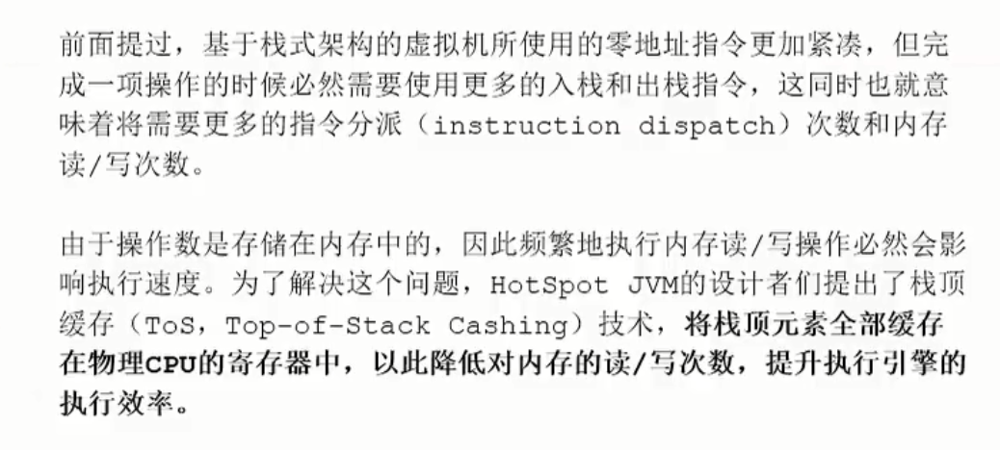

#### 3.2.3.3 动态链接

- 每个栈帧内部都包含一个==指向运行时常量池中该栈帧所属方法的引用==。包含这个引用的目的就是为了支持当前方法的代码能够实现动态链接，比如invokedynamic指令。
- 在Java源文件被编译到字节码文件中时，所有的变量和方法引用都作为符号引用保存在class文件的常量池里。比如：描述一个方法调用了另外的其他方法时，就是通过常量池中指向方法的符号引用来表示的，那么==动态链接的作用就是为了将这些符号引用转换为调用方法的直接引用。==

#### 3.2.3.4 方法调用

在JVM中，将符号引用转换为调用方法的直接引用与方法的绑定机制相关

- **静态链接**：

  当一个字节码文件被装载进JVM内部时，如果被调用的==目标方法在编译期可知==，且运行期保持不变时。这种情况下将调用方法的符号引用转换为直接引用的过程称之为静态链接。

- **动态链接**：

  如果==被调用的方法在编译期无法被确定下来==，也就是说，只能够在程序运行期将调用方法的符号引用转换为直接引用，由于这种引用转换过程具备动态性，因此也被称之为动态链接。

对应的方法的绑定机制为：早期绑定和晚期绑定。==绑定是一个字段、方法或者类在符号引用被替换为直接引用的过程仅发生一次==。

- 早期绑定（对应静态链接）

  指被调用的==目标方法如果在编译期可知，且运行期保持不变==时，即可将这个方法与所属的类型进行绑定，这样一来，由于明确了被调用的目标方法究竟是哪一个，因此也就可以使用静态链接的方式将符号引用转换为直接引用。

- 晚期绑定（对应动态链接）

  如果==被调用的方法在编译期无法确定下来，只能将在程序运行期根据实际的类型绑定相关的方法==，这种绑定方式被称为晚期绑定。

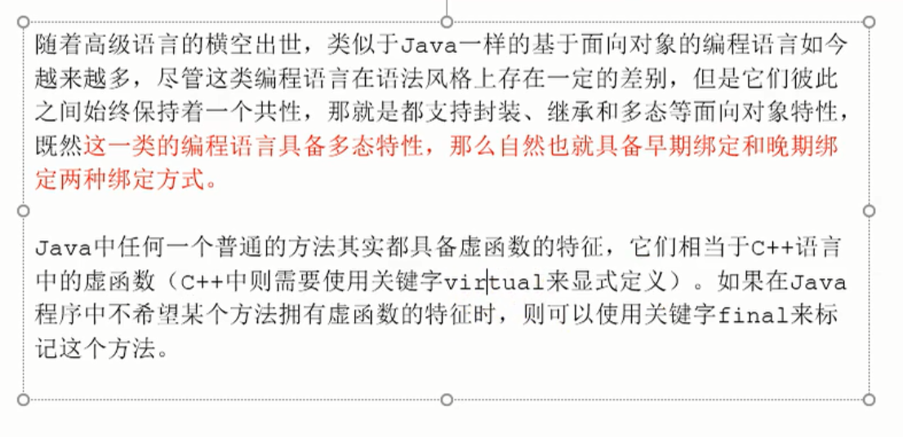

-----

**虚方法和非虚方法**

- 非虚方法
  - 如果方法在编译期就确定了具体的调用版本，这个版本在运行时是不可变的，这样的方法就称为非虚方法。
  - 静态方法、私有方法、final方法、实例构造器、父类方法都是非虚方法。
- 其他方法称为虚方法

在虚拟机中提供了以下几条方法调用指令：

- 普通调用指令：

  1. **invokestatic：调用静态方法，解析阶段确定唯一方法版本**
  2. **invokespecial：调用<init>方法，私有以及父类方法，解析阶段确定唯一方法版本**
  3. invokevirtual：调用所有虚方法
  4. invokeinterface：调用所有接口方法

- 动态调用指令

  5. invokedynamic：动态解析出需要调用的方法，然后执行

  前四条指令固化在虚拟机内部，方法的调用执行不可人为干预，而invokedynamic指令则指出由用户确定方法版本。其中==invokestatic指令和invokespecial指令调用的方法称为非虚方法，其余的（final修饰的除外）称为虚方法。==

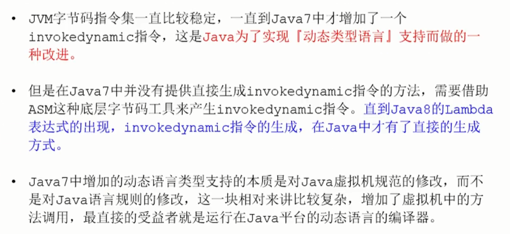

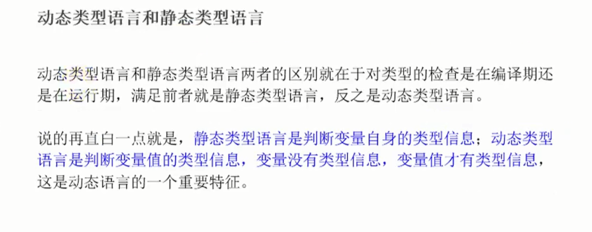

---

**方法重写的本质：**

1. 找到操作数栈顶的第一个元素所执行的对象的实际类型，记作C。
2. 如果在类型C中找到与常量中的描述符合简单名称都相符的方法，则进行访问权限校验，如果通过则返回这个方法的直接引用，查找过程结束；如果不通过，则返回java.lang.IllegalAccessError异常。
3. 否则，按照继承关系从下往上依次对C的各个父类进行第2步的搜索和验证过程。
4. 如果始终没有找到合适的方法，则抛出java.lang.AbstractMethodError异常。

**IllegalAccessError介绍：**

程序试图访问或修改一个属性或调用一个方法，这个属性或方法没有访问权限。一般的，这个会引起编译器异常。如果这个错误发生在运行时，则说明一个类发生了不兼容的改变。

**虚方法表**

- 在面向对象的编程中会频繁的使用到动态分派，如果在每次动态分派的过程中都要重新在类的方法元数据中搜索合适的目标的话就可能影响到执行效率。因此，==为了提高性能==，JVM采用在类的方法区建立一个虚方法表==（virtual method table，非虚方法不会出现在表中）来实现。使用索引表来代替查找。==
- 每个类中都有一个虚方法表，表中存放着各个方法的实际入口。
- 那么虚方法表什么时候被创建？
  - 虚方法表会在类加载的链接阶段（中解析阶段）被创建并开始初始化，类的变量初始值准备完成之后，JVM会把该类的方法表也初始化完毕。

举例1：

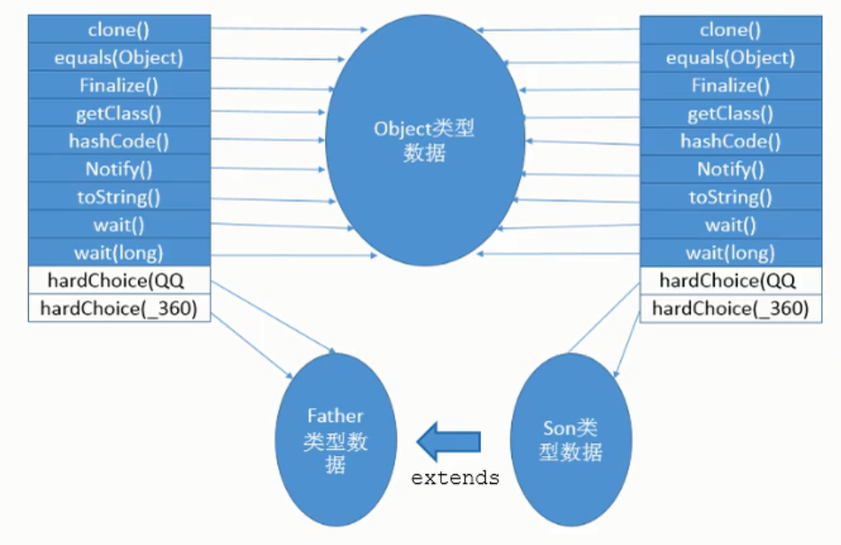

#### 3.2.3.5 方法返回地址

- 存放调用方法的PC寄存器的值。
- 一个方法的结束有两种方式：
  - 正常执行完成
  - 出现未处理的异常，非正常退出
- 无论通过哪种方式退出，在方法退出后都返回到该方法被调用的位置。==方法正常退出时，调用者的PC计数器的值作为返回地址，即调用该方法的指令的下一条指令==。而通过异常退出时，返回地址是要通过异常表来确定，栈帧中一般不会保存这部分信息。

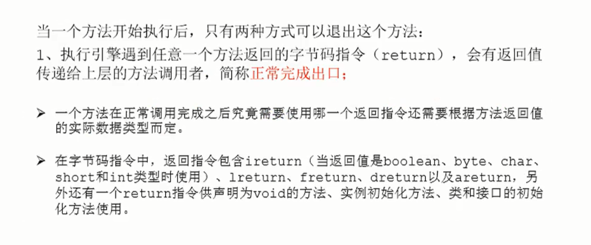

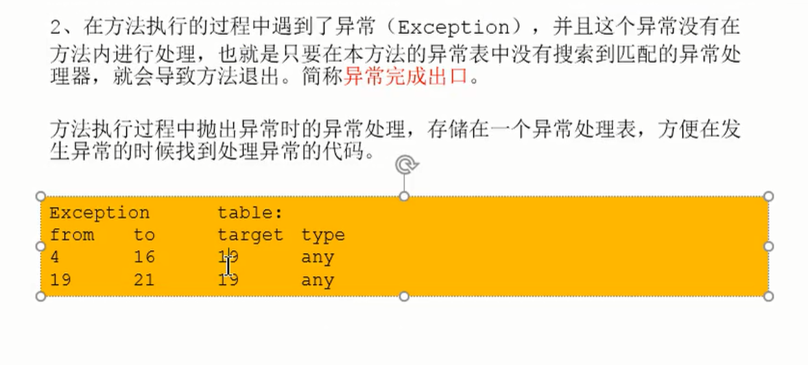

#### 3.2.3.6 一些附加信息

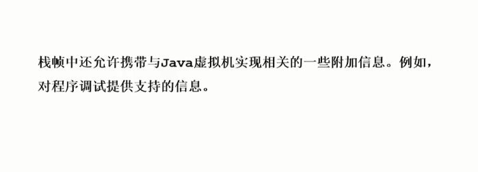

## 3.3 本地方法栈

- ==Java虚拟机栈用于管理Java方法的调用，而本地方法栈用于管理本地方法的调用。==
- 本地方法栈也是线程私有的。
- 如果被实现成固定或者是可动态扩展的内存大小。（在内存溢出方面是相同的）
  - 如果线程请求分配的栈容量超过本地方法栈允许的最大容量，Java虚拟机将会抛出一个StackOverflowError异常。
  - 如果本地方法栈可动态扩展，并且在尝试扩展的时候无法申请到足够的内存，或者在创建新的线程时没有足够的内存去创建对应的本地方法栈，那么Java虚拟机将会抛出一个OutOfMemoryError异常。
- 本地方法时使用C语言实现的。
- 它的具体实现是Native Method Stack中登记native方法，在Execution Engine执行时加载本地方法库。
- ==当某个线程调用一个本地方法时，它就进入了一个全新的并且不再受虚拟机限制的时间。它和虚拟机拥有同样的权限。==
  - 本地方法可以通过本地方法接口来==访问虚拟机内部的运行时数据区。==
  - 它甚至可以直接使用本地处理器中的寄存器。
  - 直接从本地内存的堆中分配任意数量的内存。
- ==并不是所有JVM都支持本地方法。因为Java虚拟机规范并没有明确要求本地方法栈的使用语言、具体实现方式、数据结构等。==如果JVM产品不打算支持native方法，也可以无需实现本地方法栈。
- 在HotSpot JVM中，直接将本地方法栈和虚拟机栈合二为一。

### 3.3.1. 本地方法接口

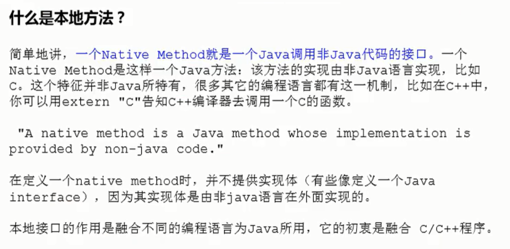

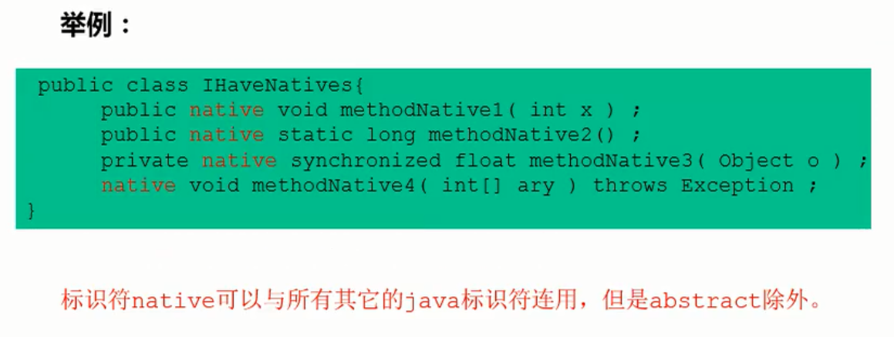

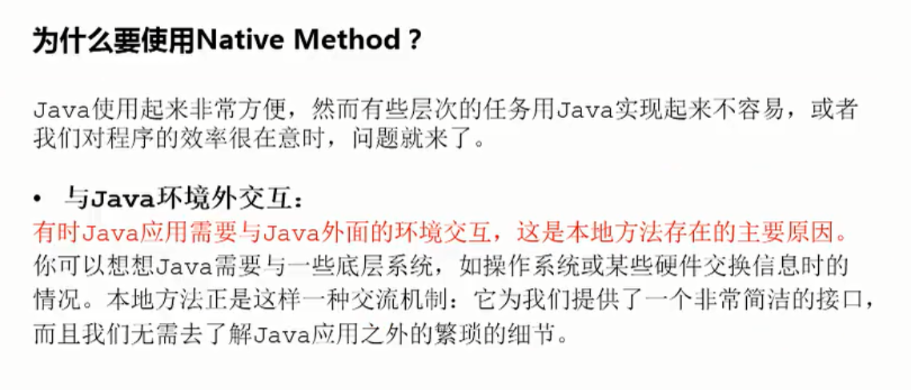

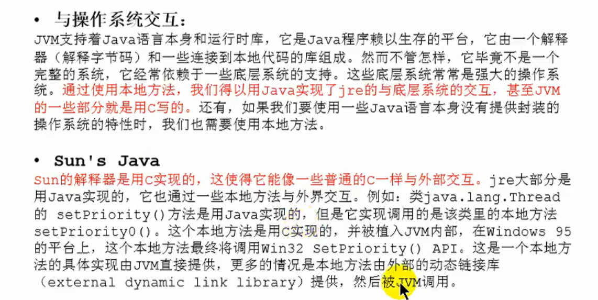

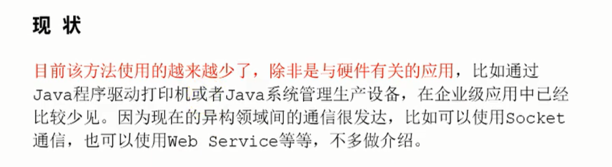


## 3.4 堆

- 一个JVM实例只存在一个堆内存，堆也是Java内存管理的核心区域。
- Java堆区在JVM启动的时候即被创建，其空间大小也就确定了。是JVM管理的最大一块内存空间。
  - 堆内存大小是可以调节的。
- 《Java虚拟机规范》规定，堆可以处于物理上不连续的内存空间中，但在逻辑上它应该被视为连续的。
- 所有的线程共享Java堆空间，在这里还可以划分线程私有的缓冲区（Thread Local Allocation Buffer，TLAB）。
- 《Java虚拟机规范》中对Java对的描述是：所有的对象实例以及数组都应当在运行时分配在堆上。
  - 几乎所有的对象实例都在这里分配内存。--从实际使用角度看的。（栈上分配，逃逸分析）。
- 数组和对象可能永远不会存储在栈上，因为栈帧中保存引用，这个引用指向对象和数组在堆中的位置。
- 在方法结束后，堆中的对象不会马上被移除，仅仅在垃圾收集的时候才会被移除。
- 堆是GC（Garbage Collection，垃圾收集器）执行垃圾回收的重点区域。

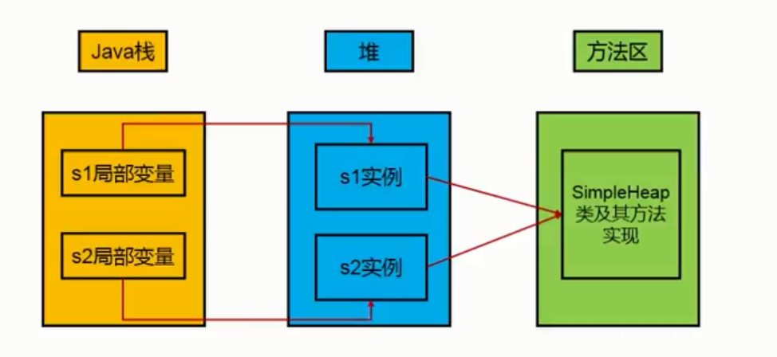

### 3.4.1 堆空间细分

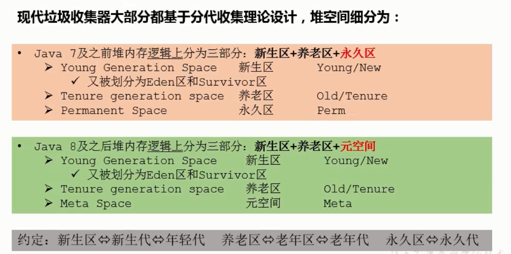


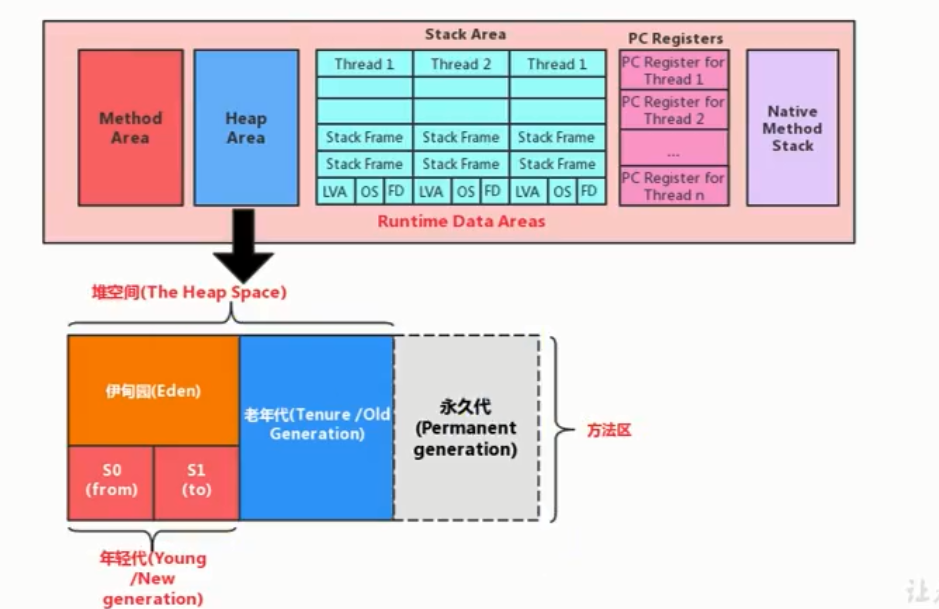

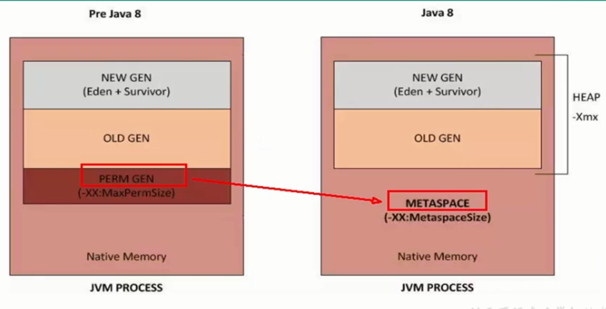

### 3.4.2 设置对空间大小与OOM

**虚拟机参数设置官方文档**

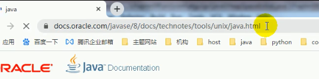

```
https://docs.oracle.com/javase/8/docs/technotes/tools/unix/java.html
```


**设置大小**

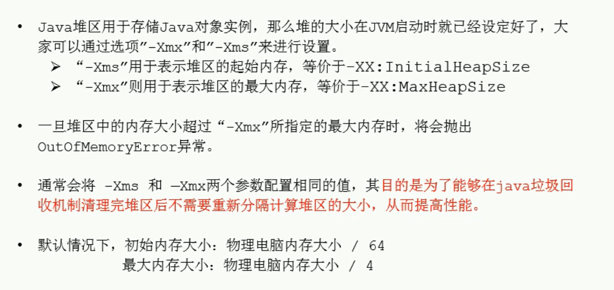

``` 
-Xms用来设置对空间（年轻代+老年代）的初始内存大小
    -X  是JVM的运行参数
    -ms 是memory start 的缩写
-Xmx用来设置对空间（年轻代+老年代）的最大内存大小
    -X  是JVM的运行参数
    -ms 是memory max 的缩写 
Runtime.getRuntime.totalMemory计算时幸存0区和幸存1区只计算了一个区的内存。
开发中建议将-Xms和—Xmx设置成相同的值。

查看设置的参数：方式1:jps  jstat -gc 进程id
             方式2: -XX:+PrintGCDetails
```

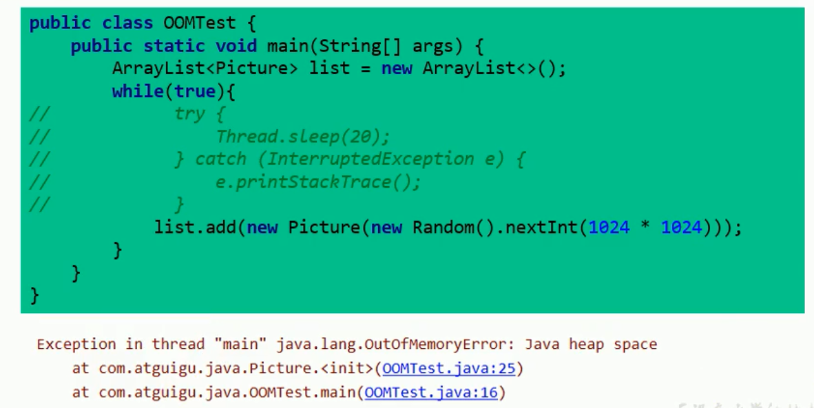

### 3.4.3 年轻代与老年代

- 存储在JVM中的Java对象可以划分为两类：

  - 一类是生命周期较短的瞬时对象，这类对象的创建和消亡都非常迅速。
  - 另一类对象的生命周期却非常长，在某些极端情况下还能够与JVM的生命周期保持一致。

- Java堆区进一步细分的话，可以划分为年轻的（YoungGen）和老年代（OldGen）。

- 其中年轻代又可以划分为Eden空间、Survivor0空间和Survivor1空间（也叫做From、To区）。

  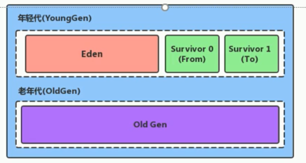

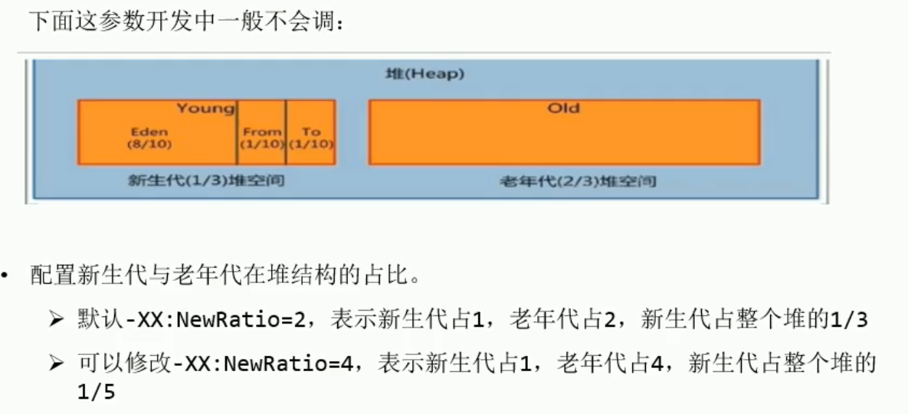

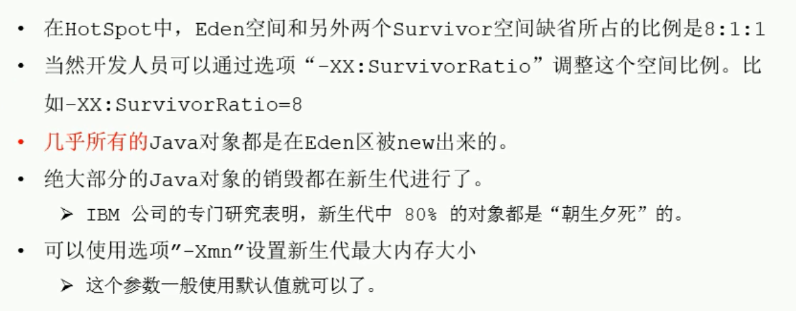

``` 
-XX:-UseAdaptiveSizePolicy:关闭自适应的内存分配策略。 
默认是比例是8:1:1但是实际使用的时候是6:1:1。需要显示设置为8才会在实际使用的时候是8:1:1。
```

### 3.4.4 对象分配过程

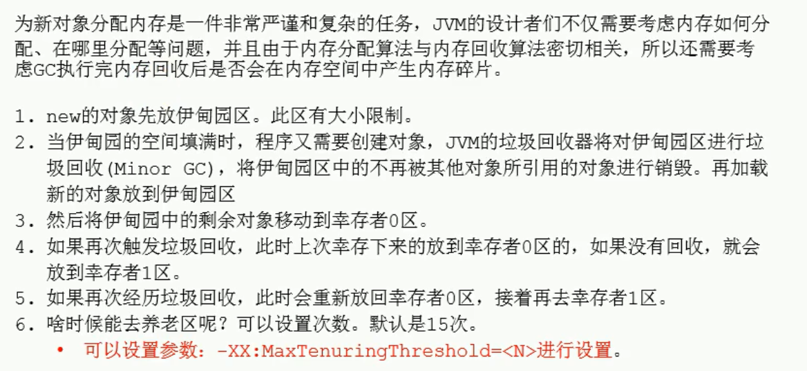

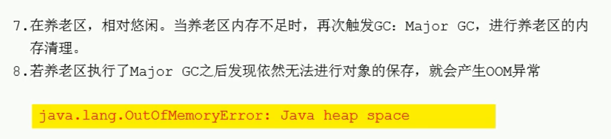

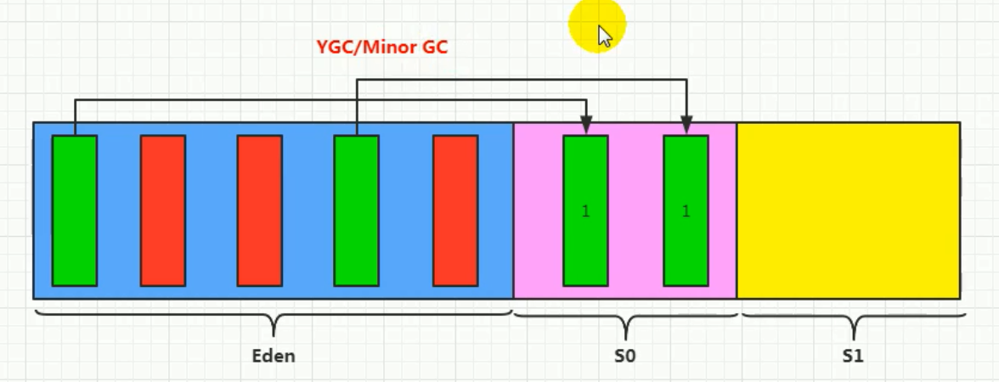

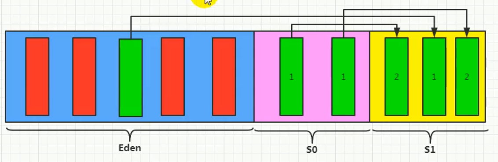


Eden区满了会触发YGC，Survivor区满了不会触发YGC。触发YGC时Eden和Survivor区都会进行垃圾回收。Survivor区满了会将其中的对象放到老年代中。

**总结：**

- ==针对幸存者s0区和s1区，复制之后有交换，谁空谁是to。==
- ==关于垃圾回收：频繁在新生去收集，很少在养老区收集，几乎不再永久区/元空间收集==

**带特殊情况的内存分配策略**

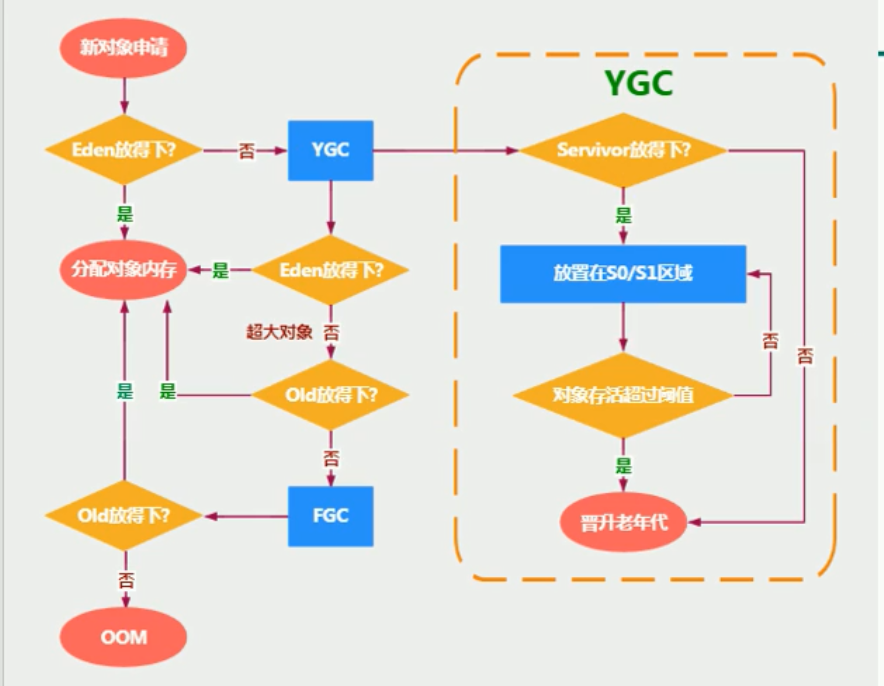

### 3.4.5 常用的调优工具

- JDK命令行
  - jinfo、jstate、javap、jamp
- Eclipse:Memory Analyzer Tool
- Jconsole
- VisualVM
- Jprofiler
- Java Flight Recorder
- GCViewer
- GC Easy

### 3.4.6 GC 分类

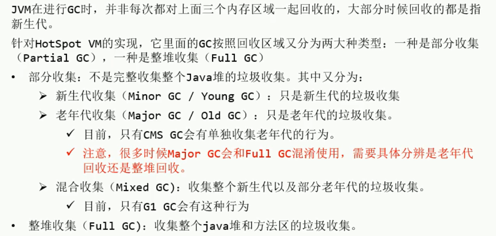

**分代式GC触发的条件**

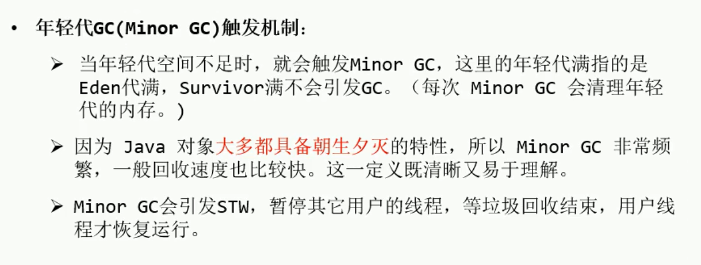


**内存分配策略**


### 3.4.7 对象分配过程：TLAB

**为什么要有TLAB(Thread Local Allocation Buffer)**

- 堆区是线程共享区域，任何线程都可以访问到堆区中的共享数据。
- 由于对象实例的创建在JVM中非常频繁，因此在并发环境下从堆区中划分内存空间是线程不安全的。
- 为避免多个线程操作同一地址，需要使用加锁等机制，进而影响分配速度。

**什么是TLAB**

- 从内存模型而不是垃圾收集的角度，堆Eden区域继续进行划分，JVM为==每个线程分配了一个私有缓存区域==，它包含在Eden空间内。
- 多线程同时分配内存时，使用TLAB可以避免一系列的非线程安全问题，同时还能够提升内存分配的吞吐量，因此我们可以将这种内存分配方式称为==快速分配策略==。
- 所有的OpenJDK衍生出来的JVM都提供了TLAB的设计。


**对象分配过程**


### 3.4.8 堆空间常用参数


### 3.4.9 逃逸分析


**逃逸分析概述**


参数设置：

- 在JDK 6u23版本之后，HotSpot中默认就已经开启了逃逸分析。
- 如果使用的是较早版本，可以通过：
  - -XX：+DoEscapeAnalysis显式开启逃逸分析。
  - 通过选项-XX：+PrintEscapeAnalysis查看逃逸分析的筛选结果。

### 3.8.10 代码优化


**栈上分配**


**同步省略**


**标量替换**


标量替换的参数设置：

```
参数-XX:+EliminateAllocations:开启标量替换，默认是打开的，运行将对象打散分配在栈上。
```

**逃逸分析的说明，并不是很成熟**


## 3.5 方法区（元空间）

### 3.5.1 栈、堆、方法区的交互关系


**交互关系**


### 3.5.2 方法区概述


**Hotspot中方法区的演进**

 


### 3.5.3 设置方法区大小与OOM


**解决OOM异常**


### 3.5.4 内部结构

**方法区的存储内容**


**类型信息**

对每个加载的类型（类class、接口interface、枚举enum、注解annotation），JVM必须在方法区中存储以下类型信息：

1. 这个类型的完整有效名称（全名=包名.类名）
2. 这个类型直接父类的完整有效名（对于interface或者是java.lang.Object，都没有父类）
3. 这个类型的修饰符（public，abstract，final的某个子集）
4. 这个类型直接接口的一个有序列表

**域（Field）信息**

- JVM必须在方法区中保存类型的所有域的相关信息以及域的声明顺序。
- 域的相关信息包括：域名称、域类型、域修饰符（public、private、protected、static、final、volatile、transient的某个子集）。

**方法（Method）信息**

JVM必须保存所有方法的以下信息，同域信息一样包括声明顺序：

- 方法名称
- 方法的返回类型（或void）
- 方法参数的数量和类型（按顺序）
- 方法的修饰符（public、private、protected、static、final、synchronized、native、abstract的一个子集）
- 方法的字节码（bytecodes）、操作数栈、局部变量表及大小（abstract和native方法除外）
- 异常表（abstract和native方法除外）
  - 每个异常处理的开始位置、结束位置、代码处理在程序计数器中的偏移地址、被捕获的异常类的常量池索引

**non-final的类变量**

- 静态变量和类关联在一起，随着类的加载而加载，它们成为类数据在逻辑上的一部分。
- 类变量被类的所有实例共享，即使没有类实例时也可以访问。

**全局常量：static final**

- 被声明为final的类变量的处理方式则不同，每个全局常量在编译的时候就会被分配了。

#### 3.5.4.1 运行时常量池

- 方法区，内部包含了运行时常量池。
- 字节码文件，内部包含了常量池。
- 要弄清楚方法区，需要理解清楚ClassFile，因为加载类的信息都在方法区。
- 要弄清楚方法区的运行时常量池，需要理解清楚ClassFile中的常量池。


**为什么需要常量池**


**常量池中有什么信息？**

- 数量值
- 字符串值
- 类引用
- 字段引用
- 方法引用

**运行时常量池**


### 3.5.5 方法区演进


**永久代为什么被元空间替换**


**字符串常量池为什么要调整**

jdk7中将StringTable放到了堆空间中，因为永久代的回收效率很低，在full gc 的时候才会被触发。而full gc是老年代的空间不足、永久代不足时才会被触发，这就导致StringTable回收效率不高。而我们开发中会有大量的字符串被创建，回收效率低，导致永久代内存不足。放到堆中能即时回收内存。

### 3.5.6 方法区垃圾回收


# 4.对象实例化、内存布局、访问定位

## 4.1 对象实例化


**创建对象的方式**

1. new 
   - 最常见的new 对象
   - 变形1：xxx的静态方法
   - 变形2：xxxBuilder/xxxFactory的静态方法
2. Class的newInstance():反射的方式，只能调用空参的构造函数，权限必须为public
3. Constructor的newInstance(xxx):反射的方式，可以调用空参、带参的构造函数，权限没有要求。
4. 使用clone():不调用任何构造器，当前类需要实现Cloneable接口，实现clone()
5. 使用反序列化：从文件中、网络中获取一个对象的二进制流
6. 第三方库Objenesis

**对象创建的步骤**

1. 判断对象对应的类是否加载、链接、初始化。

   >  虚拟机遇到一条new指令，首先去检查这个指令的参数是否在MetaSpace的常量池中定位到一个类的符号引用，并且检查这个符号引用代表的类是否已经被加载、解析和初始化，（即判断类元信息是否存在）。如果没有，那么在双亲委派模式下使用类加载器以CLassLoader+包名+类名为Key进行查找对应的class文件。如果没有找到文件，则抛出ClassNotFoundException异常，如果找到，则进行类加载并产生对象的Class类对象。

2. 为对象分配内存

   > 首先计算对象占用空间大小，接着在堆中划分一块内存给新对象。如果实例成员变量是引用变量，仅分配引用变量空间即可，即4个字节大小。

   - 如果内存规整----指针碰撞

     > 如果内存是规整的，那么虚拟机将采用的是指针碰撞法（Bump The Pointer）来为对象分配内存。
     >
     > 意思是所有用过的内存在一边，空闲的内存在另外一边，中间放着一个指针作为分界点的指示器，分配内存就仅仅是把指针向空闲那边挪到一段与对象大小相等的距离罢了。如果垃圾收集器选择的是Serial、ParNew这种基于压缩算法的，虚拟机采用这种分配方式。一般使用带有compact（整理）过程的收集器时，使用指针碰撞。

   - 如果内存不规整----虚拟机需要维护一个列表、空闲列表分配

     > 如果内存不是规整的，已使用和未使用的内存互相交错，那么虚拟机将采用的是空闲列表法来为对象分配内存。
     >
     > 意思是虚拟机维护了一个列表，记录上哪些内存块是可使用的，再分配的时候从列表中找到一块足够大的空间划分给对象实例，并更新列表上的内存。这种分配方式称为"空闲列表"。

   - 说明

     > 选择哪种分配方式有Java堆是否规整决定，而Java堆是否规整又由所采用的垃圾收集器是否带有压缩整理功能决定。

3. 处理并发安全问题

   - 采用CAS失败重试、区域加锁保证更新的原子性
   - 每个线程预先分配一块TLAB，通过-XX:+/-UseTLAB参数来设定

4. 初始化分配到的空间

   - 所有属性设置默认值，保证对象实例字段在不赋值时可以直接使用。

5. 设置对象的对象头

   > 将对象的所属类（即类的元数据信息）、对象的HashCode和对象的GC信息、锁信息等数据存储在对象的对象头中。这个过程的具体设置方式取决于JVM实现。

6. 执行init方法进行初始化

   > 在Java程序的视角看来，初始化才正式开始。初始化成员变量，执行实例化代码块，调用类的构造方法，并把堆内对象的首地址复制给引用变量。
   >
   > 因此，一般来说由字节码中是否跟随由invokespecial指令所决定，new指令之后接着就会的执行方法，把对象按照程序员的意愿进行初始化，这样一个真正可用的对象才算完全创建出来。

## 4.2 对象的内存布局


```java
public class Customer{
    int id = 1001;
    String name;
    Account acct;
    {
        name = "匿名用户";
    }
    public Customer(){
        acct = new Account();
    }
}
Class Account{
    
}

public static void main(String[] args){
    Customer cust  = new Customer();
}
```

## 4.3 访问定位


1. 图示

   

2. 句柄访问

   - 图示

     

   - 好处

     > reference中存储稳定句柄地址，对象被移动（GC）时只会改变句柄中实例数据指针即可，reference本身不需要被修改。

3. 直接指针（HotSpot采用）

   - 图示

     

   - 好处

     > 访问速度快，不需要另外开辟一个空间

# 5.直接内存


- I/O        byte[]/char[]       Stream

- NIO(Non-Blocking IO-+`)          Buffer              Channel


# 6. 执行引擎


**执行引擎的工作过程**


从外观上看所有Java虚拟机的执行引擎输入、输出都是一致的，输入的是字节码二进制流，处理过程是字节码解析执行的等效过程，输出的是执行结果。

## 6.1 编译与执行

 


示例

 

## 6.2 解释器


**解释器工作**


**解释器分类**


**现状**


## 6.2 JIT编译器


**为何保留解释器**


**方法调用计数器**


**回边计数器**


## 6.3 设置程序执行方式


```
//命令行模式
java -Xint -version
```

**JIT 分类**


