[TOC]

<div style = "page-break-after:always;"></div>

# 1. JavaBase

**JDK、JRE和JVM之间的关系**

- Java Development Kit ，提供给Java开发人员使用，其中包含了Java的开发工具，也包含了JRE。开发工具：编译工具（javac.exe)，打包工具（jar.exe）等。
- Java Runtime Environment，包括了Java虚拟机（Java Virtual Machine）和Java的核心类库，如果想要运行一个Java程序，只需要安装JRE即可。

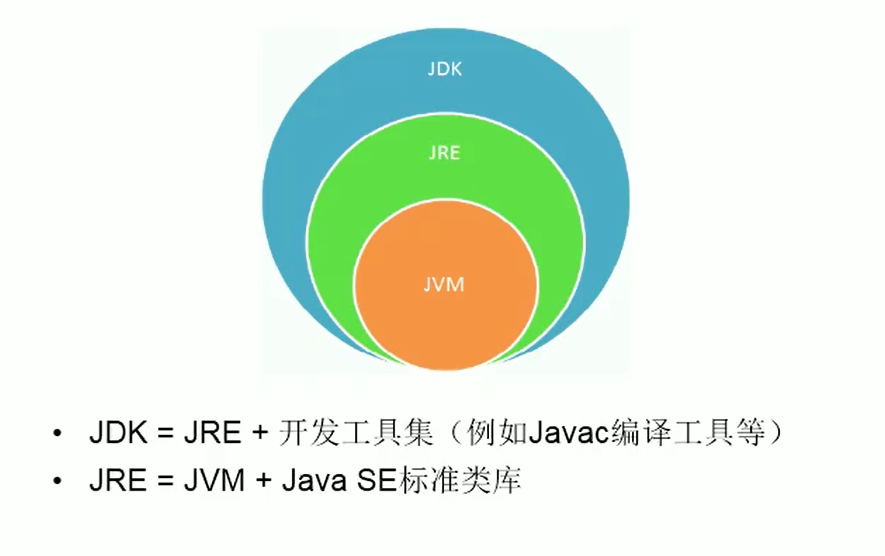

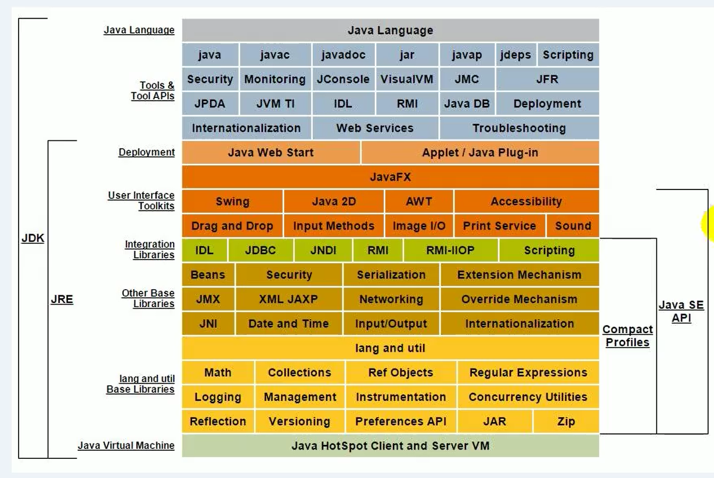

**面向对象三要素** 

- 封装
- 继承
- 多态

**面向对象五个基本设计原则**

- 单一职责原则

  其核心思想为：一个类，最好只做一件事，只有一个引起它的变化。高内聚、低耦合。

- 开放封闭原则

  核心思想是：软件实体应该是可扩展的，不可修改的。开放封闭原则主要体现在两个方面：

  1. 对扩展开放，意味着有新的需求或变化时，可以对现有代码进行扩展，以适应新的情况。
  2. 对修改封闭，意味着类一旦设计完成，就可以独立完成其工作，而不要对其进行任何尝试的修改。

- Liskov替换原则（Liskov-Substituion Principle）

  核心思想是：子类必须能够替换其基类。这一思想体现为对继承机制的约束规范，只有子类能够替换基类时，才能保证系统在运行期内识别子类，这是保证继承复用的基础。

- 依赖倒置原则

   其核心思想是：依赖于抽象。具体而言就是高层模块不依赖于底层模块，二者都同依赖于抽象；抽象不依赖于具体，具体依赖于抽象。

- 接口隔离原则

  其核心思想是：使用多个小的专门的接口，而不要使用一个大的总接口。具体而言，接口隔离原则体现在：接口应该是内聚的，应该避免“胖”接口。一个类对另外一个类的依赖应该建立在最小的接口上，不要强迫依赖不用的方法，这是一种接口污染。

---

 **interface** 

- 在jdk7以前只能定义全局常量和抽象方法
  - 全局常量 public static final
  - 抽象方法 public abstract
- 在jdk8以后，除了定了全局常量和抽象方法外，还可以定义静态方法、默认方法(deafult)。
  - 接口中定义的静态方法，只能通过接口来调用。
  - 通过实现类的对象，可以调用接口中的默认方法。
  - 如果实现类重写了接口中的默认方法，调用的是重写的方法。
  - 如果子类(或实现类)继承的父类和实现的接口中声明了同名同参数的方法，子类在没有重写此方法的情况下，默认调用的是父类中的同名同参数的方法。 
  - 如果实现类实现了多个接口，而这多个接口中定义了同名同参的默认方法，那么在实现类没有重写此方法的情况下会报错(接口冲突)，这就需要我们必须在实现类中重写此方法。

# 2.IDEA 设置

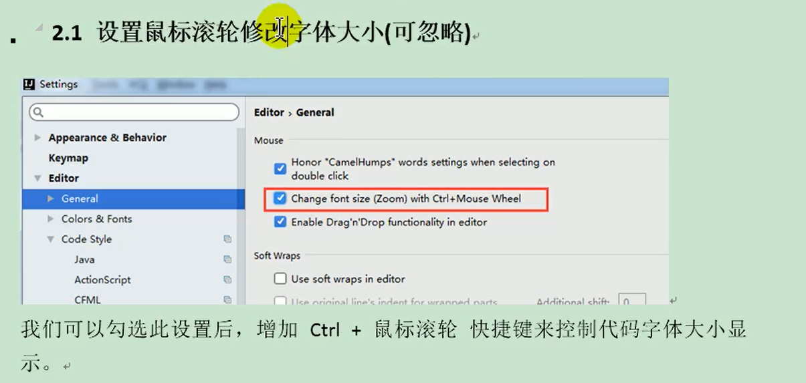

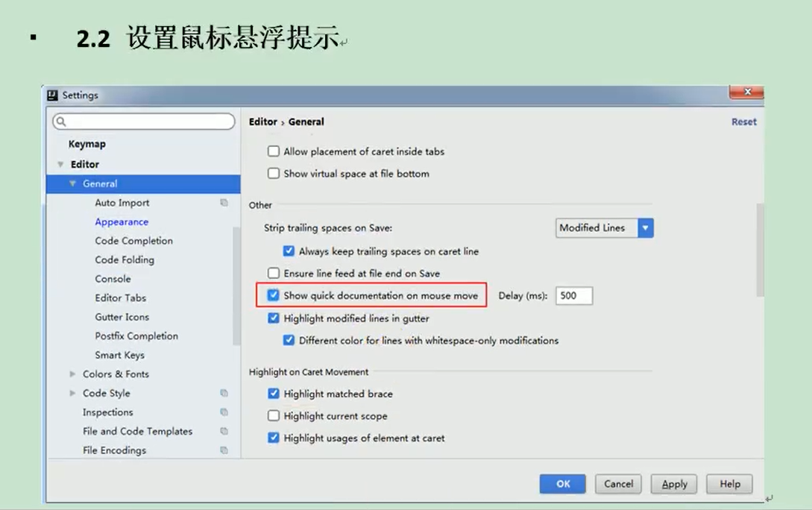

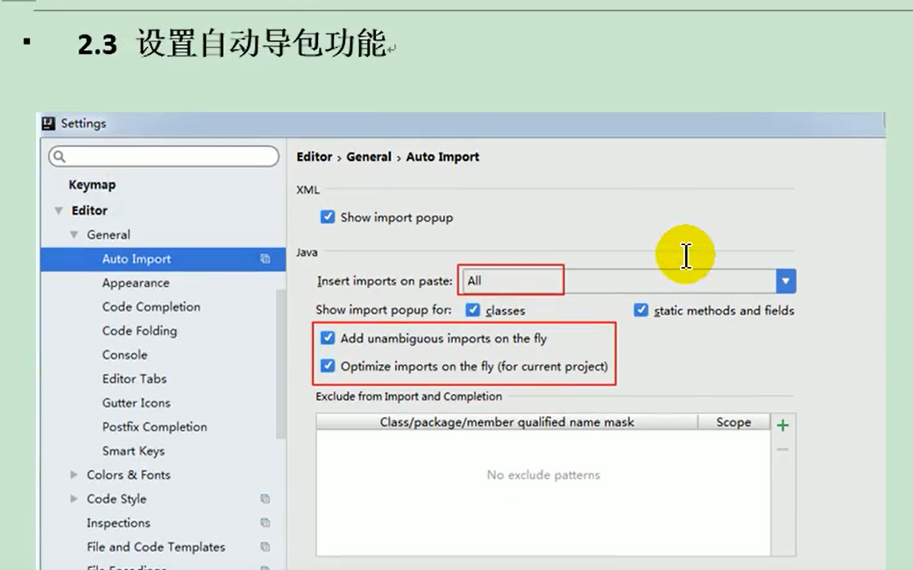

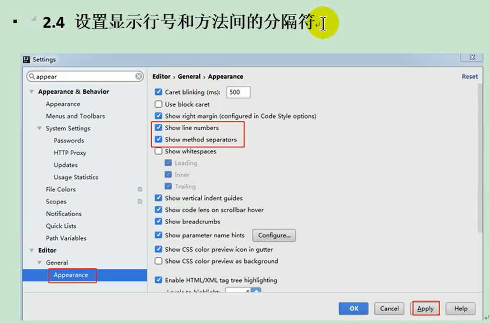

忽略大小写提示，取消match case

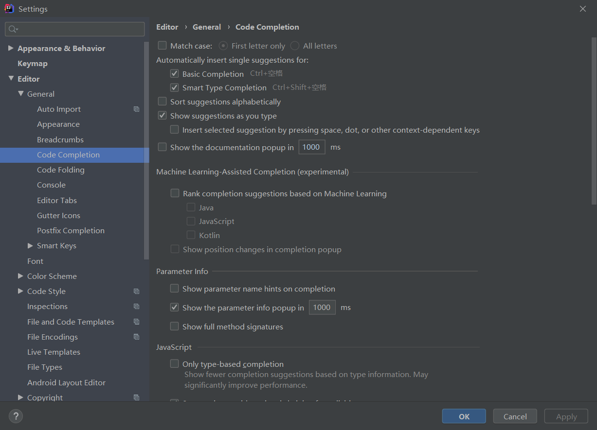

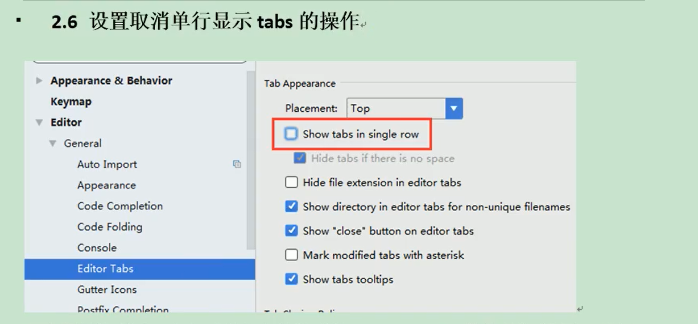

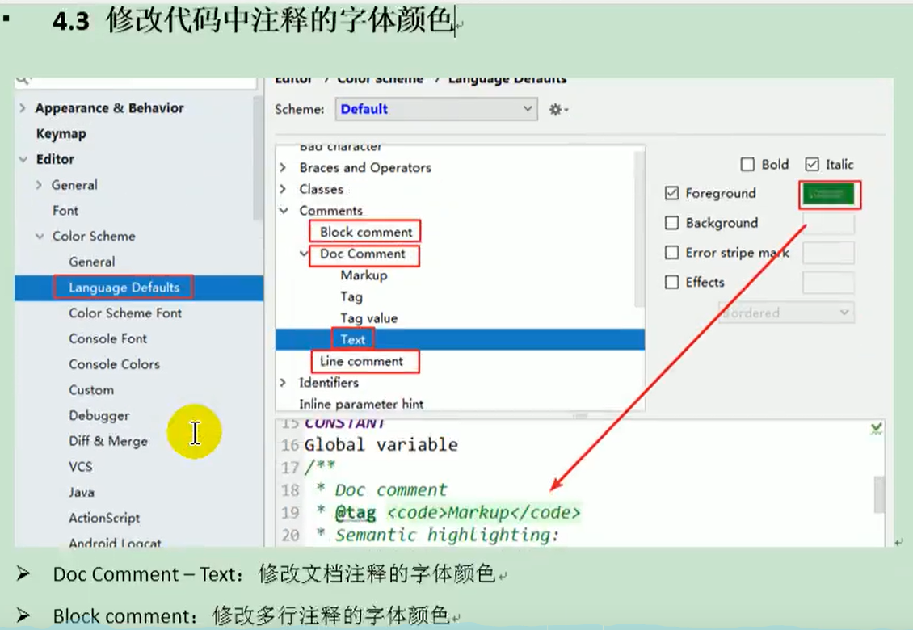

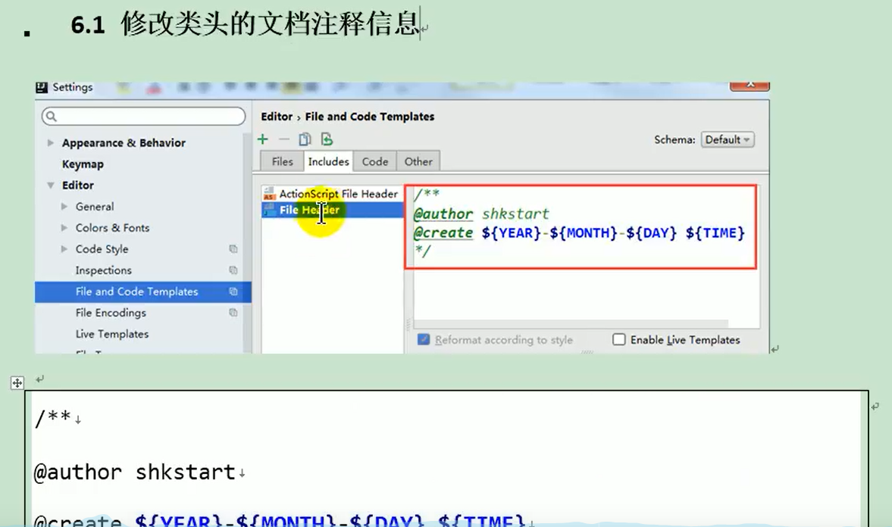

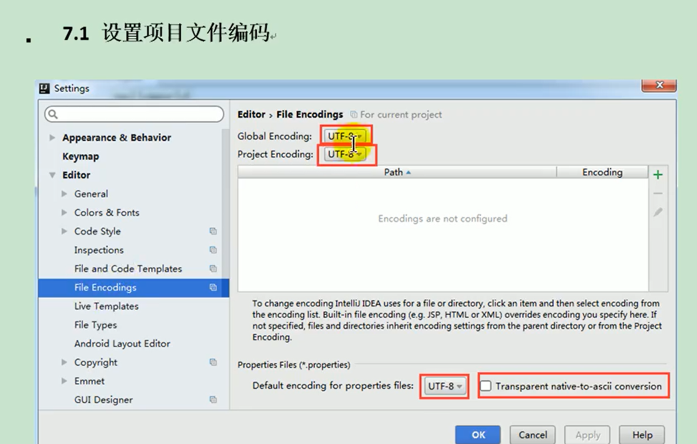

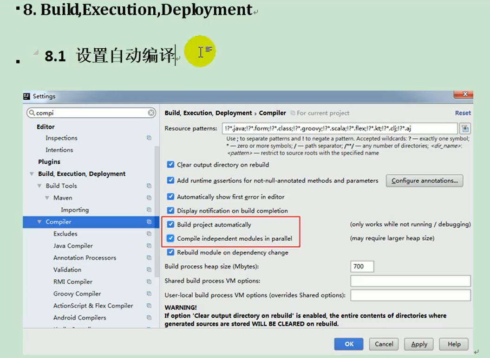

# 3.多线程

## 3.1 程序、进程、线程

- **程序program**：是为了完成特定任务、用某种语言编写的一组指令的集合。即指==一段静态的代码==，静态对象。
- **进程process**：是程序的一次执行过程，或是==正在运行的一个程序==。是一个动态的过程，有它自身的产生、存在和消亡的过程。--生命周期
  - 如：运行中的微信，运行中的mp3播放器
  - 程序是静态的，进程是动态的。
  - ==进程作为资源分配的单元==，系统在运行时会为每个进程分配不同的内存区域。
- **线程thread**：进程可进一步细化为线程，是一个程序内部的一条执行路径。
  - 若一个进程同一时间**并行**执行多个线程，就是支持多线程。
  - ==线程作为调度和执行的单元，每个线程拥有独立的运行栈和程序计数器==，线程切换的开销较小。
  - 一个进程中的多个线程共享共同的内存单元/内存地址空间-->它们从同一堆中分配对象，可以访问相同的变量和对象，这就使得线程间通信更方便、高效。但多个线程操作共享的系统资源可能就会带来**安全隐患**。

---

- 单核CPU和多核CPU的理解
  - 单核CPU，其实是一种假的多线程，在一个时间单元内只能执行一个线程的任务。但是因为CPU时间单元特别短，因此感觉不出来。
  - 如果是多核的话，才能更好的发挥多线程的效率，（现在的服务器都是多核的）。
  - 一个Java应用程序java.exe，其实至少有三个线程：main()主线程，gc()垃圾回收线程，异常处理线程。当然，如果发生异常，会影响主线程。

---

- 并行与并发
  - 并行：多个CPU同时执行多个任务。比如：多个人同时做不同的事。
  - 并发：一个CPU（采用时间片）同时执行多个任务。比如：多个人做同一件事。

---

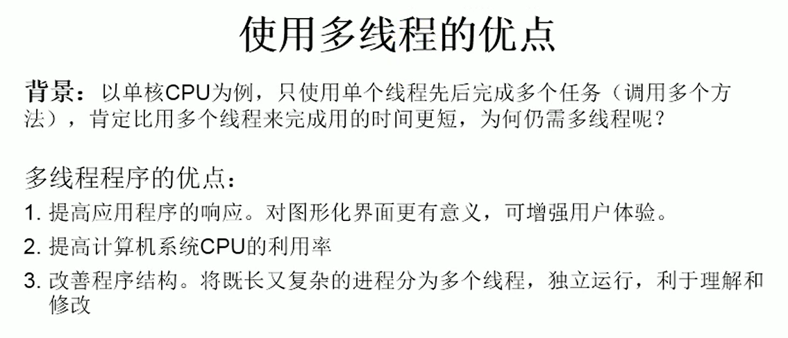


## 3.2 线程的创建和使用

### 3.2.1 通过继承Thread类实现

- Java语言的JVM允许程序运行多个线程，它通过java.lang.Thread类来实现。
- Thread类的特性
  - 每个线程都是通过某个特定Thread对象的run()方法来完成操作的，经常把run()方法的主体称为**线程体**。
  - 通过该Thread对象的start()方法来启动这个线程，而非直接调用run()。

```java
package com.cn.zhenghang;

/**
 *多线程的创建，方式一：继承于Thread类
 * 1. 创建一个继承于Thread类的子类
 * 2. 重写Thread类的run()-->此线程将执行的操作声明在run()中
 * 3. 创建Thead类的子类的对象
 * 4. 通过此对象调用start()
 *
 * @author zhenghang
 * @create 2021-03-28-21:11
 */

//创建一个继承于Thread类的子类
public class ThreadTest extends Thread  {
    //重写Thread类的run()-->此线程将执行的操作声明在run()中
    @Override
    public void run() {
        for (int i = 0; i < 100 ; i++) {
            if (i % 2 == 0){
                System.out.println(i);
            }
        }
    }
}

class myTest{
    public static void main(String[] args) {
        //创建Thead类的子类的对象
        ThreadTest threadTest = new ThreadTest();
        //通过此对象调用start()
        threadTest.start();
        for (int i = 0; i < 100 ; i++) {
            if (i % 2 == 0){
                System.out.println(i + "****");
            }
        }
    }
}

```

- Thread 类相关的方法
  - void start()：启动线程，并执行对象的run()方法
  - run()：线程在被调度时执行的操作
  - String getName()：返回线程的名称
  - void setName(String name)：设置该线程名称
  - static Thread currentThread():返回当前线程。在Thread子类中就是this，通常用于主线程和Runnable实现类
  - static void yield()：线程让步
    - 暂停当前正在执行的线程，把执行机会让给优先级相同或更高的线程
    - 若对列中没有同优先级的线程，忽略此方法
  - join()：当某个程序执行流中调用其他线程的join()方法时，调用线程将被阻塞，直到join()线程执行完为止。
    - 低优先级的线程也可以获得执行
  - static void sleep(long mills)：指定休眠时间：毫秒
    - 令当前活动线程在指定时间段内放弃对CPU控制，使其他线程有机会被执行，时间到后重排队
    - 抛出interruptException异常
  - stop()：强制线程生命周期结束，不推荐使用
  - boolean isAlive()：返回boolean，判断线程是否还存活

```java
package com.cn.zhenghang;

/**
 * 测试Thread中常用的方法
 *
 * @author zhenghang
 * @create 2021-03-30-19:43
 */
public class ThreadMethodTest {
    public static void main(String[] args) {
        MyThread thread = new MyThread();
        thread.setName("线程一");
        thread.start();
        //给主线程命名
        Thread.currentThread().setName("主线程");
        for (int i = 0 ; i < 100 ;i++ ){
            if (i%2 == 0){
                System.out.println(Thread.currentThread().getName() + ":" + i);
            }
//            if (i%20 == 0){
//                try {
//                    thread.join();
//                } catch (InterruptedException e) {
//                    e.printStackTrace();
//                }
//            }
        }
    }
}
class MyThread extends Thread {
    @Override
    public void run() {
        for (int i = 0 ; i < 100 ;i++ ){
            if (i%2 == 0){
                System.out.println(Thread.currentThread().getName() + ":" + i);
            }
            if (i%20 == 0){
                this.yield();
            }
        }
    }
}

```

### 3.2.2 线程调度

- 调度策略
  - 时间片
  - 抢占式：高优先级的线程抢占CPU
- Java的调度方法
  - 同优先级线程组成先进先出对列（先到先服务），使用时间片策略
  - 对高优先级，使用优先调度的抢占式策略
- 线程的优先级
  - MAX_PRIORITY:10
  - MIN_PRIORITY:1
  - NORM_PRIORITY:5，默认的优先级
- 涉及的方法
  - getPriority：返回线程优先级
  - setPriority：改变线程的优先级
- 说明
  - 线程创建时继承父线程的优先级
  - 低优先级只是获得调度的概率低，并非一定是在高优先级线程之后才被调用

### 3.2.3 实现Runnable接口

```java
package com.cn.zhenghang;

/**
 * 创建多线程的方式二：实现Runnable接口
 * 1. 创建一个实现了Runnable接口的类
 * 2. 实现类去实现Runnable中的抽象方法：run()
 * 3. 创建实现类的对象
 * 4. 将此对象作为参数传递到Thread类的构造器中，创建Thread类的对象
 * 5. 通过Thread类的对象调用start()
 *
 * @author zhenghang
 * @create 2021-03-30-20:37
 */
public class ThreadTest1 {
    public static void main(String[] args) {
        //3. 创建实现类的对象
        MyThread2 myThread2 = new MyThread2();
        //4. 将此对象作为参数传递到Thread类的构造器中，创建Thread类的对象
        Thread t1 = new Thread(myThread2);
        //5. 通过Thread类的对象调用start();①启动线程②调用当前线程的run()-->调用Runnable类型的target的run()
        t1.start();
    }
}

//1. 创建一个实现了Runnable接口的类
class MyThread2 implements Runnable{

    //2. 实现类去实现Runnable中的抽象方法：run()
    @Override
    public void run() {
        for (int i = 0; i < 100 ; i++) {
            if (i % 2 == 0){
                System.out.println(i);
            }
        }
    }
}

//匿名类
new Thread(){
    @Override
    public void run(){
        
    }
}.start();
new Thread(new Runnable(){
    @Override
    public void run(){
        
    }
}).start;
```

---

Java 中的线程分为两类：守护线程和用户线程

- 它们在几乎每个方面都是相同的，唯一的区别是判断JVM何时离开。
- 守护线程是用来服务用户线程的，通过在start()方法前调用thread.setDaemon(true)可以把一个用户线程变成一个守护线程。
- Java垃圾回收就是一个典型的守护线程。
- 若JVM中都是守护线程，JVM将退出。

### 3.2.4 线程的生命周期

JDK中用Thread.State类定义了线程的几种状态

要想实现多线程，必须在主线程中创建新的线程对象。Java语言使用Thread类及其子类的对象来表示线程，在它的一个完整的生命周期中通常要经历如下的五种状态：

- 新建：当一个Thread类或其子类的对象被声明并创建时，新生的线程对象处于新建状态。
- 就绪：处于新建状态的线程被start()后，将进入线程对列等待CPU时间片，此时它已具备了运行的条件，只是没有分配到CPU资源。
- 运行：当就绪的线程被调度并获得CPU资源时，便进入运行状态，run()方法定义了线程的操作和功能。
- 阻塞：在某种特殊情况下，被人为挂起或执行输入输出操作时，让出CPU并临时中止自己的执行，进入阻塞状态。
- 死亡：线程完成了它的全部工作或线程被提前强制性地终止或出现异常导致结束。

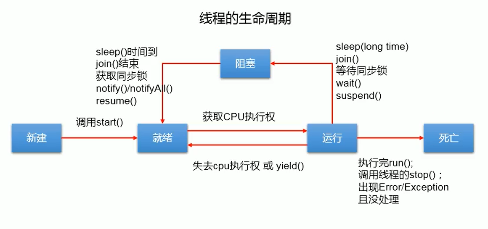

### 3.2.5 线程的同步

- 同步代码块 

  > synchronized(同步监视器){
  >
  > //需要被同步的代码，操作共享数据的代码
  >
  > }

  同步监视器，俗称锁。任何一个类的对象都可以充当锁。

  ​    要求：多个线程必须要共用同一把锁。

- 同步方法

  > private synchronized name(){
  >
  > //需要被同步的代码，操作共享数据的代码
  >
  > }

  如果操作共享数据的代码完整的声明在一个方法中，我们不妨将此方法声明为同步的。非静态的同步方法中同步监视器为this。在继承Thread类的时候，同步方法需声明为static，此时的同步监视器为当前类(类.class)。

- Lock(锁)

  > private ReentrantLock lock = new ReentrantLock();
  >
  > //fair 公平锁
  >
  > try{
  >
  > lock.lock();
  >
  > //需要被同步的代码，操作共享数据的代码
  >
  > }finally{
  >
  > lock.unlock();
  >
  > }

  - 从JDK5.0开始，Java提供了更强大的同步机制--通过显式定义同步锁对象来实现同步。同步锁使用Lock对象充当。
  - ==java.util.concurrent.locks.Lock接口是控制多个线程对共享资源进行访问的工具。==锁提供了对共享资源的独占访问，每次只能有一个线程对Lock对象加锁，线程开始访问共享资源之前应先获得Lock对象。
  - RentrantLock类实现了Lock，它拥有与synchronized相同的并发性和内存语义，在实现线程安全的控制中，比较常用的是ReentrantLock，可以显示加锁、释放锁。

同步的方式解决了线程的安全问题，操作同步代码时只能有一个线程参与，其他线程等待，相当于是一个单线程的过程，效率低。

在继承Thread类创建多线程的方式中，慎用this充当同步监视器，考虑使用当前类(类.class)充当同步监视器。

**synchronized 和 Lock的异同？**

- 相同：都可以解决同步问题
- 差异：
  - synchronized 机制执行完同步代码以后自动的释放同步监视器。
  - Lock需要手动的启动同步(lock()),同时结束同步也需要手动实现(unlock())。使用Lock锁，JVM将花费较少的时间来调度线程，性能更好。并且具有更好的扩展性（提供更多的子类）。

### 3.2.6 线程死锁

- 死锁
  - 不同的线程分别占用对方需要的同步资源不放弃，都在等待对方放弃自己需要的同步资源，就形成了线程的死锁。
  - 出现死锁后，不会出现异常和提示，只是所有线程都处于阻塞状态，无法继续执行。
- 解决方法
  - 专门的算法、原则
  - 尽量减少同步资源的定义
  - 尽量避免嵌套同步

### 3.2.7 线程的通信

**涉及到的三个方法：**

wait():一旦执行此方法，当前线程就会进入阻塞状态，并释放同步监视器。

notify():一旦执行此方法，就会唤醒被wait的一个线程。如果有多个线程被wait,就唤醒优先级高的线程。

notifyAll():一旦执行此方法，就会唤醒所有被wait的线程。

> 1.wait(),notify(),notifyAll()三个方法必须使用在同步方法或者同步代码块中。
>
> 2.wait(),notify(),notifyAll()三个方法的调用者必须是同步代码块或同步方法中的同步监视器，否则会出现IllegalMonitorStateException异常。
>
> 3.wait(),notify(),notifyAll()三个方法是定义在java.lang.Object类中的。

```java
/**
*线程通信的例子，使用两个线程打印1-100，线程1与线程2交替打印
*/
public class CommunicationTest{
    public static void mian(String[] args){
        Number number = new Number();
        Thread t1 = new Thread(number);
        Thread t2 = new Thread(number);
        t1.setName("线程1");
        t2.setName("线程2");
        t1.start();
        t2.start();
    }
}
class Number implements Runnable{
    private int number = 1;
    @Override
    public void run(){
        while(true){
            synchronized(this){
                notify();
                if(number <= 100){
                    System.out.println(Thread.currentThread().getName() + ":" + number);
                    number++;
                    
                    try{
                        wait();
                    }catch(InterruptedException e){
                        e.printStackTrace();
                    }
                }else{
                    break;
                }
            }
        }
    }
}
```

---

**sleep()和wait()的异同?**

- 相同点：一旦执行方法，都可以使得当前线程进入阻塞状态。
- 不同点：
  1. 两个方法声明的位置不同：Thread类中声明sleep(),Object()类中声明wait()。
  2. 调用的要求不同：sleep()可以在任何需要的场景下调用，wait()必须使用在同步方法或同步代码块中。
  3. wait()会释放同步监视器，sleep()不会释放锁。

### 3.2.8 实现Callable接口


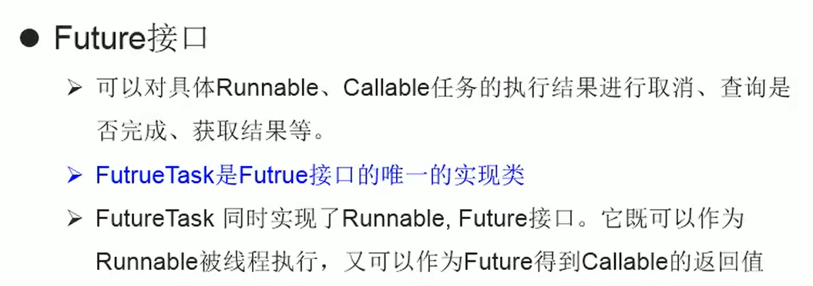

```java
/**
*创建线程的方式三：实现Callable接口--jdk5.0 新增
*/

Class NumThread implements Callable{
    @Override 
    public Object call() throws Exception{
        int sum = 0;
        for (int i =1 ;i<100 ; i++){
            if(i % 2 == 0){
                sum += i;
            }
        }
        retrun sum;
    }
}

public Class ThreadNew{
	public static void main(){
        NumThread numThread = new NumThread();
        FutureTask task = new FutureTask(numThread);
        new Thread(task).start();
        try{
            Object sum = task.get();
            System.out.println(sum);
        }catch Exception e{
            e.printStackTrace();
        }
    }
} 

```

### 3.2.9 使用线程池

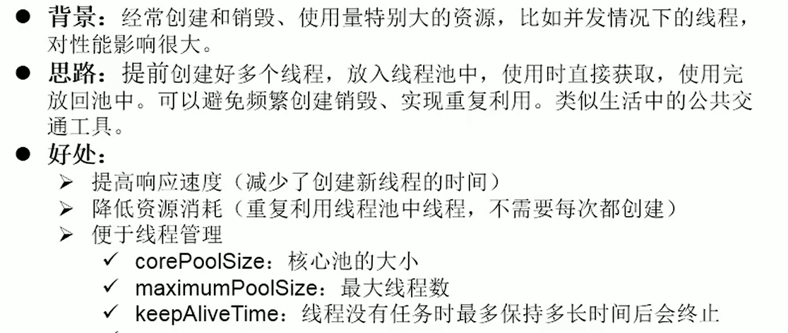

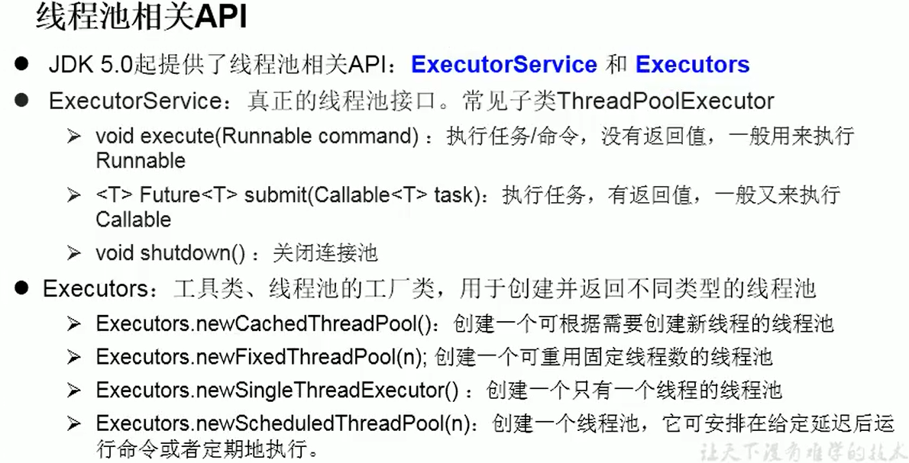

``` java
/**
*创建线程的方式四：使用线程池
*/
Class NumberThread implements Runnable{
    @override
    public void run(){
        for(int i = 0 ;i<= 100 ; i++){
            if(i % 2 == 0){
                System.out.println(i);
            } 
        }           
    }
}
public class ThreadPool{
    public static void main(String args[]){
        ExecutorService service = Executors.newFixedThreadPool(10);
        service.execute( new NumberThread());//适用Runnable接口
        //service.submit();//适用Callable接口
        service.shutdown();
    }
}
```

# 4. String、StringBuilder、StringBuffer

String、StringBuilder、StringBuffer三者的异同：

- String：不可变的字符序列；底层使用char[]存储
- StringBuffer：可变的字符序列；线程安全的，效率低；底层使用char[]存储
- StringBuilder：可变的字符序列；jdk5.0新增，线程不安全的，效率高；底层使用char[]存储

```java
//源码分析
String str = new String();//char[] value = new char[0];
String str1 = new String("abc");//char[] value = new char[]{'a','b','c'};

StringBuffer sb1 = new StringBuffer();//char[] value = new char[16];底层创建了一个长度为16的数组。
sb1.append('a');//value[0] = 'a';
sb1.append('b');//value[1] = 'b';

StringBuffer sb2 = new StringBuffer("abc");//char[] value = new char["abc".length + 16];

//扩容问题：如果要添加的数据底层数组盛不下，那就需要扩容底层的数组。默认情况下，扩容为原来容量的2倍 + 2，同时将原有数组中的元素复制到新的数组中。

```


