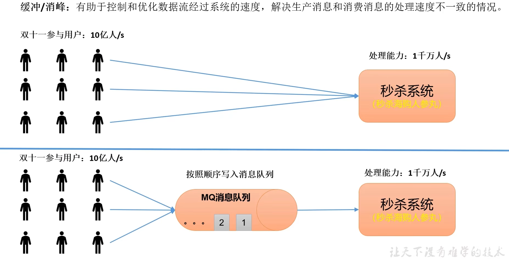
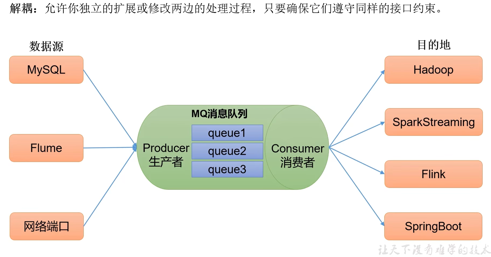
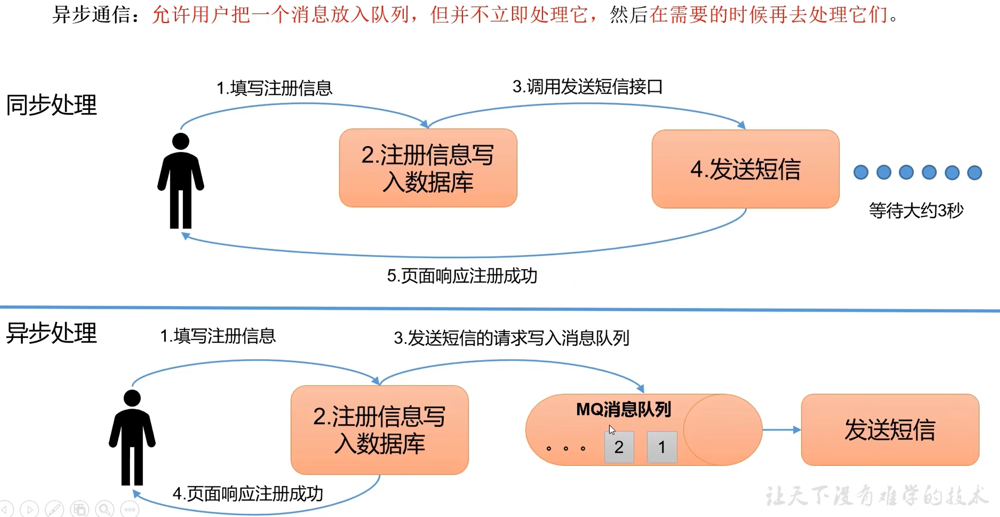
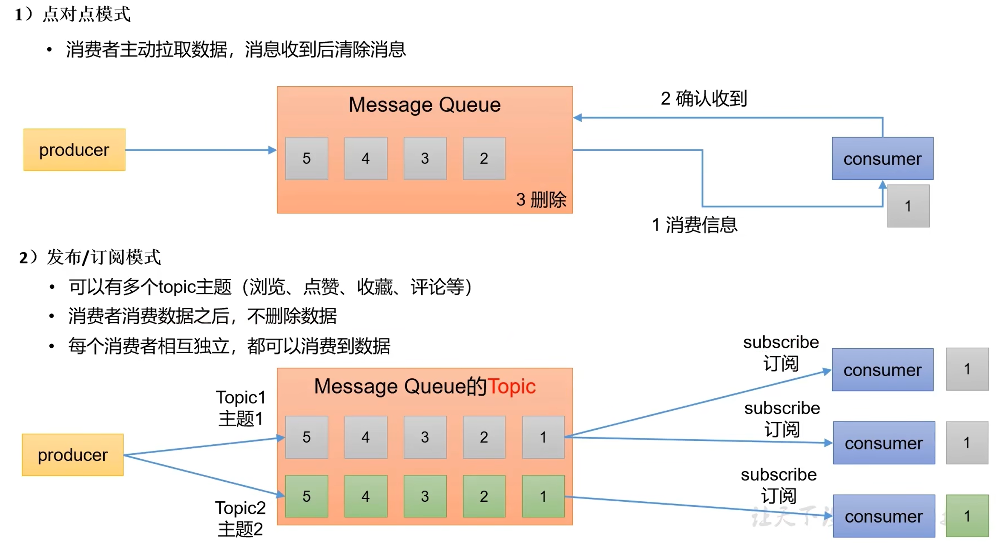
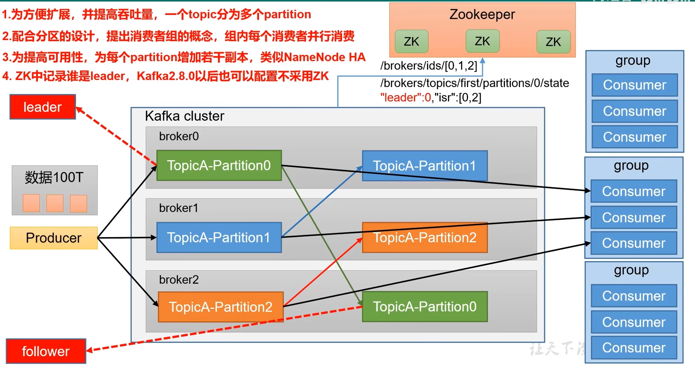
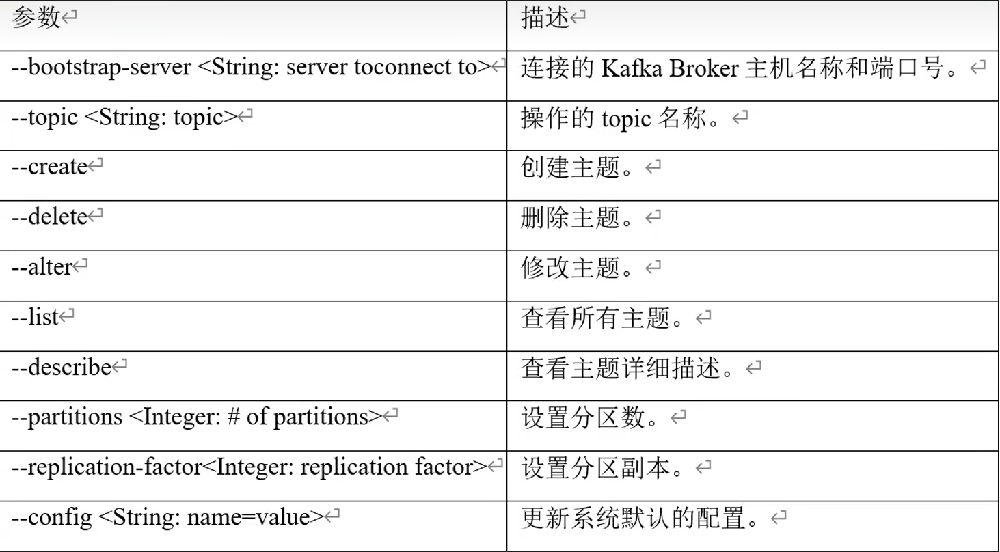
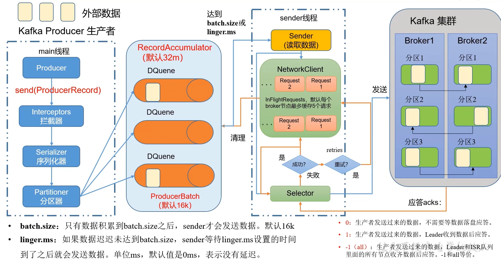

[TOC]

# 快速入门

## 1 kafka概述

### 1.1 kafka定义

- kafka传统定义：kafka是一个**分布式**的**基于发布/订阅模式的消息队列**，主要用于大数据实时处理领域。
- kafka最新定义：kafka是一个开源的分布式事件流平台，被用于**高性能数据管道**、**流分析**、**数据集成**和**关键任务应用**。

#### 1.2 消息队列

   目前企业中比较常见的消息队列产品主要有Kafka、ActiveMQ、RabbitMQ、RocketMQ等。在大数据场景主要采用Kafka作为消息队列，在JavaEE开发中主要采用ActiveMQ、RabbitMQ、RocketMQ。

##### 1.2.1 应用场景

  消息队列主要应用场景：**缓存/消峰、解耦、异步通信。**







##### 1.2.2 消息队列的两种模式



#### 1.3 基础架构



## 2 Kafka快速入门

### 2.1 安装部署

| hadoop102 | hadoop103 | hadoop104 |
| --------- | --------- | --------- |
| zk        | zk        | zk        |
| kafka     | kafka     | kafka     |

1. kafka下载地址https://kafka.apache.org/downloads
1. 修改server.proper配置文件

```shell
#broker的全局唯一编号，不能重复
broker.id=0
#删除topic功能，可以修改为true
delete.topic.enable=true
#处理网络请求的线程数量
num.network.thread=3
#用来处理磁盘IO的线程数量
num.io.threads=8
#发送套接字的缓冲区大小,默认100k
socket.send.buffer.bytes=102400
#接收套接字的缓冲区大小，默认100k
socket.receive.buffer,bytes=102400
#请求套接字的缓冲区大小,默认100M
socket.request.max.bytes=104857600;
#kafka运行时数据存放地址
log.dirs=/tmp/kafka-logs
#topic在当前broker上的分区个数
num.partitions=1
#用来恢复和清理data下数据的线程数量
num.recovery.threads.per.data.dir=1
#segment文件保留的最长时间，超时将被删除,默认为7天
log.retention.hours=168
#配置连接Zookeeper集群地址
zookeeper.connect=172.0.0.1:2181,172.0.0.2:2181
#修改启动端口,默认9092
port=9092
```

3. 配置环境变量（可选）

```sh
$ sudo vim /etc/profile

#KAFKA_HOME,选择合适路径
export KAFKA_HOME=/opt/module/kafka
export PATH=$PATH:$KAFKA_HOME/bin

$ source /etc/profile
```

4. 启动前需要先启动zookeeper

```shell
zkServer.sh start 
```

5. 启动kafka

```shell
bin/kafka-server-start.sh config/server.properties

#后台启动，以守护进程启动
bin/kafka-server-start.sh -daemon config/server.properties
```

### 2.2 kafka命令操作

#### 2.2.1 Topic命令

bin/kafka-topics.sh 脚本以及主要参数



#### 2.2.2 producer命令

bin/kafka-console-producer.sh 脚本

#### 2.2.3 comsumer命令

bin/kafka-console-consumer.sh 脚本

## 3 Kafka生产者

### 3.1 生产者发送流程

#### 3.1.1 发送原理

  在消息发送的过程中，涉及到了两个线程--main线程和sender线程。在main线程中创建了一个双端队列RecordAccumulator。main线程将发送消息给RecordAccumulator，Sender线程不断从RecordAccumulator中拉取消息发送到Kafka Broker。




