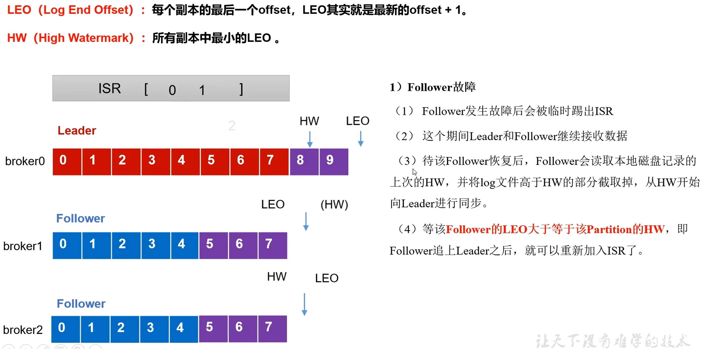

[TOC]

# 快速入门

## 1 kafka概述

### 1.1 kafka定义

- kafka传统定义：kafka是一个**分布式**的**基于发布/订阅模式的消息队列**，主要用于大数据实时处理领域。
- kafka最新定义：kafka是一个开源的分布式事件流平台，被用于**高性能数据管道**、**流分析**、**数据集成**和**关键任务应用**。

#### 1.2 消息队列

   目前企业中比较常见的消息队列产品主要有Kafka、ActiveMQ、RabbitMQ、RocketMQ等。在大数据场景主要采用Kafka作为消息队列，在JavaEE开发中主要采用ActiveMQ、RabbitMQ、RocketMQ。

##### 1.2.1 应用场景

  消息队列主要应用场景：**缓存/消峰、解耦、异步通信。**


##### 1.2.2 消息队列的两种模式


#### 1.3 基础架构


## 2 Kafka快速入门

### 2.1 安装部署

| hadoop102 | hadoop103 | hadoop104 |
| --------- | --------- | --------- |
| zk        | zk        | zk        |
| kafka     | kafka     | kafka     |

1. kafka下载地址https://kafka.apache.org/downloads
1. 修改server.proper配置文件

```shell
#broker的全局唯一编号，不能重复
broker.id=0
#删除topic功能，可以修改为true
delete.topic.enable=true
#处理网络请求的线程数量
num.network.thread=3
#用来处理磁盘IO的线程数量
num.io.threads=8
#发送套接字的缓冲区大小,默认100k
socket.send.buffer.bytes=102400
#接收套接字的缓冲区大小，默认100k
socket.receive.buffer,bytes=102400
#请求套接字的缓冲区大小,默认100M
socket.request.max.bytes=104857600;
#kafka运行时数据存放地址
log.dirs=/tmp/kafka-logs
#topic在当前broker上的分区个数
num.partitions=1
#用来恢复和清理data下数据的线程数量
num.recovery.threads.per.data.dir=1
#segment文件保留的最长时间，超时将被删除,默认为7天
log.retention.hours=168
#配置连接Zookeeper集群地址
zookeeper.connect=172.0.0.1:2181,172.0.0.2:2181
#修改启动端口,默认9092
port=9092
```

3. 配置环境变量（可选）

```sh
$ sudo vim /etc/profile

#KAFKA_HOME,选择合适路径
export KAFKA_HOME=/opt/module/kafka
export PATH=$PATH:$KAFKA_HOME/bin

$ source /etc/profile
```

4. 启动前需要先启动zookeeper

```shell
zkServer.sh start 
```

5. 启动kafka

```shell
bin/kafka-server-start.sh config/server.properties

#后台启动，以守护进程启动
bin/kafka-server-start.sh -daemon config/server.properties
```

### 2.2 kafka命令操作

#### 2.2.1 Topic命令

bin/kafka-topics.sh 脚本以及主要参数


#### 2.2.2 producer命令

bin/kafka-console-producer.sh 脚本

#### 2.2.3 comsumer命令

bin/kafka-console-consumer.sh 脚本

## 3 Kafka生产者

### 3.1 生产者发送流程

#### 3.1.1 发送原理

  在消息发送的过程中，涉及到了两个线程--main线程和sender线程。在main线程中创建了一个双端队列RecordAccumulator。main线程将发送消息给RecordAccumulator，Sender线程不断从RecordAccumulator中拉取消息发送到Kafka Broker。


### 3.2 异步发送API

#### 3.2.1 普通异步发送

```java
package producer;

import org.apache.kafka.clients.producer.KafkaProducer;
import org.apache.kafka.clients.producer.ProducerConfig;
import org.apache.kafka.clients.producer.ProducerRecord;
import org.apache.kafka.common.serialization.StringSerializer;

import java.util.Properties;

public class CustomProducer {

    public static void main(String[] args) {

        //0.配置
        Properties properties = new Properties();

        properties.put(ProducerConfig.BOOTSTRAP_SERVERS_CONFIG, "172.16.8.100:9092,172.16.8.101:9092");
        //设置序列化类型
        properties.put(ProducerConfig.KEY_SERIALIZER_CLASS_CONFIG, StringSerializer.class.getName());
        properties.put(ProducerConfig.VALUE_SERIALIZER_CLASS_CONFIG, StringSerializer.class.getName());

        //1.创建kafka生产者对象
        KafkaProducer<String, String> producer = new KafkaProducer<String, String>(properties);

        //2. 提交数据
        for (int i = 0; i < 5; i++) {
            producer.send(new ProducerRecord<String, String>("first", "hello" + i));
        }

        //3. 关闭资源
        producer.close();
    }
}
```

#### 3.2.2 回调函数的异步发送

```java
package producer;


import org.apache.kafka.clients.producer.*;
import org.apache.kafka.common.serialization.StringSerializer;

import java.util.Properties;

public class CustomProducer {

    public static void main(String[] args) {

        //0.配置
        Properties properties = new Properties();

        properties.put(ProducerConfig.BOOTSTRAP_SERVERS_CONFIG, "172.16.8.100:9092");
        //设置序列化类型
        properties.put(ProducerConfig.KEY_SERIALIZER_CLASS_CONFIG, StringSerializer.class.getName());
        properties.put(ProducerConfig.VALUE_SERIALIZER_CLASS_CONFIG, StringSerializer.class.getName());

        //1.创建kafka生产者对象
        KafkaProducer<String, String> producer = new KafkaProducer<>(properties);

        //2. 提交数据
        for (int i = 0; i < 5; i++) {
            producer.send(new ProducerRecord<>("first", "hello" + i), (metadata, exception) -> {
                if (exception == null) {
                    System.out.println("topic:" + metadata.topic() + ";partition:" + metadata.partition());
                }
            });
        }

        //3. 关闭资源
        producer.close();
    }
}
```

### 3.3 同步发送

> 添加get方法阻塞

```java
package producer;


import org.apache.kafka.clients.producer.*;
import org.apache.kafka.common.serialization.StringSerializer;

import java.util.Properties;
import java.util.concurrent.ExecutionException;

public class CustomProducer {

    public static void main(String[] args) throws ExecutionException, InterruptedException {

        //0.配置
        Properties properties = new Properties();

        properties.put(ProducerConfig.BOOTSTRAP_SERVERS_CONFIG, "172.16.8.100:9092");
        //设置序列化类型
        properties.put(ProducerConfig.KEY_SERIALIZER_CLASS_CONFIG, StringSerializer.class.getName());
        properties.put(ProducerConfig.VALUE_SERIALIZER_CLASS_CONFIG, StringSerializer.class.getName());

        //1.创建kafka生产者对象
        KafkaProducer<String, String> producer = new KafkaProducer<>(properties);

        //2. 提交数据
        for (int i = 0; i < 5; i++) {
            producer.send(new ProducerRecord<>("first", "hello" + i), (metadata, exception) -> {
                if (exception == null) {
                    System.out.println("topic:" + metadata.topic() + ";partition:" + metadata.partition());
                }
            }).get();
        }

        //3. 关闭资源
        producer.close();
    }
}
```

### 3.4 生产者分区

#### 3.4.1 分区好处


#### 3.4.2 默认分区规则


```java
package producer;


import org.apache.kafka.clients.producer.*;
import org.apache.kafka.common.serialization.StringSerializer;

import java.util.Properties;
import java.util.concurrent.ExecutionException;

public class CustomProducer {

    public static void main(String[] args) throws ExecutionException, InterruptedException {

        //0.配置
        Properties properties = new Properties();

        properties.put(ProducerConfig.BOOTSTRAP_SERVERS_CONFIG, "172.16.8.100:9092");
        //设置序列化类型
        properties.put(ProducerConfig.KEY_SERIALIZER_CLASS_CONFIG, StringSerializer.class.getName());
        properties.put(ProducerConfig.VALUE_SERIALIZER_CLASS_CONFIG, StringSerializer.class.getName());

        //1.创建kafka生产者对象
        KafkaProducer<String, String> producer = new KafkaProducer<>(properties);

        //2. 提交数据，指定分区0
        for (int i = 0; i < 5; i++) {
            producer.send(new ProducerRecord<>("first", 0, "", "hello" + i), (metadata, exception) -> {
                if (exception == null) {
                    System.out.println("topic:" + metadata.topic() + ";partition:" + metadata.partition());
                }
            });
        }

        //3. 关闭资源
        producer.close();
    }
}
```

#### 3.4.3 自定义分区器

实现步骤：

1. 定义类实现Partitioner接口
2. 重写partition方法

```java
package producer;

import org.apache.kafka.clients.producer.Partitioner;
import org.apache.kafka.common.Cluster;

import java.util.Map;

public class MyPartitioner implements Partitioner {
    @Override
    public int partition(String topic, Object key, byte[] keyBytes, Object value, byte[] valueBytes, Cluster cluster) {
        // 获取数据
        String msg = value.toString();
        int partition;
        if (msg.contains("hello")) {
            partition = 0;
        } else {
            partition = 1;
        }
        return partition;
    }

    @Override
    public void close() {

    }

    @Override
    public void configure(Map<String, ?> configs) {

    }
}
---
package producer;


import org.apache.kafka.clients.producer.KafkaProducer;
import org.apache.kafka.clients.producer.ProducerConfig;
import org.apache.kafka.clients.producer.ProducerRecord;
import org.apache.kafka.common.serialization.StringSerializer;

import java.util.Properties;

public class CustomProducer {

    public static void main(String[] args) {

        //0.配置
        Properties properties = new Properties();

        properties.put(ProducerConfig.BOOTSTRAP_SERVERS_CONFIG, "172.16.8.100:9092");
        //设置序列化类型
        properties.put(ProducerConfig.KEY_SERIALIZER_CLASS_CONFIG, StringSerializer.class.getName());
        properties.put(ProducerConfig.VALUE_SERIALIZER_CLASS_CONFIG, StringSerializer.class.getName());

        //关联自定义分区器
        properties.put(ProducerConfig.PARTITIONER_CLASS_CONFIG, MyPartitioner.class.getName());

        //1.创建kafka生产者对象
        KafkaProducer<String, String> producer = new KafkaProducer<>(properties);

        //2. 提交数据
        for (int i = 0; i < 5; i++) {
            producer.send(new ProducerRecord<>("first", "hello" + i), (metadata, exception) -> {
                if (exception == null) {
                    System.out.println("topic:" + metadata.topic() + ";partition:" + metadata.partition());
                }
            });
            producer.send(new ProducerRecord<>("first", "eeee" + i), (metadata, exception) -> {
                if (exception == null) {
                    System.out.println("topic:" + metadata.topic() + ";partition:" + metadata.partition());
                }
            });
        }

        //3. 关闭资源
        producer.close();
    }
}
```

### 3.5 生产者如何提高吞吐量


```java
package producer;


import org.apache.kafka.clients.producer.KafkaProducer;
import org.apache.kafka.clients.producer.ProducerConfig;
import org.apache.kafka.clients.producer.ProducerRecord;
import org.apache.kafka.common.serialization.StringSerializer;

import java.util.Properties;

public class CustomProducer {

    public static void main(String[] args) {

        //0.配置
        Properties properties = new Properties();

        properties.put(ProducerConfig.BOOTSTRAP_SERVERS_CONFIG, "172.16.8.100:9092");
        //设置序列化类型
        properties.put(ProducerConfig.KEY_SERIALIZER_CLASS_CONFIG, StringSerializer.class.getName());
        properties.put(ProducerConfig.VALUE_SERIALIZER_CLASS_CONFIG, StringSerializer.class.getName());

        //关联自定义分区器
        properties.put(ProducerConfig.PARTITIONER_CLASS_CONFIG, MyPartitioner.class.getName());

        //缓冲区大小
        properties.put(ProducerConfig.BUFFER_MEMORY_CONFIG, 33554432);
        //批次大小
        properties.put(ProducerConfig.BATCH_SIZE_CONFIG, 16384);
        //linger.ms
        properties.put(ProducerConfig.LINGER_MS_CONFIG, 1);
        //压缩类型
        properties.put(ProducerConfig.COMPRESSION_TYPE_CONFIG, "snappy");


        //1.创建kafka生产者对象
        KafkaProducer<String, String> producer = new KafkaProducer<>(properties);

        //2. 提交数据
        for (int i = 0; i < 5; i++) {
            producer.send(new ProducerRecord<>("first", "hello" + i), (metadata, exception) -> {
                if (exception == null) {
                    System.out.println("topic:" + metadata.topic() + ";partition:" + metadata.partition());
                }
            });
            producer.send(new ProducerRecord<>("first", "eeee" + i), (metadata, exception) -> {
                if (exception == null) {
                    System.out.println("topic:" + metadata.topic() + ";partition:" + metadata.partition());
                }
            });
        }

        //3. 关闭资源
        producer.close();
    }
}
```

### 3.6 数据可靠性


```java
        //ack类型
        properties.put(ProducerConfig.ACKS_CONFIG, "1");

        //重试次数
        properties.put(ProducerConfig.RETRIES_CONFIG, 3);
```

### 3.7 数据去重


```shell
开启参数 enable.idempotence,默认为true;false关闭。
```

#### 3.7.1 生产者事务


```java
package producer;

import org.apache.kafka.clients.producer.KafkaProducer;
import org.apache.kafka.clients.producer.ProducerConfig;
import org.apache.kafka.clients.producer.ProducerRecord;
import org.apache.kafka.common.serialization.StringSerializer;

import java.util.Properties;

public class ProducerTransaction {

    public static void main(String[] args) {
        //0.配置
        Properties properties = new Properties();

        properties.put(ProducerConfig.BOOTSTRAP_SERVERS_CONFIG, "172.16.8.100:9092");
        //设置序列化类型
        properties.put(ProducerConfig.KEY_SERIALIZER_CLASS_CONFIG, StringSerializer.class.getName());
        properties.put(ProducerConfig.VALUE_SERIALIZER_CLASS_CONFIG, StringSerializer.class.getName());
        //指定事务id
        properties.put(ProducerConfig.TRANSACTIONAL_ID_CONFIG, "transaction_id");
        KafkaProducer<String, String> producer = new KafkaProducer<>(properties);
        //开启事务
        producer.initTransactions();
        producer.beginTransaction();
        //2. 提交数据
        try {
            for (int i = 0; i < 5; i++) {
                producer.send(new ProducerRecord<>("first", "hello" + i));
            }
            producer.commitTransaction();
        } catch (Exception e) {
            producer.abortTransaction();
        } finally {
            producer.close();
        }

    }

}
```

### 3.8 数据有序


### 3.9 数据乱序


## 4 Kafka Broker

### 4.1 Kafka Borker工作流程

#### 4.1.1 Zookeeper中存储的信息


#### 4.1.2 KafkaBroker总体的工作流程


### 4.2 Kafka副本

#### 4.2.1 Kafka副本基本信息


#### 4.2.2 Leader选举流程


#### 4.2.3 Leader和Follower故障处理细节

**Follower故障处理细节**



**Leader故障处理细节**


#### 4.2.4 Leader Partition自动平衡


### 4.3 文件存储

#### 4.3.1 文件存储机制


#### 4.3.2 文件清除策略


### 4.4 高效读写数据

1. Kafka本身是分布式集群，可以采用分区技术，并行度高。
2. 读取数据采用稀疏索引，可以快速定位消费的数据。
3. 顺序写磁盘。
4. 页缓存和零拷贝技术。


