[TOC]

<div style="page-break-after:always;"></div>

# 1. Kafka概述

## 1.1 Kafka定义

Kafka 是一个==分布式==的基于==发布/订阅模式==的==消息队列==，主要应用于大数据实时处理领域。

## 1.2 使用消息队列好处

1. 解耦

   允许独立的扩展或修改两端的处理过程，只要确保它们遵循同样的接口约束。

2. 可恢复性

   系统的一部分组件失效时，不会影响整体。消息队列降低了进程间的耦合度，所以，即使一个处理消息的进程挂掉，加入队列中的消息仍然可以在系统恢复后被处理。

3. 缓冲

   有助于控制和优化数据流系统的速度，解决生产消息和消费消息的处理速度不一致的情况，大多数是生产大于消费的情况。

4. 灵活性和峰值处理能力

   在访问量剧增的情况下，应用仍然要继续发挥作用，但这种突发的访问量并不是常见情况。如果以此增加更多的资源会造成浪费，使用消息队列能够使关键组件在突发访问压力是仍然能使用，而不会因此突发的超负荷请求而崩溃。

5. 异步通信

   消息队列提供了异步处理机制，允许用户把一个消息放入队列中，但并不立即处理它，等到需要时再进行处理。

## 1.3 消息队列的两种模式

1. **点对点模式**（一对一，消费者主动拉取数据，消息收到后消息清除）

   消息生成者生成消息发送到队列中，然后消息消费者从队列中取出并且消费消息。消息被消费以后，队列中不再存储，所以消息消费者不可能消费到已经被消费的消息。队列支持存在多个消费者，但是对于一个消息而言，只会有一个消费者进行消费。

   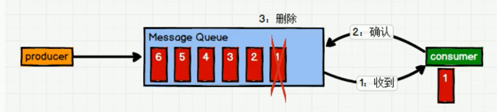

2. **发布/订阅模式**（一对多，消费者消费数据之后不会清除数据）

   消息生产者（发布）消息到主题中，同时有多个消费者（订阅）消费该消息。和点对点方式不同，发布到主题的消息会被所有订阅者消费。

   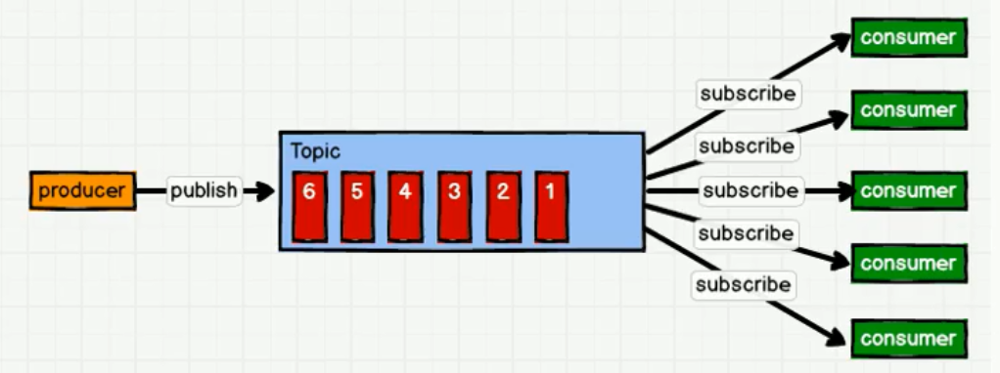

   - 消费者拉取消息的模式。消费者的消费速度可以由消费者自己决定；缺点，需要维持一个长轮询去查看消息队列中是否有新消息。（Kafka是基于这种模式）
   - 生成者推送消息的模式。缺点，消费者的消费速度不一致问题。

## 1.4 基础架构

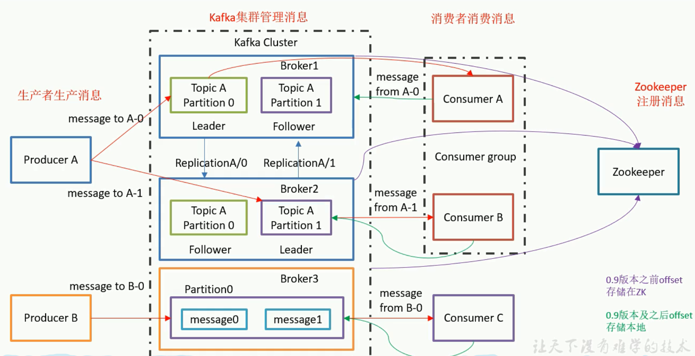

- Leader和Follower针对的是Partition的，主要是为了备份。
- 一个主题（Topic）的某个分区（Partition）只能够被同一个消费者组（Consumer Group）的某个消费者（Consumer）消费。

#  2. 命令行操作

## 2.1 安装部署

下载https://kafka.apache.org/downloads 选择对应版本。

1. 修改server.proper配置文件

```shell
#broker的全局唯一编号，不能重复
broker.id=0
#删除topic功能，可以修改为true
delete.topic.enable=true
#处理网络请求的线程数量
num.network.thread=3
#用来处理磁盘IO的线程数量
num.io.threads=8
#发送套接字的缓冲区大小,默认100k
socket.send.buffer.bytes=102400
#接收套接字的缓冲区大小，默认100k
socket.receive.buffer,bytes=102400
#请求套接字的缓冲区大小,默认100M
socket.request.max.bytes=104857600;
#kafka运行时数据存放地址
log.dirs=/tmp/kafka-logs
#topic在当前broker上的分区个数
num.partitions=1
#用来恢复和清理data下数据的线程数量
num.recovery.threads.per.data.dir=1
#segment文件保留的最长时间，超时将被删除,默认为7天
log.retention.hours=168
#配置连接Zookeeper集群地址
zookeeper.connect=172.0.0.1:2181,172.0.0.2:2181
```

2. 配置环境变量（可选）

   ```sh
   $ sudo vim /etc/profile
   
   #KAFKA_HOME,选择合适路径
   export KAFKA_HOME=/opt/module/kafka
   export PATH=$PATH:$KAFKA_HOME/bin
   
   $ source /etc/profile
   ```

3. 启动前需要先启动zookeeper

   ```shell
   zkServer.sh start 
   ```

4. 启动kafka

   ```shell
   bin/kafka-server-start.sh config/server.properties
   
   #后台启动，以守护进程启动
   bin/kafka-server-start.sh -daemon config/server.properties
   ```

## 2.2 kafka命令行操作

1. 查看kafka主题

   ```shell
   bin/kafka-topics.sh --list --zookeeper 172.0.0.1:2181
   ```

2. 创建一个主题

   ```shell
   bin/kafka-topics.sh --create --zookeeper 172.0.0.1:2181 --topic test --partitions 2 --replication-factor 2 
   ```

3. 删除一个主题，需要设置delete.topic.enable=true

      ```shell
   bin/kafka-topics.sh --delete --zookeeper 172.0.0.1:2181 --topic test
   ```

4. 查看主题详情

      ```shell
      bin/kafka-topics.sh --describe --topic test --zookeeper 172.0.0.1:2181
      ```

5. 生产者

   ```shell
   bin/kafka-console-producer.sh --topic test --broker-list 172.0.0.1:9092
   ```

6. 消费者

   ```shell
   bin/kafka-console-consumer.sh --topic test --bootstrap.servers 172.0.0.1:9092 --from-beginning
   ```

# 3. Kafka架构

## 3.1 Kafka工作流程

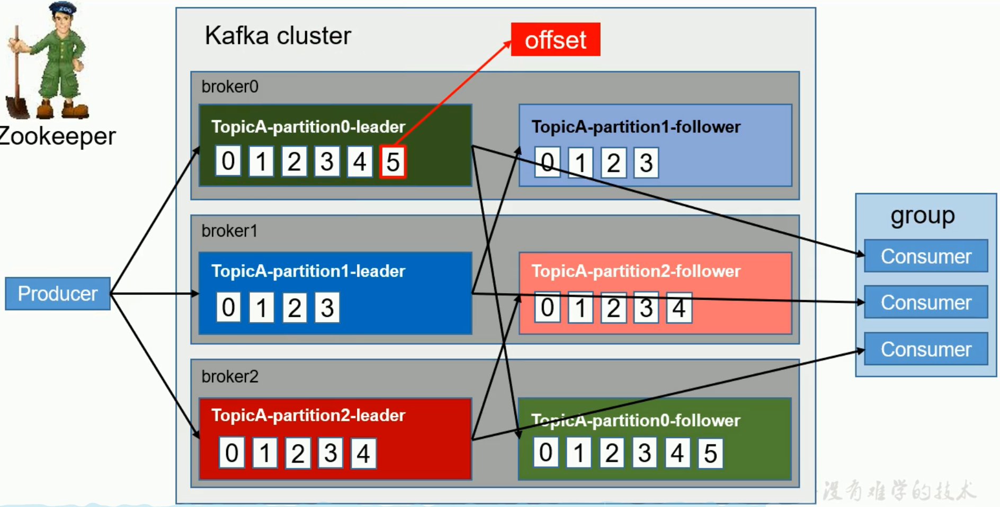

- 每个分区维护了一个Kafka offset的值。
- 不能保证全局有序，只能保证区内有序性。
- Kafka中消息是以topic进行分类的，生产者生成消息，消费者消息，都是面向topic的。
- topic是逻辑上的概念，而partition是物理上的概念。

## 3.2文件存储机制

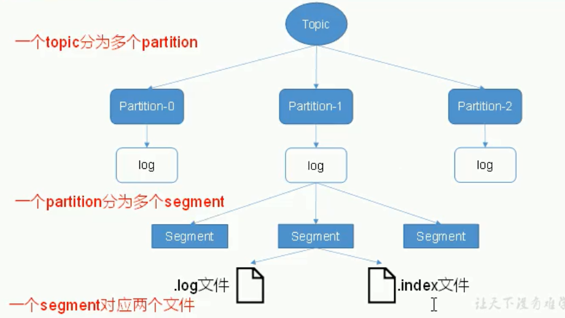

- 由于生产者生产的消息会不断追加到log文件末尾，为防止log文件过大导致数据定位效率低下，Kafka采取了分片和索引机制，将每个partition分为多个segment。每个segment对应两个文件--".index"和".log"文件。

**index文件和log文件详解**

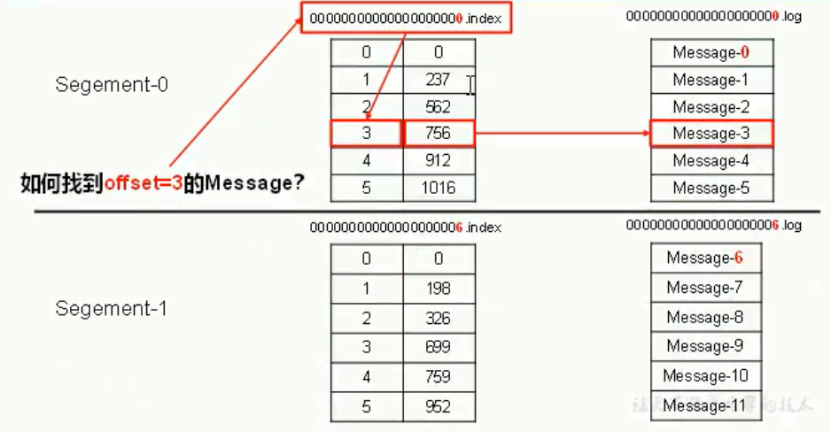

- index 中存储的是log中的起始偏移量，每条数据中大小相等，有利于加速查询。
- 采用二分查找法定位到index文件，然后从index中那拿到起始偏移地址和数据大小，接着去log文件中起始偏移地址读取对应大小的数据。

## 3.3 Kafka生产者

### 3.3.1 分区策略

1. 分区原因

   1）==方便在集群中扩展==，每个partition可以通过调整以适应它所在的机器，而一个topic又可以由多个partition组成，因此整个集群就可以适应任意大小的数据。

   2）==可以提高并发==，用partition为单位进行读写。

2. 分区原则

   Java api 中需要将producer发送的数据封装为一个ProducerRecord对象。

   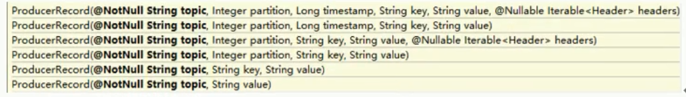

   - 指明partition的情况下，直接将指明的值直接作为partition值；
   - 没有指明partition值但有key的情况下，将key的hash值与topic的partition数进行取余得到partition值；
   - 既没有partition值又没有key值的情况下，第一次调用时随机生成一个整数（后面每次调用在这个整数上自增），将这个值与topic可用的partition总数取余得到partition，然后进行轮询算法。

### 3.3.2 数据可靠性保证

为保证producer发送的数据，能可靠的发送到指定的topic，topic的每个partition收到producer发送的数据后，都需要向producer发送ack（acknowledgement 确认收到），如果producer收到ack，就会进行下一轮的发送，否则重新发送数据。

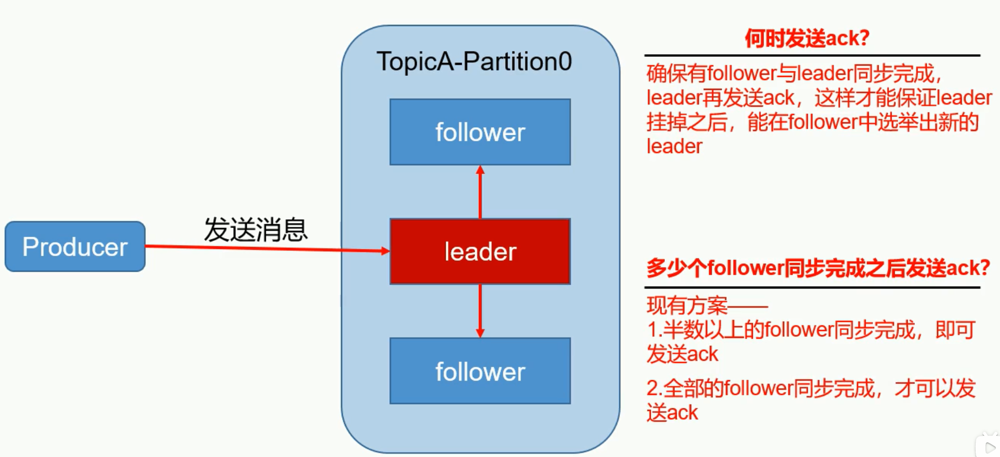

**副本数据同步策略**

| 方案                      | 优点                                             | 缺点                                              |
| ------------------------- | ------------------------------------------------ | ------------------------------------------------- |
| 半数以上完成同步就发送ack | 延迟低                                           | 选举新的leader时，容忍n台节点故障，需要2n+1个副本 |
| 全部完成同步，才发送ack   | 选举新的leader时，容忍n台节点故障，需要n+1个副本 | 延迟高                                            |

Kafka选择第二种方案，原因如下：

1. 同样为了容忍n台节点故障，第一种方案需要2n+1个副本，而第二种方案只需要n+1个副本。Kafka的每个分区都有大量的数据，第一种方案会造成大量数据冗余。
2. 虽然第二种方案的网络延迟较高，但网络延迟对Kafka的影响较小。

**ISR** 解决节点出现故障的问题

Leader 维护了一个动态的in-sync replica set（ISR），为何leader保持同步的follower集合。当ISR中的follower完成数据的同步之后，leader就会给follower发送ack。如果follower长时间未向leader同步数据，则该follower将被踢出ISR，该时间阈值由replica.lag.time.max.ms参数设定。Leader故障之后就会从ISR中选举新的Leader。

- 高版本保留了时间的方式，丢弃了条数的方式。
- 条数方式会在批次的条数大于设定的条数大小时，会导致频繁的加入和踢出ISR，频繁操作zk中的数据。

**ack应答机制**

Kafka为用户提供三种可靠性级别，acks参数配置：

- 0，producer不等待broker的ack，这一操作提供了最低的延迟，broker一接收到消息还没有写入磁盘就已经返回，==当broker故障时极有可能丢失数据==；

- 1，producer等待broker的ack，partition的leader写入磁盘后返回ack，如果在==follower同步成功之前leader故障，将会丢失数据==；

  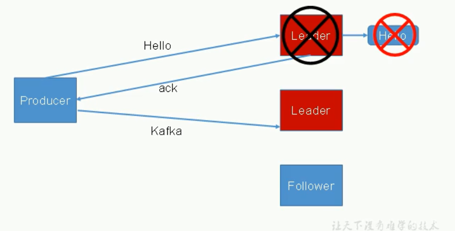

- -1（all），producer等待broker的ack，partition的leader和ISR中的follower全部写入磁盘成功后才会返回ack（极限情况下，网络不好时，ISR中只存在leader，退化成等于1的情况，会导致丢数据），但==如果follower同步完成后，broker发送ack之前，leader故障，那么会导致数据重复。==

  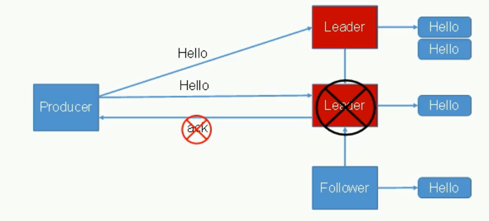

**存储一致性，数据消费的一致性**

- LEO：Log End Offset，每个副本的最后一个offset，即最大的offset；

- HW：High Watermark所有副本中最小的LEO，即消费者能见的最大的offset，ISR队列中最小的LEO。

  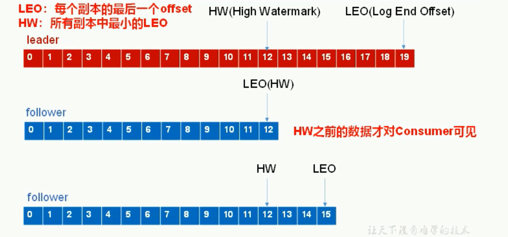

重新选举leader时会截取数据，保证存储一致性。

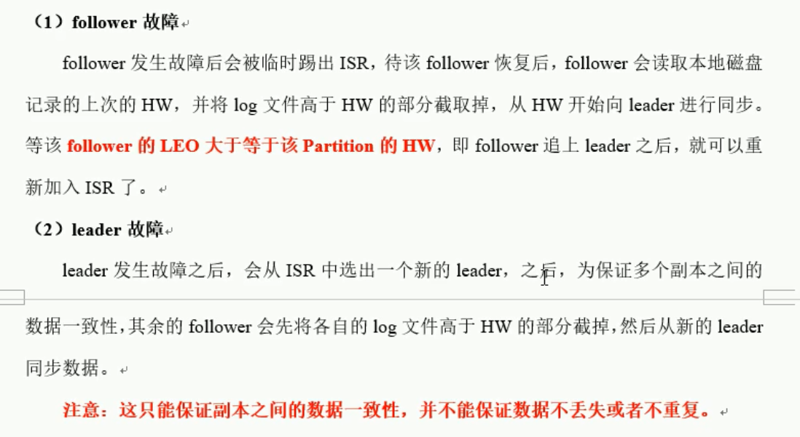

### 3.3.3 Exactly Once 语义

将服务器的ACK级别设置为-1时，可以保证Producer和Server之间不会丢失数据，即==At Least Once 语义==。相对的，将服务器ACK级别设置为0时，可以保证生产者每天消息只会被发送一次，即==At Most Once语义==。

At Least Once 可以保证数据不丢失，但是不能保证数据不重复；相对的，At Least Once 可以保证数据不重复，但是不能保证数据不丢失。==但是，对于一些非常重要的消息，比如交易数据，下游数据消费者要求数据既不重复也不丢失，即Exactly Once 语义。==

0.11版本Kafka中引入了**幂等性**。指的是Producer无论向Server发送多少次重复数据，Server端只会持久化一条。

​        **At Least Once + 幂等性 = Exactly Once**

要启动幂等性，需要将Producer参数中的enable。idompotence设置为true。Kafka的幂等性实现其实就是江南原来下游的去重放在了数据上游。开启幂等性的Producer在初始化的时候会被分配一个PID，发往同一Partition的消息会附带Sequence Number。而Broker端会对<PID,Partition,SeqNumber>做缓存，当具有相同主键的消息提交时，Broker只会持久化一条。

但是PID在Producer重启就会发生变化，同时不同的Partition也具有不同主键，**所以幂等性无法保证跨分区，跨回话的Exactly Once。**	

## 3.4 Kafka消费者

Kafka中消费者采用pull模式，其不足之处在于如果kafka中没有数据，消费者可能会陷入循环中，一直返回空数据。针对这一点，kafka的消费者会在消费数据时传入一个时长参数timeout,如果当前没有数据可供消费，consumer会等待一段时间之后再返回，这段时间即为timeout。

### 3.4.1 分区分配策略

Kafka有两种分配策略，一个是轮询（RoundRobin），一个是范围（Range）

RoundRobin 一个主题时

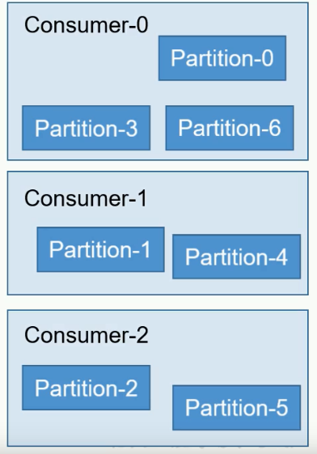

同时订阅多个主题时，会将多个主题中的分区当做整体，然后根据Hash值排序，然后进行轮询，按照消费者组分配。

Range，默认的分配方式。取余，将不同的主题当做不同的个体，按照主题分配。缺点：可能导致多个消费者间消费分区个数不对等的问题。

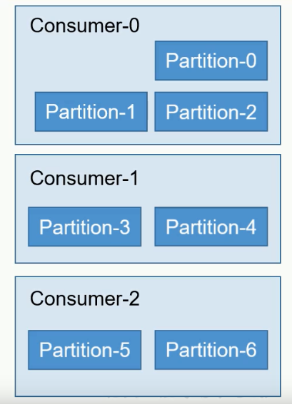

当消费者组中的消费者个数发生变化时就会触发重新分配策略。

### 3.4.2 offset的存储

offset 是按照consumer group + topic + partition 唯一确定的。

1. 修改consumer.properties文件

   ```shell
    exclude.internal.topics=false
   ```

   

2. 读取offset

   ```shell
   #0.11.0.0之前
   bin/kafka-console-consumer.sh --topic _consumer_offsets --zookeeper 172.0.0.1:2181 --formatter "kafka.coordinator.GroupMetadataManager\$OffsetMessageFormateer" --consumser.config config/consummer.propertites --from-beginning
   
   #0.11.0.0之后
   bin/kafka-console-consumer.sh --topic _consumer_offsets --zookeeper 172.0.0.1:2181 --formatter "kafka.coordinator.group.GroupMetadataManager\$OffsetMessageFormateer" --consumser.config config/consummer.propertites --from-beginning
   ```

   

## 3.5 Kafak高效读写数据

1. 顺序写磁盘

   Kafka的producer生产数据要写入到log文件中，写的过程是一直追加到文件末端，进行顺序写。

2. 零复制技术

   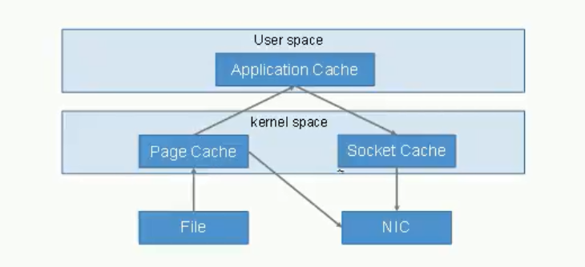

   

## 3.6 Zookeeper在Kafka中的作用

Kafka集群中有一个broker会被选举为Controller，负责**管理集群broker的上下线**，所有topic的**分区副本分配**和**leader选举**等工作。==Controller的管理工作是依赖于Zookeeper的。==

副本leader的选举过程（不是Controller）

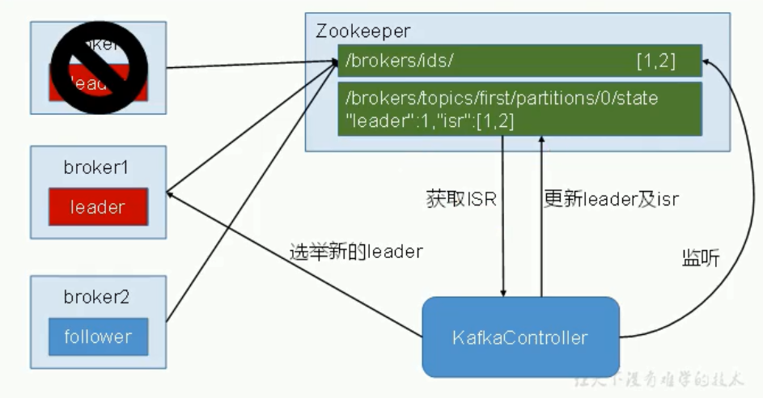

## 3.7 Kafka事务

事务可以保证Kafka在Exactly Once 语义的基础上，生成和消费可以跨分区和会话，要么全部成功，要么全部失败。

**Producer 事务**

为了实现跨分区会话的事务，需要引入一个全局唯一的TransactionID（这个值应该是客户端传入的），并将Producer获得的PID和TransactionID绑定，这样Producer重启后就可以通过正在进行的TransactionID获得原来的ID。

为了管理Transaction，Kafka引入了新的组件Transaction Coordinator。Producer就是通过和Transaction Coordinator 交互获得Transaction ID 对应的任务状态。Transaction Coordinator 还复制将事务所有写入Kafka的一个内部Topic，这样即使整个服务重启，由于事务状态得到保存，进行中的事务状态可以得到恢复，从而继续进行。

**Consumer 事务**

上述事务机制主要是从Producer方面考虑，对于Consumer而言，事务的保证会相对较弱，尤其是无法保证Commit的信息被精确消费。这是由于Consumer可以通过offset访问任意信息，而且不同的Segment File 生命周期不同，同一事务的消息可能会出现重启后被删除的情况。

# 4. Kafka API

## 4.1 Producer API

**发送流程**

kafka的Producer发送消息采用的是**异步发送**的方式。在消息发送的过程中，涉及到两个线程--main线程和Sender线程，以及一个线程共享变量--RecordAccumulator。main线程将消息发送给RecordAccumulator，Sender线程不断从RecordAccumulator中拉取消息发送到Kafka broker。

**Kafka 发送消息流程**

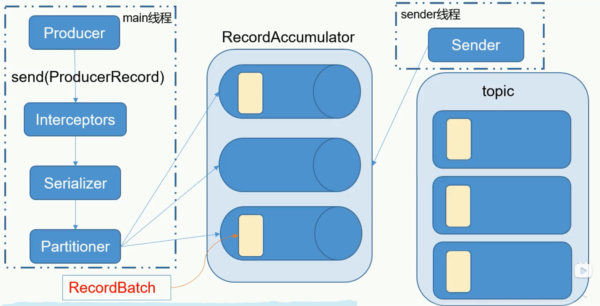

**相关参数：**

- batch.size：只有数据积累到batch.size之后，sender才会发送数据。
- linger.ms：如果数据迟迟未达到batch.size，sender等待linger.time之后就会发送数据。

**添加依赖**

```xml
<dependency>
    <groupId>org.apache.kafka</groupId>
    <artifactId>kafka-client</artifactId>
    <version>对应的版本即可</version>
</dependency>
```

用到的类：

- KafkaProducer：生产者对象，用来发送数据
- ProducerConfig：配置参数
- ProducerRecord：数据要被封装成一个ProducerRecord对象

``` java
Properties props = new Properties();
/**
* 常量类 ProducerConfig ConsumerConfig CommonConfig 
*/
//指定连接的kafka集群
props.put("bootstrap.servers", "172.0.0.1:9092");
//ACK级别
props.put("acks", "all");
//重试次数
props.put("retries", 3);
//批次大小
props.put("batch.size", 16384);
//等待时间
props.put("linger.ms", 1);
//RecordAccumulator缓冲区大小
props.put("buffer.memory", 33554432);
//key值的序列化类
props.put("key.serializer", "org.apache.kafka.common.serialization.StringSerializer");
//value值的序列化类
props.put("value.serializer", "org.apache.kafka.common.serialization.StringSerializer");
//生产者对象
Producer<String, String> procuder = new KafkaProducer<String,String>(props);
//定义主题
String topic = "test";
for (int i = 1; i <= 10; i++) {
    String value = "value_" + i;
    ProducerRecord<String, String> msg = new ProducerRecord<String, String>(topic, value);
    //发送数据
    procuder.send(msg);
    //procuder.send.get()可以阻塞主线程，同步等待数据完成。
}
//关闭资源
producer.close
```

自定义存储offset需要借助ConsumerRebalanceListener。

## 4.2 Consumer API

``` java
Properties props = new Properties();
//指定连接的kafka集群
props.put("bootstrap.servers", "172.0.0.1:9092");
//消费者组名
props.put("group.id", GROUPID);
//自动提交
props.put("enable.auto.commit", "true");
//自动提交间隔时间
props.put("auto.commit.interval.ms", "1000");
//连接超时时间
props.put("session.timeout.ms", "30000");
// Consumer每次调用poll()时取到的records的最大数。
props.put("max.poll.records", 1000);
/**
这个配置项，是告诉Kafka Broker在发现kafka在没有初始offset，或者当前的offset是一个不存在的值（如果一个record被删除，就肯定不存在了）时，该如何处理。它有4种处理方式：
1） earliest：自动重置到最早的offset。
2） latest：看上去重置到最晚的offset。
3） none：如果边更早的offset也没有的话，就抛出异常给consumer，告诉consumer在整个consumer group中都没有发现有这样的offset。
4） 如果不是上述3种，只抛出异常给consumer。*/
props.put("auto.offset.reset", "earliest");
//反序列化类
props.put("key.deserializer", "org.apache.kafka.common.serialization.StringDeserializer");
props.put("value.deserializer", "org.apache.kafka.common.serialization.StringDeserializer");
KafkaConsumer<String, String> consumer = new KafkaConsumer<String, String>(props);
//订阅主题
consumer.subscribe(Arrays.asList(topic));
//获取数据
ConsumerRecords<String,String> consumerRecords = consumer.poll(100);
//关闭连接
consumer.close;

/**
手动提交offset需要关闭自动提交 
props.put("enable.auto.commit", "false");
同步提交consumer.commitSync
异步提交consumer.commitAsync*/
```

## 4.3 自定义拦截器（interceptor）

需要实现org.apache.kafka.clients.producer.ProducerInterceptor接口。定义的方法包括：

- configure（configs）

  获取配置信息和初始化数据调用。

- onSend（ProducerRecord）

  该方法封装进KafkaProducer.send方法中，即它运行在用户主线程中。Producer确保在消息被序列化以及计算分区前调用该方法。==用户可以在该方法中对消息做任何操作，但最好保证不要修改消息所属的topic和分区==，否则会影响目标分区的计算。

- onAcknowledgement（RecordMetadata，Exception）

  ==该方法会在消息从RecordAccumulator成功返回到Broker之后，或者在发送过程中失败时调用。==并且通常都是在producer回调逻辑触发之前。onAcknowledgement运行在producer的IO线程中，因此不要在该方法中放入很重的逻辑，否则会拖慢producer的消息发送效率。

- close

  关闭interceptor，在执行一些资源清理工作。

``` java
ArrayList<String> interceptors = new ArrayList<>();
interceptors.add(拦截器1);
...
interceptors.add(拦截器n);
//设置自定义拦截器的值
prop.put(ProducerConfig.INTERCEPTOR_CLASSES_CONFIG,interceptors);
```

