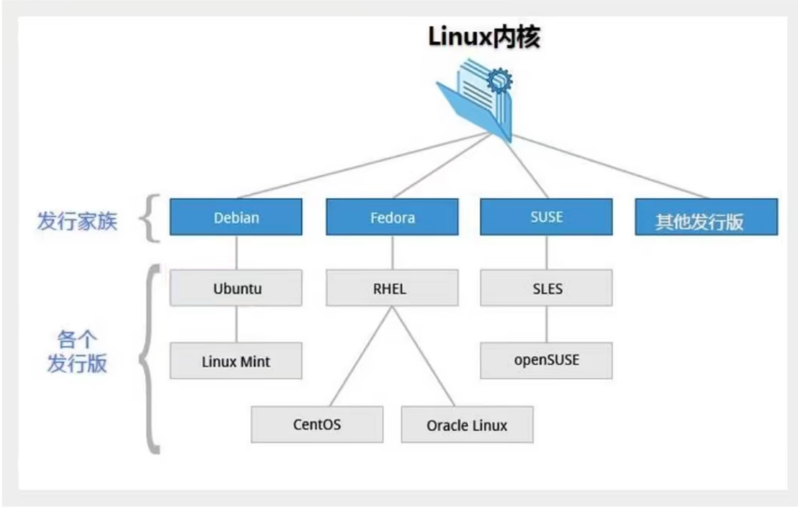
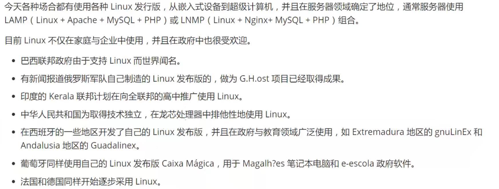
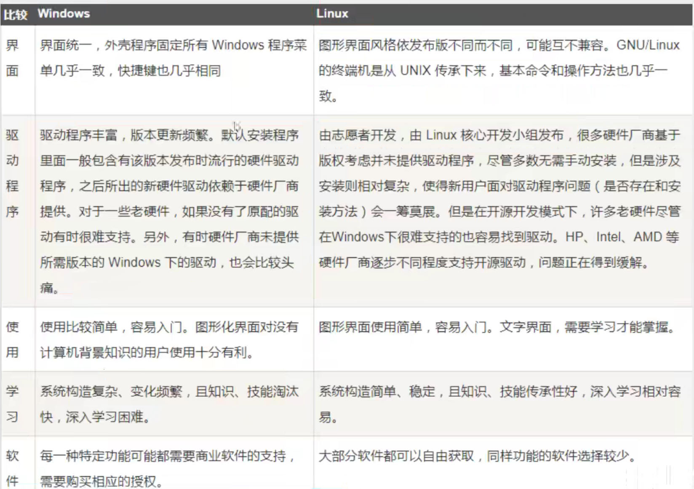
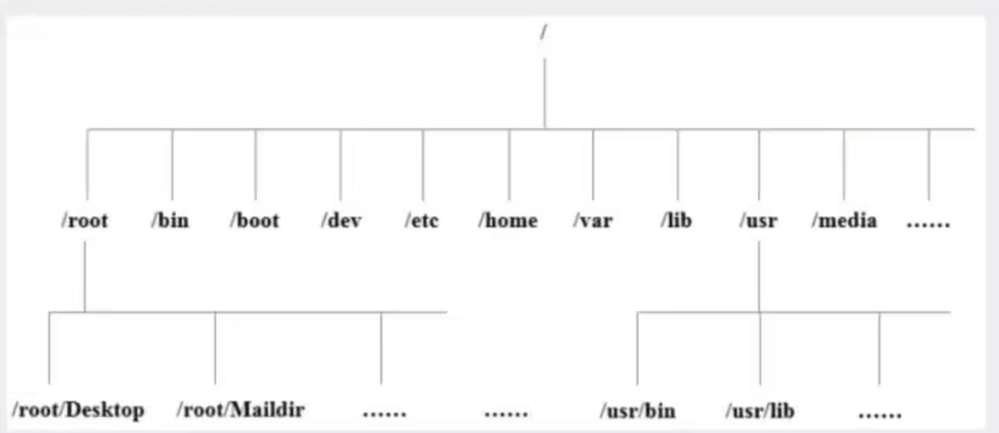

[TOC]


# Linux概述

> Linux 简介

Linux内核最初只是由芬兰人林纳斯·托瓦斯（Linus Torvalds）在赫尔辛基大学上学时出于个人爱好而编写的。

Linux是一套免费使用和自由传播的类Unix操作系统，是一个基于POSIX（可移植操作系统接口）和UNIX的多用户、多任务、支持多线程和多CPU的操作系统。

Linux能运行主要的UNIX工具软件、应用程序和网络协议。它支持32位和64位硬件。Linux继承了Unix以网络为核心的设计思想，是一个性能文档的多用户操作系统。

> Linux发行版



目前市面上较知名的发行版有Ubuntu、RedHat、CentOS、Debian、Fedora、SUSE、OpenSUSE、Arch Linux、SolusOS等。

> Linux 应用领域



> Linux VS Windows



# 走近Linux系统

>开机登录

开机会启动许多程序，它们在Windows叫做服务（Service），在Linux就叫做守护进程（daemon）。

> 关机

```shell
sync #将数据由内存同步到硬盘中。
shutdown #关机指令，可以man shutdown看一下帮助文档
shutdown -h 10 #十分钟后关机
shutdown -h now #立马关机
shutdown -h 20:25 #20:25关机
shutdown -h +10 #十分钟后关机
shutdown -r now #系统立即重启
shutdown -r +10 #系统十分钟后重启
reboot #重启，等同于shutdown -r now
halt #关闭系统，等同于shutdown -h now 和 poweroff
```

> 系统目录结构

1. 一切皆文件

2. 根目录/ 所有的文件都挂载在这个节点下



以下是对这些目录的解释

- /bin: bin是Binary的缩写，这个目录存放着最经常使用的命令。
- /boot: 这里存放的是启动Linux时使用的一些核心文件，包括一些连接文件和镜像文件。
- /dev: dev是device（设备）的缩写，存放的是Linux的外部设备，在linux中访问设备的方式和访问文件的方式是相同的。
- /etc: 这个目录用来存放所有的系统管理所需要的配置文件和子目录。
- /home: 用户的主目录，在linux中，每个用户都有一个自己的目录，一般该目录名是以用户的账号命名的。
- /lib: 这个目录里存放着系统最基本的动态连接共享库，其作用类似于Windows里的DLL文件。
- /lost+found: 这个目录一般情况下是空的，当系统非法关机后，这里就存放了一些文件。
- /media: linux系统会自动识别一些设备，例如U盘，光驱等，当识别后Linux会把识别的设备挂载到这个目录下。
- /mnt: 系统提供该目录是为了让用户临时挂载别的文件系统的，我们可以将光驱挂载到/mnt/上，然后进入该目录查看光驱中的内容。
- /opt: 这个是给主机额外安装软件所摆放的目录。默认是空的。
- /proc: 这个目录是一个虚拟的目录，它是系统内存的映射，我们可以通过直接访问这个目录来获取系统信息。
- /root: 该目录为管理员账户的主目录。
- /sbin: s就是super user的意思，这里存放的是系统管理员使用的系统管理程序。
- /srv: 该目录存放一些服务启动之后需要提取的数据。
- /sys: 这是linux2.6内核的一个很大变化。该目录下安装了2.6内核中新出现的一个文件系统sysfs。
- /tmp: 这个目录用来存放一些临时文件的。
- /usr: 用户很多的应用程序和文件都放在这个目录下，类似于Windows下的program files目录。
- /usr/bin: 系统用户使用的应用程序。
- /usr/sbin: 超级用户使用的比较高级的管理程序和系统守护程序。
- /usr/src: 内核源码默认的方式目录
- /var: 这个目录中存放着在不断扩充着的东西，我们习惯将那些经常被修改的目录放在这个目录下。包括日志文件。
- /run: 是一个临时文件系统，存储系统启动以来的信息。当系统重启后，这个目录下的文件应该被删掉或者清除。


