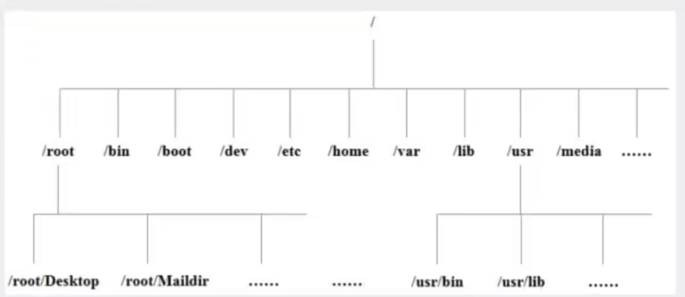
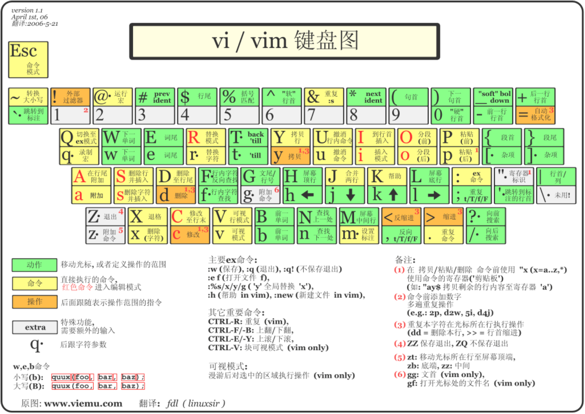

[TOC]


# Linux概述

> Linux 简介

Linux内核最初只是由芬兰人林纳斯·托瓦斯（Linus Torvalds）在赫尔辛基大学上学时出于个人爱好而编写的。

Linux是一套免费使用和自由传播的类Unix操作系统，是一个基于POSIX（可移植操作系统接口）和UNIX的多用户、多任务、支持多线程和多CPU的操作系统。

Linux能运行主要的UNIX工具软件、应用程序和网络协议。它支持32位和64位硬件。Linux继承了Unix以网络为核心的设计思想，是一个性能文档的多用户操作系统。

> Linux发行版


目前市面上较知名的发行版有Ubuntu、RedHat、CentOS、Debian、Fedora、SUSE、OpenSUSE、Arch Linux、SolusOS等。

> Linux 应用领域


> Linux VS Windows


# 走近Linux系统

>开机登录

开机会启动许多程序，它们在Windows叫做服务（Service），在Linux就叫做守护进程（daemon）。

> 关机

```shell
sync #将数据由内存同步到硬盘中。
shutdown #关机指令，可以man shutdown看一下帮助文档
shutdown -h 10 #十分钟后关机
shutdown -h now #立马关机
shutdown -h 20:25 #20:25关机
shutdown -h +10 #十分钟后关机
shutdown -r now #系统立即重启
shutdown -r +10 #系统十分钟后重启
reboot #重启，等同于shutdown -r now
halt #关闭系统，等同于shutdown -h now 和 poweroff
```

> 系统目录结构

1. 一切皆文件

2. 根目录/ 所有的文件都挂载在这个节点下



以下是对这些目录的解释

- /bin: bin是Binary的缩写，这个目录存放着最经常使用的命令。
- /boot: 这里存放的是启动Linux时使用的一些核心文件，包括一些连接文件和镜像文件。
- /dev: dev是device（设备）的缩写，存放的是Linux的外部设备，在linux中访问设备的方式和访问文件的方式是相同的。
- /etc: 这个目录用来存放所有的系统管理所需要的配置文件和子目录。
- /home: 用户的主目录，在linux中，每个用户都有一个自己的目录，一般该目录名是以用户的账号命名的。
- /lib: 这个目录里存放着系统最基本的动态连接共享库，其作用类似于Windows里的DLL文件。
- /lost+found: 这个目录一般情况下是空的，当系统非法关机后，这里就存放了一些文件。
- /media: linux系统会自动识别一些设备，例如U盘，光驱等，当识别后Linux会把识别的设备挂载到这个目录下。
- /mnt: 系统提供该目录是为了让用户临时挂载别的文件系统的，我们可以将光驱挂载到/mnt/上，然后进入该目录查看光驱中的内容。
- /opt: 这个是给主机额外安装软件所摆放的目录。默认是空的。
- /proc: 这个目录是一个虚拟的目录，它是系统内存的映射，我们可以通过直接访问这个目录来获取系统信息。
- /root: 该目录为管理员账户的主目录。
- /sbin: s就是super user的意思，这里存放的是系统管理员使用的系统管理程序。
- /srv: 该目录存放一些服务启动之后需要提取的数据。
- /sys: 这是linux2.6内核的一个很大变化。该目录下安装了2.6内核中新出现的一个文件系统sysfs。
- /tmp: 这个目录用来存放一些临时文件的。
- /usr: 用户很多的应用程序和文件都放在这个目录下，类似于Windows下的program files目录。
- /usr/bin: 系统用户使用的应用程序。
- /usr/sbin: 超级用户使用的比较高级的管理程序和系统守护程序。
- /usr/src: 内核源码默认的方式目录
- /var: 这个目录中存放着在不断扩充着的东西，我们习惯将那些经常被修改的目录放在这个目录下。包括日志文件。
- /run: 是一个临时文件系统，存储系统启动以来的信息。当系统重启后，这个目录下的文件应该被删掉或者清除。

# 基本属性

Linux系统是一种典型的多用户系统，不同的用户处于不同的地位，拥有不同的权限。为了保护系统的安全性，Linux系统对不同的用户访问同一文件（包括目录文件）的权限做了不同的规定。

在Linux中第一个字符代表这个文件是目录、文件或者链接文件等等：

- 当为[d]则是目录；
- 当为[-]则是文件；
- 当为[l]则是链接文档（link file)；
- 当为[b]则是装置文件里面的可供存储的接口设备（可随机存取装置）；
- 当为[c]则是装置文件里面的串行端口设备，例如键盘、鼠标（一次性读取装置）。

接下来的字符三个为一组，且为[RWX]的三个参数的组合。[r]代表可读，[w]代表可写，[x]代表可执行。如果没有权限则会出现减号[-]。


> 修改文件属性

1.chgrp:更改文件属组

```shell
chgrp [-R] 属组名 文件名  
#-R 递归更改文件属组，就是在更改某个目录文件的属组时，如果加上-R参数，那么该目录下的所有文件的属组都会更改。
```

2. chown:更改文件属主，也可以同时更改文件属组。

```shell
chown [-R] 属主名 文件名
chown [-R] 属主名:属组名 文件名
```

3. chmod:更改文件9个属性

```shell
chmod [-R] xyz 文件或目录
```

Linux文件属性有两种设置方法，一种是数字(常用)，一种是符号。

Linux文件的基本权限就有九个，我们可以使用数字来代表各个权限，各权限的数值对照表如下：

```shell
r:4         w:2        x:1
```

> 网络配置

网络配置目录：==cd /etc/sysconfig/network-scripts/==

ifconfig 查看网络配置

> Linux连接的概念

Linux 的连接分为两种：硬链接、软连接！

硬链接：A---B，假设B是A的硬链接，那么他们两个指向了同一个文件！允许一个文件拥有多个路径，用户可以通过这种机制建立链接到一些重要文件上，防止误删！

软连接：类似Windows的快捷方式，删除源文件，快捷方式也访问不了。

ln 创建链接

ln -s 创建软链接

# Vim编辑器

Vim是vi发展出来的一个文本编辑器。所有Unix Like系统都会内建vi文本编辑器。vim的官网(http://www.vim.org)也说vim是一个程序开发工具而不是文字处理软件。



vi/vim共分为三种模式，分别是命令模式(Command mode),输入模式(insert mode),底线命令模式(Last line mode).

# 账号管理

> useradd 命令 添加用户

```shell
useradd 选项 用户名
```

-m : 自动创建这个用户的主目录

-d : 指定用户目录，如果此目录不存在，则同时使用-m选项可以创建主目录

-G : 给用户执行用户组。

本质是在/etc/passwd文件中写入用户信息，参数介绍

`用户名:口令(登陆密码,不可见):用户标识号:用户组标识号:注释性信息:主目录:登陆Shell`，这个文件中的每一行都代表一个用户。加密后的密码放到/etc/shadow文件中。

> 删除用户

```shell
userdel 选项 用户名
```

-r : 删除用户时删除用户目录

> 修改用户

```shell
usermod 修改的内容 修改的用户
```

> 切换用户

1. 切换用户的命令为： `su username`
2. 从普通用户切换到root用户还可以使用命令：`sudo su`
3. 在终端输入exit或者logout或使用快捷键ctrl+d,可以退回到原来用户，ctrl+d也是执行exit命令。
4. 在切换用户时，如果想在切换用户之后使用新用户的工作环境，可以在su和username之间加-，例如`su -root`

$表示普通用户

#表示超级用户，也就是root用户

> 设置密码

```shell
#超级用户 
passwd 用户名
#普通用户
passwd
```

> 锁定账户

```shell
passwd -l 用户名 #锁定之后这个用户就不能登陆了
passwd -u 用户名 #解除锁定
passwd -d 用户名 #将用户的密码设置为空
```

# 用户组管理

每个用户都有一个用户组，系统可以对一个用户组中的所有用户进行集中管理。不同Linux系统对用户组的规定有所不同。

用户组的管理设计用户组的添加、删除和修改。组的增加、删除和修改实际上就是对/etc/group文件的更新。

> 创建用户组

```shell
groupadd 选项 用户组名
# -g id ： 指定用户组id
```

创建完用户组之后会获取一个id，这个id是可以指定的。如果不知道则会自增1。

> 删除用户组

```shell
groupdel 选项 用户组名
```

> 修改用户组的权限

```shell
groupmod 修改的内容 用户组名
```

> 用户组怎么切换

```shell
#登陆用户
newgrp 用户组名
```

# 磁盘管理

> df(列出文件系统整体的磁盘使用量) du(检查磁盘) 
>
> mount 挂载命令 
>
> umount 卸载命令

# 进程管理

> 基本概念

1. 在linux中，每一个程序都是有自己的一个进程，每一个进程都有一个id号。
2. 每一个进程都会有一个父进程。
3. 进程可以有两种存在方式：前台运行和后台运行。
4. 一般服务都是后台运行的，基本的程序都是前台运行的。

> 命令

ps 查看当前系统中正在执行的各种进程的信息。

ps -xx:

- -a 显示当前终端运行的所有的进程信息。
- -u 以用户的信息显示进程。
- -x 显示后台运行进程的参数
- -ef 可以查看父进程的信息

pstree -pu

- -p 显示父id
- -u 显示用户组


