[TOC]

# 1.Docker概述

## 1.1Docker出现的原因

​	Docker的思想就来自于集装箱。Docker通过隔离机制可以将服务器环境利用到极致。

## 1.2Docker的历史

2010年，在美国成立一家dotCloud公司。做pass的云计算服务。做Linux有关的容器技术。将容器化技术命名为Docker。Docker刚诞生时，没有引起行业的注意。dotCloud生存不下去，因此想进行了开源（开放源代码）。

2013年，Docker开源。越来越多的人发现了docker的优点，Docker几乎每个月都会更新一个版本。

2014年4月9日，Docker1.0发布。

Docker的优点，相比于虚拟机十分的轻巧！在容器技术出来之前，我们都使用虚拟机技术。

虚拟机：在windows中安装一个虚拟机软件（如：VMWare）,通过这个软件可以虚拟出一台或多台电脑，笨重。

虚拟机和Docker容器技术都是虚拟化技术。

> vm： linux centos原生镜像，隔离，需要开启多个虚拟机。 GB 几分钟
>
> docker：隔离，镜像，十分的小巧，运行镜像就可以了。     M/KB 秒级启动

## 1.3Docker简介

Docker是基于Go语言开发的项目。

官网：https://www.docker.com/

文档地址：https://docs.docker.com/

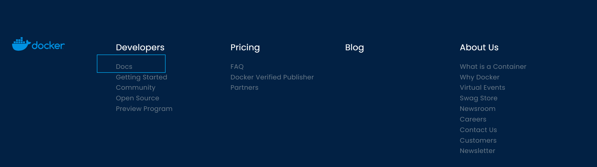

仓库地址：https://hub.docker.com/

## 1.4 Docker VS VM

虚拟机技术：虚拟出一套硬件，运行一个完整的操作系统，然后在这个系统上安装和运行软件。

容器化技术：容器化技术不是一个完整的操作系统。容器内的应用直接运行在宿主机的内核，容器是没有自己的内核的，也就是没有虚拟化硬件。每个容器间互相隔离，容器内都有一个属于自己的文件系统，互不影响。

# 2.Docker安装

# 3.Docker命令

# 4.Docker镜像

# 5.容器数据卷

# 6.DockerFile

# 7.Docker网络原理

三个网络

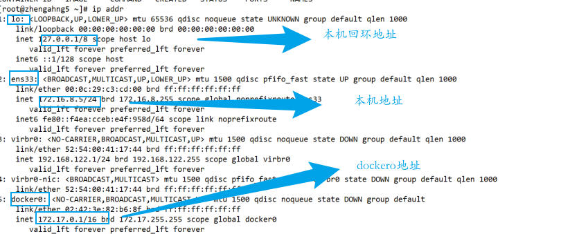

```shell
docker run -d -P --name tomcat01 tomcat
#查看容器的内部网络地址 ip addr， 发现容器启动的时候会得到一个etho@if7 ip地址，docker自动分配的。如果执行失败，可以使用命令 apt update && apt install -y iproute2 安装网络工具
docker exec -it tomcat01 ip addr
```

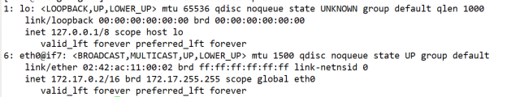

> 原理

每启动一个docker容器，docker就会给docker容器分配一个ip，只要安装了docker，就会有docker0的网卡，使用桥接模式，使用的技术是evth-pair技术。

主机上的网卡与docker容器中的网卡是成对出现的。

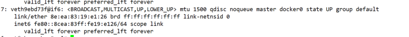

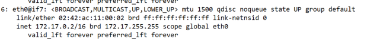

evth-pair 就是一对虚拟设备接口，他们都是成对出现的，一端连着协议，一端彼此相连，正因如此，evth-pair技术被充当一个桥梁，用来连接各种虚拟网络设备的。

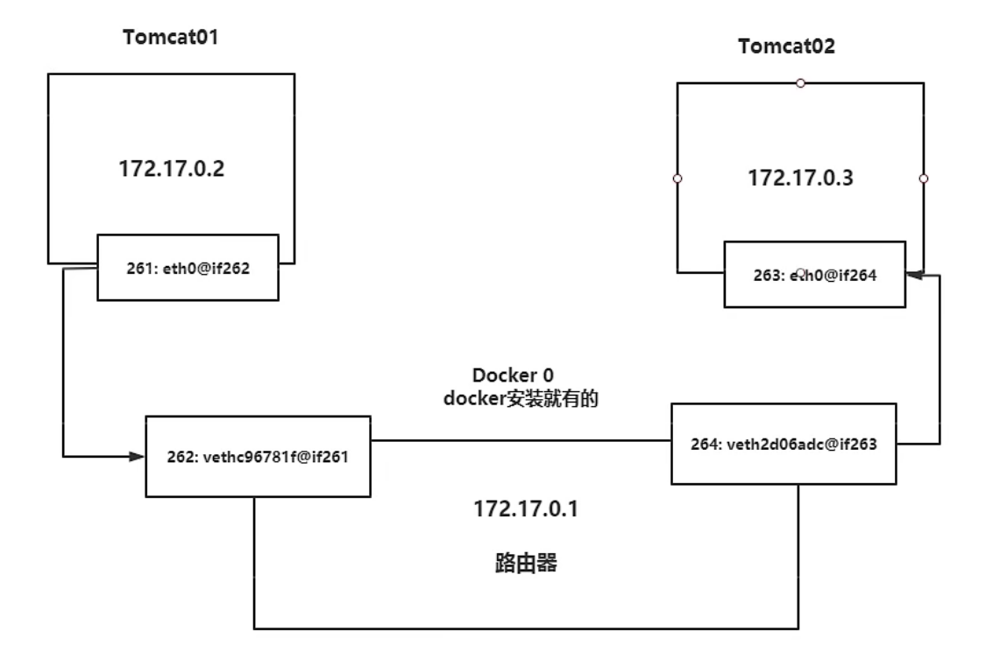

所有的容器不指定网络的情况下，都是docker0路由的，docker会给容器分配一个默认的可用ip，B类地址。使用的是linux的桥接模式，宿主机是docker容器的网桥docker0,容器中的所有网络接口都是虚拟的，虚拟网桥转发效率高。

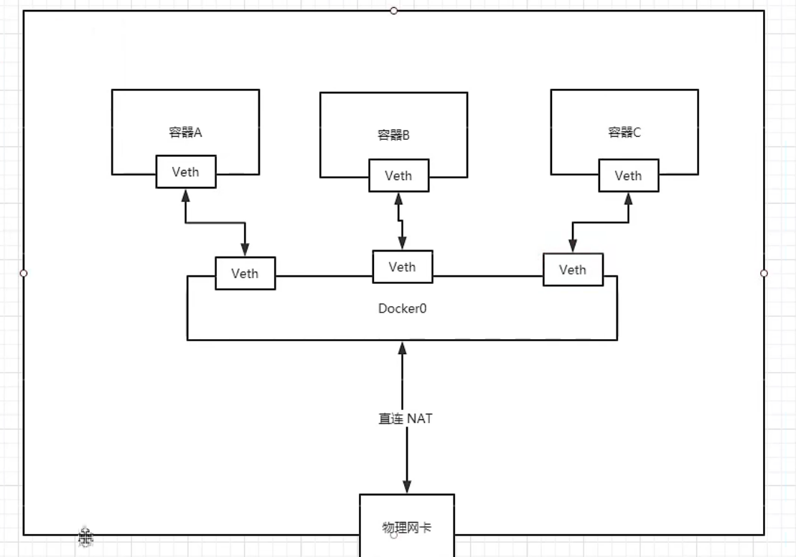

## 7.1 ——link

原理是在容器的host文件中添加link的主机地址。不建议使用。docker0存在的问题，不支持容器名连接服务。

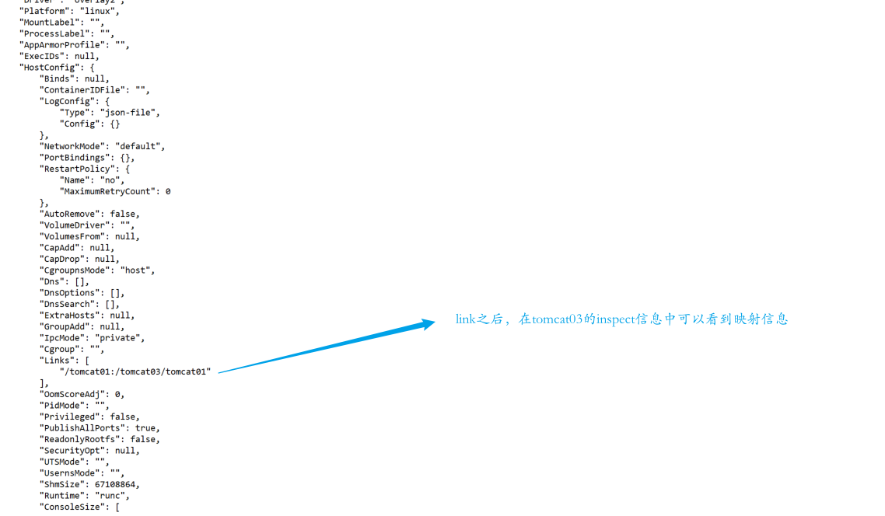

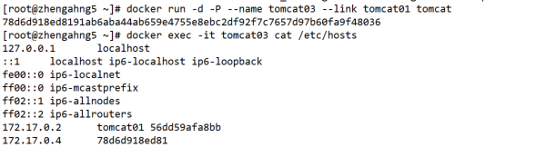

docker查看网络信息

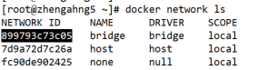

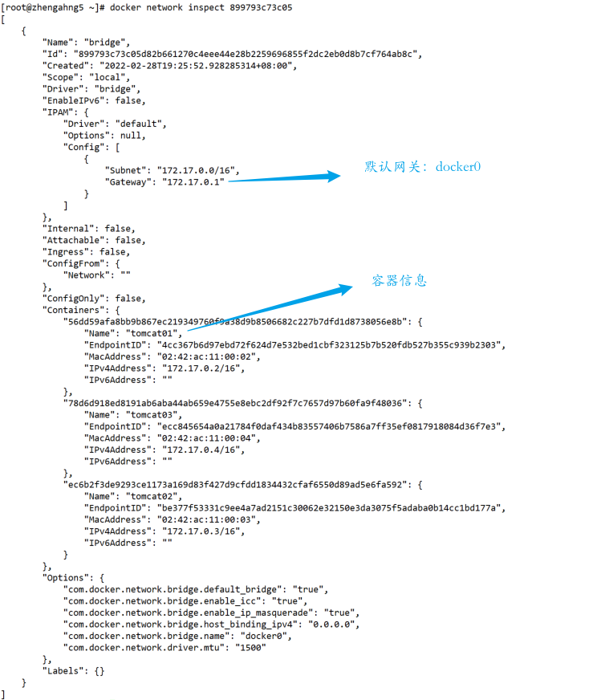


## 7.2 自定义网络

> 网络模式

bridge: 桥接(docker默认网络)

none: 不配置网络

host: 和宿主机共享网络

container： 容器网络联通

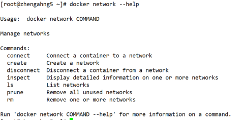

启动容器时，网络的默认参数为--net bridge ，也就是docker0。

> 创建网络

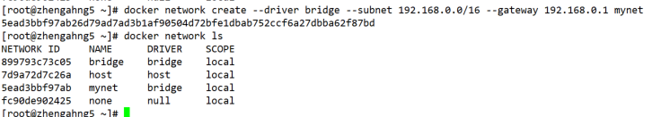****

自定义网络可以通过服务名ping通网络。

> 网络连通

```	shell 
docker network connect mynet tomcat01

#没有ping命令时使用 apt update && apt install -y iproute2 && apt install -y net-tools && apt install -y iputils-ping
```

# 8.Docker Compose

## 8.1 简介

Docker Compose 用来管理容器，定义运行多个容器。作用：批量容器编排。地址https://docs.docker.com/compose/install/

> 官方介绍

Compose is a tool for defining and running multi-container Docker applications. With Compose, you use a ==YAML file==to configure your application’s services. Then, with a single command, you create and start all the services from your configuration. To learn more about all the features of Compose, see [the list of features](https://docs.docker.com/compose/#features).

Compose works in all environments: production, staging, development, testing, as well as CI workflows. You can learn more about each case in [Common Use Cases](https://docs.docker.com/compose/#common-use-cases).

Using Compose is basically a three-step process:

1. Define your app’s environment with a `Dockerfile` so it can be reproduced anywhere.
2. Define the services that make up your app in `docker-compose.yml` so they can be run together in an isolated environment.
3. Run `docker compose up` and the [Docker compose command](https://docs.docker.com/compose/cli-command/) starts and runs your entire app. You can alternatively run `docker-compose up` using the docker-compose binary.


> Compose

Compose 是Docker官方的开源项目，需要安装！

`Dockerfile`可以让程序在任何地方运行。

Compose文件

```yaml
version: "3.9"  # optional since v1.27.0
services:
  web:
    build: .
    ports:
      - "8000:5000"
    volumes:
      - .:/code
      - logvolume01:/var/log
    links:
      - redis
  redis:
    image: redis
volumes:
  logvolume01: {}
```

Compose中的重要概念。

- 服务 services,容器、应用。
- 项目 project。一组关联的容器。

## 8.2 安装

```shell
# 1.获取地址
# 官方地址
sudo curl -L "https://github.com/docker/compose/releases/download/1.29.2/docker-compose-$(uname -s)-$(uname -m)" -o /usr/local/bin/docker-compose 
# 国内地址
sudo curl -L "https://get.daocloud.io/docker/compose/releases/download/1.29.2/docker-compose-$(uname -s)-$(uname -m)" -o /usr/local/bin/docker-compose
# 2. 赋权
sudo chmod +x docker-compose

# 如果安装后命令docker-compose失败，请检查您的路径。您还可以/usr/bin在路径中创建指向或任何其他目录的符号链接。
 sudo ln -s /usr/local/bin/docker-compose /usr/bin/docker-compose
```

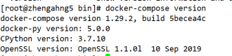

## 8.3 流程

1. 创建网络
2. 执行Docker-compose.yml
3. 启动服务

**默认规则：**

- 自动下载yml脚本中的docker镜像。
- 默认的服务名 `文件名_服务名_num`,num代表副本数量。
- 网络规则 `文件名_default`（项目中的网络都在同一个网络下，可以通过域名访问）

停止： docker-compose stop/down 需要在文件夹下。

## 8.4 yaml编写规则

https://docs.docker.com/compose/compose-file/compose-file-v3/

```yaml
# 总共三层
version:'' # 版本
service: # 服务
  服务1: web
    # 服务配置
    image
    build
    network
  服务1: web
    # 服务配置
    image
    build
    network
#其他配置
volumes:
networks:
configs:
```

# 9.Docker Swarm

网址：https://docs.docker.com/engine/swarm/

## 9.1 工作模式

Docker Engine 1.12 introduces swarm mode that enables you to create a cluster of one or more Docker Engines called a swarm. A swarm consists of one or more nodes: physical or virtual machines running Docker Engine 1.12 or later in swarm mode.

There are two types of nodes: [**managers**](https://docs.docker.com/engine/swarm/how-swarm-mode-works/nodes/#manager-nodes) and [**workers**](https://docs.docker.com/engine/swarm/how-swarm-mode-works/nodes/#worker-nodes).

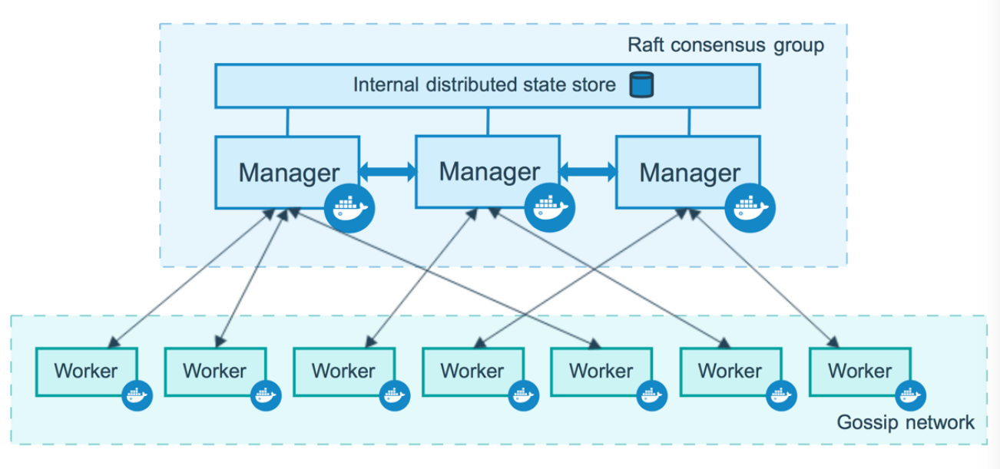

>  docker 自带swarm的信息

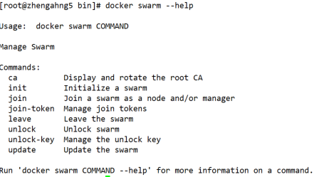

> 初始化主节点：

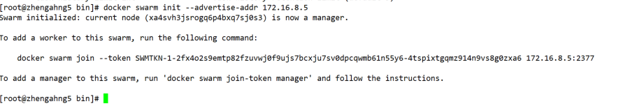

> docker 生成token令牌

```shell
docker swarm join manager
docker swarm join worker
```


## 9.2 Raft协议

Raft协议：保证大多数节点存活在可以用，集群至少大于三台！

## 9.3 概念

**swarm**

集群的管理和编号，docker可以初始化一个swarm集群，其他节点可以加入。（manager、worker)

**Node**

就是一个docker节点，多个节点就组成一个网络集群。

**Service**

任务，可以在管理节点或者工作节点来运行。

**Task**

容器内的命令，细节任务。

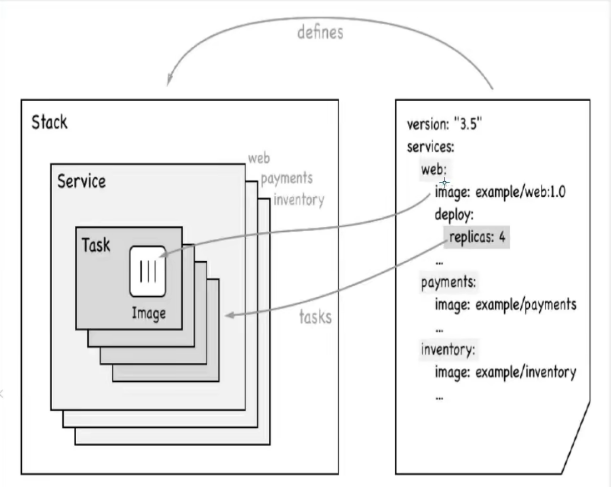

> docker Stack/docker Secret/docker Config 

# 10.CI\CD jenkins