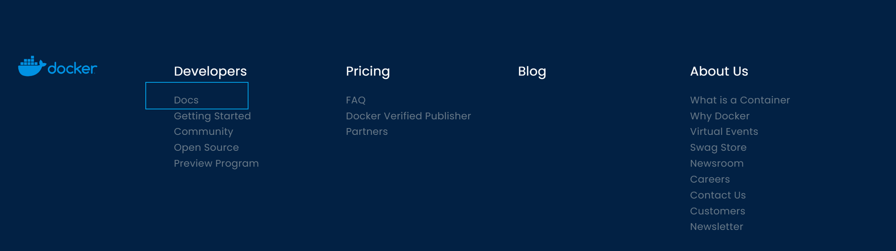

[TOC]

# 1.Docker概述

## 1.1Docker出现的原因

​	Docker的思想就来自于集装箱。Docker通过隔离机制可以将服务器环境利用到极致。

## 1.2Docker的历史

2010年，在美国成立一家dotCloud公司。做pass的云计算服务。做Linux有关的容器技术。将容器化技术命名为Docker。Docker刚诞生时，没有引起行业的注意。dotCloud生存不下去，因此想进行了开源（开放源代码）。

2013年，Docker开源。越来越多的人发现了docker的优点，Docker几乎每个月都会更新一个版本。

2014年4月9日，Docker1.0发布。

Docker的优点，相比于虚拟机十分的轻巧！在容器技术出来之前，我们都使用虚拟机技术。

虚拟机：在windows中安装一个虚拟机软件（如：VMWare）,通过这个软件可以虚拟出一台或多台电脑，笨重。

虚拟机和Docker容器技术都是虚拟化技术。

> vm： linux centos原生镜像，隔离，需要开启多个虚拟机。 GB 几分钟
>
> docker：隔离，镜像，十分的小巧，运行镜像就可以了。     M/KB 秒级启动

## 1.3Docker简介

Docker是基于Go语言开发的项目。

官网：https://www.docker.com/

文档地址：https://docs.docker.com/

仓库地址：https://hub.docker.com/

## 1.4 Docker VS VM

虚拟机技术：虚拟出一套硬件，运行一个完整的操作系统，然后在这个系统上安装和运行软件。

容器化技术：容器化技术不是一个完整的操作系统。容器内的应用直接运行在宿主机的内核，容器是没有自己的内核的，也就是没有虚拟化硬件。每个容器间互相隔离，容器内都有一个属于自己的文件系统，互不影响。

# 2.Docker安装

# 3.Docker命令

# 4.Docker镜像

# 5.容器数据卷

# 6.DockerFile

# 7.Docker网络原理

# 8.IDEA整合Docker

# 9.Docker Compose

# 10.Docker Swarm

# 11.CI\CD jenkins