[TOC]

# Hadoop简介

## 1.Hadoop概述

### 1.1 Hadoop是什么

1. Hadoop是一个由Apache基金会所开发的==分布式系统基础框架==。
2. 主要解决海量数据的==存储==和海量数据的==分析计算==问题。
3. 广义上来说，Hadoop通常是指一个更广泛的概念--Hadoop生态圈。

### 1.2 Hadoop三大发行版本

Hadoop三大发行版本：Apache、Cloudera、HortonWorks。

1. Apache版本原始（最基础）的版本。2006
2. Cloudera内部集成了很多大数据框架，对应产品CDH。2008
3. HortonWorks文档较好，对应产品HDP。2011
4. HortonWorks现在已经被Cloudera公司收购，推出新的品牌CDP。2018

1）Apache Hadoop

官网地址：http://hadoop.apache.org

下载地址：https://hadoop.apache.org/releases.html

### 1.3 Hadoop优势

1. 高可靠性：Hadoop底层维护多个数据副本，所以即使Hadoop某个计算元素或存储出现故障，也不会导致数据的丢失。
2. 高扩展性：在集群间分配任务数据，可方便的扩展数以千计的节点。
3. 高效性：在MapReduce的思想下，Hadoop是并行工作的，以加快任务处理速度。
4. 高容错性：能够自动将失败的任务重新分配。

### 1.4 Hadoop组成


#### 1.4.1 HDFS概述

HDFS(Hadoop Distribute File System)

NameNode(nn) 存储文件的==元数据==，如文件名，文件目录结果，文件属性（生成时间、副本数、文件权限），以及每个文件的块列表和块所在的DataNode等。

DateNode(dn) 在本地文件系统==存储文件块数据==，以及==块数据的校验和==。

Secondary NameNode(2NN) ==每隔一段时间对NameNode元数据备份==。

#### 1.4.2 Yarn架构概述

1. ResourceManager（RM):管理整个集群资源（内存、CPU等）。

2. NodeManager（NM）：管理单个服务器资源。
3. ApplicationMaster（AM）：单个任务运行的管理。
4. Container：容器，相当于一台独立的服务器，里面封装了任务运行所需要的资源，如内存、CPU、磁盘、网络等。


#### 1.4.3 MapReduce架构概述


#### 1.4.4 MapReduce、Yarn、MapReduce关系


#### 1.4.5 大数据生态体系


## 2.Hadoop运行环境搭建

需要安装JDK,配置环境变量(可以在/etc/profile.d/ 路径下生成.sh文件，配置自己的环境变量)

```shell
#java_home
export JAVA_HOME=路径
export PATH=$PATH:$JAVA_HOME/bin
export CLASSPATH=.:$JAVA_HOME/lib/dt.jar:$JAVA_HOME/lib/tools.jar
#hadoop_home
export HADOOP_HOME=路径
export PATH=$PATH:$HADOOP_HOME/bin
export PATH=$PATH:$HADOOP_HOME/sbin

source /etc/profile
```


3)配置文件

core-site.xml


hdfs-site.xml


yarn-site.xml


mapred-site.xml


4)启动集群


5）配置历史服务器


xsync为自定义分发脚本

6）配置日志聚集


7）常用启动命令


# HDFS

## 1. HDFS概述

### 1.1 HDFS产出背景


### 1.2 HDFS优缺点

1. HDFS优点

   

2. HDFS缺点

   

### 1.3 HDFS组成架构


### 1.4 HDFS文件块大小


## 2. HDFS 的Shell操作


### 2.1 上传

```shell
#从本地剪切粘贴到HDFS
hadoop fs -moveFromLocal 本地文件 hdfs路径
#从本地文件系统中拷贝文件到HDFS路径
hadoop fs -copyFromLocal 本地文件 hdfs路径
#等同于copyFromLocal
hadoop fs -put 本地文件 hdfs路径
#追加一个文件到已经存在的文件末尾
hadoop fs -appendToFile 本地文件 hdfs文件
```

### 2.2 下载

```shell
#从HDFS拷贝到本地
hadoop fs -copyToLocal hdfs文件 本地路径（可修改文件名）
#等同于copyToLocal
hadoop fs -get hdfs文件 本地路径（可修改文件名）
```

### 2.3 HDFS操作

```shell
#显示目录信息
hadoop fs -ls 文件目录
hadoop fs -ls hdfs://namenode:namenodeport/文件目录
#显示文件内容
hadoop fs -cat 文件
#修改文件所属权限，和Linux文件系统用法相同
hadoop fs -chmod
hadoop fs -chgrp
hadoop fs -chown
#创建文件路径
hadoop fs -mkdir 文件夹名称
#从HDFS的一个路径拷贝到另一个路径
hadoop fs -cp 源文件 目标路径
#在HDFS目录中移动文件
hadoop fs -mv 源文件 目标路径
#显示一个文件的末尾1kb的数据
hadoop fs -tail 文件
#删除文件或文件夹
hadoop fs -rm 文件
#递归删除目录以及目录文件
hadoop fs -rm -r 文件夹
#统计文件夹的大小信息
hadoop fs -du -s -h 文件夹
#设置HDFS中文件的副本数量
hadoop fs -setrep 副本数量 文件
```


## 3. HDFS的读写流程

### 3.1 HDFS写入流程


**网络拓扑-节点距离计算**


机架感知（副本存储节点选择）

**机架感知说明**


### 3.2 HDFS的读数据流程

考虑节点最近和负载均衡两个方面选择节点。读数据是串行读取（从1到n个数据块串行读取）。


## 4.NameNode 和SecondaryNameNode

### 4.1 NameNode和2nn工作机制


### 4.3 Fsimage和Edits概念


**查看image**


**查看编辑日志**


## 5. DataNode

**DataNode工作机制**


**HDFS配置:hdfs-site.xml**


**数据完整性**


**DataNode离线时间设置**


# MapReduce

## 1. MapReduce概述

定义：


优缺点


**mapReduce核心思想**


**MapReduce进程**


**常用的序列化类型**


## 2.MapReduce序列化


## 3. MapReduce框架原理

### 3.1InputFormat数据输入


数据切片与MapTask并行度觉得机制


**Job提交流程**


**FileInputFormat切片源码解析**


**FileInputFormat切片大小参数配置**


**TextInputFormat方法**


**CombineTextInputFormat方法**


### 3.2 MapReduce工作流程

Reduce端进行数据的拉取。


### 3.3 Shuffle机制

Map方法之后，Reduce方法之前的数据处理称为Shuffle。

> 排序的方法为快排，对key的索引按照字典进行排序。


**Partitioner分区**


**Combiner合并**


### 3.4 OutPutFormat


### 3.5 源码分析

**MapTask工作机制**


**ReduceTask工作机制**


**注意事项**

1. ReduceTask = 0 ，表示没有Reduce阶段，输出文件个数和Map个数一致。
2. ReduceTask默认值就是1，所以输出文件为一个。
3. 如果数据分布不均匀，就有可能在Reduce阶段产生数据倾斜。
4. ReduceTask数量并不是任意设置，还要考虑雨雾逻辑需求，有些情况下，需要计算全局汇总结果，就只能有1个ReduceTask。
5. 具体多少ReduceTask，需要根据集群性能而定。
6. 如果分区数不是1，但是ReduceTask为1，是否执行分区过程。答案是：不执行分区过程。因为在MapTask的源码中，执行分区的前提时候先判断ReduceNum个数是否大于1。不大于1肯定不执行。

### 3.7 Reduce Join


缺点：

Reduce端处理的方式，合并的操作在Reduce端完成，Reduce端的处理压力太大，Map节点的运算负载则很低，资源利用率不高，且在Reduce阶段极易产生数据倾斜。

### 3.8 Map Join


### 3.9 ETL数据清洗


## 4. MapReduce 数据压缩

1）压缩的好处和坏处

- 压缩的优点: 以减少磁盘IO、减少磁盘存储空间。
- 压缩的缺点：增加CPU开销。

2）压缩原则

- 运算密集型的Job，少用压缩。
- IO密集型的Job，多用压缩。

**常用的压缩编码**

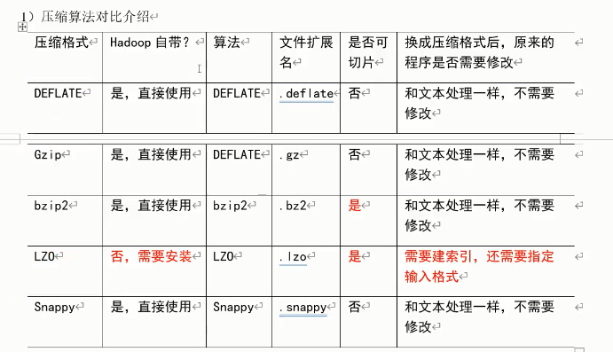

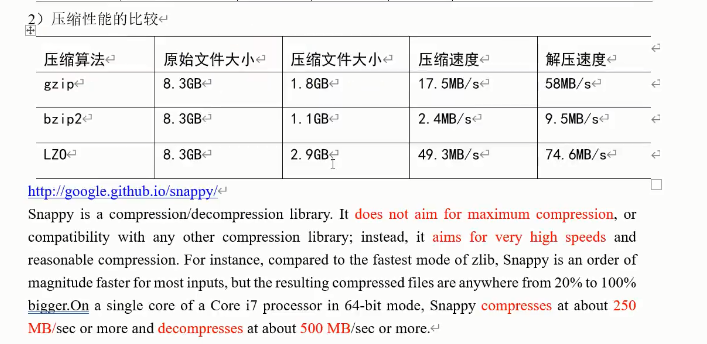

**压缩方式选择**

​	压缩方式选择式重点考虑：==压缩/解压缩速度、压缩率（压缩后存储大小）、压缩后是否可以支持切片。==

1. Gzip压缩
   - 优点：压缩率比较高；
   - 确定：不支持切片，压缩/解压缩速度一般。
2. Bzip2压缩
   - 优点：压缩率高，支持切片；
   - 确定：压缩/解压缩速度慢。
3. Lzo压缩
   - 优点：压缩/解压缩速度比较快，支持切片；
   - 确定：压缩率一般；想支持切片需要额外创建索引。
4. Snappy压缩
   - 优点：压缩和解压缩速度快；
   - 缺点：不支持切片，压缩率一般。

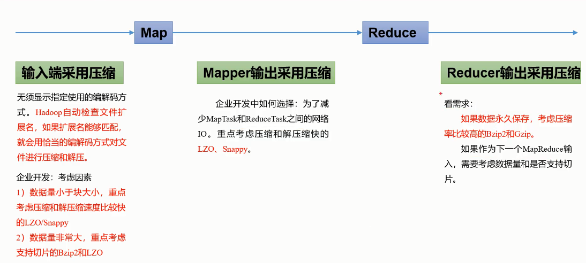

**压缩参数配置**

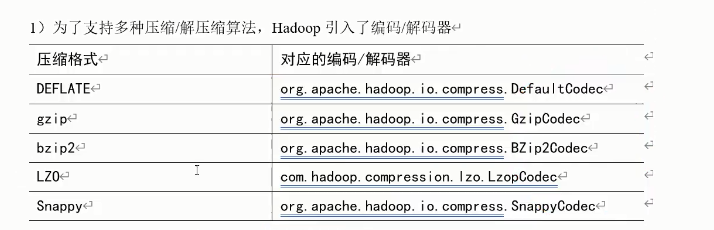

# Yarn

## 1. Yarn资源调度器

​	Yarn是一个资源调度平台，负责为运算程序提供服务器运算资源，相当于一个分布式的==操作系统平台==，而MapReduce等运算程序则相当于==运行于操作系统之上的应用程序==。集群资源管理和任务合理分配资源。

### 1.1 Yarn基础架构

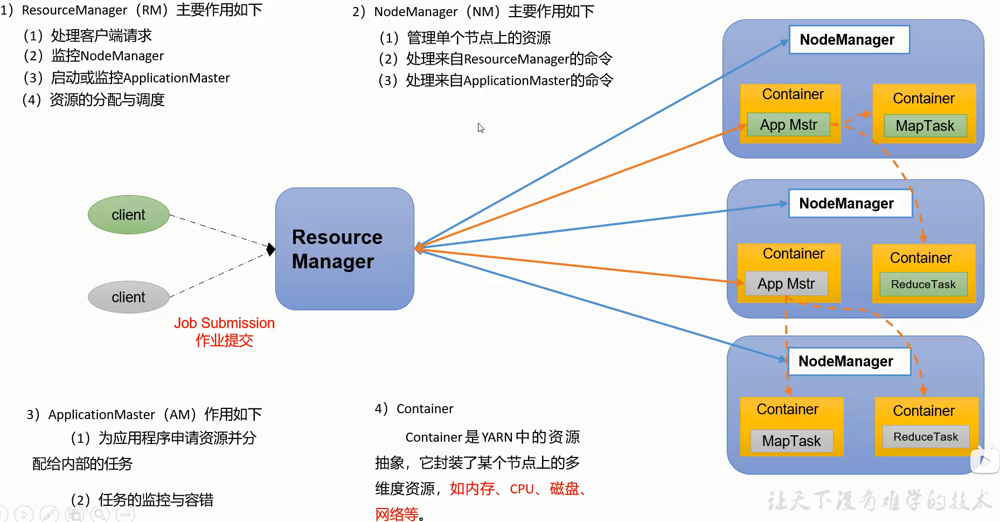

### 1.2 Yarn工作机制

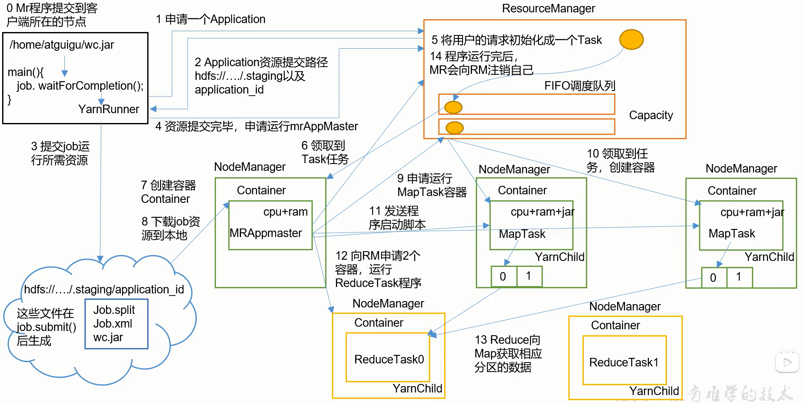

### 1.3 Yarn调度器和调度算法

Hadoop作业调度器主要有三种：先进先出(FIFO)、容量（Capacity Scheduler）和公平（Fail Scheduler）。Apache Hadoop3.1.3默认的资源调度器是Capacity Scheduler。CDH框架默认调度器是Fair Scheduler。

详情设置在yarn-default.xml文件

```xml
<property>
    <name>yarn.resourcemanager.scheduler.class</name>
    <value>org.apache.hadoop.yarn.server.resourcemanager.scheduler.capacity.CapacityScheduler</value>
</property>
```

**FIFO**

单队列，根据提交作业的先后顺序，先来先服务。

**Capacity Scheduler**

Yahoo开发的多用户调度器。

- 容量调度器特点

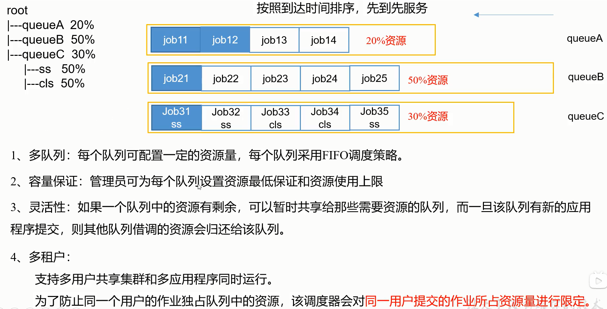

- 容量调度器资源分配算法

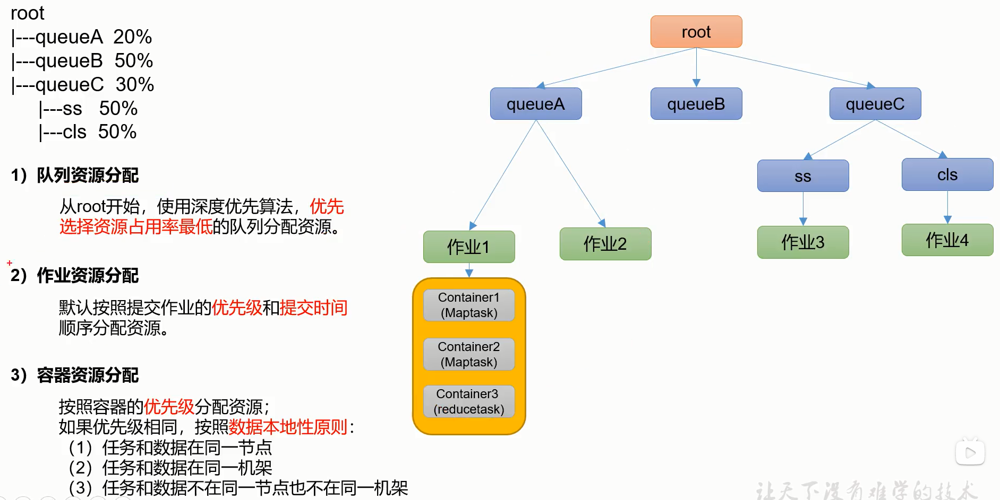

**Fair Scheduler**

Facebook开发的多用户调度器

- 公平调度器特点

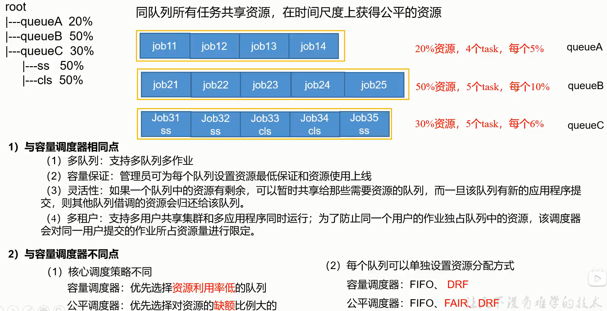

公平调度器设计目标是：在时间尺度上，所有作用获得公平的资源。某一时刻一个作业应获得资源和实际获得资源的差距叫==缺额==。

调度器会==优先为缺额大的作业分配资源==。

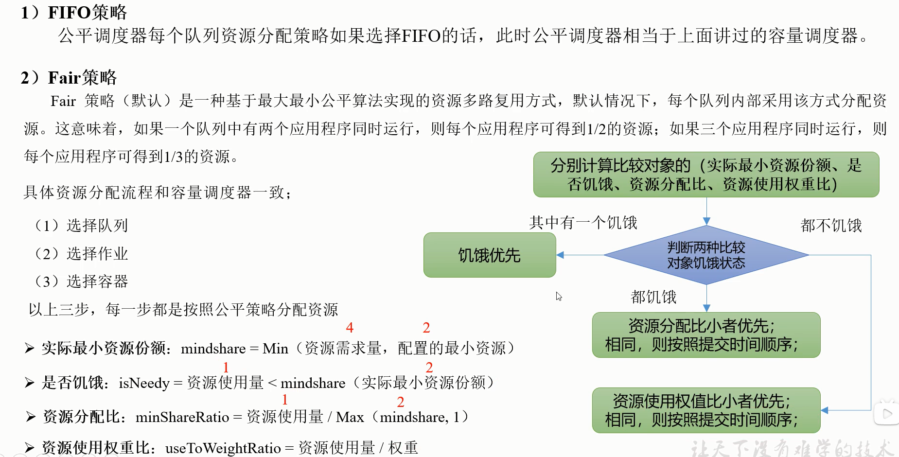

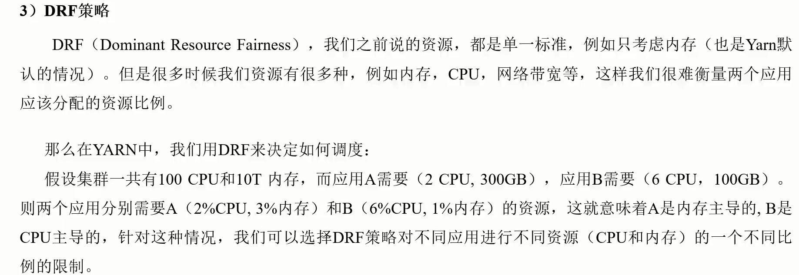

- 公平调度器分配算法

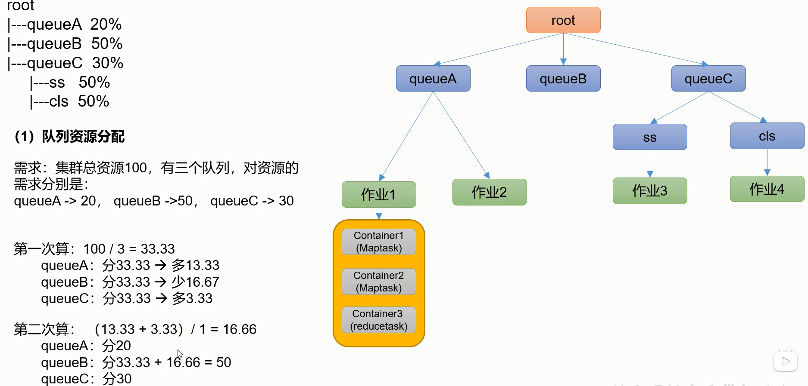


## 2.Yarn常用命令

```shell
#列出所有application:
yarn application -list
#根据application状态过滤：所有状态：ALL、NEW、NEW_SAVING、SUBMITTED、ACCEPTED、RUNNING、FINISHED、FAILED、KILLED
yarn application -list -appStates FINISHED
#kill application
yarn application -kill <application_id>
#查询application日志
yarn logs -applicationId <application_id>
#查询Container日志
yarn logs -applicationId <application_id> -containerId <container_id>
#yarn applicationattempt 查看尝试运行的任务、会显示container_id
yarn applicationattempt -list <application_id>
#打印applicationattempt状态
yarn applicationattempt -status <applicationAttemptId_id>
#列出所有容器
yarn container -list <applicationAttemptId_id>
#打印容器状态
yarn container -status <container_id>
#查看yarn node 节点状态
yarn node -list -all
#yarn rmadmin更新配置，加载队列配置：
yarn rmadmin -refreshQueues
#查看yarn queue队列
yarn queue -status <queue_name>
```

## 3.Yarn生产环境核心配置参数

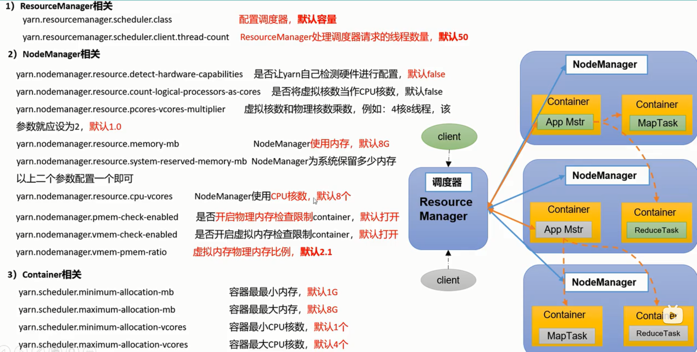

# Hadoop完全分布式(HA)模式搭建

## 1.集群规划

| hadoop1              | hadoop2              | hadoop3     | hadoop4     | hadoop5     |
| -------------------- | -------------------- | ----------- | ----------- | ----------- |
| zookeeper            | zookeeper            | zookeeper   | zookeeper   | zookeeper   |
| NameNode             | NameNode             |             |             |             |
| ZKFailoverController | ZKFailoverController |             |             |             |
| JouralNode           | JouralNode           | JouralNode  | JouralNode  | JouralNode  |
|                      |                      | DateNode    | DateNode    | DateNode    |
|                      |                      | NodeManager | NodeManager | NodeManager |
| ResourceManager      | ResourceManager      |             |             |             |

## 2.准备工作

- 主机名ip地址映射

  ```shell
  sudo vim /etc/hosts
  172.16.12.101   hadoop1
  172.16.12.102   hadoop2
  172.16.12.103  	hadoop3
  172.16.12.104   hadoop4
  172.16.12.105   hadoop5 
  ```

- 关闭防火墙

  ```shell
  sudo systemctl stop firewalld
  sudo systemctl disable firewalld
  ```

- 禁用selinux

  ```shell
  sudo vim /etc/selinx/config
  SELINX=enforcing --> SELINX=disabled
  ```

- 配置时间同步

  ```shell
  sudo yum -y install ntp ntpdate 
  ntpd  ntp.aliyun.com 
  ```

- 下载zookeeper和hadoop的压缩包(没有jdk记得安装jdk)

  `https://archive.apache.org/dist/hadoop/common/`

  `https://archive.apache.org/dist/zookeeper/`

- 解压文件并配置环境变量,以zookeeper3.4.14和hadoop3.1.3为例

  ```shell
  tar -zxvf hadoop-3.1.3.tar.gz
  tar -zxvf zookeeper-3.4.14.tar.gz
  ```

- 配置环境变量,假设解压后路径分别为/mnt/disk1/hadoop-3.1.3/hadoop-3.1.3和/mnt/disk1/zookeeper-3.4.14/zookeeper-3.4.14

  ```shell
  sudo vim /etc/profile
  #或者在/etc/profile.d新建.sh文件,假如为hadoop-env.sh文件
  vim /etc/profile.d/hadoop-env.sh#
  export HADOOP_HOME=/mnt/disk1/hadoop-3.1.3/hadoop-3.1.3
  export PATH=$PATH:$HADOOP_HOME/bin
  export PATH=$PATH:$HADOOP_HOME/sbin
  
  #保存后记得source
  source /etc/profile
  #可以查看一下path或者使用hadoop看table是否能补齐
  echo $PATH
  ```

## 3.搭建zookeeper

- 复制/mnt/disk1/zookeeper-3.4.14/zookeeper-3.4.14/conf/zoo_sample.cfg 为zoo.cfg

  ```shell
  cd /mnt/disk1/zookeeper-3.4.14/zookeeper-3.4.14/conf/
  cp zoo_sample.cfg zoo.cfg
  ```

- 修改zoo.cfg中的内容

  ```shell
  vim zoo.cfg
  dataDir=/mnt/disk1/zookeeper-3.4.14/zk/data
  dataLogDir=/mnt/disk1/zookeeper-3.4.14/zk/log
  clientPort=2181
  server.1=hadoop1:2888:3888 
  server.2=hadoop2:2888:3888 
  server.3=hadoop3:2888:3888 
  server.4=hadoop4:2888:3888 
  server.5=hadoop5:2888:3888
  ```

- 保存退出后创建数据目录和日志目录

  ```shell
  mkdir -p /mnt/disk1/zookeeper-3.4.14/zk/data
  mkdir -p /mnt/disk1/zookeeper-3.4.14/zk/log
  ```

- 配置zkId(其他机器分别为2,3,4,5)

  ```shell
  echo 1 > /mnt/disk1/zookeeper-3.4.14/zk/data/myid
  ```

## 4.Hadoop配置

- 配置ssh公钥登陆

  在hadoop1-hadoop5上分别执行

  ```shell
  #生成秘钥,三次回车
  ssh-keygen -t rsa
  #将生成的秘钥分别拷贝到所有机器上
  ssh-copy-id hadoop1
  ssh-copy-id hadoop2
  ssh-copy-id hadoop3
  ssh-copy-id hadoop4
  ssh-copy-id hadoop5
  ```

  

- 配置hadoop-env.sh文件

  ```shell
  vim hadoop-env.sh
  #指定JAVA_HOME
  export JAVA_HOME=/opt/soft/jdk1.8.0_251(可以通过echo $JAVA_HOME查看) 
  #指定hadoop用户，hadoop3.x之后必须配置(我的用户名就叫hadoop)
  export HDFS_NAMENODE_USER=hadoop
  export HDFS_DATANODE_USER=hadoop 
  export HDFS_ZKFC_USER=hadoop 
  export HDFS_JOURNALNODE_USER=hadoop
  export YARN_RESOURCEMANAGER_USER=hadoop 
  export YARN_NODEMANAGER_USER=hadoop
  export HADOOP_PID_DIR=/mnt/disk1/hadoop-3.1.3/pid
  ```

- 配置core-site.xml文件

  ```xml
  <!--集群名称-->
  <property> 
      <name>fs.defaultFS</name> 
      <value>hdfs://mycluster</value> </property> 
  <!--临时目录-->
  <property> 
      <name>hadoop.tmp.dir</name> 
      <value>/mnt/disk1/hadoop-3.1.3/hadoop_data</value> 
  </property>
  <!--webUI展示时的用户-->
  <!--<property> 
      <name>hadoop.http.staticuser.user</name>            
      <value>hadoop</value> 
  </property>-->
  <property>
      <name>io.file.buffer.size</name>
      <value>4096</value>
  </property>
  <!--高可用依赖的zookeeper的通讯地址-->
  <property>
      <name>ha.zookeeper.quorum</name>
      <value>hadoop1:2181,hadoop2:2181,hadoop3:2181,hadoop4:2181,hadoop5:2181</value>
  </property>
  ```

- 配置hdfs-site.xml文件

  ```xml
  <property>
      <name>dfs.nameservices</name>
      <value>mycluster</value>
  </property>
  <!--定义hdfs集群中的namenode的ID号-->
  <property>
      <name>dfs.ha.namenodes.mycluster</name>
      <value>nn1,nn2</value>
  </property>
  <!--定义namenode的主机名和rpc协议的端口-->
  <property>
      <name>dfs.namenode.rpc-address.mycluster.nn1</name>
      <value>hadoop1:8020</value>
  </property>
  <property>
      <name>dfs.namenode.rpc-address.mycluster.nn2</name>
      <value>hadoop2:8020</value>
  </property>
  <!--定义namenode的主机名和http协议的端口-->
  <property>
      <name>dfs.namenode.http-address.mycluster.nn1</name>
      <value>hadoop1:50070</value>
  </property>
  <property>
      <name>dfs.namenode.http-address.mycluster.nn2</name>
      <value>hadoop2:50070</value>
  </property>
  <!--定义共享edits的url-->
  <property>
      <name>dfs.namenode.shared.edits.dir</name>
      <value>qjournal://hadoop1:8485;hadoop2:8485;hadoop3:8485;hadoop4:8485;hadoop5:8485/ljgk</value>
  </property>
  <!--定义hdfs的客户端连接hdfs集群时返回active namenode地址-->
  <property>
      <name>dfs.client.failover.proxy.provider.mycluster</name>
      <value>org.apache.hadoop.hdfs.server.namenode.ha.ConfiguredFailoverProxyProvider</value>
  </property>
  
  <!--hdfs集群中两个namenode切换状态时的隔离方法-->
  <property>
      <name>dfs.ha.fencing.methods</name>
      <value>sshfence</value>
  </property>
  
  <!--hdfs集群中两个namenode切换状态时的隔离方法的秘钥-->
  <property>
      <name>dfs.ha.fencing.ssh.private-key-files</name>
      <value>/root/.ssh/id_rsa</value>
  </property>
  
  <!--journalnode集群中用于保存edits文件的目录-->
  <property>
      <name>dfs.journalnode.edits.dir</name>
      <value>/opt/journalnode/data</value>
  </property>
  <!--ha的hdfs集群自动切换namenode的开关-->
  <property>
      <name>dfs.ha.automatic-failover.enabled</name>
      <value>true</value>
  </property>
  
  <property>
      <name>dfs.safemode.threshold.pct</name>
      <value>1</value>
  </property>
  ```

- 配置workers文件

  ```
  hadoop1
  hadoop2
  hadoop3
  ```

- 配置yarn-site.xml文件

  ```xml
  <property>
      <name>yarn.resourcemanager.ha.enabled</name>
      <value>true</value>
      <description>Enable RM high-availability</description>
  </property>
  <property>
      <name>yarn.resourcemanager.cluster-id</name>
      <value>cluster1</value>
      <description>Name of the cluster</description>
  </property>
  <property>
      <name>yarn.resourcemanager.ha.rm-ids</name>
      <value>rm1,rm2</value>
      <description>The list of RM nodes in the cluster when HA is enabled</description>
  </property>
   <property>
      <name>yarn.resourcemanager.hostname.rm1</name>
      <value>hadoop1</value>
      <description>The hostname of the rm1</description>
  </property>
  <property>
      <name>yarn.resourcemanager.hostname.rm2</name>
      <value>hadoop2</value>
      <description>The hostname of the rm2</description>
  </property>
  <property>
      <name>yarn.resourcemanager.webapp.address.rm1</name>
      <value>hadoop1:8088</value>
  </property>
  <property>
      <name>yarn.resourcemanager.webapp.address.rm2</name>
      <value>hadoop2:8088</value>
  </property>
  <property>
      <name>yarn.resourcemanager.zk-address</name>
      <value>hadoop1:2181,hadoop2:2181,hadoop3:2181,hadoop4:2181,hadoop5:2181</value>
  </property>
  <property>
      <name>yarn.nodemanager.aux-services</name>
      <value>mapreduce_shuffle</value>
  </property>
  <property>
      <name>yarn.nodemanager.aux-services.mapreduce_shuffle.class</name>
      <value>org.apache.hadoop.mapred.ShuffleHandler</value>
  </property>
  <property>
      <name>yarn.nodemanager.env-whitelist</name>
       <value>JAVA_HOME,HADOOP_COMMON_HOME,HADOOP_HDFS_HOME,HADOOP_CONF_DIR,CLASSPATH_PREPEND_DISTCACHE,HADOOP_YARN_HOME,HADOOP_MAPRED_HOME,PATH</value>
  </property>
  <property>
      <name>yarn.application.classpath</name>
      <value>
          /mnt/disk1/hadoop-3.1.3/hadoop-3.1.3/etc/hadoop,
          /mnt/disk1/hadoop-3.1.3/hadoop-3.1.3/share/hadoop/common/*,
          /mnt/disk1/hadoop-3.1.3/hadoop-3.1.3/share/hadoop/common/lib/*,
          /mnt/disk1/hadoop-3.1.3/hadoop-3.1.3/share/hadoop/hdfs/*,
          /mnt/disk1/hadoop-3.1.3/hadoop-3.1.3/share/hadoop/hdfs/lib/*,
          /mnt/disk1/hadoop-3.1.3/hadoop-3.1.3/share/hadoop/mapreduce/*,
          /mnt/disk1/hadoop-3.1.3/hadoop-3.1.3/share/hadoop/mapreduce/lib/*,
          /mnt/disk1/hadoop-3.1.3/hadoop-3.1.3/share/hadoop/yarn/*,
          /mnt/disk1/hadoop-3.1.3/hadoop-3.1.3/share/hadoop/yarn/lib/*
      </value>
  </property>
  <!--配置yarn的最大container内存大小,单位M-->
  <property>
      <name>yarn.scheduler.maximum-allocation-mb</name>
      <value>10240</value>
  </property>
  <!--配置yarn的每个节点内存大小,单位M-->
  <property>
      <name>yarn.nodemanager.resource.memory-mb</name>
      <value>184320</value>
  </property>
  <!--配置yarn的的每个节点核数大小-->
  <property>
      <name>yarn.nodemanager.resource.cpu-vcores</name>
      <value>24</value>
  </property>
  ```

- 配置mapred-site.xml文件

  ```xml
  <property>
      <name>mapreduce.framework.name</name>
      <value>yarn</value>
  </property>
   <!-- <property>
     <name>mapreduce.application.classpath</name>
      <value>
          /mnt/disk1/hadoop-3.1.3/hadoop-3.1.3/etc/hadoop,
          /mnt/disk1/hadoop-3.1.3/hadoop-3.1.3/etc/hadoop/common/*,
          /mnt/disk1/hadoop-3.1.3/hadoop-3.1.3/etc/hadoop/common/lib/*,
          /mnt/disk1/hadoop-3.1.3/hadoop-3.1.3/etc/hadoop/hdfs/*,
          /mnt/disk1/hadoop-3.1.3/hadoop-3.1.3/etc/hadoop/hdfs/lib/*,
          /mnt/disk1/hadoop-3.1.3/hadoop-3.1.3/etc/hadoop/mapreduce/*,
          /mnt/disk1/hadoop-3.1.3/hadoop-3.1.3/etc/hadoop/mapreduce/lib/*,
          /mnt/disk1/hadoop-3.1.3/hadoop-3.1.3/etc/hadoop/yarn/*,
          /mnt/disk1/hadoop-3.1.3/hadoop-3.1.3/etc/hadoop/yarn/lib/*
      </value> 
  </property> -->
  <property>
      <name>mapreduce.jobhistory.address</name>
    <value>xcloud55:10020</value>
  </property>
  <property>
      <name>mapreduce.jobhistory.webapp.address</name>
      <value>xcloud55:19888</value>
  </property>
  
  <property>
      <name>mapreduce.admin.user.env</name>
      <value>HADOOP_MAPRED_HOME=$HADOOP_HOME</value>
  </property>
  <property>
      <name>yarn.app.mapreduce.am.env</name>
      <value>HADOOP_MAPRED_HOME=$HADOOP_HOME</value>
  </property>
  ```
  
  

## 5.启动

- 启动zookeeper

  ```shell
  zkServer.sh start
  ```
  
- 启动hadoop

  ```shell
  #启动五个阶段jn
  hadoop-daemon.sh start journalnode (hdfs --daemon start journalnode)
  #格式化一个NameNode并启动
  hdfs namenode -format
  hadoop-daemon.sh start namenode (hdfs --daemon start namenode)
  #另一个NameNode手动同步数据并启动
  hdfs namenode -bootstrapStandby
  hadoop-daemon.sh start namenode(hdfs --daemon start namenode)
  #初始化zkfc(任意节点)
  hdfs zkfc -formatZK
  #停止hadoop所有进程
  stop-dfs.sh
  #全部启动
  start-all.sh
  #启动yarn
  start-yarn.sh 
  #单独启动yarn的resourcemanager节点
yarn --daemon start resourcemanager
  
  #启动JobHistoryServer的方法
  mr-jobhistory-daemon.sh start historyserver(mapred --daemon start historyserver)
  ```
  
  