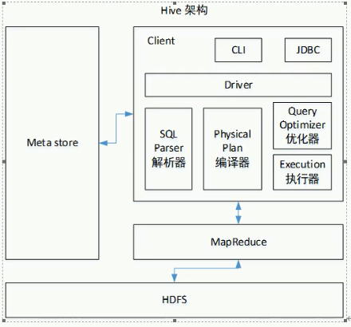
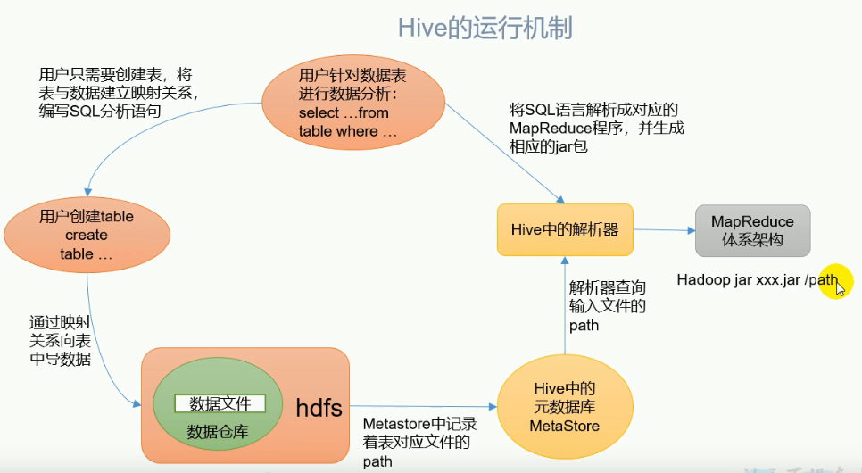

[toc]

# 1.Hive基本概念

1. hive简介

   Hive：有Facebook开源用于解决海量结构化日志的数据统计工具

   Hive是基于Hadoop的一个**数据仓库工具**，可以将**结构化的数据文件映射为一张表**，并提供**类SQL**查询功能

2. Hive本质，将HQL转化为MapReduce程序

   

   - Hive处理的数据存储在HDFS。
   - Hive分析数据底层的实现是MapReduce。
   - 执行程序运行在Yarn上。

## 1.1 Hive优缺点

1. Hive优点
   - 操作接口采用类SQL语法，提供快速开发的能力。
   - 避免了去写MapReduce，减少开发人员的学习成本。
   - Hive的执行延迟比较高，因此Hive常用于数据分析，对实时性要求不高的场合。
   - Hive优势在于处理大数据，用于处理小数据没有优势，因此Hive的执行延迟比较高。
   - Hive支持用户自定义函数，用户可以根据自己的需求来实现自己的函数。
2. Hive缺点
   - Hive的HQL表达能力有限
     - 迭代式算法无法表达。
     - 数据挖掘方面不擅长，由于MapReduce数据处理流程的限制，效率更高的算法却无法实现。
   - Hive的效率比较低
     - Hive自动生成的MapReduce作业，通常情况下不够智能化。
     - Hive调优比较困难，粒度较粗。

## 1.2 Hive架构

## 1.3 Hive和数据库比较

1. 查询语言

   由于SQL被广泛的应用在数据仓库中，因此，专门针对HIve的特性设计了类SQL的查询语言HQL。熟悉SQL开发的开发者可以很方便的使用Hive进行开发。

2. 数据更新

   由于Hive是针对数据仓库应用设计的，而==数据仓库的内容是读多写少的==。因此，==Hive中不建议对数据的改写，所有的数据都是在加载的时候确定好的。==而数据库中的数据通常是需要经常进行修改的，因此可以使用INSERT INTO...VALUES添加数据，使用UPDATE...SET修改数据。

3. 执行延迟

   Hive在查询数据的时候，由于没有索引，需要扫描整个表，因此延迟较高。另外一个导致Hive执行延迟高的因素数MapReduce框架。由于MapReduce本身具有较高的延迟，因此在利用MapReduce执行Hive查询是，也会有较高的延迟。相对的，数据库的执行延迟较低。当然，当数据规模大到超过数据库的处理能力的时候，Hive的并行计算显然能体现出优势。

4. 数据规模

   由于Hive建立在集群上并可以利用MapReduce进行并行计算，因此可以支持很大规模的数据；对应的，数据库可以支持的数据规模较小。

