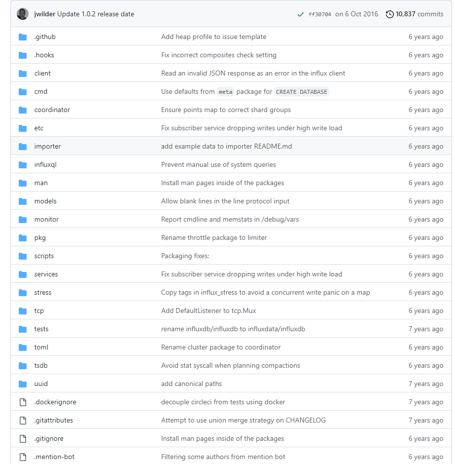

# influxdb1.0 代码

一级目录：



目录解析

- client

  client lib V2版本。

- cmd目录

  influxDb 相关程序所在目录：

  - influxd 目录为influxdb主程序代码；
  - influx 为influxdb自带的控制台管理工具源码；
  - influx_inspect 为influxdb数据查看工具源码；
  - influx_stress 为influxdb压力测试工具源码；
  - influx_tsm 为数据库装换工具（将数据库从b1或者bz1格式转换为tsm1格式）源码；

- coordinator

  协调器，负责数据的写入和一些创建语句的执行。

  在influxdb的changeLog中显示在v1.0.0中使用coordinator转换cluster。

  自建集群功能可以通过此模块实现。

- etc

  存放默认配置

- importer

  数据导出功能，版本向后兼容相关代码。在readme中提到：InfluxDB 0.8.9 版增加了将数据导出为可导入 0.9.3 及更高版本的格式的支持。

  > Version `0.8.9` of InfluxDB adds support to export your data to a format that can be imported into `0.9.3` and later.

- influxql

  influxdb查询语言的解析器。

- internal

  主要实现metaClient接口。

- man

  帮助手册。

- models

  基础数据类型定义。

- monitor

  influxdb系统监控。

- pkg

  一些通用包集合：

  - deep 主要实现deepValueEqual方法，用于深层次比较两个值是否相等；
  - escape 主要实现byte和string两种数据类型转移字符相关操作；
  - limiter 主要是一个基于channel实现的简单并发限制器Fixed；
  - pool 主要实现bytes和generic两种类型的pool，在pool中的对象不使用时不会被垃圾回收自动清理掉；
  - slices 主要实现string数组的操作；

- scripts

  存放关于influxdb的脚本。

- services

  存放关于influxdb的服务。

  - admin 为influxdb内置管理服务；
  - collectd 为 collectd对接服务，可以通过接收UDP发送过来的collectd格式数据；
  - continuous_querier 为influxdb的CQ服务；
  - graphite 为influxdb的graphite服务；
  - httpd 为influxdb的http服务，可以通过该接口进行数据库数据的写入和查询等操作；
  - meta 为influxdb的元数据服务，可以用于管理数据库的元数据相关内容；
  - opentsdb 为influxdb的opentsdb服务，可用于替换opentsdb；
  - precreator 为influxdb的Shard与创建服务；
  - retention 为influxdb的数据保留策略的强制执行服务，主要用于定时删除文件；
  - snapshotter 为influxdb的快照服务；
  - subscribe 为influxdb的订阅服务；
  - udp 为influxdb的udp服务，可以通过改接口进行数据库的写入和查询等操作；

- stress

  压力测试相关内容。

- tcp

  网络连接多路复用

- tests

  测试相关内容。

- toml

  toml解析器，为独立的解析模块，主要解析时间字符串和磁盘容量数据。

- tsdb

  主要是时序数据库的实现。

- uuid

  主要存放uuid生成的相关代码。

# 时序数据库安装

下载安装路径：https://portal.influxdata.com/downloads/ 参考给出的安装步骤即可。

以1.8版本、linux 64系统离线安装为例：

- 下载tar.gz的包 

  `wget https://dl.influxdata.com/influxdb/releases/influxdb-1.8.10_linux_amd64.tar.gz`

- 解压压缩包

  `tar xvfz influxdb-1.8.10_linux_amd64.tar.gz`

- 编辑配置文件

  ```shell
  cd influxdb-1.8.10
  vim influxdb.conf
  
  [meta]
  dir = "/mnt/disk1/influxDB/influxdb/meta"
  [data]
  dir = "/mnt/disk1/influxDB/influxdb/data"
  wal-dir = "/mnt/disk1/influxDB/influxdb/wal"
  seriers-id-set-cache-size = 100
  [coordinator]
  [retention]
  enabled = true
  check-interval = "30m"
  ```

- 启动

  ```shell
  export PATH=$PATH:{安装路径}/usr/bin
  
  #服务端 前台启动
  influxd -config influxdb.conf
  
  #服务端 后台启动
  nohup influxd -config influxdb.conf &2 > 1 > influxdb.out &
  
  #客户端 启动
  influx [-host 主机地址] [-port 端口]
  ```


# 存储引擎


