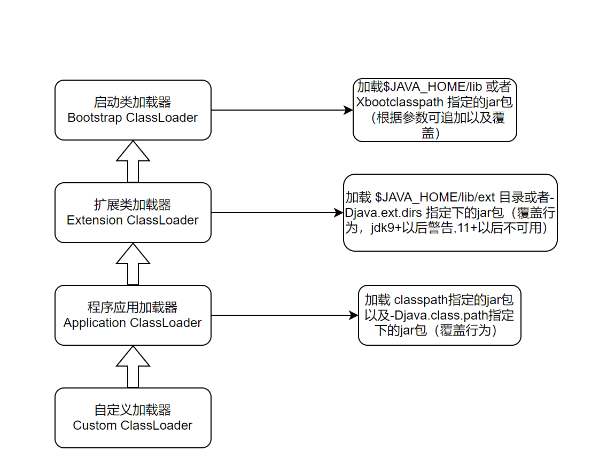
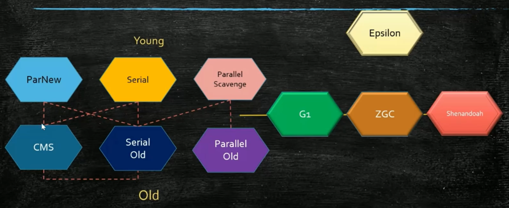
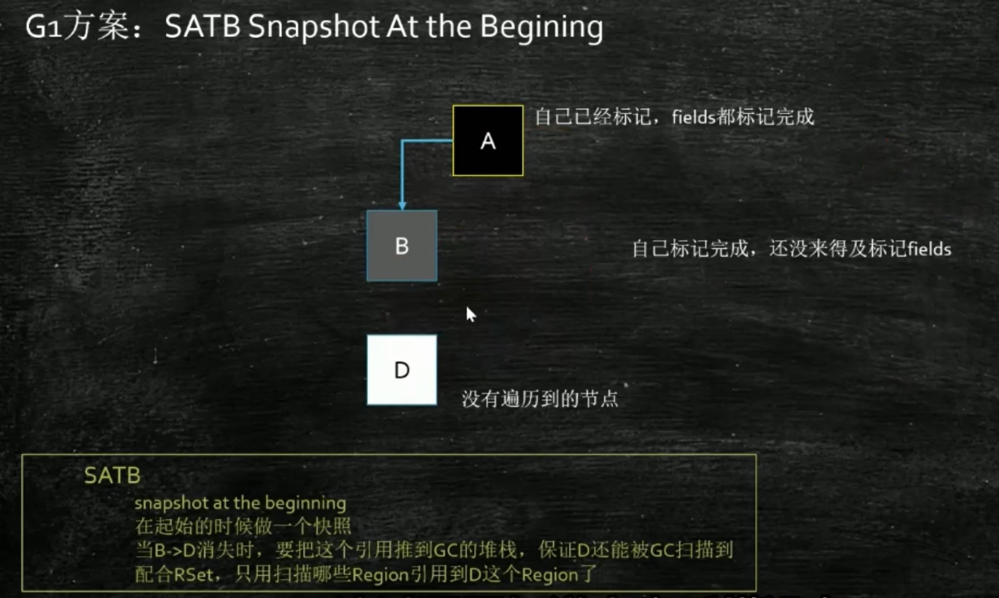
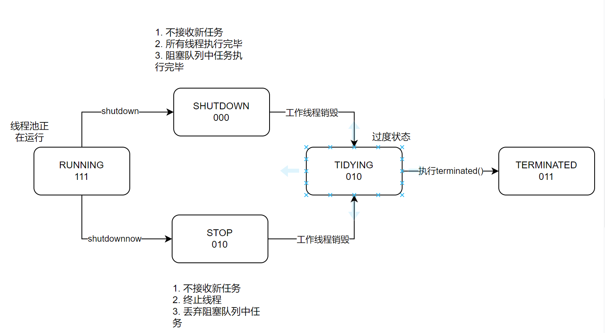
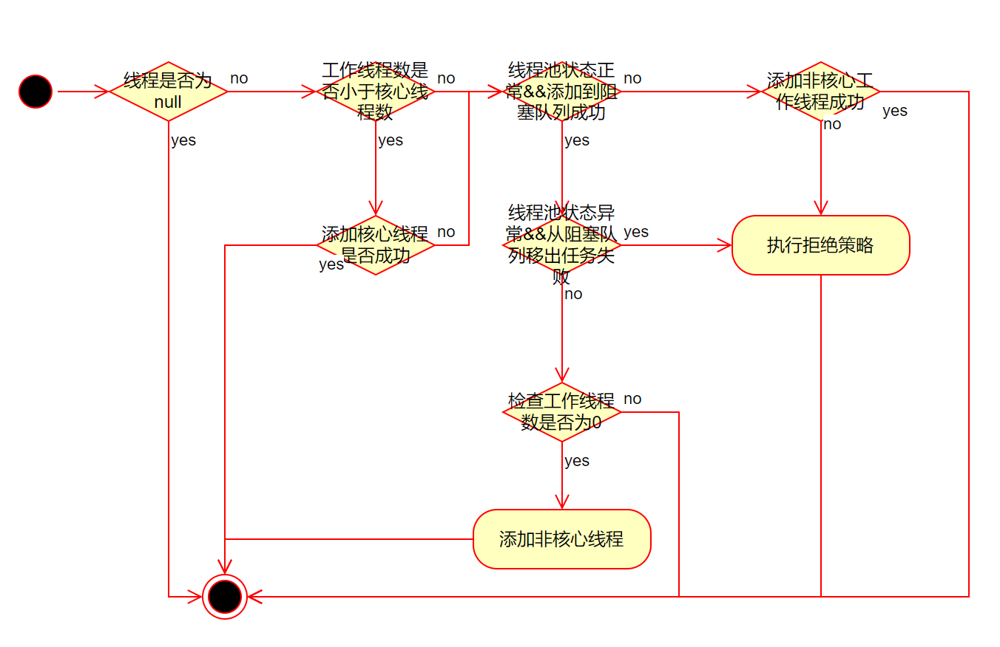
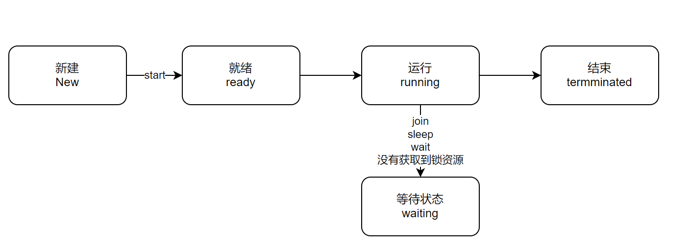
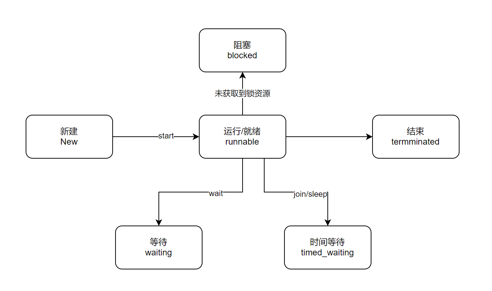

[toc]

# JVM

## 类加载器以及双亲委派



## 类加载机制

1. 加载：加载class文件，将二进制流的静态结构生成方法区的运行时数据结构，在堆内生成java.lang.Class对象。
2. 链接：
   - 验证：文件格式验证，元数据验证，字节码验证，符号引用验证。
   - 准备：为类静态变量分配内存并赋予默认值。
   - 解析：将常量池内的符号引用转化为直接引用。
3. 初始化：执行类构造器方法`<clinit>`方法。

## 运行时数据区


- 程序计数器：用于线程切换后还原现场。

- 栈：以栈帧为基本单位存储。栈帧结构为：局部变量表，操作数栈，动态链接，方法返回地址，附加信息。

  > 动态链接的作用：将符号引用转换为直接引用

- 本地方法栈：管理本地方法调用。

- 方法区：存放类信息，域信息，方法信息，静态变量，运行时常量池，JIT代码缓存。jdk8以后，字符串常量池和静态变量放到了堆中。

- 堆：java内存管理的核心区域。

## 垃圾收集器

### 根可达性算法

GCRoot有哪些：系统类，虚拟机栈中局部变量，jni指针，活跃线程，静态变量，同步锁。

### 垃圾收集算法

1. 标记清除算法

2. 拷贝算法

3. 标记整理（压缩）算法

### 垃圾收集器



### CMS垃圾收集器

垃圾清理过程：初始标记->并发标记->重新标记->并发清理

CMS并发标记使用三色标记算法(黑色：所有feiled标记完，灰色：标记了一部分,白色：未标记)，并使用增量更新(屏障：在黑色指向白色时把黑色置灰)处理漏标问题。

> CMS解决方案因为存在Bug,所以引入重新标记。

### G1三色标记算法



> 基于RSet实现SATB解决方案

## 什么时候回发生垃圾回收

1. 自动回收: eden区或者s区不够用 触发yang gc;老年代空间不够用触发full gc; 方法区空间不够用触发full gc。
2. 手动回收： system.gc(),下发full gc命令，由jvm确定gc时间。

## 方法区与持久代以及元数据区的关系

方法区：虚拟机规范规范。

持久代与元数据区（元空间）是方法区的具体实现，持久代：jdk1.7之前的实现，存放在对空间里边; 元数据区：jdk1.8以后的实现，使用直接内存。

# 多线程

## 多线程使用场景和注意事项

### 使用场景

1. io密集型操作，主要处理异步请求。
2. CPU密集型操作，主要处理并行计算。
3. 处理高并发请求。
4. 定时任务和后台任务。

### 注意事项

1. 对于唯一性资源，保证竞争条件。
2. 多线程变量可见性。
3. 预防死锁。
4. 性能监控和调优。

## synchronized 的原理是什么？

添加synchronized关键字后，jvm底层执行命令时会使用moniterenter 和moniterexit 指令标记同步代码块。C++底层使用 ObjectMoniter中的_owner属性通过CAS的方式置为当前线程。

没有获取到锁的线程会放到 _cxq 或 _EntryList中等待唤醒。

## 什么是可重入性,为什么说synchronized是可重入锁？

可重入性：获取到锁的线程对同一个锁是否可以再次获取。

ObjectMoniter中使用_recusions来记录重入次数。

woker 继承AbstractQueuedSynchronizer 实现了一些锁机制，为不可重入锁。

## 为什么synchronized 是悲观锁

synchronized 会经历 无锁->偏向锁->轻量级锁->重量级锁 一系列锁升级的过程。当出现单线程无竞争获取锁时，升级为偏向锁。出现多线程轻微竞争，通过CAS自旋能够解决时为轻量级锁。竞争激烈或者调用wait()/notify()方法时会触发重量级锁。JDK15以后，默认禁用自旋锁。

## 乐观锁实现原理

基于CPU支持的原语配合lock指令来实现。java中Unsafe类封装了一系列compareAndSwap方法。

## 谈谈AQS框架是怎么回事

AQS是java中的一个抽象类，很多JUC下边的类基于AQS实现锁的功能。

AQS中有三个重要属性：

1. state,int类型，用来记录锁的状态。
2. head和tail属性，Node类型，用来维护一个同步队列，获取资源失败后的同步队列。
3. ConditionObject类中维护一个单向链表，实现条件队列。给lock锁的实现，当线程执行await/signal方法时，将线程放到单向链表中等待唤醒。

## 对比synchronized和ReentrantLock的区别

ReentrantLock 是基于AQS实现的一个类，synchronized是基于c++底层ObjectMonitor对象实现的关键字，都是JVM层面的互斥锁。ReentrantLock比synchronized功能更全面，可以实现公平锁与非公平锁，指定获取锁资源的时间。ReentrantLock出现异常需要手动释放锁，synchronized会自动释放锁资源。

## 聊一下ConcurrentHashMap的扩容是怎么实现的

ConcurrentHashMap 在达到扩容因子(0.75)或链表长度为8并且table.leng<64会触发扩容。

> 链表长度为8并且table.leng>=64会转换为红黑树。

1. 生成扩容标识戳，保证多线程协助扩容时的唯一性以及记录信息。
2. 计算迁移步长。
3. 创建新的数组。
4. 领取迁移任务。
5. 迁移数据到新数组。
6. 最后一个完成迁移的线程检查老数组，查询是否有遗漏的数据。

## ConcurrentHashMap的红黑树中为什么要保留一套双向链表

1. 当红黑树结构发生变化时（发生旋转），保证读操作不阻塞。
2. 扩容时使用双向链表迁移数据。

# 线程池

## 线程池处理任务发生异常时，出现异常会发生什么

1. 通过execute执行任务时，会捕获异常并记录，然后抛出异常。因为Runnable中没有异常处理，因此run方法异常结束，线程结束。
2. 通过submit执行任务时，ThreedPoolExecutor会把任务封装成FutureTask执行,FutureTask会记录异常到outcome中，方法正常结束。

## 线程池的核心参数

1. corePoolSize 核心工作线程数
2. maximumPoolSize  最大工作线程数
3. keepliveTime  工作线程存活时间
4. unit 工作线程存活时间单位
5. workQueue  工作队列
6. threadFactory  构建工作线程
7. RejectedExecutionHandler 拒绝策略

## RejectedExecutionHandler 有哪些

1. AbortPolicy  抛异常
2. CallerRunsPolicy 交给调用线程处理
3. DiscardPolicy  丢弃，什么也不做
4. DiscardOldestPolicy 丢弃队列中最早的任务，并尝试交给线程池处理

## 线程池的状态



## 线程池执行流程



## 线程池添加工作线程的流程

1. 检查线程池状态和个数是否满足需求需求
   1. 检查线程池状态是否为runnig&&检查无线程处理任务的特殊情况
   2. 检查线程池个数是否超过最大值||(根据是否是核心线程检查线程个数是否超过max||coreSize)
   3. cas修改个数。
   4. 重新检查线程状态是否发生变化。
2. 添加工作线程
   1. 创建worker并添加到hashset中。
   2. 通过worker中的thread启动线程。

## 线程池为什么要构建空任务的非核心线程

为了处理阻塞队列有任务但是没有工作线程的情况。

1. 核心线程数为0。
2. 修改核心线程运行超时为true后，没有核心线程。

## 线程池使用完毕为什么使用shutdown()方法

避免内存泄漏

1. 核心线程正在运行导致内存泄漏。
2. 核心线程存活导致threadPoolExecutor的内存泄漏。

shutdown方法的作用

1. 设置线程池状态为shutdown,让未阻塞线程结束gettask方法。
2. 调用interruput方法唤醒阻塞线程,结束gettask方法。

## 线程池的核心参数怎么设置

对于cpu密集型建议初始设置为n+1;io密集型 cpuCores * (1 + 平均IO等待时间)推荐为2N。实际业务场景中需要做好压测以及监控，动态修改coreSize的个数。

# Java基础

## Java中线程实现方式

1. 继承Thread类。
2. 实现Runnable接口。
3. 实现Callable重新call方法。
4. 基于线程池构建线程。

所有的方法都最终通过实现runnable接口。

## Java中线程的状态

操作系统把线程分为这几种状态




Java虚拟机设置状态为6种



## Java中如何停止线程

1. 设置退出标志位
2. interrupt
3. stop已经弃用

## 并发编程三大特性

1. 原子性  一个现在正在执行时，不受其他线程影响

   synchronized,CAS,Lock锁，ThreadLoacl(通过线程独享变量控制不受影响)

2. 可见性 去除CPU缓存与主内存不一致。

   volatile,synchronized(加锁时同步数据),lock,final

3. 有序性

   ```txt
   在并发环境下，由于以下原因可能被破坏：
        * 1. 编译器优化重排序
        * 2. 处理器指令级并行重排序  
        * 3. 内存系统重排序
   ```

   **Java解决方案**：happens-before规则和内存屏障

   **关键工具**:最终使用volatile

## CAS有什么优缺点

CAS是一条CPU操作原语，如果预期值与内存值一致，则替换。

优点：避免线程挂起时，用户态到内核态的切换。

缺点：ABA问题->通过添加版本号的方式解决；自旋时间过长，导致长时间占用CPU->1.指定CAS次数（自旋锁），2.可以在CAS失败后暂存，参考（LongAdder）

## Java四种引用类型

1. 强引用 不回收
2. 软引用 内存不够则回收
3. 索引用 发现即回收
4. 虚引用 不能单独使用，必须和引用队列联合使用。用于跟踪对象被垃圾回收状态。

## ThreadLocal的内存泄漏问题

**ThreadLocal实现原理**

1. Thread内部存在一个ThreadLocalMap去存储数据。
2. ThreadLocal本身不存储数据，通过操控ThreadLocalMap去修改数据。
3. ThreadLocalMap本身基于Entry[]实现，以存储多个数据。
4. ThreadLocalMap以ThreadLocal本身作为key,其中key时一个弱引用，对value存取数据。

**ThreadLocal内存泄漏问题**

1. key的内存泄漏通过弱引用解决。
2. value的内存泄漏需要线程调用结束后remove。

# Spring

## 什么是Spring框架，包含那些模块

一个javaee轻量级框架，核心包括IOC容器，AOP以及数据访问/集成。

主要包含七大模块：**核心容器 (Core Container)**、**数据访问/集成 (Data Access/Integration)**、**面向切面编程 (AOP)**、**Web 模块**、**消息传递 (Messaging)**、**测试 (Test)** 和 **工具类 (Instrumentation)**

## Spring有哪些优点

轻量性框架、依托IOC实现松耦合、通过AOP能够让业务逻辑和系统的服务分隔、MVC框架能够更好的集成Web应用，对于事务管理和异常处理都有便捷的方式。

## 什么是控制反转(IOC)，什么是依赖注入

控制反转是一种设计思想，将对象的依赖交给外部调用者或者框架。

依赖注入是控制反转的实现方式，将对象创建和绑定的过程从对象内部转移到了对象外部。

## 谈下对于Spring IOC的理解

Spring将对象的创建和生命周期交给Spirng容器管理，只需要在配置文件中配置好对象，就可以在需要的地方通过Spring容器来使用。

spring ioc容器的创建过程

1. 创建BeanFactory和BeanDefinitionReader,读取配置信息加载bean对象(obtainFactory)
2. BeanFactory属性设置（prepareFactory）
3. BeanFactory后置处理（postBeanFactory）
4. 执行所有BeanFactoryPostProcessor和BeanDefinitionRegistryPostProcessor（invokeBeanFactoryProcess）
5. 注册BeanPostProcessor（registerBeanPostProcessors）
6. 通过反射将beanDefinition对象实例化为bean对象
7. 初始化bean对象并生成完整的bean对象

## 描述bean的生命周期

1. 通过反射实例化bean，createBeanInstance()
2. 填充bean的属性,populateBean()
3. 调用aware相关接口,invokeAwareMethod()
4. BeanPostProcesser前置处理,applyBeanPostProcessorsBeforeInitialization()
5. 检查是否实现InitializingBean接口，调用afterPropertiesSet()方法
6. 调用init-method方法，invokeCustomInitMethod()
7. BeanPostProcesser后置处理，applyBeanPostProcessorsAfterInitialization()
8. 使用bean对象
9. 是否实现DisposableBean接口，调用destory()方法
10. 是否配置自定义destory-method

> registerDisposableBeanIfNecessary 检查是否需要注册destory方法，在initializeBean方法之后

## Spring 自动装配的各种模式

1. no：不进行自动装配
2. byName: 通过名称自动装配
3. byType: 通过类型自动装配
4. constructor: 通过构造器自动装配
5. autodetect: 有构造器通过constructor装配，没有则通过byType

## BeanFactory 和 ApplicationContext的区别

1. BeanFactory通过延迟加载，只有使用时才会加载bean,如果没有正确配置bean,可能会报运行时异常；Application提前加载所有Bean对象。
2. BeanFactory以编程的方式创建，ApplicationContext可以通过编程和声明创
3. ApplicationContext继承自BeanFactory接口，不仅提供BeanFactory的所有功能，还提供更多的功能。

## 谈一下对于SpringAop的理解

1. aop的应用场景

   | 场景         | 核心价值                   | 常用注解/实现                  |
   | :----------- | :------------------------- | :----------------------------- |
   | **日志记录** | 统一日志格式，无侵入式日志 | `@Around`, `@Before`, `@After` |
   | **事务管理** | 声明式事务，简化代码       | `@Transactional`               |
   | **性能监控** | 方法执行时间，调用统计     | `@Around`, Metrics             |
   | **权限控制** | 统一权限校验               | `@Before`, 自定义权限注解      |
   | **缓存管理** | 方法结果缓存，缓存失效     | `@Around`, `@After`            |
   | **参数校验** | 统一参数验证               | `@Before`                      |
   | **重试机制** | 失败自动重试               | `@Around`, 自定义重试注解      |
   | **限流熔断** | 流量控制，系统保护         | `@Around`                      |
   | **数据脱敏** | 敏感信息保护               | `@AfterReturning`              |
   | **版本控制** | API 版本管理               | `@Around`                      |

2. 切面：将多个类的通用行为封装为可重用的模块。

3. 通知：@Before,@Around,@After,@AfterReturning,@After-Throwing

4. 切入点：一个或一组连接点，通知将在这些地方执行。

5. 织入：将切面应用到目标对象，从而创建代理对象的过程。Spring 在**运行时**完成织入。

## 五种通知的执行顺序

正常情况：@Around中proceed()之前的部分->@Befor->目标方法->@Around中proceed()之后的部分 -> @AfterReturning->@After

异常情况：@Around中proceed()之前的部分->@Befor->目标方法抛出异常-> @AfterThrowing->@After -> (@Around中proceed()之后的部分,如果 proceed() 被 try-catch，则执行)

## Spring用到了哪些模式

1. 单例模式
2. 工厂模式（BeanFactory)
3. 代理模式
4. 模板方法模式（JDBCTemplate,RestTemplate）
5. 适配器模式（SpringMVC中HandlerAdapter）
6. 装饰器模式（HttpServletRequestWrapper）
7. 观察者模式（ApplicationListener）
8. 责任链模式（filter过滤器）

## @Autowired和@Resource的区别

共同点：@Autowired和@Resource都可以通过属性和setter方法注入依赖。

区别：

1. @Autowired是spring提供的注解，@Resource是java自带注解。

2. @Autowired默认通过byType注入，如果需要byName的方式，需要使用@Qualififler注解。

   @Resource默认通过byName注入，可以使用byName和byType注入。

> @Resource如果同时使用name和type,会寻找唯一匹配的bean装配，找不到则抛异常。

## 谈谈你对循环依赖的理解

1. 自循环依赖
2. 互相循环依赖
3. 多组循环依赖

> 构造器注入无解，设值注入提前暴露依赖

## Spring如何解决循环依赖

Spring 只支持设值注入的单例循环依赖，使用三级缓存解决循环依赖。

- 一级缓存singletonObjects，存放已经实例化和初始化完成可用bean。
- 二级缓存earlySingletonObjects，存放已经实例化但未初始化的bean。
- 三级缓存singletonFactories，存放ObjectFactory工厂。

三级缓存主要处理AOP代理对象的问题，没有三级缓存能解决循环依赖的问题。

## Spring 支持几种作用域

1. prototype,原型
2. singleton,单例
3. request,为每一个网络请求创建一个实例
4. session,为每一个session创建一个实例
5. global-session,与portlet相关。

## Spring 事务隔离级别

隔离发生的问题：

1. 脏读，读取到另一个事务未提交的数据。
2. 不可重复读，在同一个事务中，多次读取同一数据，得到的结果不一致。这是因为在两次读取之间，其他事务**修改并提交**了该数据。
3. 幻读，在同一个事务中，多次执行相同的查询，**结果集的行数**发生变化。

Spring 支持的隔离级别

| 隔离级别         | 描述                                                      |
| :--------------- | :-------------------------------------------------------- |
| DEFAULT          | 使用数据库默认的隔离级别，oracle,读已提交；mysql,可重复读 |
| READ_UNCOMMITTED | 读未提交，最低隔离级别，一切皆有可能                      |
| READ_COMMITTED   | 读已提交，避免脏读                                        |
| REPEATABLE_READ  | 可重复读，避免脏读、不可重复读                            |
| SERLALIZABLE     | 串行化，避免所有问题                                      |

## Spring 事务传播行为

| 事务行为                 | 说明                                                       |
| ------------------------ | ---------------------------------------------------------- |
| PROPAGATION_REQUIRED     | 支持当前事务，如果没有事务，则新建一个事务                 |
| PROPAGATION_SUPPORTS     | 支持当前事务，如果没有事务，则以非事务方式运行             |
| PROPAGATION_MANDATORY    | 支持当前事务，如果没有事务，则抛出异常                     |
| PROPAGATION_REQUITES_NEW | 新建事务，假设当前存在事务，则挂起当前事务                 |
| PROPAGATION_NOT_SUPPORTS | 以非事务方式运行，假设当前存在事务，则挂起当前事务         |
| PROPAGATION_NENVER       | 以非事务方式运行,假设当前存在事务，则抛异常                |
| PROPAGATION_NESTED       | 如果当前存在事务，则嵌套执行，如果没有事务，则新建一个事务 |


# Mysql

## 为什么mysql选中b+树作为索引

1. **极低的磁盘I/O次数**：矮胖的多路平衡树结构，使得在大量数据中定位一条记录通常只需要3-4次I/O。
2. **出色的范围查询和排序性能**：叶子节点的双向链表结构，使得顺序遍历大量数据变得极其高效，而这正是`ORDER BY`、`GROUP BY`以及范围查询的基础。
3. **稳定的查询性能**：每次数据查询都需要从根节点遍历到叶子节点，路径长度相同，性能稳定可预测。
4. **更高的节点扇出**：非叶子节点只存储键，不存储数据，使得单个节点可以索引更多的子节点，进一步降低树高。
5. **更适合扫库**：如果需要全表扫描，B+树只需要遍历叶子节点的链表即可，而不需要像B树那样进行整棵树的遍历。

## Mysql的优化可以从哪些方面

1. SQL语句与索引优化

   1. 索引优化

   - **确保索引有效**
   - **选择合适的索引类型**
   - **避免冗余和重复索引**

   2. SQL语句优化
   - **使用 `EXPLAIN` 分析执行计划**
   - **避免使用 `SELECT*`**
   - **避免复杂的JOIN和子查询**

2. 数据库表结构优化

   1. 选择合适的数据类型
   2. 尽量避免大字段
   3. 合理使用冗余

3. 系统配置与服务器硬件优化

4. 架构优化

   1. 读写分离
   2. 分库分表
   3. 引入缓存