[toc]

# JVM

## 类加载器以及双亲委派

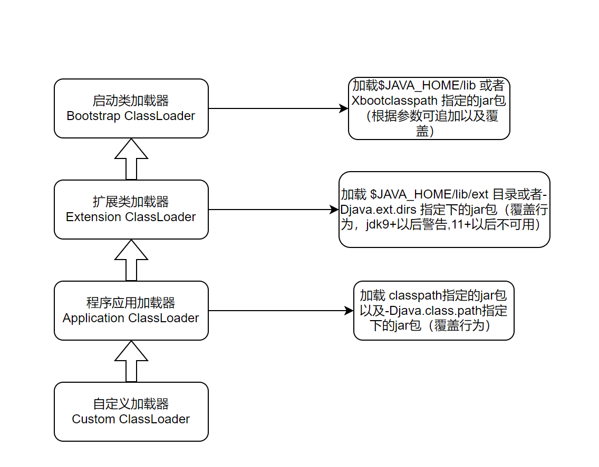

## 类加载机制

1. 加载：加载class文件，将二进制流的静态结构生成方法区的运行时数据结构，在堆内生成java.lang.Class对象。
2. 链接：
   - 验证：文件格式验证，元数据验证，字节码验证，符号引用验证。
   - 准备：为类静态变量分配内存并赋予默认值。
   - 解析：将常量池内的符号引用转化为直接引用。
3. 初始化：执行类构造器方法`<clinit>`方法。

## 运行时数据区

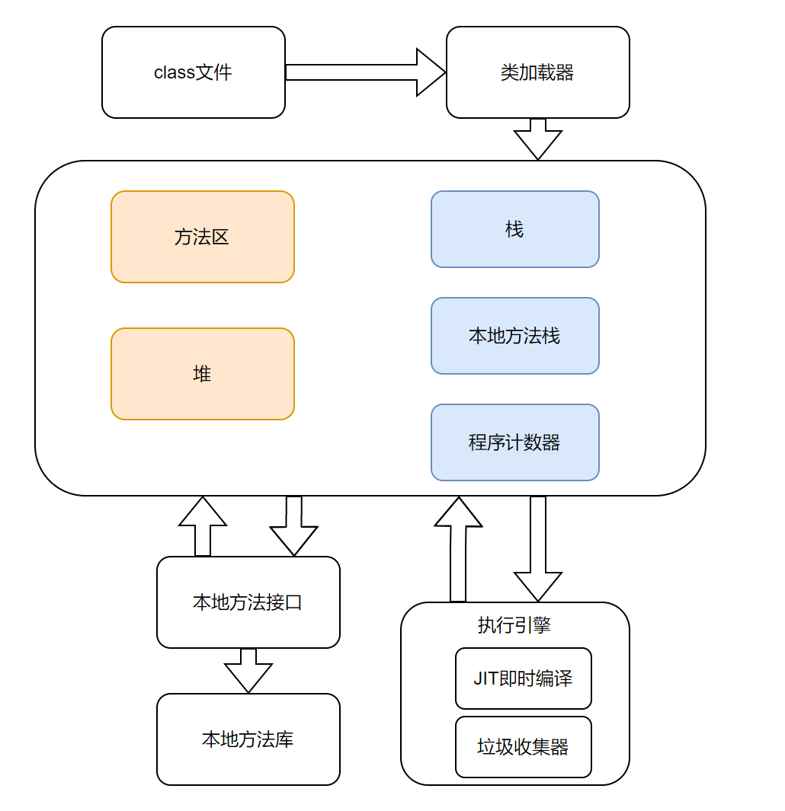

- 程序计数器：用于线程切换后还原现场。

- 栈：以栈帧为基本单位存储。栈帧结构为：局部变量表，操作数栈，动态链接，方法返回地址，附加信息。

  > 动态链接的作用：将符号引用转换为直接引用

- 本地方法栈：管理本地方法调用。

- 方法区：存放类信息，域信息，方法信息，静态变量，运行时常量池，JIT代码缓存。jdk8以后，字符串常量池和静态变量放到了堆中。

- 堆：java内存管理的核心区域。

## 垃圾收集器

### 根可达性算法

GCRoot有哪些：系统类，虚拟机栈中局部变量，jni指针，活跃线程，静态变量，同步锁。

### 垃圾收集算法

1. 标记清除算法

2. 拷贝算法

3. 标记整理（压缩）算法

### 垃圾收集器

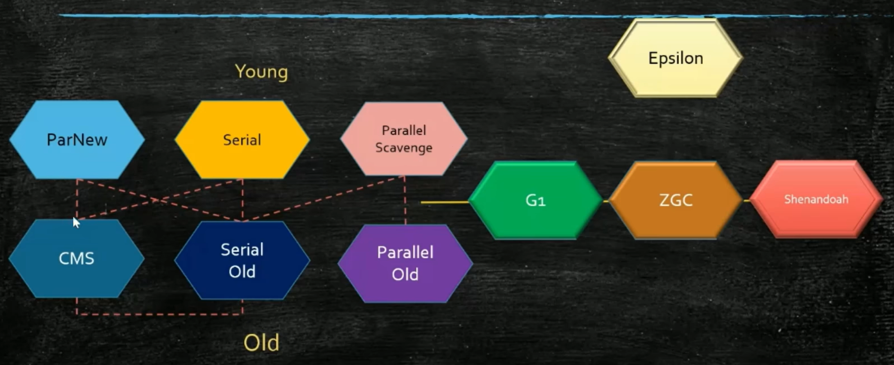

### CMS垃圾收集器

垃圾清理过程：初始标记->并发标记->重新标记->并发清理

CMS并发标记使用三色标记算法(增量更新)(黑色：所有feiled标记完，灰色：标记了一部分,白色：未标记)，并使用增量更新(屏障：在黑色指向白色时把黑色置灰)处理漏标问题。

> CMS解决方案因为存在Bug,所以引入重新标记。

### G1三色标记算法

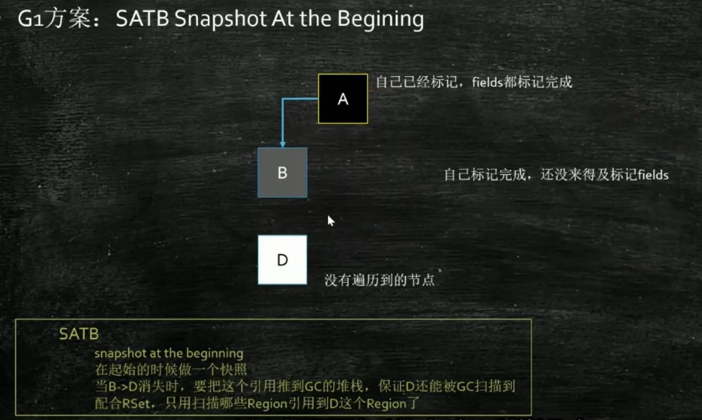

> 基于RSet实现SATB解决方案

## 什么时候回发生垃圾回收

1. 自动回收: eden区或者s区不够用 触发yang gc;老年代空间不够用触发full gc; 方法区空间不够用触发full gc。
2. 手动回收： system.gc(),下发full gc命令，由jvm确定gc时间。

## 方法区与持久代以及元数据区的关系

方法区：虚拟机定义的规范。

持久代与元数据区（元空间）是方法区的具体实现，持久代：jdk1.7之前的实现，存放在堆空间里边; 元数据区：jdk1.8以后的实现，使用直接内存。

# Java基础

## Java中线程实现方式

1. 继承Thread类。
2. 实现Runnable接口。
3. 实现Callable重新call方法。
4. 基于线程池构建线程。

所有的方法都最终通过实现runnable接口。

## Java中线程的状态

操作系统把线程分为这几种状态

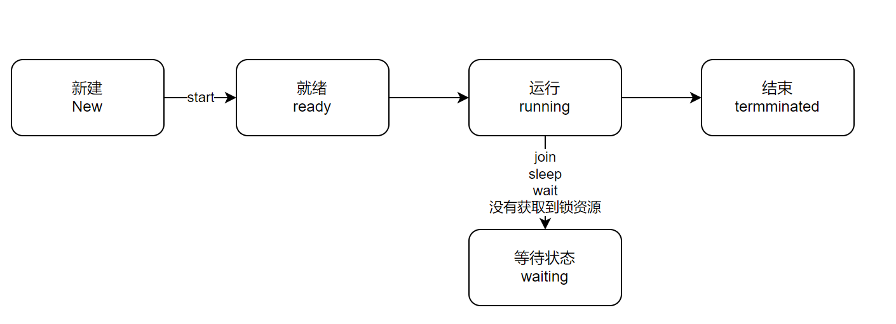


Java虚拟机设置状态为6种

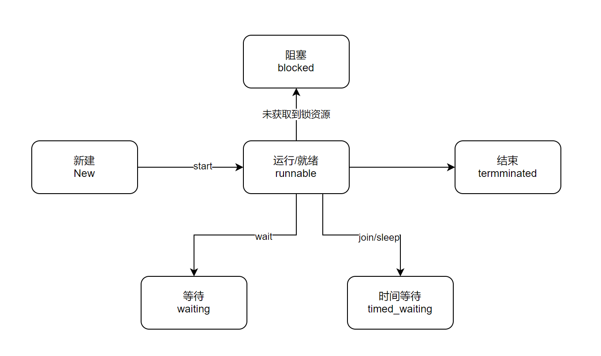

## Java中如何停止线程

1. 设置退出标志位
2. interrupt
3. stop已经弃用

## 并发编程三大特性

1. 原子性  一个线程正在执行时，不受其他线程影响

   synchronized,CAS,Lock锁，ThreadLoacl(通过线程独享变量控制不受影响)

2. 可见性 去除CPU缓存与主内存不一致。

   volatile,synchronized(加锁时同步数据),lock,final

3. 有序性

   ```txt
   在并发环境下，由于以下原因可能被破坏：
        * 1. 编译器优化重排序
        * 2. 处理器指令级并行重排序  
        * 3. 内存系统重排序
   ```

   **Java解决方案**：happens-before规则和内存屏障

   **关键工具**:最终使用volatile

## CAS有什么优缺点

CAS是一条CPU操作原语，如果预期值与内存值一致，则替换。

优点：避免线程挂起时，用户态到内核态的切换。

缺点：ABA问题->通过添加版本号的方式解决；自旋时间过长，导致长时间占用CPU->1.指定CAS次数（自旋锁），2.可以在CAS失败后暂存，参考（LongAdder）

## Java四种引用类型

1. 强引用 不回收
2. 软引用 内存不够则回收
3. 弱引用 发现即回收
4. 虚引用 不能单独使用，必须和引用队列联合使用。用于跟踪对象被垃圾回收状态。

## ThreadLocal的内存泄漏问题

**ThreadLocal实现原理**

1. Thread内部存在一个ThreadLocalMap去存储数据。
2. ThreadLocal本身不存储数据，通过操控ThreadLocalMap去修改数据。
3. ThreadLocalMap本身基于Entry[]实现，以存储多个数据。
4. ThreadLocalMap以ThreadLocal本身作为key,其中key是一个弱引用，对value存取数据。

**ThreadLocal内存泄漏问题**

1. key的内存泄漏通过弱引用解决。
2. value的内存泄漏需要线程调用结束后remove。

# 多线程

## 多线程使用场景和注意事项

### 使用场景

1. io密集型操作，主要处理异步请求。
2. CPU密集型操作，主要处理并行计算。
3. 处理高并发请求。
4. 定时任务和后台任务。

### 注意事项

1. 对于唯一性资源，保证竞争条件。
2. 多线程变量可见性。
3. 预防死锁。
4. 性能监控和调优。

## 常见的多线程集合以及实现原理

1. concurrentHashMap **数组 + 链表 + 红黑树**
2. CopyOnWriteArrayList 读多写少的场景
3. ConcurrentLinkedQueue 基于无锁算法（CAS） 实现的非阻塞线程安全队列

## synchronized 的原理是什么？

添加synchronized关键字后，jvm底层执行命令时会使用moniterenter 和moniterexit 指令标记同步代码块。C++底层使用 ObjectMoniter中的_owner属性通过CAS的方式置为当前线程。

没有获取到锁的线程会放到 _cxq 或 _EntryList中等待唤醒。

## 什么是可重入性,为什么说synchronized是可重入锁？

可重入性：获取到锁的线程对同一个锁是否可以再次获取。

ObjectMoniter中使用_recusions来记录重入次数。

worker 继承AbstractQueuedSynchronizer 实现了一些锁机制，为不可重入锁。

## 为什么synchronized 是悲观锁

synchronized 会经历 无锁->偏向锁->轻量级锁->重量级锁 一系列锁升级的过程。当出现单线程无竞争获取锁时，升级为偏向锁。出现多线程轻微竞争，通过CAS自旋能够解决时为轻量级锁。竞争激烈或者调用wait()/notify()方法时会触发重量级锁。JDK15以后，默认禁用自旋锁。

## 乐观锁实现原理

基于CPU支持的原语配合lock指令来实现。java中Unsafe类封装了一系列compareAndSwap方法。

## 谈谈AQS框架是怎么回事

AQS是java中的一个抽象类，很多JUC下边的类基于AQS实现锁的功能。

AQS中有三个重要属性：

1. state,int类型，用来记录锁的状态。
2. head和tail属性，Node类型，用来维护一个同步队列，获取资源失败后的同步队列。
3. ConditionObject类中维护一个单向链表，实现条件队列。给lock锁的实现，当线程执行await/signal方法时，将线程放到单向链表中等待唤醒。

## 对比synchronized和ReentrantLock的区别

- ReentrantLock 是基于AQS实现的一个类，synchronized是基于c++底层ObjectMonitor对象实现的关键字，都是JVM层面的互斥锁。
- ReentrantLock比synchronized功能更全面，可以实现公平锁与非公平锁，指定获取锁资源的时间。
- ReentrantLock出现异常需要手动释放锁，synchronized会自动释放锁资源。

## 聊一下ConcurrentHashMap的扩容是怎么实现的

ConcurrentHashMap 在达到扩容因子(0.75)或链表长度为8并且table.leng<64会触发扩容。

> 链表长度为8并且table.leng>=64会转换为红黑树。

1. 生成扩容标识戳，保证多线程协助扩容时的唯一性以及记录信息。
2. 计算迁移步长。
3. 创建新的数组。
4. 领取迁移任务。
5. 迁移数据到新数组。
6. 最后一个完成迁移的线程检查老数组，查询是否有遗漏的数据。

## ConcurrentHashMap的红黑树中为什么要保留一套双向链表

1. 当红黑树结构发生变化时（发生旋转），保证读操作不阻塞。
2. 扩容时使用双向链表迁移数据。

# 线程池

## 线程池处理任务发生异常时，出现异常会发生什么

1. 通过execute执行任务时，会捕获异常并记录，然后抛出异常。因为Runnable中没有异常处理，因此run方法异常结束，线程结束。
2. 通过submit执行任务时，ThreedPoolExecutor会把任务封装成FutureTask执行,FutureTask会记录异常到outcome中，方法正常结束。

## 线程池的核心参数

1. corePoolSize 核心工作线程数
2. maximumPoolSize  最大工作线程数
3. keepliveTime  工作线程存活时间
4. unit 工作线程存活时间单位
5. workQueue  工作队列
6. threadFactory  构建工作线程
7. RejectedExecutionHandler 拒绝策略

## RejectedExecutionHandler 有哪些

1. AbortPolicy  抛异常
2. CallerRunsPolicy 交给调用线程处理
3. DiscardPolicy  丢弃，什么也不做
4. DiscardOldestPolicy 丢弃队列中最早的任务，并尝试交给线程池处理

## 线程池的状态

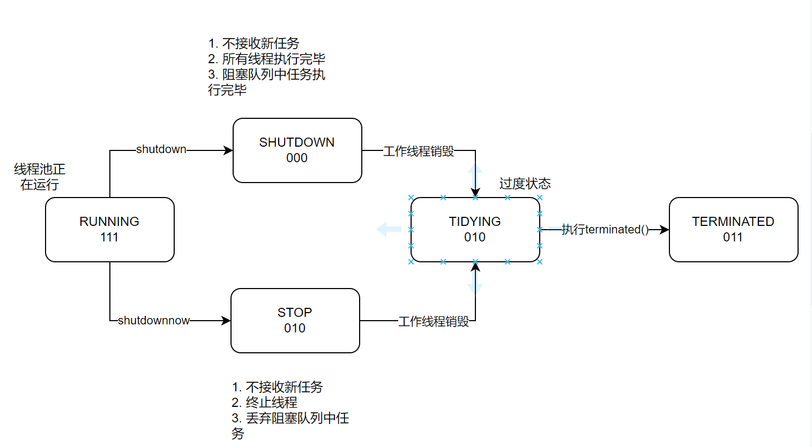

## 线程池执行流程

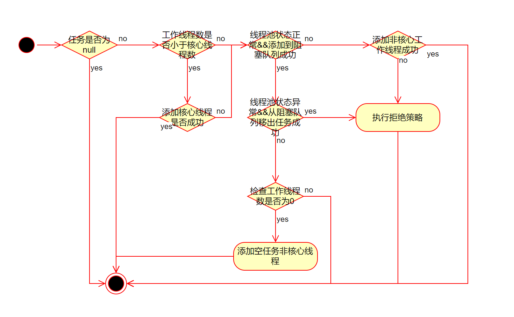

## 线程池添加工作线程的流程

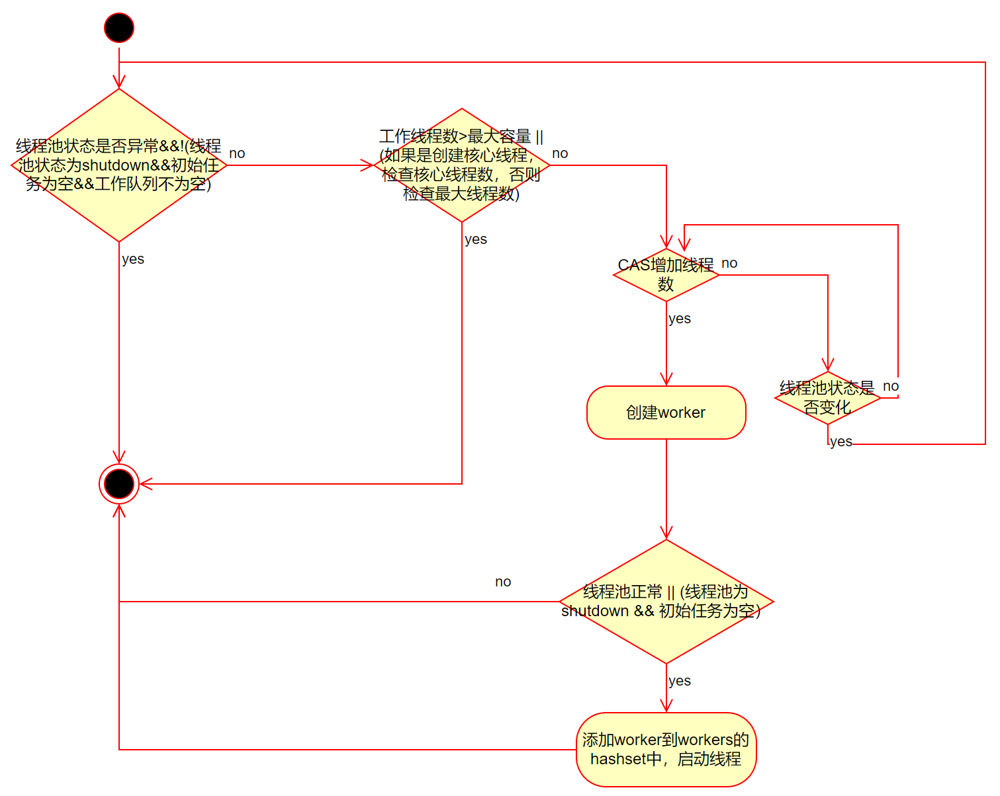

## 线程池为什么要构建空任务的非核心线程

为了处理阻塞队列有任务但是没有工作线程的情况。

1. 核心线程数为0。
2. 修改核心线程运行超时为true后，没有核心线程。

## 线程池使用完毕为什么使用shutdown()方法

避免内存泄漏

1. 核心线程正在运行导致内存泄漏。
2. 核心线程存活导致threadPoolExecutor的内存泄漏。

shutdown方法的作用

1. 设置线程池状态为shutdown,让未阻塞线程结束gettask方法。
2. 调用interruput方法唤醒阻塞线程,结束gettask方法。

## 线程池的核心参数怎么设置

对于cpu密集型建议初始设置为n+1;io密集型 cpuCores * (1 + 平均IO等待时间)推荐为2N。实际业务场景中需要做好压测以及监控，动态修改coreSize的个数。

# Spring

## 什么是Spring框架，包含哪些模块

一个javaee轻量级框架，核心包括IOC容器，AOP以及数据访问/集成。

主要包含七大模块：**核心容器 (Core Container)**、**数据访问/集成 (Data Access/Integration)**、**面向切面编程 (AOP)**、**Web 模块**、**消息传递 (Messaging)**、**测试 (Test)** 和 **工具类 (Instrumentation)**

## Spring有哪些优点

轻量性框架、依托IOC实现松耦合、通过AOP能够让业务逻辑和系统的服务分隔、MVC框架能够更好的集成Web应用，对于事务管理和异常处理都有便捷的方式。

## 什么是控制反转(IOC)，什么是依赖注入

控制反转是一种设计思想，将对象的依赖交给外部调用者或者框架。

依赖注入是控制反转的实现方式，将对象创建和绑定的过程从对象内部转移到了对象外部。

## 谈下对于Spring IOC的理解

Spring将对象的创建和生命周期交给Spirng容器管理，只需要在配置文件中配置好对象，就可以在需要的地方通过Spring容器来使用。

spring ioc容器的创建过程

1. 创建BeanFactory和BeanDefinitionReader,读取配置信息加载bean对象(obtainFactory)
2. BeanFactory属性设置（prepareFactory） 对 `BeanFactory` 进行标准配置，包括设置类加载器、表达式解析器、属性编辑器注册器等。
3. BeanFactory后置处理（postBeanFactory）
4. 执行所有BeanFactoryPostProcessor和BeanDefinitionRegistryPostProcessor（invokeBeanFactoryProcess）
5. 注册BeanPostProcessor（registerBeanPostProcessors）
6. 通过反射将beanDefinition对象实例化为bean对象
7. 初始化bean对象并生成完整的bean对象

## 描述bean的生命周期

1. 通过反射实例化bean，createBeanInstance()
2. 填充bean的属性,populateBean()
3. 调用aware相关接口,invokeAwareMethod()
4. BeanPostProcesser前置处理,applyBeanPostProcessorsBeforeInitialization()
5. 检查是否实现InitializingBean接口，调用afterPropertiesSet()方法
6. 调用init-method方法，invokeCustomInitMethod()
7. BeanPostProcesser后置处理，applyBeanPostProcessorsAfterInitialization()
8. 使用bean对象
9. 是否实现DisposableBean接口，调用destory()方法
10. 是否配置自定义destory-method

> registerDisposableBeanIfNecessary 检查是否需要注册destory方法，在initializeBean方法之后

## Spring 自动装配的各种模式

1. no：不进行自动装配
2. byName: 通过名称自动装配
3. byType: 通过类型自动装配
4. constructor: 通过构造器自动装配
5. autodetect: 有构造器通过constructor装配，没有则通过byType

## BeanFactory 和 ApplicationContext的区别

1. BeanFactory通过延迟加载，只有使用时才会加载bean,如果没有正确配置bean,可能会报运行时异常；Application提前加载所有Bean对象。
2. BeanFactory以编程的方式创建，ApplicationContext可以通过编程和声明创
3. ApplicationContext继承自BeanFactory接口，不仅提供BeanFactory的所有功能，还提供更多的功能（国际化支持，事件发布与监听，资源访问）。

## 谈一下对于SpringAop的理解

1. aop的应用场景

   | 场景         | 核心价值                   | 常用注解/实现                  |
   | :----------- | :------------------------- | :----------------------------- |
   | **日志记录** | 统一日志格式，无侵入式日志 | `@Around`, `@Before`, `@After` |
   | **事务管理** | 声明式事务，简化代码       | `@Transactional`               |
   | **性能监控** | 方法执行时间，调用统计     | `@Around`, Metrics             |
   | **权限控制** | 统一权限校验               | `@Before`, 自定义权限注解      |
   | **缓存管理** | 方法结果缓存，缓存失效     | `@Around`, `@After`            |
   | **参数校验** | 统一参数验证               | `@Before`                      |
   | **重试机制** | 失败自动重试               | `@Around`, 自定义重试注解      |
   | **限流熔断** | 流量控制，系统保护         | `@Around`                      |
   | **数据脱敏** | 敏感信息保护               | `@AfterReturning`              |
   | **版本控制** | API 版本管理               | `@Around`                      |

2. 切面：将多个类的通用行为封装为可重用的模块。

3. 通知：@Before,@Around,@After,@AfterReturning,@After-Throwing

4. 切入点：一个或一组连接点，通知将在这些地方执行。

5. 织入：将切面应用到目标对象，从而创建代理对象的过程。Spring 在**运行时**完成织入。

## 五种通知的执行顺序

正常情况：@Around中proceed()之前的部分-> @Befor -> 目标方法 -> @AfterReturning -> @After ->@Around中proceed()之后的部分

异常情况：@Around中proceed()之前的部分->@Befor->目标方法抛出异常-> @AfterThrowing->@After -> (@Around中proceed()之后的部分,如果 proceed() 被 try-catch，则执行)

多个切面（A order=1, B order=2）: A@Aroud前置-> A@Before -> B@Aroud前置 -> B@Before -> procced -> B@AfterReturing -> B@After -> B@Aroud后置 -> A@AfterReturing -> A@After -> A@Aroud后置

## Spring用到了哪些模式

1. 单例模式
2. 工厂模式（BeanFactory)
3. 代理模式
4. 模板方法模式（JDBCTemplate,RestTemplate）
5. 适配器模式（SpringMVC中HandlerAdapter）
6. 装饰器模式（HttpServletRequestWrapper）
7. 观察者模式（ApplicationListener）
8. 责任链模式（filter过滤器）

## @Autowired和@Resource的区别

共同点：@Autowired和@Resource都可以通过属性和setter方法注入依赖。

区别：

1. @Autowired是spring提供的注解，@Resource是java自带注解。

2. @Autowired默认通过byType注入，如果需要byName的方式，需要使用@Qualififler注解。

   @Resource默认通过byName注入，可以使用byName和byType注入。

> @Resource如果同时使用name和type,会寻找唯一匹配的bean装配，找不到则抛异常。

## 谈谈你对循环依赖的理解

1. 自循环依赖
2. 互相循环依赖
3. 多组循环依赖

> 构造器注入无解，设值注入提前暴露依赖

## Spring 如何解决循环依赖

Spring 只支持设值注入的单例循环依赖，使用三级缓存解决循环依赖。

- 一级缓存singletonObjects，存放已经实例化和初始化完成可用bean。
- 二级缓存earlySingletonObjects，存放已经实例化但未初始化的bean。
- 三级缓存singletonFactories，存放ObjectFactory工厂。

三级缓存主要处理AOP代理对象的问题，没有三级缓存能解决循环依赖的问题。

## Spring 支持几种作用域

1. prototype,原型
2. singleton,单例
3. request,为每一个网络请求创建一个实例
4. session,为每一个session创建一个实例
5. global-session,与portlet相关。

## Spring 事务隔离级别

隔离发生的问题：

1. 脏读，读取到另一个事务未提交的数据。
2. 不可重复读，在同一个事务中，多次读取同一数据，得到的结果不一致。这是因为在两次读取之间，其他事务**修改并提交**了该数据。
3. 幻读，在同一个事务中，多次执行相同的查询，**结果集的行数**发生变化。

Spring 支持的隔离级别

| 隔离级别         | 描述                                                      |
| :--------------- | :-------------------------------------------------------- |
| DEFAULT          | 使用数据库默认的隔离级别，oracle,读已提交；mysql,可重复读 |
| READ_UNCOMMITTED | 读未提交，最低隔离级别，一切皆有可能                      |
| READ_COMMITTED   | 读已提交，避免脏读                                        |
| REPEATABLE_READ  | 可重复读，避免脏读、不可重复读                            |
| SERLALIZABLE     | 串行化，避免所有问题                                      |

## Spring 事务传播行为

| 事务行为                 | 说明                                                       |
| ------------------------ | ---------------------------------------------------------- |
| PROPAGATION_REQUIRED     | 支持当前事务，如果没有事务，则新建一个事务                 |
| PROPAGATION_SUPPORTS     | 支持当前事务，如果没有事务，则以非事务方式运行             |
| PROPAGATION_MANDATORY    | 支持当前事务，如果没有事务，则抛出异常                     |
| PROPAGATION_REQUITES_NEW | 新建事务，假设当前存在事务，则挂起当前事务                 |
| PROPAGATION_NOT_SUPPORTS | 以非事务方式运行，假设当前存在事务，则挂起当前事务         |
| PROPAGATION_NENVER       | 以非事务方式运行,假设当前存在事务，则抛异常                |
| PROPAGATION_NESTED       | 如果当前存在事务，则嵌套执行，如果没有事务，则新建一个事务 |

## Spring 事务问题

Spring 有个bean对象，方法a和方法b, a方法中有事务，调用b,那么b中有事务吗？

| 调用方式                    | b 方法是否有事务 | 原因             |
| :-------------------------- | :--------------- | :--------------- |
| **this.b()** (直接调用)     | ❌ **没有事务**   | AOP 代理机制失效 |
| **self.b()** (注入自身代理) | ✅ **有事务**     | 通过代理调用     |
| **@Transactional 注解位置** | 影响生效范围     | 注解的继承性     |

## Spring中事务的本质是什么？

Spring 中事务的本质是基于Spring的AOP代理能力，对数据库事务的能力进行封装。Spring将数据库连接保存到ThreadLocal中，保证一个线程中多个map和dao使用同一个连接。

## BeanFactoryPostProcessor和BeanPostProcessor的区别

BeanFactoryPostProcessor 作用于 BeanDefinition，在 Bean 实例化之前执行，用于修改 Bean 的元数据。

BeanPostProcessor 作用于 Bean 实例，在 Bean 初始化前后执行，用于增强或包装 Bean，例如 AOP 代理。

两者最大的区别是处理阶段不同，一个**操作定义**，一个**操作实例**。

| 对比点       | BeanFactoryPostProcessor | BeanPostProcessor |
| ------------ | ------------------------ | ----------------- |
| 处理对象     | BeanDefinition           | Bean实例          |
| 执行时机     | 实例化之前               | 实例化之后        |
| 能否操作实例 | ❌                        | ✅                 |
| 能否改元数据 | ✅                        | ❌                 |
| 是否参与 AOP | ❌                        | ✅                 |
| 典型场景     | 解析配置                 | 创建代理          |

## SpringMVC的理解

springMVC的结构图

```
客户端请求
     ↓
DispatcherServlet
     ↓
HandlerMapping（找谁处理）
     ↓
HandlerAdapter（怎么调用）
     ↓
Controller
     ↓
ViewResolver
     ↓
返回响应
```

执行流程

1. 请求进入 DispatcherServlet

   DispatcherServlet 初始化时会加载所有 Spring MVC 配置：

   - HandlerMapping
   - HandlerAdapter
   - ViewResolver
   - HandlerInterceptor
   - MessageConverter

2. HandlerMapping 查找处理器，返回值包括Handler（Controller 方法）以及Interceptor链

3. 执行 HandlerInterceptor preHandle 链

4. HandlerAdapter 调用 Controller

   - 参数解析

   - 调用执行controller方法

   - 返回值处理

     > 根据方法返回类型调用 HandlerMethodReturnValueHandler：String → 走 ViewResolver、对象 → 走 HttpMessageConverter → JSON、ModelAndView → 直接渲染

5. 执行 postHandle 链

6. 渲染视图（ViewResolver），如果有 @RestController 或 @ResponseBody，走httpmessageConverter作转换。

7. 执行 afterCompletion 链

SpringMVC 是一个基于 Servlet 的 Web 框架，核心是 DispatcherServlet 前端控制器。
请求进入后通过 HandlerMapping 找到对应的 Controller 方法，再由 HandlerAdapter执行。
在执行过程中通过参数解析器（HandlerMethodArgumentResolver）完成数据绑定，通过消息转换器（HttpMessageConverter）实现 JSON 转换。
执行完成后通过视图解析器或消息转换器生成响应。
整体采用适配器、策略等设计模式，实现高度解耦和可扩展性。

## @RequestBody 原理

@RequestBody 本质是通过 HandlerMethodArgumentResolver 解析方法参数，在解析过程中会调用 HttpMessageConverter 读取请求体并将 JSON 转为 Java 对象。

## 拦截器 vs 过滤器

| 对比                 | 过滤器 Filter             | 拦截器 Interceptor |
| -------------------- | ------------------------- | ------------------ |
| 规范                 | Servlet 规范              | Spring 提供        |
| 作用范围             | 所有请求                  | 只拦截 SpringMVC   |
| 执行顺序             | 在 DispatcherServlet 之前 | 在 Controller 前后 |
| 能否操作 Spring Bean | 不方便                    | 可以               |

过滤器更底层，属于 Servlet 规范；

拦截器属于 SpringMVC 框架内部，主要用于业务层控制，比如权限校验。

## DelegatingFilterProxy的理解

DelegatingFilterProxy 是一个特殊的 Filter，它本身由 Servlet 容器管理，但会把请求转发给 Spring 容器中的某个 Filter Bean 执行。
它解决了 Servlet Filter 无法直接注入 Spring Bean 的问题。
在 Spring Security 中，它会代理 springSecurityFilterChain 这个 Bean，从而构建完整的安全过滤器链。

# SpringBooot

## SpringBoot 自动装配原理

SpringBoot 自动装配的核心是 @EnableAutoConfiguration。

它通过 AutoConfigurationImportSelector 读取 META-INF 下的自动配置类列表，然后根据条件注解进行筛选，最终将满足条件的配置类注册到 Spring 容器中，从而实现按需装配。

## SPI和自动装配的区别

SPI 是一种服务发现机制，通过读取 META-INF/services 下的配置文件加载接口实现类；
SpringBoot 自动装配是通过 @EnableAutoConfiguration 导入自动配置类，并结合条件注解按需注册 Bean。自动装配借鉴了 SPI 的思想，但增加了条件判断、Bean 注册和生命周期管理，是更高级的扩展机制。

## SpringFactoriesLoader机制

SpringFactoriesLoader 是 Spring 提供的一个 SPI 扩展加载机制，用于从 META-INF/spring.factories 文件中加载指定接口的实现类。
Spring Boot 通过它加载自动装配类、监听器、初始化器等。
它的核心流程是读取所有 jar 中的 spring.factories 文件，解析为 Map，再根据接口名找到实现类并反射实例化。

## import注解的理解

@Import 用于向容器中导入额外的组件或配置类，本质是注册 BeanDefinition。它支持导入普通类、配置类、ImportSelector（selectImports方法） 和 ImportBeanDefinitionRegistrar （registerBeanDefinitions方法）。Spring Boot 自动装配底层就是通过 ImportSelector 实现的。Import 在配置类解析阶段由 ConfigurationClassPostProcessor 处理。

## DeferredImportSelector 原理

DeferredImportSelector 是 ImportSelector 的一种延迟实现方式，它不会在解析到 @Import 时立即执行，而是等所有 @Configuration 类解析完成之后统一执行。

Spring Boot 的自动装配就是通过 DeferredImportSelector 实现的，目的是保证用户自定义配置优先注册，确保 @Conditional 条件判断的准确性。

# Nacos注册中心

## 如何设计一个注册中心

1. 高可用，可以用CP或者AP，常见的是AP模式。
2. 服务注册，服务发现，服务探活，服务下线。
3. 服务订阅和推送（不是必须的）

## Nacos1.x作为注册中心的原理

- g高可用：Nacos 1.x的核心原理是基于Distro协议的AP架构。
- 服务注册：它通过分片写的设计保证了注册的高并发，通过异步复制实现最终一致性。
- 服务探活和下线：采用5秒心跳+15秒不健康+30秒剔除的机制。
- 服务发现：采用UDP推送保证实时性，同时用10秒定时拉取兜底。这种设计在保证高可用的前提下，很好地平衡了数据一致性和性能，但缺点就是1.x的HTTP短连接在大规模场景下开销较大，而2.x的gRPC长连接正好优化了这点。

## nacos服务领域模型

- Namespace: 环境隔离或租户隔离。
- Group: 逻辑上的业务模块划分。
- Service: 最核心的业务概念，直接对应开发者在代码中定义的微服务。
- Cluster: 实现更细粒度的路由和容灾。
- Instance: 最底层的元素，代表一个真实的、提供服务的IP地址和端口。

## Nacos的Distro协议

Nacos中的Distro协议是其处理临时实例的AP型一致性协议。它的核心特点是**去中心化**和**最终一致性**。
在写请求上，它采用**分片机制**，每个实例只有其**责任节点**才能处理写操作，避免了冲突；写入成功后通过**异步任务**批量同步给其他节点。
在读请求上，得益于异步复制，所有节点都能**本地读取**全量数据，性能极高。
此外，节点间还会通过**周期性的数据校验**实现自我修复。
这种设计完美适配了注册中心对**高可用**和**高并发读**的需求，但代价是允许极短暂的数据不一致。

## 配置中心选型

| 特性维度          | **Spring Cloud Config**                  | **Apollo**                                        | **Nacos**                          | **K8s ConfigMap**                       |
| :---------------- | :--------------------------------------- | :------------------------------------------------ | :--------------------------------- | :-------------------------------------- |
| **实时推送**      | 需集成Spring Cloud Bus和消息队列才能实现 | **原生支持**，基于HTTP长轮询，秒级生效            | **原生支持**，基于长连接，实时性高 | 不支持，需配合工具（如Reloader）重启Pod |
| **版本管理/回滚** | 依赖Git，回滚即Git回滚                   | **界面化支持**，可视化一键回滚                    | **界面化支持**，可视化一键回滚     | 依赖Yaml版本管理，回滚较原始            |
| **权限/审计**     | 弱（依赖Git权限）                        | **强**，企业级，有完善的操作审计和权限控制        | 较强，支持命名空间和角色权限       | 弱（依赖K8s RBAC）                      |
| **多环境/多集群** | 通过Git分支管理，不够直观                | **强**，通过Namespace和Cluster抽象，管理清晰      | **强**，通过Namespace和Group隔离   | 通过Namespace隔离，管理相对分散         |
| **配置格式**      | 文件（Properties/Yaml）                  | **支持**Properties、XML、Yaml、JSON等多种格式     | **支持**多种格式                   | 文件或环境变量                          |
| **多语言支持**    | 主要面向Java                             | 主流语言均有SDK，提供HTTP API                     | 主流语言均有SDK，提供HTTP API      | 任何运行在K8s的应用均可使用             |
| **依赖与复杂度**  | 轻量，但需自建监控告警                   | 功能丰富，组件较多（Portal、Admin、Config），较重 | 轻量，注册中心和配置中心一体化     | 与K8s强绑定，无外部依赖                 |
| **数据一致性**    | Git的强一致性                            | **准强一致**，内部有数据库保证                    | **AP型**（最终一致），适合配置管理 | **强一致**（基于Etcd）                  |

## Nacos1.x配置中心的长轮询机制

客户端发起一次可能长达30秒的HTTP请求，服务端在29.5秒内如果发现配置变更，就立即返回；如果一直没变，则在第29.5秒返**无变更**。

## Nacos配置中心的配置优先级

优先级从低到高是 shared-configs、extension-configs、默认 DataId、profile DataId。同时远程配置通常高于本地 application.yml。

## Nacos2.x的探活机制

服务端会启动一个**每3秒**执行一次的定时任务，扫描所有**超过20秒**未通过该连接进行任何通信的客户端。对于这些**静默**客户端，服务端会主动发送一个 **`ClientDetectionRequest`** 探测请求。如果客户端在**1秒内**成功响应，则连接和其注册的服务被视为健康；否则，服务端会认为连接已失效，并执行 `unregister` 操作，移除该连接及其下所有注册的临时实例。

## Ribbon怎么实现不同服务的不同配置

为不同服务创建不同的上下文。内部维护一个ConcurrentHashMap来存储服务和上下文的对应关系。

## Ribbon的属性配置和类配置优先级

**类配置（Java代码）的优先级要高于属性配置（配置文件）**

## feign的性能优化

Feign 默认使用 JDK 的 `HttpURLConnection`，**不支持连接池**，每次请求都会新建和关闭连接，导致大量 TIME_WAIT，性能较差。推荐替换为 **Apache HttpClient** 或 **OkHttp**，它们支持连接池、超时控制和更高效的 IO。

## feign怎么实现认证传递

使用 RequestInterceptor 传递 Token。如果使用了Hystrix或Sentinel且线程池隔离，`RequestContextHolder` 会丢失上下文。此时需要手动传递 Token。

## sentienl中使用的限流算法

1. 滑动窗口计数，减少固定窗口计数的边界问题。
2. 漏斗算法，恒定速率流出（处理任务）。
3. 令牌桶算法，恒定速率流入（生成令牌）。

## sentienl服务的熔断过程

1. 熔断器关闭：服务正常调用。
2. 熔断器打开：服务异常，调用fallback方法。
3. 熔断器半开：熔断到达熔断恢复的时间后，允许少量请求调用服务并监测成功率。

## 在GateWay中怎么实现服务的平滑迁移

- **简单金丝雀发布** → 权重路由。
- **需要按用户或请求内容区分** → 结合服务发现元数据和自定义断言。
- **频繁调整** → 配置中心 + 动态刷新。

# 分布式

## 分布式幂等性怎么设计。

1. 采用乐观锁 版本号或者状态机。
2. 采用去重表：数据库采用唯一索引做数据去重，基于redis的setnx命令。
3. 用token机制防止重复提交。
4. 分布式锁保证业务的原子性。

## 什么是二阶段提交协议（2PC）

一种预提交的策略。

1. 准备阶段
   - 协调者向所有参与者节点发起准备提交事务的请求。
   - 所有节点开始执行事务，做好undo和redo日志，并不真正提交事务。
   - 返回执行的结果。
2. 提交/回滚阶段
   - 协调者根据所有节点的执行情况，如果都成功则发出yes指令，所有节点提交事务；如果有节点失败，则发出no指令，所有节点开始回滚。

优点：便于理解，强一致性。

缺点：

1. 同步阻塞，一阶段开始到二阶段完成前，一直占用连接。
2. 单点故障，协调者宕机导致服务不可用。
3. 数据不一致，二阶段出现部分参与者收到指令时会出现数据不一致。

## 什么是补偿型事务

追求最终一致性，在事务失败后撤销之前操作所带来的影响，TCC就是常见的实现模式。

1. **Try（预留）**：尝试执行业务，完成所有业务检查，并预留好必要的资源。
2. **Confirm（确认）**：如果所有参与者的 Try 都成功了，就执行 Confirm。这个操作通常不做检查，直接使用 Try 阶段预留的资源来完成最终业务。
3. **Cancel（取消）**：如果任何一个参与者的 Try 失败，就会执行 Cancel，释放 Try 阶段预留的资源。

**优点**

- **性能更好**：每个小事务执行完就提交，释放资源，不会像二阶段提交那样长时间锁定资源，更适合高并发场景。
- **高可用**：协调者如果挂了，由于事务已经提交，数据不会丢，只是暂时没补偿，恢复后可以继续执行补偿。

**缺点**

- **开发复杂**：需要为每个操作编写正向和反向的补偿逻辑。
- **弱一致性**：在补偿完成前，会有一段短暂的数据不一致时间窗口。

## 如何用消息队列实现分布式事务

属于最终一致性的方案，**利用本地事务和消息发送的原子性，确保业务操作和消息发送要么同时成功，要么同时失败。**

1. 本地消息表方案

   开启本地事务->执行本地业务->插入本地消息表->提交/回滚事务->定时任务发送消息到消息队列->消费者消费->处理消费者业务->更新本地消息表。

   > 如果消费者业务处理失败，只能通过补偿机制处理。

2. 事务消息方案

   依赖特定的mq执行，比如**RocketMQ**事务消息。

## 分布式id生成有几种方案

1. uuid  
   - 本地生成，性能高；  
   - 无序，长度过长；
2. 数据库自增id
   - 简单，严格有序
   - 单点瓶颈，并发低
3. 批量生成id
   - 提高了性能，趋势递增
   - 需要维护号段服务，有DB依赖
4. redis生成id
   - 并发高，有序
   - 需考虑持久化与组件高可用
5. 雪花算法
   - 内存生成，高性能，趋势递增
   - 需解决时钟回拨和机器ID配置

## 常见的负载均衡算法

1. 轮询 无状态应用，配置相同
2. 加权轮询 无状态应用，配置异构
3. 随机  在请求量足够大的情况下，随机算法的分布趋近于加权轮询。
4. 最少连接数/加权最少连接数 长连接的应用（文件上传下载）
5. 一致性hash 常见的有ip地址，hash有状态的服务、session会话保持、分布式存储

## 数据库如何处理大数量

- 首先考虑进行索引优化、加入缓存以及使用读写分离的模式来分摊压力。
- 如果数据量过大（超过两千万），再考虑做分表以及分库。
- 对于数据查询较少的，可以采用冷热数据分离或者分区的形式。
- 对于高并发写入，可以考虑noSql数据库（HBase）

## 什么是CAP定理

CAP定理是分布式系统设计的基石，它指出一个分布式系统在**一致性（Consistency）**、**可用性（Availability）**和**分区容忍性（Partition tolerance）**这三者之间，最多只能同时满足两个。实际上由于网络的分区一直存在，因此，现在的分布式系统为AP或者CP模型。

## 场景的CP和AP组件

| **AP** | Eureka、Nacos（AP模式）、Cassandra、CouchDB、Riak、Redis（异步复制）、Kafka（acks=1） |
| ------ | ------------------------------------------------------------ |
| **CP** | ZooKeeper、etcd、Consul、HBase、MongoDB（写 majority）、Nacos（CP模式）、Kafka（acks=all） |

# MyBatis

## Mybatis的启动过程

1. 通过`SqlSessionFactoryBuilder`读取并解析配置文件，获得sqlSessionFactory。
2. 通过sqlSessionFactory对象获取SqlSession对象。
3. 通过SqlSession完成对应的查询。

## Mybatis中的缓存设计

- **一级缓存**：会话级别，默认开启，用于减少重复查询。
- **二级缓存**：Mapper 级别，需要手动开启，适合读多写少、对实时性要求不高的场景（如配置信息表）。

## sqlSession的安全问题

`SqlSession` 底层是基于JDBC的connection实现的，**不是线程安全的**，它内部持有数据库连接、缓存等资源。如果在多线程环境中共享同一个 `SqlSession` 实例，会导致多个线程使用同一个连接执行 SQL，造成数据错乱、连接管理异常等问题。

## Mybatis中的延迟加载的理解

开启**`lazyLoadingEnabled`**和**`aggressiveLazyLoading`**配置。结果集中设置association或collection。

原理：MyBatis通过**动态代理**技术实现延迟加载。当返回的结果对象被创建时，如果关联属性配置为延迟加载，MyBatis会为该对象创建一个代理对象（CGLIB或Javassist生成）。这个代理对象中，关联属性的值暂时是一个占位符（未加载状态）。当真正调用该属性的`getter`方法时，代理对象会拦截该调用，然后执行预先定义好的查询语句去数据库加载数据，并将结果设置到目标对象中。

## Mybatis中插件的原理

拦截以下四个接口：

- Executor (执行器)
- StatementHandler (语句处理器)
- ParameterHandler (参数处理器)
- ResultSetHandler (结果集处理器)

工作原理：

- 解析XML文件，将plugin标签中的内容添加到Configuration对象的拦截链中。
- 在创建四个核心对象时，会创建代理对象。
- 根据拦截链一步步的往下执行。

常见的使用场景：

1. 物理分页（pagehelper）
2. 数据权限控制
3. 性能监控与慢SQL告警
4. 数据加解密
5. 自动填充公共字段
6. 敏感操作审计

## Mapper接口的使用规则

1. mapper映射文件的namespace对应mapper接口全路径名
2. mapper接口中方法名对应mapper映射文件中的id
3. mapper接口中入参与出参与映射文件对应
4. 接口名称与映射文件同名

## Mybatis架构设计的理解

MyBatis 的架构可以分为三层：

- 接口层：面向应用程序的 API 接口。核心是 SqlSession，它提供了增删改查、事务管理等方法。开发者通过 SqlSession 或更便捷的 Mapper 接口与 MyBatis 交互。
- 数据处理层：负责具体的 SQL 查找、解析、执行以及结果映射。主要组件包括 Executor（执行器）、StatementHandler（语句处理器）、ParameterHandler（参数处理器）和 ResultSetHandler（结果集处理器）。
- 框架支撑层：负责基础功能支撑，如配置加载、连接管理、事务管理、缓存管理等。核心对象是 Configuration，它持有所有配置信息。

## 传统JDBC开发的不足

1. 频繁创建关闭连接，导致资源浪费。
2. SQL 语句与 Java 代码强耦合
3. 结果集映射繁琐
4. 参数传递不灵活

## mybatis中executor执行器的理解

- Simple: 默认执行器，每次执行SQL创建一个新的Statement。
- Reuse: 缓存Statement进行重复使用。
- Batch: 支持批量操作（如批量插入、更新），将多个 SQL 收集起来一次性发送到数据库执行，减少网络往返次数，性能最高。

# Mysql

## 为什么mysql选中b+树作为索引

1. **极低的磁盘I/O次数**：矮胖的多路平衡树结构，使得在大量数据中定位一条记录通常只需要3-4次I/O。
2. **出色的范围查询和排序性能**：叶子节点的双向链表结构，使得顺序遍历大量数据变得极其高效，而这正是`ORDER BY`、`GROUP BY`以及范围查询的基础。
3. **稳定的查询性能**：每次数据查询都需要从根节点遍历到叶子节点，路径长度相同，性能稳定可预测。
4. **数据与索引分离，缓存命中率高**：非叶子节点只存储键，不存储数据，因此可以缓存大部分的查询结果。
5. **更适合扫库**：如果需要全表扫描，B+树只需要遍历叶子节点的链表即可，而不需要像B树那样进行整棵树的遍历。

## Mysql的优化可以从哪些方面

1. SQL语句与索引优化

   1. 索引优化

   - 确保索引有效
   - 在排序、join、查询条件多的列创建索引
   - 避免冗余和重复索引
   - 索引列选择区分度高、数据量大的列

   2. SQL语句优化
   - 使用 `EXPLAIN` 分析执行计划
   - 避免使用 `SELECT*`
   - 避免复杂的JOIN和子查询

2. 数据库表结构优化

   1. 选择合适的数据类型
   2. 尽量避免大字段
   3. 合理使用冗余

3. 系统配置与服务器硬件优化

4. 架构优化

   1. 读写分离
   2. 引入缓存
   3. 分库分表

## 什么是慢查询，怎么优化

慢查询：指的是超过预期设定的预值的sql查询。

成因：

- 数据量过大
- 索引失效
- SQL语句的问题
- 锁竞争
- 配置的问题 内存配置innodb_buffer_pool_size设置过小，join_buffer_size设置过小，innodb_log_file_size 设置过小，max_connections 设置过低等。

发现慢查询：

- 开启慢查询的配置，MySql中为show_query_log以及long_query_time。
- 性能监控工具 
- 业务埋点

优化方向：索引、SQL优化、表结构优化、架构优化、配置和硬件优化。

## 什么是执行计划，怎么理解

执行计划是使用EXPLIAN关键字后，数据库模拟SQL查询，从而知道数据库如何处理SQL语句。

主要字段：

- id: 值越大越先执行。
- select_type: 查询类型。
- table: 访问的表
- type: 访问类型
- possible_keys: 可能使用到的索引
- key: 实际使用的索引
- rows: 预计扫描的行数
- filtered: 满足条件的行与扫描行的比例
- extra: 额外信息，是否使用到临时表、文件排序等

type详解：

1. system: 系统表；仅一行
2. const: 常量查询；根据主键或者唯一索引查询，最多一行
3. eq_ref: 唯一索引扫描；多表关联时被关联表使用的主键或唯一索引，常见与JOIN
4. ref: 使用普通索引扫描；可能返回多个数据
5. range: 索引范围扫描；使用范围`>,<,between,in`等范围查询
6. index: 索引全扫描；遍历整个索引树
7. ALL: 全表扫描 

Extra详解：

1. Using index： 覆盖索引；查询列被索引包含，不需要回表。
2. using where: MySQL 服务器层在存储引擎返回数据后，再根据 WHERE 条件进行过滤。
3. using temporary: 使用临时表；常见于grop by和order by
4. using filesort: 使用文件排序；无法使用索引排序，需优化
5. using index condition: 索引条件下推。

## 如何优化Mysql的表结构

1. 索引类的类型选择尽量小的。
2. 索引列选择区分度高、数据量大的列
3. 使用前缀索引
4. 用于搜索，排序和分组的字段添加索引
5. 联合索引符合最左匹配原则

## Mysql如何避免死锁

Mysql中死锁通常为以下两种情况：

1. **事务之间以不同的顺序访问相同的表或行**（最常见的场景）。
2. **事务之间相互持有对方需要的锁**（如行锁、间隙锁、意向锁）。

优化方案：

1. 合理设计索引，减少锁范围。
2. 事务尽可能简短，固定访问顺序。
3. 特殊情况下使用悲观锁，保证事务顺利进行。

## MySql如何优化大量数据插入的性能

1. 首选Load Data Infile（PG数据库COPY指令）,从文件中导入数据
2. 用批处理+手动控制事务进行批量插入
3. 先不创建非唯一性索引
4. 调整数据库配置：innodb_buffer_size, innodb_log_file_size, innodb_flush_log_at_trx_commit
5. 使用多线程去添加数据。

## 大数据量的批量写会导致什么问题

1. 长时间锁等待以及可能会导致死锁。
2. 磁盘I/O过载。
3. 事务日志过大，回滚困难。
4. 内存缓冲池污染以及OOM。
5. 主从复制延迟

## 介绍一下最佳左前缀法则

**如果索引了多列，在使用索引时，要从索引的最左列开始，并且不能跳过中间的列。**

## 什么是索引下推

专门针对**联合索引**（复合索引）进行优化，**把服务器层做的“数据筛选”工作，下推到存储引擎层的“索引遍历”过程中去执行**，从而只对真正需要的数据进行回表，减少 I/O 操作。

## 什么是自适应哈希索引

完全存在于内存中（占用 InnoDB Buffer Pool 的一部分）。它的作用是：根据查询条件，直接定位到数据所在的页面，跳过 B+ 树从根节点到叶子节点的多层路径查找。

## 自增还是UUID？怎么选择数据库主键类型

自增id

- 优点：性能优越，查询高效，节省空间，可读性好，简单易用
- 缺点：分布式不友好，暴露业务信息，高并发会导致锁竞争

UUID

- 优点：全局唯一，安全性好，易于扩展
- 缺点：存储空间大，索引性能差，查询效率低，可读性差

## Innodb和Myisam的区别

- 事务和外键
  - Innodb 支持事务和外键，具有安全性和完整性
  - Myisam 不支持事务和外键
- 锁机制
  - Innodb 支持行级锁，并发更高
  - Myisam 支持表级锁
- 索引结构
  - Innodb 是聚簇索引，数据和索引存储在一起
  - myisam 是非聚簇索引
- 崩溃和恢复
  - Innodb 有redo和undo日志自动恢复
  - myisam 崩溃后可能损坏，修复慢且可能丢数据
- 磁盘文件
  - .frm和.idb文件
  - .frm、.myd、.myi文件

## 一个b+树大概能存放多少条记录

在 InnoDB 中，B+树能存放多少条记录取决于**页面大小**（默认 16KB）、**主键大小**以及**行记录的大小**。通常，一个高度为 3 的 B+树可以存储约**千万到亿级**的记录。

## 如何进行分页查询优化

1. 基于排序键的游标分页，记录分页的值
2. 利用子查询优化： 
   - 首先定位偏移量，然后用获取到的id向后查询
   - 子查询只查索引值，然后进行关联

## Hash索引有哪些优缺点

- 优点：索引结构比较紧凑，等值查询较快
- 缺点: 没办法做排序、范围查询

## Innodb内存相关参数优化

- innodb_buffer_pool_size： 在专用服务器上设置为内存的50%-75%
- innodb_buffer_pool_instances： 降低锁竞争
- innodb_log_buffer_size： redo log的内存缓冲
- innodb_log_file_size： redo log的文件大小，根据业务量一小时生成的日志大小去设置。
- innodb_log_files_in_group： redo log日志组文件个数

## Innodb I/O线程相关参数

- `innodb_read_io_threads/innodb_write_io_threads` : CPU核心线程数的一半
- innodb_io_capacity： 磁盘iops的70%
- innodb_io_capacity_max: innodb_io_capacity值的两倍
- innodb_flush_neighbors： SSD设置为0；HDD设置为1

## 什么是写失效

因为操作系统页大小默认为4K,innodb数据页大小为16k,需要分四次写入磁盘，如果过程中发生意外，则导致数据丢失。

Mysql的解决方案为双写缓冲区，在将脏页写入数据文件前，先把数据写入到磁盘中一块连续的共享表空间中，然后再将数据写到对应的数据文件，利用了连续磁盘顺序写数率快的优点。

## 什么是行溢出

Innodb支持的行格式类型：redundant、compact、dynamic、compressed。默认是dynamic。

一行记录的长度超过了单个数据页（Page）所能容纳的大小，导致部分数据（通常是变长字段，如 VARCHAR、TEXT、BLOB 等）需要存储在其他页中，仅在原页保留一个指向该溢出页的指针的现象。

redundant/compact会保留前768字节，dynamic和compressed只会保留20字节的偏移量。

## 如何进行join优化

执行join的几种方式：

- **Index Nested-Loop Join (INLJ)**：驱动表每匹配一行，通过被驱动表的索引快速查找，性能最好。
- **Block Nested-Loop Join (BNL)**：当被驱动表无索引时，MySQL 将驱动表的数据缓存到 join buffer，然后批量与被驱动表对比，减少 I/O。
- **Hash Join (MySQL 8.0+)**：当连接字段无索引且为等值连接时，MySQL 会自动使用 Hash Join，将驱动表构建成哈希表，然后扫描被驱动表进行匹配，性能优于 BNL。

优化建议：

1. 用小表驱动大表
2. 为连接字段添加索引
3. 调整join_buffer_size的值
4. 只查询需要的字段

## 索引在哪些情况下会失效

1. 复合索引不满足最左匹配原则
2. 对索引列进行函数操作或者计算
3. 隐式类型转换
4. 模糊查询通配符在开头
5. 使用了OR字段且条件列并不是都有索引
6. 使用`!=,<>,not in,not exists`
7. 使用`is null,is not null`
8. 数据分布不均匀，优化器认为全表扫描更快
9. join 时两个表编码集不一致

## 什么是覆盖索引

**一个索引包含了查询所需的所有字段**，从而使查询可以直接从索引中获取数据，而无需回表。

## MySQL 中的MVCC机制

MVCC（Multi-Version Concurrency Control，多版本并发控制）是 MySQL 中 **InnoDB 存储引擎**实现高并发的重要手段。它通过在数据库中保留数据行的多个历史版本，使得读操作和写操作可以并发执行而互不阻塞，从而大大提升了数据库的并发性能。

1. 每行数据实际上有三个隐藏字段：
   - DB_TRX_ID：最近修改（插入/更新）该行的事务 ID。
   - DB_ROLL_PTR：回滚指针，指向该行在 undo log 中的上一个版本（用于构建版本链）
   - DB_ROW_ID：隐式自增 ID（如果没有定义主键，InnoDB 会自动生成）。

2. Undo Log（回滚日志）
   - 当事务修改数据时，InnoDB 会将修改前的旧版本数据写入 undo log。
   - undo log 通过回滚指针将同一行的不同版本串联成一个版本链，链头是最新版本，链尾是最早版本。
   - undo log 在事务提交后，如果没有其他事务需要访问旧版本（即没有更早的快照），才会被 purge 线程清理。
3. Read View（读视图）
   - Read View 是事务进行快照读时生成的“快照”，它记录了当前活跃事务（未提交）的 ID 列表。
   - 根据 Read View，可以判断版本链中的哪个版本对当前事务是可见的。
4. Read View 包含三个关键信息：
   - m_low_limit_id：当前系统中尚未分配的最小事务 ID（即所有大于等于该 ID 的事务都未开始）。
   - m_up_limit_id：生成 Read View 时，当前活跃事务的最小 ID。
   - m_ids：生成 Read View 时，所有活跃事务的 ID 列表。

# Redis

## Redis为什么快

1. 纯内存访问
2. 单线程避免了上下文切换
3. IO 多路复用技术
4. 渐进式ReHash、缓存时间戳

## Redis合适的应用场景

1. 缓存
   - 分布式会话
   - 热点数据缓存
2. 计数器、限流器  INCR命令以及EXPIRE
3. 排行榜、延时队列 ZADD 添加元素，ZINCRBY 更新分数，ZREVRANGE 获取排名靠前的用户。
4. 最新列表 LPUSH + LTRIM
5. 布隆过滤器、签到  bitmap
6. 分布式锁 SETNX加上过期时间
7. 消息队列  Stream（Redis 5.0+）或 Pub/Sub（发布订阅）以及 List

## Redis6.0之前为什么一直不使用多线程

1. Redis的瓶颈不在CPU而是在网络和内存
2. 单线程可以减少系统复杂度并带来很大优势
   - 不同考虑锁竞争、山下文切换、共享资源的访问
   - 命令执行天然就保证了原子性
3. 网络 I/O 使用多路复用，可以监听多个连接

## Redis6.0以后为什么要引入多线程

1. 硬件发展，万兆网卡的出现带来超大的QPS、以及大Key传输，让网络IO成为了性能瓶颈。
2. 用多线程来处理读写的压力（数据解析，返回结果等），核心命令任然保持单线程。

## Redis有哪些高级功能

1. 高级的数据模型：BitMap,Stream
2. 可靠性功能：RDB(快照)+AOF(追加文件)，主从复制，哨兵模式，集群模式
3. 性能优化功能：Pipeline(将数据一次性发送执行，减少RTT)，Lua脚本，内存淘汰策略`LRU（最近最少使用）、LFU（最不经常使用，Redis 4.0+）、TTL（即将过期的优先淘汰）、noeviction（不淘汰，写操作返回错误)`
4. 扩展功能：发布订阅、弱事务（MULTI，WATCH，DISCARD，EXEC）、模块系统（RedisSearch,RedisBloom）、ACL权限控制
5. 监控功能：慢查询、内存分析、客户端缓存

## Redis 相对memcached 有什么优势

| 对比维度     | Redis                                                        | memcached                        |
| ------------ | ------------------------------------------------------------ | -------------------------------- |
| 数据结构     | 多种数据类型                                                 | 只支持key-value                  |
| 数据持久化   | 支持RDB和AOF                                                 | **不支持**任何数据持久化         |
| 高可用与集群 | 原生支持主从复制、<br />哨兵模式（自动故障转移）和 <br />Redis Cluster | 本身不支持复制和集群功能         |
| 操作类型     | 单个操作，pipeline批量操作，弱事务                           | CRUD以及少量命令                 |
| 生态与社区   | redis社区活跃，支持多种编程语言                              | 社区活跃度低，客户端支持相对较少 |

## 怎么理解Redis中的事务

Redis的事务主要提供的是隔离性和有限的原子性，但并不保证传统意义上的一致性和持久性。它实际上像一个打包运行的命令序列。

- 原子性：只在发生语法错误时不执行整个事务，执行错误时不会回滚。
- 隔离性：完全隔离，基于单线程执行。

## Redis的过期策略以及内存淘汰机制

过期策略：

1. 定时删除策略：每秒默认进行十次扫描，1）每次从过期字典中随机20key,2）删除这20key中已经过期的key,3）如果过期的key比率超过1/4，则继续步骤1
2. 惰性删除：当客户端尝试访问一个 Key 时，Redis 会先检查它是否已过期。如果过期，就立即删除并返回 `nil`；如果没过期，才正常返回数据。

缓存淘汰算法：

1. noeviction：默认策略，不淘汰，到达上限拒绝写请求
2. allkeys-lru：从所有Key中，淘汰最近最少使用的key。
3. allkeys-lfu：从所有Key中，淘汰最不经常使用的key，关注访问频次，而非最后一次访问时间。
4. allkeys-random：从所有Key中，随机淘汰key。
5. volatile-lru：仅在设置了过期时间的key中，淘汰最近最少使用的Key。
6. volatile-lfu：仅在设置了过期时间的Key中，淘汰最不经常使用的Key。
7. volatile-random：仅在设置了过期时间的Key中，随机淘汰Key。
8. volatile-ttl：仅在设置了过期时间的Key中，淘汰剩余存活时间最短的Key。

## 什么是缓存穿透？如何避免

**缓存穿透**是指查询一个**根本不存在的数据**，由于缓存中不存在该数据（因为没查到），每次请求都会穿过缓存层，直接查询数据库。如果这种请求量很大，会给数据库带来巨大压力，甚至导致数据库崩溃。

1. 缓存空对象
2. 布隆过滤器
3. 接口层校验或者限流

## 什么是缓存雪崩？如何避免

**缓存雪崩**是指缓存中的大量数据在同一时间或极短的时间内**集中过期失效**，或者**缓存节点宕机**，导致原本应该访问缓存的请求全部转发到了后端数据库，使得数据库瞬间承受巨大压力，甚至可能被压垮，进而引发整个系统崩溃的现象。

1. 设置不同的过期时间
2. 使用多级缓存
3. 缓存高可用架构

## 什么是缓存击穿？如何避免

**缓存击穿**是指某个**热点 key** 在缓存过期的瞬间，同时有大量并发请求访问该 key，导致所有请求都穿透到数据库，使数据库瞬间压力剧增甚至崩溃的现象。

1. 互斥锁
2. 热点 key 永不过期（不设置过期时间或者存储逻辑过期时间，发现时间过了，立即异步更新）
3. 提前预热

## 使用redis如何设计分布式锁

1. 基础版 setnx+expire
2. 基础版原子性 SET命令的扩展参数，可以原子地完成加锁和设置过期时间
3. 看门狗机制 获取锁后，启动一个守护线程，在锁过期前进行续期。

## 使用redis实现消息队列

1. 基于list

   - 生产者使用 LPUSH 将消息写入队列头部。
   - 消费者使用 RPOP 从队列尾部取出消息，或使用 BRPOP 阻塞等待新消息。
   - 每条消息只能被一个消费者取走（点对点模式）。

   优点：

   - 简单易实现

   缺点：

   - 消息确认后丢失
   - 不支持多消费者消费同一消息
   - 没有消费者组

2. 基于 Pub/Sub 的消息队列

   - 生产者向指定频道（channel）发布消息。
   - 消费者订阅频道，所有订阅者都能收到消息（广播）。
   - 消息不会持久化，消费者离线期间发布的消息会丢失。

   优点：

   - 支持广播，实时性高

   缺点：

   - 消息不能持久化
   - 没有消息确认机制
   - 不支持消费者组

   通知、聊天室、系统广播等对可靠性要求不高的场景

3. 基于 Stream 的消息队列

   - 消息持久化：所有消息都存储在内存中，可通过 RDB/AOF 持久化。
   - 消费者组：多个消费者组成一个组，组内消息被分摊处理（类似 Kafka 的分区）。
   - 消息确认：消费者处理完消息后需显式确认（XACK），未确认的消息可重新投递。
   - 阻塞读取：支持阻塞等待新消息。
   - 范围查询：可按 ID 范围回溯消息。

   缺点：

   - 内存限制，消息积压能力有限
   - 严格顺序保证受限于 Redis 单节点
   - 死信队列、延迟消息、消息过滤和路由表现较差
   - 数据一致性与可靠性风险

## 什么是bigkey?会有什么影响

**BigKey** 是指 Redis 中存储了**大量数据**的键，通常表现为：

- **单个键值过大**：例如一个 String 类型的值达到几百 MB。
- **集合类型元素过多**：例如一个 List 包含上百万个元素，或一个 Hash 有数万个字段。

带来的影响：

1. 阻塞主线程，导致延迟增加
2. 网络拥塞
3. 集群模式下导致内存分布不均匀

## redis如何解决key冲突

对于解决键名唯一性冲突：

1. 使用 SETNX 命令，避免索引覆盖
2. 命名空间/前缀隔离

对于并发写入的竞争冲突：

原子命令、Lua 脚本、分布式锁

## 怎么提高缓存命中率

1. 缓存预热
2. 增大缓存空间
3. 结构优化：进行更细粒度的缓存，减少全量覆盖导致缓存失效
4. 多级缓存

## Redis持久化有哪些，有什么区别

1. RDB快照
   - 优点：文件紧凑，体积小，适合备份和恢复
   - 缺点：可能导致数据丢失，可能会阻塞主线程
2. AOF持久化 以日志的形式记录每个写操作
   - 优点：数据几乎不会丢失，可读性强
   - 缺点：文件体积大，性能开销高
3. 混合方式 先生成快照，在将快照后的写操作记录日志

## 为什么Redis需要把所有数据放到内存中

1. 极致的性能追求 内存读写速率更快，并且redis中提供了丰富的内存数据结构
2. 单线程模型  Redis核心采用单线程为了避免锁竞争和上下文切换，引入磁盘IO会导致线程阻塞

## 如何保证缓存与数据库的双写一致性

1. Cache Aside（旁路缓存模式） 更新数据库后删除缓存，考虑（延迟双删或者用mq）
2. 订阅Binlog

## 缓存的设计模式

1. Cache Aside 旁路缓存模式

   读数据先读缓存，如果缓存没有则从数据库读取后放入缓存。

2. Read/Write Through 读写穿透模式 

   读写都先通过缓存，缓存自动加载数据和缓存自动写入数据库。

   场景：本地缓存，读多写少

3. WriteBehind Caching 异步写入缓存模式

   写数据时先更新缓存，然后后台异步将数据写入到数据库。

   场景：高频计数器，实时统计系统，推荐系统/排名系统，游戏/实时系统

4. Write-Around Caching 写旁路缓存模式

   写数据时不更新缓存直接写入数据库，读数据时如果数据缓存没有则从数据库中加载。

   场景：日志系统、批量导入数据、冷数据系统

# MQ

## 为什么要使用消息队列

1. 解耦
2. 异步
3. 流量削峰填谷

## 消息队列有什么优点和缺点

优点：参考为什么使用消息队列

缺点：1. 系统复杂度提高 2.系统可用性降低 3. 存在一致性问题

## 常见的消息队列比较

| 对比维度         | **RabbitMQ**                                                 | **Apache Kafka**                                             | **RocketMQ**                                                 | **ActiveMQ**                                                 |
| :--------------- | :----------------------------------------------------------- | :----------------------------------------------------------- | :----------------------------------------------------------- | :----------------------------------------------------------- |
| **核心定位**     | 通用消息代理，侧重可靠传输与灵活路由                         | 分布式事件流平台，侧重高吞吐、持久化的大数据管道             | 金融级分布式消息中间件，侧重事务一致性与顺序消息             | 经典的 JMS 消息中间件，侧重标准化与企业级集成                |
| **吞吐量**       | **中等** (12000 TPS)                                         | **极高** (百万级 TPS)                                        | **高** (十万到百万级 TPS)                                    | **较低** (6000 TPS)                                          |
| **延迟**         | **微秒级** (内存优先)                                        | **毫秒级** (批量写入)                                        | **亚毫秒级**                                                 | **毫秒级**                                                   |
| **核心功能特性** | **功能丰富**：支持复杂路由、多种协议(AMQP/MQTT)、死信队列、优先级队列 | **功能聚焦**：分区顺序、流式处理(Kafka Streams)、与大数据生态无缝集成 | **功能强大**：内置事务消息、精确延时/定时消息、重试队列，金融场景适配性好 | **功能标准**：完全支持 JMS 规范，提供持久化、事务等基础功能  |
| **主要优点**     | 灵活可靠，生态丰富，管理界面友好，支持多协议                 | 吞吐量巨大，扩展性极强，消息持久化性能好，是实时流处理的事实标准 | 功能全面，数据一致性高（Raft协议），在阿里巴巴等大规模电商、金融场景久经考验 | 成熟稳定，完全遵循 JMS 标准，学习成本低，适合与老旧 Java 系统集成 |
| **主要缺点**     | 吞吐量有上限，集群扩展相对复杂，消息堆积能力不如 Kafka       | 功能较单一（如无延迟队列），运维复杂（需管理 ZooKeeper），客户端较重 | 客户端语言支持相对局限，社区生态和文档丰富度略逊于 Kafka     | 吞吐量和性能已跟不上现代高并发需求，社区活跃度低，版本更新缓慢 |
| **典型应用场景** | **微服务间通信**、任务调度、需要灵活路由的企业系统           | **大数据日志采集**、用户行为跟踪、实时流计算（配合 Flink/Spark）、指标监控 | **电商核心交易**（订单、库存）、金融支付、需要分布式事务或严格顺序保证的场景 | 对性能和规模要求不高的**传统企业内部系统**、遗留 Java EE 应用集成 |
| 综合             | 高可用、管理页面。内部机制用Erlang编写，集群不支持动态扩展   | 天生分布式、性能最好。运维难度较高、带宽有一定要求。         | 模型简单、接口应用、在阿里有大规模运用、性能比较好。         | 缺少大规模的运用，不推荐                                     |

## kafka的特性

1. 高吞吐量
2. 消息持久化
3. 扩展性强（动态扩展）
4. 多客户端支持
5. Kafka Stream 处理
6. 安全机制
7. 数据备份
8. 提供精确一致性
9. 消息压缩

## RobbitMQ中的vhost起什么作用

**Virtual Host（vhost，虚拟主机）** 是一个**强制性的逻辑隔离单元**，可以把它理解为 RabbitMQ 内部的“命名空间”或“租户”。

存在自己的queue、exchange、binding

## RobbitMQ中的queue存放的message是否有数量限制？限制是多少

默认情况下无限制，可通过x-max-length来限制消息条数，x-max-length-bytes来限制总容量。

## Kafka常见的参数

1. broker端的参数
   - broker.id 节点唯一标识符
   - listeners broker请求监听的地址和端口列表，用于接收客户端请求
   - log.dirs 日志文件存储路径
   - zookeeper.connect zookeeper连接字符串
   - log.retention.ms 消息在kafka中保留的时间，默认七天。
   - auto.create.topics.enable 是否运行创建不存在的主题，默认为true。
   - delete.topic.enable  是否运行通过api删除主题，默认为false。
2. Producer参数
   - bootstrap.servers kafka地址
   - key/value serializer 消息键值序列化器。
   - acks 0代表不确认，1代表leader确认，all(-1)所有节点确认。默认为1。
3. Comsummer参数
   - bootstrap.servers kafka地址
   - key/value serializer 消息键值序列化器。
   - group.id  消费者使用的消费者组。
   - enable.auto.commit 是否运行消费者自动提交已经拉取的offset。默认为true

## kafka中可以不使用zk吗

1. 低版本2.8以下，强依赖zk
2. 3.x版本，引入了kRaft
3. 4.x版本，zk被移除了

## RabbitMQ中的AMQP

AMQP（Advanced Message Queuing Protocol，高级消息队列协议）是RabbitMQ实现消息通信的**核心**。

AMQP协议的核心是定义了一套清晰的逻辑模型，RabbitMQ正是这套模型的实现。它的核心由三个关键组件构成，共同完成消息的路由和传递：

- 交换器：消息的接收站。生产者不会直接把消息发给队列，而是先发给交换器。交换器根据自身的类型和规则，决定将消息路由到哪个队列。
- 队列：消息的存储缓冲区。它从交换器接收消息，并等待消费者来取走。消息可以一直保存在队列里，直到被消费。
- 绑定：交换器和队列之间的连接规则。绑定定义了交换器如何根据消息的路由键，将消息发送到特定的队列。

exchange四种类型

1. direct 完全匹配 **单播**
2. topic 模式匹配，使用通配符匹配 多播
3. Fanout 广播，忽悠路由键，将消息发给所有与之绑定的队列 广播
4. Headers 头部匹配，根据消息头键的键值对进行匹配

## RabbitMQ中开启持久化机制需要注意什么

需要持久化queue,exchange和binding的持久话，开启持久化会导致性能下降。

## 为什么kafka不支持读写分离

1. 一致性存在问题，读写分离要求的是最终一致性，而kafka要保证分区内的强一致性。
2. kafka的分区机制已经解决了leader的负载均衡问题。
3. kafka消费时，如果数据还在页缓存中，kafka通过零拷贝技术直接将数据发送，主从架构做不到这点优化。同时为了保证数据一致性，需要跨broker进行数据校验和路由，破坏了kafka数据流水线的模型。

## kafka中怎么做到消息顺序性的

核心思路是利用单个分区的严格一致性，保证需要顺序消费的数据进入同一个分区。

## Kafka为什么这么快

1. 磁盘的顺序读写，核心是append-only日志、消费时只更新offset、定时清理。
2. 零拷贝技术  sendfile技术，数据直接从页缓存区发送到网卡。
3. 批量处理与压缩  生成端批量发送（batch.size和linger.size）,broker端批量写入以及批量消费。
4. 分区分布在不同的broker上，并行消费，互不影响。
5. 稀疏索引和分段存储。

## 如何解决重复消费

核心是保证幂等性。

1. 使用状态机或版本号
2. 使用去重表（小数据使用数据库，大数据可以使用redis）
3. 使用精确一致（会对性能有所影响）

## rocketmq怎么保证高可用

1. 如果运行短暂停机，可以使用主从复制的模式（或者多主多从的模式）
2. 基于raft自动切换的模式

## rocketmq的存储机制

一份数据文件(commitLog)+两个索引文件（comsumequeue、indexFile）

1. commitLog: 所有消息按照到达的顺序被写入到Commitlog文件中。
2. comsumequeue: 为每个top的每个队列创建的索引文件，固定20字节大小，8字节地址偏移量，4字节消息大小，8字节的哈希tag。
3. indexFile: 内部类似一张hash表,使用queryMsgByKey时定位到comsumequeue文件。

## RocketMq性能比较高的原因是什么

1. 存储方面：
   - 顺序写commitlog文件
   - MappedByteBuffer直接映射到虚拟内存空间
   - 零拷贝技术
2. netty技术，减少了网络开销
3. 多线程模型+无锁或轻量级锁的设计
4. 批量处理

## 什么是路由注册，rocketmq中怎么进行路由注册

1. nameserver首先启动。
2. broker启动后于nameserver建立连接，并每30秒发送一次主题心跳包。
3. nameserver接受到心跳包后会更新路由表和心跳时间。同时，nameserver每10秒检查一次路由表信息，一旦发现broker心跳时间超过120秒，则将其移除。
4. 生产者与消费者于nameserver建立连接后，每30秒拉取一次路由表。

# Zookeeper

## 什么是zk

ZooKeeper 本质上是一个基于**文件系统树结构**的、**高性能、高可用**的数据存储。

## zk的应用场景

| 场景         | 依赖的 ZooKeeper 核心特性 |
| :----------- | :------------------------ |
| 配置管理     | 持久节点 + 监听器         |
| 命名服务     | 临时节点 + 监听器         |
| 分布式锁     | 临时节点 + 顺序节点       |
| Leader 选举  | 临时顺序节点 + 监听器     |
| 集群成员管理 | 临时节点 + 监听器         |
| 分布式队列   | 顺序节点 + 临时节点       |
| 同步屏障     | 节点计数 + 监听器         |
| 元数据存储   | 持久节点 + 强一致性       |

## 什么是强、弱、最终一致性

- 强一致性：任何时刻，所有用户或进程读取到的数据都是**最新写入**的，且顺序与写入顺序完全一致。
- 弱一致性：写入成功后，不保证立刻能读到最新数据，也不承诺具体多久能读到。
- 最终一致性：弱一致性的一种特例，它**保证如果系统没有新的更新操作，那么经过一段时间后，所有副本最终会达到一致状态**。但中间时段可能读到旧数据。

## zk快速领导者选举机制

| **1. 选举轮次（逻辑时钟）** | **轮次大者胜** | 每轮新选举，逻辑时钟 `logicalclock` 会自增。如果收到的投票轮次比自己大，说明自己处于旧一轮，会立即更新轮次并重新PK。 |
| --------------------------- | -------------- | ------------------------------------------------------------ |
| **2. 事务ID（ZXID）**       | **ZXID大者胜** | 在同一轮次中，谁的 `ZXID` 越大，说明谁的数据越新。数据越新，成为Leader后需要同步的数据就越少，恢复越快。 |
| **3. 服务器ID（SID）**      | **SID大者胜**  | 如果 `ZXID` 也相同，则比较配置的 `myid`，id 大的节点胜出。   |

## zk怎么通过两阶段提交来保证一致性

1. leader节点收到请求后，先生成zxid,将zxid和数据以提案的方式发送给follower。
2. follower收到请求后，持久化日志，并返回ack。
3. leader收到ack（半数）后,发送commit请求并更新本地内存，follower节点收到请求后更新数据到内存。

## zk观察者节点的作用

1. observer不参与投票
2. 当leader发送commit请求后会同步转发给observer进行数据同步
3. 收到写请求后，观察者会将请求转发给 Leader

## zk会出现脑裂问题吗

ZooKeeper 自身并不会出现脑裂问题。它在设计上通过 **ZAB 协议**和**过半机制（Quorum）**以及epoch机制，从根本上防止了集群分裂成多个部分并各自对外提供服务的情况。

## Znode的关键属性

| **路径（path）**           | 唯一标识，如 `/app/config/db_url`         |
| -------------------------- | ----------------------------------------- |
| **数据（data）**           | 存储的字节数据（通常较小，建议 < 1MB）    |
| **版本（version）**        | 用于乐观锁控制，每次数据变更都会增加      |
| **创建时间（cZxid）**      | 创建时的 ZXID（ZooKeeper Transaction ID） |
| **修改时间（mZxid）**      | 最后修改时的 ZXID                         |
| **子节点列表（children）** | 存储子节点路径                            |

## zk的watch机制实现的原理

1. 客户端

   - 客户端发送请求时可以通过参数添加watcher,会给请求生成一个XID，并记录到ZKWatchManager中
   - 将该watcher与不同的事件(Data、children、exists)相关联。

   > ZkWatchManager中保留了三个Map,dataWatchers,existsWatchers以及childrenWatchers。

2. 服务端

   - 服务端收到带有watcher的请求后，将数据存储到WatchManager中，key是Znode路径，value是Watch(客户端网络连接封装)。

3. 事件变更 当事件发生变更时，服务端为每个会话维护一个发送队列，将事件封装为WatcherEvent(通知状态，事件类型，节点路径)对象，并将watchManager中的数据删除。

4. 客户端收到事件后，会根据本地的ZKWatchManager找到对应的Watcher对象，并删除，然后调用process方法。

## zk中对于事务性的支持

主要依赖四个函数zoo_create_op_init,zoo_delete_op_init,zoo_set_op_init, zoo_check_op_init以及multi打包发送。底层实现是依赖于乐观锁（事务号）+ZAB协议来保证原子性。

## zk中的会话管理机制

1. 客户端与服务端创建连接后，服务端会生成唯一的sessionid保存到客户端与服务端中，共同保存最后活跃时间。
2. 客户端会定期（超时时间1/3）发送ping请求到服务端，服务端收到客户端的任何请求都会更新最后活跃时间。
3. **SessionTracker**内部维护一个类似时间轮的结构，将不同超时的session放到不同桶中，并负责创建、激活、清理会话。
4. 会话与临时节点绑定，会话断开，临时节点被删除。

# ES

## Mapping是什么？Es中数据类型有哪些

mapping类似与关系型数据库的表结构，包含了字段名称，类型，使用的分词器，是否评分，是否创建索引等属性。

常见的数据类型：整型，浮点，布尔，时间类型，text，keyword。对象类型：object，nested。

## 什么是全文检索

按照相关度对结果进行排序，没有明确的查询边界。

## Term和Match的区别

term不会对查询文本进行分词，类似于直接匹配，适合于精确查询。match会对查询文本进行分词。

## 倒排索引的基本原理

以词条为核心，记录词条出现在哪些文档中。

- term_index(词项索引): FST 结构，常驻内存。存储词项的前缀和指向 .tim 文件中 Block 的指针，作为快速查找的“索引图”。
- term_ditcionary(词项字典): 存放所有经过分词处理后的**不重复词条**（Term）,按照字典序排序
- posting_list(倒排表)： 记录该词条出现在哪个文档中，通常包含文档id，词频，位置信息，偏移量

## 为什么ES不采用B+树作为索引底层的数据结构

1. 索引字段很长，如果使用B+树，树会比较深，导致io次数太多
2. 性能无法保证并且索引会失效
3. 精确度差，并且无法和其他属性产生相关性。

## 倒排索引底层的压缩算法-FOR

FOR: Frame Of Refrence

FOR 的核心思想是：**将整数序列按块（Block）分组，存储块内的基准值（最小值），以及每个元素与基准值的差值，差值用更少的比特位表示**。

## 倒排索引底层的压缩算法-RBM

**Roaring Bitmap (RBM) 是一种高效的压缩位图技术，它通过将32位整数按高16位分桶，并在每个桶内根据数据密度自适应选择最优的存储容器，从而在时间与空间效率上取得卓越平衡**

RBM 的核心思想是“分治”与“因地制宜”：

1. **分桶 (Splitting into Buckets)**：将32位整数的范围 `[0, 2^32)` 划分为 `2^16 = 65536` 个桶-。每个整数的高16位（`key`）决定其所属的桶，低16位（`value`）则作为该桶内的数据。
2. **自适应容器 (Adaptive Containers)**：每个桶对应一个**容器 (Container)**，用于存储该桶内所有整数的低16位。RBM 会根据桶内数据的稀疏程度，从三种容器中**动态选择**最节省空间的一种)：
   - **ArrayContainer (数组容器)**：当桶内元素少于 **4096个** 时使用。内部维护一个有序的 `short` 类型数组，每个元素占2字节。例如，存储4096个元素需要 `4096 * 2B = 8KB`。
   - **BitmapContainer (位图容器)**：当桶内元素达到 **4096个或更多** 时使用。它是一个固定大小 `2^16` 位的位图，占用 `65536 bits / 8 = 8KB` 内存。例如，存储65536个元素时，它用 `8KB` 内存即可表示，而 ArrayContainer 则需要 `65536 * 2B = 128KB`。因此，在数据稠密时，位图容器效率更高。
   - **RunContainer (行程容器)**：用于存储连续的整数序列（如 `[10, 11, 12, 13]`），通过行程长度编码（RLE）记录“起始值”和“连续长度”，能实现极高的压缩率

## 讲一讲FST的底层构建原理

FST（Finite State Transducer，有限状态转换器）是一种**将键（Key）映射到值（Value）的高效数据结构**。它本质上是前缀树（Trie）的进化版，其构建过程是在有序输入的引导下，通过**共享前缀和后缀**来**最小化状态（节点）**，从而形成一个有向无环图（DAG，Directed Acyclic Graph）。

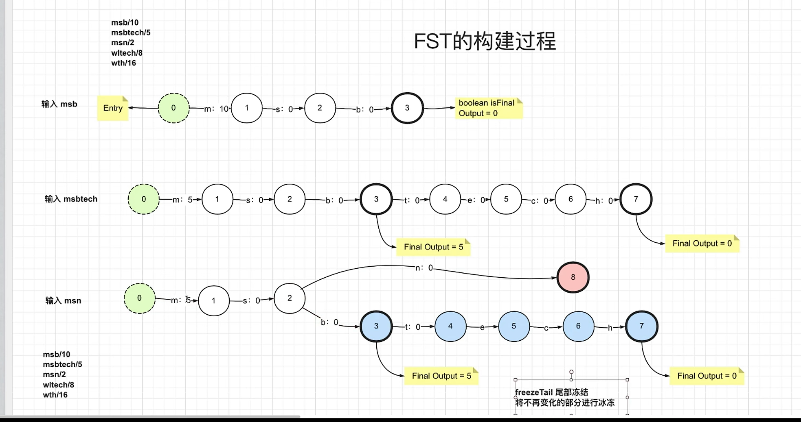

## document的写入原理

es通过协调节点将数据转发给分片所在的节点上，然后同时写入到内存buffer以及translog日志中（由于translog是顺序读写的，因此速度极快），主分片完成写入后，将写请求并行转发给其他分片所在节点。同时，后台有三个异步任务完成es的近实时性搜索、数据持久化和高性能。

1. Refresh: ES默认每1s执行一次，将内存缓存区中的文档生成一个新的Segment(数据段)并行写入到文件系统缓存中，打开segment文件后便可以搜索，然后清空内存缓冲区。由于磁盘同步开销大，因此，refresh并不能保证数据落盘。
2. Flush: Flush会将文件系统缓存中的数据强制落盘并同步，然后删除translog文件。定时（默认30分钟）、translog 过大（默认512MB）、手动触发。
3. Merge: refresh会产生很多小的segment，merge会把大小相似的segment合并成更大的segment,并物理清除被标记删除的文档。

## es中拼写纠错时怎么实现的

- 通过fuzzy模糊查询来实现的，fuzzines参数只允许（0,1,2）。
- suggest 建议器 Term Suggester（词条建议器）、Phrase Suggester（短语建议器）、Completion Suggester（完成建议器）。

## es中master的选举过程

1. 触发选举的必要条件

   - MasterFaultDetection发现master节点失联
   - NodesFaultDetetion发现集群中存在的master-eligible不满足法定票数（n/2+1）
   - master-eligible和voting-only（仅投票）节点参加选举。

2. 发现并收集节点信息：

   节点首先通过 discovery.seed_hosts 配置的主机列表与集群中其他节点建立连接，并通过 Ping 请求收集响应。ES 会根据响应生成两个关键列表:

   - activeMasters：其他节点声称的当前集群 Master 列表。
   - masterCandidates：有资格成为 Master 的节点列表。

3. 选举临时 Master：
   节点会优先选择 activeMasters 列表中版本号最新、ID 最小的节点作为临时 Master。如果该列表为空，则在 masterCandidates 列表中同样选择版本最新、ID 最小的节点。

4. 投票与确认：
   选出的临时 Master 会向所有有投票权的节点发起投票请求。一旦获得超过法定人数的多数票支持，它就会被正式确认为新的 Master。

5. 发布集群状态：
   新 Master 选举成功后，会负责向集群中的所有其他节点发布最新的集群状态（Cluster State），宣告自己的合法地位

# Kubernetes

## docker和虚拟机的区别

docker是轻量级的沙盒，在其中运行的只是应用。而虚拟机里边还有额外的独立操作系统运行。

| 维度           | Docker (容器)                                                | 虚拟机 (VM)                                                  |
| :------------- | :----------------------------------------------------------- | :----------------------------------------------------------- |
| **架构**       | 容器共享宿主机的操作系统内核，每个容器运行在独立的用户空间，通过命名空间（Namespace）和 cgroups 实现隔离。 | 虚拟机包含完整的客户操作系统（Guest OS），运行在 Hypervisor 之上，Hypervisor 对硬件资源进行虚拟化，为每个虚拟机分配独立的虚拟硬件。 |
| **隔离级别**   | 进程级隔离，容器本质上是宿主机上的进程。                     | 硬件级隔离，每个虚拟机拥有独立的操作系统和内核，隔离更彻底。 |
| **启动速度**   | 秒级，甚至毫秒级（启动容器本质上是启动一个进程）。           | 分钟级，需要启动完整的操作系统。                             |
| **资源利用率** | 高，容器共享宿主机内核，内存和磁盘占用极小，通常只包含应用程序及其依赖。 | 较低，每个虚拟机占用独立的操作系统资源，内存和磁盘开销大（通常数 GB）。 |
| **性能**       | 接近原生，几乎无额外开销（除 namespace 和 cgroups 的微小开销）。 | 有一定开销，Hypervisor 需要模拟硬件资源，I/O 路径较长，性能损耗较容器大。 |
| **操作系统**   | 容器必须与宿主机共享内核，因此只能运行与宿主机内核兼容的操作系统（如 Linux 容器运行在 Linux 上，Windows 容器运行在 Windows 上）。 | 虚拟机可以运行任意操作系统（如 Linux 宿主机上运行 Windows 虚拟机），只要 Hypervisor 支持。 |
| **镜像大小**   | 轻量，通常几十到几百 MB。                                    | 重量，通常数 GB。                                            |
| **部署与迁移** | 镜像分层、快速部署，易于版本控制和 CI/CD 集成。              | 虚拟机镜像较大，迁移相对笨重。                               |
| **持久化数据** | 容器默认无状态，数据存储通常通过挂载卷（Volumes）管理，生命周期独立于容器。 | 虚拟机通常通过虚拟磁盘持久化数据，生命周期与 VM 绑定。       |

## 简述k8s和docker的关系

docker通过doeckerfile将应用程序运行所需要设置和依赖打包到一个容器中，从而实现可移植性的特点。k8s用于关联和编排在多个主机上运行的容器。

## 简述kube-porxy ipvs和iptables的异同

相同之处： 都是基于netfilter内核转发

不同之处： iptable是为防火墙设计的，ipvs是专门用于高性能LB集群-LVS实现的。

kernelspace专用于windows系统的，userspace是早期版本的实现。

iptables:

- 优点：灵活，功能强大（根据tcp不同状态对包进行操作）
- 缺点：表中规则过多时会导致响应变慢

ipvs:

- 优点：转发效果高(基于优化的Hash表)，调度算法丰富
- 缺点：低版本内核可能不支持。与部分 CNI 插件（如 Calico）可能存在兼容性问题。

## kube-porxy修改代理模式为ipvs的方法

1. 载入模块

   ```shell
   cat > /etc/sysconfig/modules/ipvs.modules <<EOF
   #!/bin/bash
    ipvs_moudle_dir-"/usr/lib/moudles/\`uname -r`/kernel/net/netfilter/ipvs"
    for i in `ls \$ipvs_moudle_dir | sed -r 's#(.*).ko.xz#\1#\'`;do
    	/sbin/modinfo -F filename \$i &> /dev/null
    	if [\$? -eq 0 ];then
    		/sbin/modprobe \$i
    	fi
    done
   EOF
   chmod +x /etc/sysconfig/modules/ipvs.modules;
   bash /etc/sysconfig/modules/ipvs.modules
   ```

2. 确保所有节点运行

   `lsmod | grep ip_vs`

3. 修改kube-proxy configMap文件

   `kubectl edit configmap kube-proxy -n kube-system`

   `mode: "" 改为 mode:"ipvs"`

4. 删除所有kube-proxy

   ```shell
   kubectl delete pods `"kubectl get pod -n kube-system | grep kube-proxy | awk '${print $1}'"` -n kube-system
   #或者使用
   kubectl delete pods -l k8s-app=kube-proxy -n kube-system
   ```

5. 查看重启后的pod是否为ipvs

   ```shell
   kubectl get pods -n kube-system -o wide | grep proxy
   
   kubectl logs 容器名 -n kube-system
   ```

6. 按照ipvsadm查看具体的ipvs规则

   ```shell
   # 按照 ipvsadm
   yum install -y ipsadm
   #查看规则
   ipvsadm -ln
   ```

## 简述微服务部署中的蓝绿发布

发布两套相同的系统，一般用于测试使用。

优点：零停机发布、快速回滚、环境隔离

缺点：只能进行全量切换，需要两倍的资源

**k8s中蓝绿发布**

通过Label + Selector来实现

```shell
# 蓝环境（当前线上）
apiVersion: apps/v1
kind: Deployment
metadata:
  name: my-app-blue
spec:
  replicas: 3
  selector:
    matchLabels:
      app: my-app
      version: blue
  template:
    metadata:
      labels:
        app: my-app
        version: blue
    spec:
      containers:
      - name: app
        image: my-app:v1
#绿环境（新版本）
apiVersion: apps/v1
kind: Deployment
metadata:
  name: my-app-green
spec:
  replicas: 3
  selector:
    matchLabels:
      app: my-app
      version: green
  template:
    metadata:
      labels:
        app: my-app
        version: green
    spec:
      containers:
      - name: app
        image: my-app:v2
#Service（关键）
apiVersion: v1
kind: Service
metadata:
  name: my-app-service
spec:
  selector:
    app: my-app
    version: blue   # 当前指向蓝环境
  ports:
    - port: 80
      targetPort: 8080
```

## k8s中的静态pod

由kubelet创建，并且总是在kubelet所在的node节点运行。

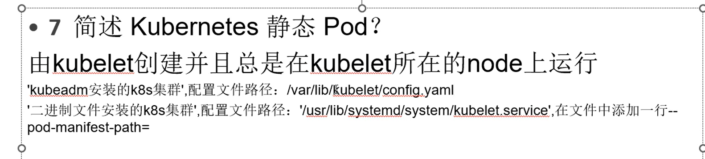

- 配置 manifest 目录：在 kubelet 启动参数中指定 --pod-manifest-path，或者在配置文件中设置 staticPodPath。默认常见路径：/etc/kubernetes/manifests
- 编写 Pod YAML：将标准的 Pod YAML 文件放入该目录。
- kubelet 自动生效：文件放入后，kubelet 会在几秒内启动 Pod。

## k8s数据持久化的方式有哪些

1. emptydir: 临时存储数据，生命周期与pod一直
2. hostpath: 类似docker bind mount,挂载到宿主机目录
3. pv/pvc  nfs,gfs,ceph分布式存储

## dockerfile中的copy和add区别

copy是将宿主机中的文件拷贝到容器内；add也会拷贝文件并解压缩，并支持url。

## 如何为k8s集群添加新的节点

1. 查看token是否存在

   ```shell
   kubeadm token list
   kubeadm token create --print-join-command (--ttl 0 过期时间)
   ```

2. 排空pod

   ```shell
   kubectl drain 节点名称 --delete-local-data --force --ingnore-daemonsets
   kubect delete node 节点名称
   ```

3. 清空集群数据

   ```shell
   kubeadm reset -f
   systemctl stop kubelet
   systemctl stop docker 
   rm -rf /var/lib/cni/
   rm -rf /var/lib/kubelet/*
   rm -rf /etc/cni/
   ifconfig cni0 down
   ifconfig flannel.1 down
   systemctl start docker
   iptables -F && sudo iptables -t nat -F && sudo iptables -t mangle -F && iptables -X
   ipvsadm -C
   ```

4. 重新添加到集群

   ```shell
   kubeadm token list
   openssl x509 -pubkey -in /etc/kubernets/pki/ca.crt | openssl rsa -pubin -outform der 2>/dev/null | openssl dgst -sha256 -hex | sed `s/^.* //`
   kubeadm join 主节点:6443 --token token的key --discovery-token-ca-cert.hash sha256:token的值
   ```

## 自定义svc端口报错是什么原因

k8s默认的路径范围为：30000-32767。需要修改kube-apiserver的配置文件，通过kubeadm安装，默认安装路径/etc/kubernetets/mainfest/kube-apiserver.yaml，修改此文件，添加--service-node-port-rang=30000-43767。

重启kube-apiserver中的pod

```shell
export apiserver_pods=$(kubectl get pods --selector=componet=kube-apiserver -n kube-system --output=jsonpath={.item..metadata.name})

kubectl delete pod $apiserver_pods -n kube-system
```

## k8s中常用控制器以及特点

deployment: 部署无状态的应用  启动顺序是无序的，名字和ip地址是随机的，后端存储是共享的。

DaemonSet: 每台主机部署一个pod

StatefulSet: 部署有状态的应用

CronJob: 定时运行pod

Job: 一次性运行pod

## k8s拉伸收缩副本失效是什么原因

自动扩展实现的方式：autoscale和HPA。失败的原因与自动拉伸冲突有关。

## node节点容忍异常时间如何设置

node节点异常时间默认是300s。

服务中断时间=停机等待时间300s+重建时间+服务启动时间+readiness探针监检测正常时间。

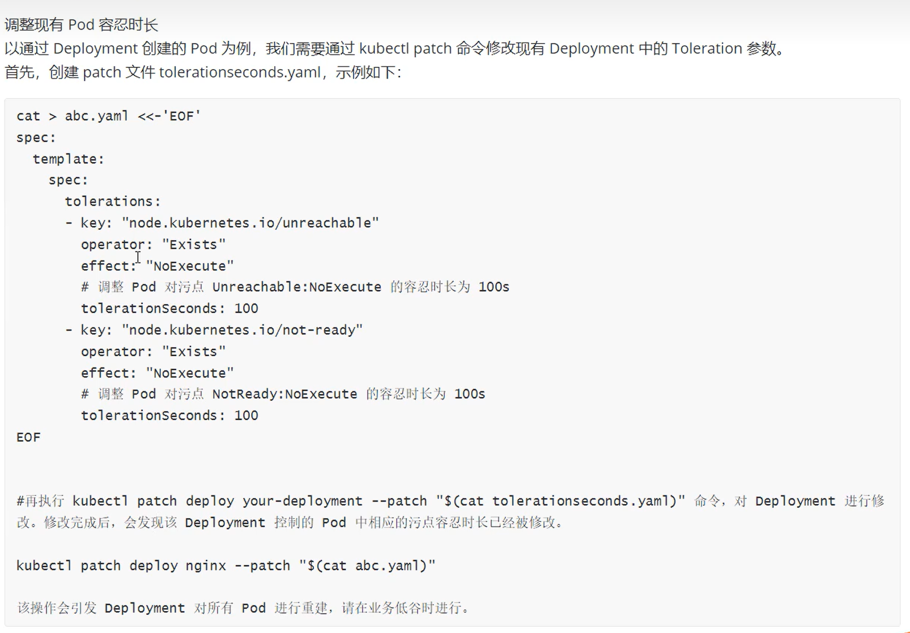

## 简述deployment控制器的升级和回滚部署

```shell
#yaml文件中revisionHisotryLimit配置规定记录多少个版本
# 发布时记录版本
kubectl deploy -f pc-deployment.yaml --record
# 查看历史版本命令
kubectl rollout history deployment -n 命名空间 服务名称
# 回滚命令
kubectl rollout undo deployment -n 命名空间 服务名称 --to-version=(修订号)

```

## k8s存储卷有哪些，说明他们的特征以及作用

emptyDir: pod调度到节点时创建的一个临时空目录，Pod删除随之删除，用于容器间分享文件

hostPath: 节点存储卷，挂载宿主机的文件或目录到Pod中

pv/PVC: 是外部存储系统中的一块存储空间，具有持久性，生命周期独立于Pod

StoageClass: 充当PV的模板，从而可以动态创建所需的PV,自动构建相对应的PV持久化存储卷。

configmap: 使一个配置文件多台机器共用，杜绝重复修改，支持热更新且支持挂载。

secret: 将密码转换为密文，写入配置清单中，起到加密的作用。

## kubectl不能自动补全的原因

1. 安装bash-completion

   `yum install -y bash-completion` 

   source /usr/share/bash-completion/bash_completion 使文件生效

2. 应用kubectl的completion到系统环境

   ```shell 
   source < (kubectl completion bash)
   echo "source < (kubectl completion bash)" >> ~/.bashrc
   ```

## 如何阻止yum或者apt自动更新linux内核 docker 与k8s版本

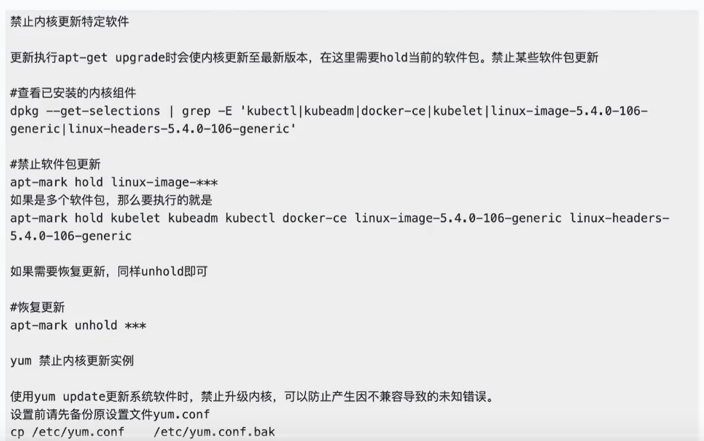

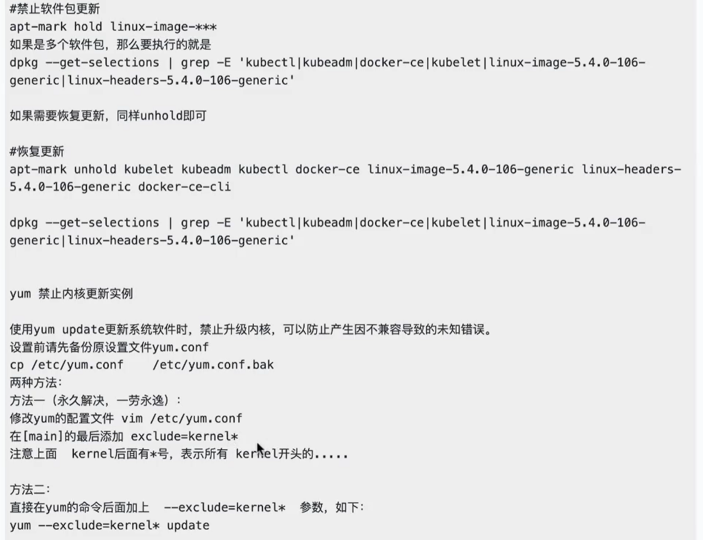