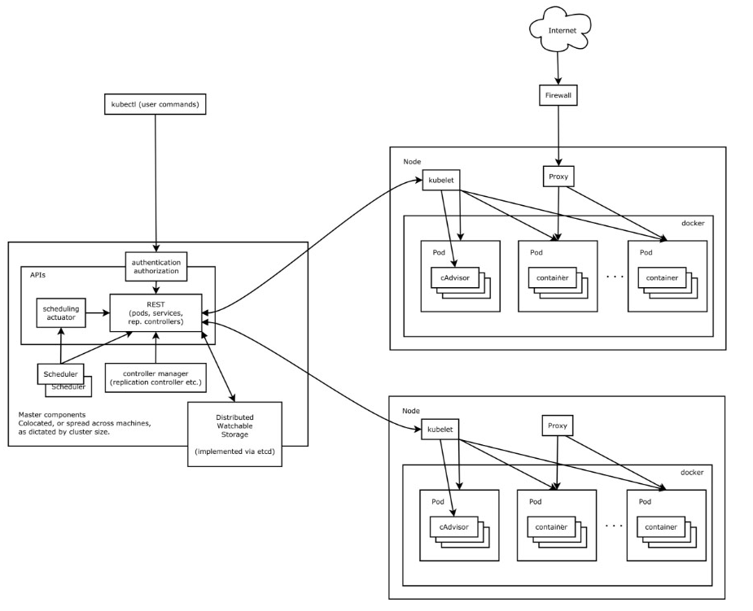

[toc]

# k8s架构

Kubernetes集群包含有节点代理kubelet和Master组件(APIs, scheduler, etc)，一切都基于分布式的存储系统。



**Kubernetes节点**
在这张系统架构图中，我们把服务分为运行在工作节点上的服务和组成集群级别控制板的服务。
Kubernetes节点有运行应用容器必备的服务，而这些都是受Master的控制。
每次个节点上当然都要运行Docker。Docker来负责所有具体的映像下载和容器运行。
Kubernetes主要由以下几个核心组件组成：

- etcd保存了整个集群的状态；
- apiserver提供了资源操作的唯一入口，并提供认证、授权、访问控制、API注册和发现等机制；
- controller manager负责维护集群的状态，比如故障检测、自动扩展、滚动更新等；
- scheduler负责资源的调度，按照预定的调度策略将Pod调度到相应的机器上；
- kubelet负责维护容器的生命周期，同时也负责Volume（CVI）和网络（CNI）的管理；
- Container runtime负责镜像管理以及Pod和容器的真正运行（CRI）；
- kube-proxy负责为Service提供cluster内部的服务发现和负载均衡；

除了核心组件，还有一些推荐的Add-ons：
- kube-dns负责为整个集群提供DNS服务
- Ingress Controller为服务提供外网入口
- Heapster提供资源监控
- Dashboard提供GUI
- Federation提供跨可用区的集群
- Fluentd-elasticsearch提供集群日志采集、存储与查询

---
**kubernetes分层架构**
Kubernetes设计理念和功能其实就是一个类似Linux的分层架构，如图1.2所示:


<center style="font-size:14px;color:black;text-decoration:underline">图1.2 kubernetes分层设计图</center> </br>

- 核心层：Kubernetes最核心的功能，对外提供API构建高层的应用，对内提供插件式应用执行环境
- 应用层：部署（无状态应用、有状态应用、批处理任务、集群应用等）和路由（服务发现、DNS解析等）
- 管理层：系统度量（如基础设施、容器和网络的度量），自动化（如自动扩展、动态Provision等）以及策略管理（RBAC、Quota、PSP、NetworkPolicy等）
- 接口层：kubectl命令行工具、客户端SDK以及集群联邦
- 生态系统：在接口层之上的庞大容器集群管理调度的生态系统，可以划分为两个范畴
    - Kubernetes外部：日志、监控、配置管理、CI、CD、Workflow、FaaS、OTS应用、ChatOps等
    - Kubernetes内部：CRI、CNI、CVI、镜像仓库、Cloud Provider、集群自身的配置和管理等

---
**kubelet**
kubelet负责管理pods和它们上面的容器，images镜像、volumes、etc。
kubelet是主要的节点代理，它会监视已分配给节点的pod，具体功能：

- 安装Pod所需的volume。
- 下载Pod的Secrets。
- Pod中运行的 docker（或experimentally，rkt）容器。
- 定期执行容器健康检查。
- Reports the status of the pod back to the rest of the system, by creating a mirror pod if necessary.
- Reports the status of the node back to the rest of the system.

---
**kube-proxy**
每一个节点也运行一个简单的网络代理和负载均衡。 正如Kubernetes API里面定义的这些服务，也可以在各种终端中以轮询的方式做一些简单的TCP和UDP传输。

服务端点目前是通过DNS或者环境变量(` Docker-links-compatible`和` Kubernetes{FOO}_SERVICE_HOST`及`{FOO}_SERVICE_PORT`变量都支持)。这些变量由服务代理所管理的端口来解析。

---
**Kubernetes控制面板**

Kubernetes控制面板可以分为多个部分。目前它们都运行在一个master 节点，然而为了达到高可用性，这需要改变。不同部分一起协作提供一个统一的关于集群的视图。

**etcd**

所有master的持续状态都存在etcd的一个实例中。这可以很好地存储配置数据。因为有watch(观察者)的支持，各部件协调中的改变可以很快被察觉。

**Kubernetes API Server**

API服务提供Kubernetes API 的服务。这个服务试图通过把所有或者大部分的业务逻辑放到不两只的部件中从而使其具有CRUD特性。它主要处理REST操作，在etcd中验证更新这些对象（并最终存储）。

**Scheduler**

调度器把未调度的pod通过binding api绑定到节点上。调度器是可插拔的，并且我们期待支持多集群的调度，未来甚至希望可以支持用户自定义的调度器。

**Kubernetes控制管理服务器**
所有其它的集群级别的功能目前都是由控制管理器所负责。例如，端点对象是被端点控制器来创建和更新。这些最终可以被分隔成不同的部件来让它们独自的可插拔。

replicationcontroller是一种建立于简单的 pod API之上的一种机制。一旦实现，我们最终计划把这变成一种通用的插件机制。

kube-controller-manager运行管理控制器，它们是集群中处理常规任务的后台线程。逻辑上，每个控制器是一个单独的进程，但为了降低复杂性，它们都被编译成单个二进制文件，并在单个进程中运行。
这些控制器包括：

- 节点（Node）控制器。
- 副本（Replication）控制器：负责维护系统中每个副本中的pod。
- 端点（Endpoints）控制器：填充Endpoints对象（即连接Services＆Pods）。
- Service Account和Token控制器：为新的Namespace 创建默认帐户访问API Token。

---
**cloud-controller-manager**
云控制器管理器负责与底层云提供商的平台交互。云控制器管理器是Kubernetes版本1.6中引入的，目前还是Alpha的功能。

云控制器管理器仅运行云提供商特定的（controller loops）控制器循环。可以通过将--cloud-provider flag设置为external启动kube-controller-manager ，来禁用控制器循环。

cloud-controller-manager 具体功能：

- 节点（Node）控制器
- 路由（Route）控制器
- Service控制器
- 卷（Volume）控制器

# k8s中的概念
## k8s对象
Kubernetes对象是Kubernetes系统中的持久实体。Kubernetes使用这些实体来表示集群的状态。具体来说，他们可以描述：

- 容器化应用正在运行(以及在哪些节点上)。
- 这些应用可用的资源。
- 关于这些应用如何运行的策略，如重新策略，升级和容错。

Kubernetes对象是“record of intent”，一旦创建了对象，Kubernetes系统会确保对象存在。通过创建对象，可以有效地告诉Kubernetes系统你希望集群的工作负载是什么样的。

要使用Kubernetes对象（无论是创建，修改还是删除），都需要使用Kubernetes API。
### k8s对象的规范和状态
每个Kubernetes对象都包含两个嵌套对象字段，用于管理Object的配置：Object Spec和Object Status。Spec描述了对象所需的状态 - 希望Object具有的特性，Status描述了对象的实际状态，并由Kubernetes系统提供和更新。

例如，通过Kubernetes Deployment 来表示在集群上运行的应用的对象。创建Deployment时，可以设置Deployment Spec，来指定要运行应用的三个副本。Kubernetes系统将读取Deployment Spec，并启动你想要的三个应用实例来更新状态以符合之前设置的Spec。如果这些实例中有任何一个失败（状态更改），Kuberentes系统将响应Spec和当前状态之间差异来调整，这种情况下，将会开始替代实例。
### 描述k8s对象
在Kubernetes中创建对象时，必须提供描述其所需Status的对象Spec，以及关于对象（如name）的一些基本信息。当使用Kubernetes API创建对象（直接或通过kubectl）时，该API请求必须将该信息作为JSON包含在请求body中。通常，可以将信息提供给kubectl .yaml文件，在进行API请求时，kubectl将信息转换为JSON。

以下示例是一个.yaml文件，显示Kubernetes Deployment所需的字段和对象Spec：
```yaml
# nginx-deployment.yaml;
apiVersion: apps/v1beta1
kind: Deployment
metadata:
  name: nginx-deployment
spec:
  replicas: 3
  template:
    metadata:
      labels:
        app: nginx
    spec:
      containers:
      - name: nginx
        image: nginx:1.7.9
        ports:
        - containerPort: 80
```
使用上述.yaml文件创建Deployment，是通过在kubectl中使用kubectl create命令来实现。将该.yaml文件作为参数传递。如下例子：
```shell
    $ kubectl create -f docs/user-guide/nginx-deployment.yaml --record
```
其输出与此类似:`deployment "nginx-deployment" created`。

### yaml文件中的必要字段

对于要创建的Kubernetes对象的yaml文件，需要为以下字段设置值：

- apiVersion - 创建对象的Kubernetes API 版本
- kind - 要创建什么样的对象？
- metadata- 具有唯一标示对象的数据，包括 name（字符串）、UID和Namespace（可选项）

还需要提供对象Spec字段，对象Spec的精确格式（对于每个Kubernetes 对象都是不同的），以及容器内嵌套的特定于该对象的字段。Kubernetes API reference可以查找所有可创建Kubernetes对象的Spec格式。

## k8s Namespaces
Kubernetes可以使用Namespaces（命名空间）创建多个虚拟集群。
### 何时使用多个Namespaces
当团队或项目中具有许多用户时，可以考虑使用Namespace来区分，如果是少量用户集群，可以不需要考虑使用Namespace，如果需要它们提供特殊性质时，可以开始使用Namespace。

Namespace为名称提供了一个范围。资源的Names在Namespace中具有唯一性。

Namespace是一种将集群资源划分为多个用途(通过 resource quota)的方法。

在未来的Kubernetes版本中，默认情况下，相同Namespace中的对象将具有相同的访问控制策略。

对于稍微不同的资源没必要使用多个Namespace来划分，例如同意软件的不同版本，可以使用labels(标签)来区分同一Namespace中的资源。

### 使用Namespaces
Namespace的创建、删除和查看。
**创建**

```shell
# (1) 命令行直接创建
$ kubectl create namespace new-namespace

# (2) 通过文件创建
$ cat my-namespace.yaml
apiVersion: v1
kind: Namespace
metadata:
  name: new-namespace

$ kubectl create -f ./my-namespace.yaml
```
> 注意：命名空间名称满足正则表达式[a-z0-9]([-a-z0-9]*[a-z0-9])?,最大长度为63位

**删除**
```shell
$ kubectl delete namespaces new-namespace
```
注意：
- 删除一个namespace会自动删除所有属于该namespace的资源。
- default和kube-system命名空间不可删除。
- PersistentVolumes是不属于任何namespace的，但PersistentVolumeClaim是属于某个特定namespace的。
- Events是否属于namespace取决于产生events的对象。

**查看 Namespaces**
```
$ kubectl get namespaces
```
Kubernetes从两个初始的Namespace开始：

- default
- kube-system 由Kubernetes系统创建的对象的Namespace

**要临时设置Request的Namespace，请使用--namespace 标志。**
```shell
$ kubectl --namespace=<insert-namespace-name-here> run nginx --image=nginx
$ kubectl --namespace=<insert-namespace-name-here> get pods
```
**可以使用kubectl命令创建的Namespace可以永久保存在context中。**
```shell
$ kubectl config set-context $(kubectl config current-context) --namespace=<insert-namespace-name-here>
# Validate it
$ kubectl config view | grep namespace:
```

### 所有对象都在Namespace中?

大多数Kubernetes资源（例如pod、services、replication controllers或其他）都在某些Namespace中，但Namespace资源本身并不在Namespace中。而低级别资源（如Node和persistentVolumes）不在任何Namespace中。Events是一个例外：它们可能有也可能没有Namespace，具体取决于Events的对象。

## K8s的Labels 和 Selectors

Labels其实就一对 key/value ，被关联到对象上，标签的使用我们倾向于能够标示对象的特殊特点，并且对用户而言是有意义的（就是一眼就看出了这个Pod是什么作用），但是标签对内核系统是没有直接意义的。标签可以用来划分特定组的对象（比如，所有女的），标签可以在创建一个对象的时候直接给与，也可以在后期随时修改，每一个对象可以拥有多个标签，但是，key值必须是唯一的
```shell
"labels": {
  "key1" : "value1",
  "key2" : "value2"
}
```
我们最终会索引并且反向索引（reverse-index）labels，以获得更高效的查询和监视，把他们用到UI或者CLI中用来排序或者分组等等。我们不想用那些不具有指认效果的label来污染label，特别是那些体积较大和结构型的的数据。不具有指认效果的信息应该使用annotation来记录。

### Motivation
Labels可以让用户将他们自己的有组织目的的结构以一种松耦合的方式应用到系统的对象上，且不需要客户端存放这些对应关系（mappings）。

服务部署和批处理管道通常是多维的实体（例如多个分区或者部署，多个发布轨道，多层，每层多微服务）。管理通常需要跨越式的切割操作，这会打破有严格层级展示关系的封装，特别对那些是由基础设施而非用户决定的很死板的层级关系。

### 语法和字符集
Label其实是一对 key/value。有效的标签键有两个段：可选的前缀和名称，用斜杠（/）分隔，名称段是必需的，最多63个字符，以[a-z0-9A-Z]带有虚线（-）、下划线（_）、点（.）和开头和结尾必须是字母或数字（都是字符串形式）的形式组成。前缀是可选的。如果指定了前缀，那么必须是DNS子域：一系列的DNSlabel通过”.”来划分，不超过253个字符，以斜杠（/）结尾。如果前缀被省略了，这个Label的key被假定为对用户私有的。自动化系统组件有（例如kube-scheduler，kube-controller-manager，kube-apiserver，kubectl，或其他第三方自动化），这些添加标签终端用户对象都必须指定一个前缀。Kuberentes.io 前缀是为Kubernetes 内核部分保留的。

有效的标签值最长为63个字符。要么为空，要么使用[a-z0-9A-Z]带有虚线（-）、下划线（_）、点（.）和开头和结尾必须是字母或数字（都是字符串形式）的形式组成。

### Lables 选择器
与Name和UID 不同，标签不需要有唯一性。一般来说，我们期望许多对象具有相同的标签。

通过标签选择器（Labels Selectors），客户端/用户 能方便辨识出一组对象。标签选择器是kubernetes中核心的组成部分。

API目前支持两种选择器：equality-based（基于平等）和set-based（基于集合）的。标签选择器可以由逗号分隔的多个requirements 组成。在多重需求的情况下，必须满足所有要求，因此逗号分隔符作为AND逻辑运算符。

一个为空的标签选择器（即有0个必须条件的选择器）会选择集合中的每一个对象。

一个null型标签选择器（仅对于可选的选择器字段才可能）不会返回任何对象。
> 注意：两个控制器的标签选择器不能在命名空间中重叠。

### Equality-based requirement 基于相等的请求
基于相等的或者不相等的条件允许用标签的keys和values进行过滤。匹配的对象必须满足所有指定的标签约束，尽管他们可能也有额外的标签。有三种运算符是允许的，“=”，“==”和“!=”。前两种代表相等性（他们是同义运算符），后一种代表非相等性。例如：
```yaml
environment = production
tier != frontend
```
第一个选择所有key等于 environment 值为 production 的资源。后一种选择所有key为 tier 值不等于 frontend 的资源，和那些没有key为 tier 的label的资源。要过滤所有处于 production 但不是 frontend 的资源，可以使用逗号操作符，
```yaml
frontend：environment=production,tier!=frontend
```
### Set-based requirement 基于集合的请求
Set-based 的标签条件允许用一组value来过滤key。支持三种操作符: in ， notin 和 exists(仅针对于key符号) 。例如：
```yaml
environment in (production, qa)
tier notin (frontend, backend)
partition
!partition
```
第一个例子，选择所有key等于 environment ，且value等于 production 或者 qa 的资源。 第二个例子，选择所有key等于 tier 且值是除了 frontend 和 backend 之外的资源，和那些没有标签的key是 tier 的资源。 第三个例子，选择所有有一个标签的key为partition的资源；value是什么不会被检查。 第四个例子，选择所有的没有lable的key名为 partition 的资源；value是什么不会被检查。

类似的，逗号操作符相当于一个AND操作符。因而要使用一个 partition 键（不管value是什么），并且 environment 不是 qa 过滤资源可以用 partition,environment notin (qa) 。

Set-based 的选择器是一个相等性的宽泛的形式，因为 environment=production 相当于environment in (production) ，与 != and notin 类似。

Set-based的条件可以与Equality-based的条件结合。例如， partition in (customerA,customerB),environment!=qa 。

### Service和ReplicationController

一个service针对的pods的集合是用标签选择器来定义的。类似的，一个replicationcontroller管理的pods的群体也是用标签选择器来定义的。

对于这两种对象的Label选择器是用map定义在json或者yaml文件中的，并且只支持Equality-based的条件：
```yaml
"selector": {
    "component" : "redis",
}
```
要么
```yaml
selector:
    component: redis
```
此选择器（分别为json或yaml格式）等同于component=redis或component in (redis)。

### 支持set-based要求的资源
Job，Deployment，Replica Set，和Daemon Set，支持set-based要求。
```yaml
selector:
  matchLabels:
    component: redis
  matchExpressions:
    - {key: tier, operator: In, values: [cache]}
    - {key: environment, operator: NotIn, values: [dev]}
```
matchLabels 是一个{key,value}的映射。一个单独的 {key,value} 相当于 matchExpressions 的一个元素，它的key字段是”key”,操作符是 In ，并且value数组value包含”value”。 matchExpressions 是一个pod的选择器条件的list 。有效运算符包含In, NotIn, Exists, 和DoesNotExist。在In和NotIn的情况下，value的组必须不能为空。所有的条件，包含 matchLabels andmatchExpressions 中的，会用AND符号连接，他们必须都被满足以完成匹配。

## Pod

### Pod 简介
Pod是Kubernetes创建或部署的最小/最简单的基本单位，一个Pod代表集群上正在运行的一个进程。

一个Pod封装一个应用容器（也可以有多个容器），存储资源、一个独立的网络IP以及管理控制容器运行方式的策略选项。Pod代表部署的一个单位：Kubernetes中单个应用的实例，它可能由单个容器或多个容器共享组成的资源。

> Docker是Kubernetes Pod中最常见的runtime ，Pods也支持其他容器runtimes。

Kubernetes中的Pod使用可分两种主要方式：
- Pod中运行一个容器。“one-container-per-Pod”模式是Kubernetes最常见的用法; 在这种情况下，你可以将Pod视为单个封装的容器，但是Kubernetes是直接管理Pod而不是容器。
- Pods中运行多个需要一起工作的容器。Pod可以封装紧密耦合的应用，它们需要由多个容器组成，它们之间能够共享资源，这些容器可以形成一个单一的内部service单位 - 一个容器共享文件，另一个“sidecar”容器来更新这些文件。Pod将这些容器的存储资源作为一个实体来管理。

每个Pod都是运行应用的单个实例，如果需要水平扩展应用（例如，运行多个实例），则应该使用多个Pods，每个实例一个Pod。在Kubernetes中，这样通常称为Replication。Replication的Pod通常由Controller创建和管理。

**为什么使用pods**
**管理需求**
Pod 是这样一个模式的抽象：互相协作的多个进程共同形成一个完整的服务。通过提供对应用的更高层次的抽象，pod简化了应用部署和管理。pod是部署、水平扩展以及复制的基本单元。容器的协同工作（协同调度)，共享生命周期(比如说：终止), 复制协调，资源共享以及依赖管理都自动在 pod 内部进行处理。

**资源共享和通信**
Pod 内部实现了数据共享和相互通信。

在 pod 里的所有应用使用同一个网络空间(相同的 IP 和端口)， 彼此之间可以通过 localhost 相互通信。因此在同一个 pod 里的应用必须相互之间协调好端口的使用。每一个 pod 都拥有一个平面网络空间的 IP 地址，使用这个地址可以与网络中其他物理机器和 pods 进行通信。

pod 里的应用容器的主机名被设置成 pod 名字更多的网络细节。

除了定义运行在pod中的应用容器，pod还可以指定一系列共享存储卷。有了卷，数据就不会在容器重启后丢失，数据还可以在pod内的容器之间共享。

#### Pods如何管理多个容器
Pod 被设计成支持用多个相互协作的进程（比如说：容器）来构成一组高粘性的服务。 Pod 的容器能在集群里的物理或者虚拟机上自动协同寻址、协同调度到同一台机器上。 容器之间能够共享资源和依赖，能相互通信，还能相互协调容器终止的方式和终止的时间点。

在高级应用中我们将一组协同寻址，协同管理的容器放到一个单独的 Pod 里. 这种模式往往被运用在容器紧耦合的场景里。比如说：你可以部署一个容器充当共享卷里文件的 web 服务器同时用 “sidecar” 容器来更新文件。

**Pods提供两种共享资源：网络和存储。**

**网络**
每个Pod被分配一个独立的IP地址，Pod中的每个容器共享网络命名空间，包括IP地址和网络端口。Pod内的容器可以使用localhost相互通信。当Pod中的容器与Pod 外部通信时，他们必须协调如何使用共享网络资源（如端口）

**存储**
Pod 可以指定一系列的共享存储卷。Pod 里所有的容器都由权限访问这个共享卷，同时也可以使用这个共享卷来分享数据。 卷的出现使 Pod 能够支持数据持久性，这样就算是在 Pod 内部容器需要重启的场景里，数据也可以长期保持。

#### 使用Pod
你很少会直接在kubernetes中创建单个Pod。因为Pod的生命周期是短暂的，用后即焚的实体。当Pod被创建后（不论是由你直接创建还是被其他Controller），都会被Kuberentes调度到集群的Node上。直到Pod的进程终止、被删掉、因为缺少资源而被驱逐、或者Node故障之前这个Pod都会一直保持在那个Node上。
> 注意：重启Pod中的容器跟重启Pod不是一回事。Pod只提供容器的运行环境并保持容器的运行状态，重启容器不会造成Pod重启。

Pod不会自愈。如果Pod运行的Node故障，或者是调度器本身故障，这个Pod就会被删除。同样的，如果Pod所在Node缺少资源或者Pod处于维护状态，Pod也会被驱逐。Kubernetes使用更高级的称为Controller的抽象层，来管理Pod实例。虽然可以直接使用Pod，但是在Kubernetes中通常是使用Controller来管理Pod的。

#### Pod和Controller
Controller可以创建和管理多个Pod，提供副本管理、滚动升级和集群级别的自愈能力。例如，如果一个Node故障，Controller就能自动将该节点上的Pod调度到其他健康的Node上。

包含一个或者多个Pod的Controller示例：
- Deployment
- StatefulSet
- DaemonSet

通常，Controller会用你提供的Pod Template来创建相应的Pod。

#### Pod template(模板)
Pod模板是包含了其他对象（如Replication Controllers，Jobs和 DaemonSets）中的pod定义 。Controllers控制器使用Pod模板来创建实际需要的pod。

pod模板类似cookie cutters。“一旦饼干被切掉，饼干和刀将没有关系”。随后对模板的后续更改甚至切换到新模板对已创建的pod并没有任何的影响。

### Pod 生命周期
一般来说，Pod 不会消失，直到人为销毁他们。这可能是一个人或控制器。这个规则的唯一例外是成功或失败的 phase 超过一段时间（由 master 确定）的Pod将过期并被自动销毁。

有三种可用的控制器：

- 使用 Job 运行预期会终止的 Pod，例如批量计算。Job 仅适用于重启策略为 OnFailure 或 Never 的 Pod。
- 对预期不会终止的 Pod 使用 ReplicationController、ReplicaSet 和 Deployment ，例如 Web 服务器。 ReplicationController 仅适用于具有 restartPolicy 为 Always 的 Pod。
- 提供特定于机器的系统服务，使用 DaemonSet 为每台机器运行一个 Pod 。


所有这三种类型的控制器都包含一个 PodTemplate。建议创建适当的控制器，让它们来创建 Pod，而不是直接自己创建 Pod。这是因为单独的 Pod 在机器故障的情况下没有办法自动复原，而控制器却可以。

如果节点死亡或与集群的其余部分断开连接，则 Kubernetes 将应用一个策略将丢失节点上的所有 Pod 的 phase 设置为 Failed。
#### Pod phase
Pod 的 status 定义在 PodStatus 对象中，其中有一个 phase 字段。

Pod 的相位（phase）是 Pod 在其生命周期中的简单宏观概述。该阶段并不是对容器或 Pod 的综合汇总，也不是为了做为综合状态机。

Pod 相位的数量和含义是严格指定的。除了本文档中列举的内容外，不应该再假定 Pod 有其他的 phase 值。

下面是 phase 可能的值：

- 挂起（Pending）：Pod 已被 Kubernetes 系统接受，但有一个或者多个容器镜像尚未创建。等待时间包括调度 Pod 的时间和通过网络下载镜像的时间，这可能需要花点时间。
- 运行中（Running）：该 Pod 已经绑定到了一个节点上，Pod 中所有的容器都已被创建。至少有一个容器正在运行，或者正处于启动或重启状态。
- 成功（Succeeded）：Pod 中的所有容器都被成功终止，并且不会再重启。
- 失败（Failed）：Pod 中的所有容器都已终止了，并且至少有一个容器是因为失败终止。也就是说，容器以非0状态退出或者被系统终止。
- 未知（Unknown）：因为某些原因无法取得 Pod 的状态，通常是因为与 Pod 所在主机通信失败。

如果某个节点死亡或与集群的其余部分断开连接，Kubernetes将应用一个策略，将丢失的节点上所有Pod的相位设置为“失败”。

#### Pod conditions
Pod 有一个 PodStatus 对象，其中包含一个 PodCondition 数组，标识pod是否已经准备就绪：

- PodScheduled: 已将Pod调度到一个节点。
- ContainersReady:Pod中的所有容器均已准备就绪。
- Initialized:所有初始化容器都已成功启动。
- Ready:Pod能够处理请求，应将其添加到所有匹配服务的负载平衡池中。

| 名称               | 描述                                                       |
| ------------------ | ---------------------------------------------------------- |
| type               | Pod Condition的名称                                        |
| status             | 指示该条件是否适用，可能的值为“True”，“False”或“Unknown”   |
| lastProbeTime      | 上一次探测Pod Condition的时间戳。                          |
| lastTransitionTime | Pod上一次从一种状态转换为另一种状态的时间戳。              |
| reason             | 机器可读的UpperCamelCase文本，指示条件最后一次转换的原因。 |
| message            | 人类可读的消息，指示有关最后状态转换的详细信息。           |

#### 容器探针
探针 是由 kubelet 对容器执行的定期诊断。要执行诊断，kubelet 调用由容器实现的 Handler。有三种类型的处理程序：

- ExecAction：在容器内执行指定命令。如果命令退出时返回码为 0 则认为诊断成功。
- TCPSocketAction：对指定端口上的容器的 IP 地址进行 TCP 检查。如果端口打开，则诊断被认为是成功的。
- HTTPGetAction：对指定的端口和路径上的容器的 IP 地址执行 HTTP Get 请求。如果响应的状态码大于等于200 且小于 400，则诊断被认为是成功的。

每次探测都将获得以下三种结果之一：

- Success：容器通过了诊断。
- Failure：容器未通过诊断。
- Unknown：诊断失败，因此不会采取任何行动。

Kubelet 可以选择是否执行在容器上运行的两种探针执行和做出反应：

- livenessProbe：指示容器是否正在运行。如果存活探测失败，则 kubelet 会杀死容器，并且容器将受到其 `restartPolicy` 的影响。如果容器不提供存活探针，则默认状态为 Success。
- readinessProbe：指示容器是否准备好服务请求。如果就绪探测失败，端点控制器将从与 Pod 匹配的所有 Service 的端点中删除该 Pod 的 IP 地址。初始延迟之前的就绪状态默认为 Failure。如果容器不提供就绪探针，则默认状态为 Success。

**restartPolicy 重启策略**
PodSpec 中有一个 restartPolicy 字段，可能的值为 Always、OnFailure 和 Never。默认为 Always。 restartPolicy 适用于 Pod 中的所有容器。restartPolicy 仅指通过同一节点上的 kubelet 重新启动容器。失败的容器由 kubelet 以五分钟为上限的指数退避延迟（10秒，20秒，40秒…）重新启动，并在成功执行十分钟后重置。如 Pod 文档 中所述，一旦绑定到一个节点，Pod 将永远不会重新绑定到另一个节点。

**该什么时候使用存活（liveness）和就绪（readiness）探针?**
如果容器中的进程能够在遇到问题或不健康的情况下自行崩溃，则不一定需要存活探针; kubelet 将根据 Pod 的restartPolicy 自动执行正确的操作。

如果您希望容器在探测失败时被杀死并重新启动，那么请指定一个存活探针，并指定restartPolicy 为 Always 或 OnFailure。

如果要仅在探测成功时才开始向 Pod 发送流量，请指定就绪探针。在这种情况下，就绪探针可能与存活探针相同，但是 spec 中的就绪探针的存在意味着 Pod 将在没有接收到任何流量的情况下启动，并且只有在探针探测成功后才开始接收流量。

如果您希望容器能够自行维护，您可以指定一个就绪探针，该探针检查与存活探针不同的端点。

请注意，如果您只想在 Pod 被删除时能够排除请求，则不一定需要使用就绪探针；在删除 Pod 时，Pod 会自动将自身置于未完成状态，无论就绪探针是否存在。当等待 Pod 中的容器停止时，Pod 仍处于未完成状态。

## Volume
默认情况下容器的数据都是非持久化的，在容器消亡以后数据也跟着丢失，所以 Docker 提供了 Volume 机制以便将数据持久化存储。类似的，Kubernetes 提供了更强大的 Volume 机制和丰富的插件，解决了容器数据持久化和容器间共享数据的问题。

与 Docker 不同，Kubernetes Volume 的生命周期与 Pod 绑定:

- 容器挂掉后 Kubelet 再次重启容器时，Volume 的数据依然还在。
- 而 Pod 删除时，Volume 才会清理。数据是否丢失取决于具体的 Volume 类型，比如 emptyDir 的数据会丢失，而 PV 的数据则不会丢。

### Volume的类型
Kubernetes支持Volume类型有：
1. emptyDir
2. hostPath
3. gcePersistentDisk
4. awsElasticBlockStore
5. nfs
6. iscsi
7. fc (fibre channel)
8. flocker
9. glusterfs
10. rbd
11. cephfs
12. gitRepo
13. secret
14. persistentVolumeClaim
15. downwardAPI
16. projected
17. azureFileVolume
18. azureDisk
19. vsphereVolume
20. Quobyte
21. PortworxVolume
22. ScaleIO
23. StorageOS
24. local

#### emptyDir
使用emptyDir，当Pod分配到Node上时，将会创建emptyDir，并且只要Node上的Pod一直运行，Volume就会一直存。当Pod（不管任何原因）从Node上被删除时，emptyDir也同时会删除，存储的数据也将永久删除。
> 注：删除容器不影响emptyDir。

```yaml
apiVersion: v1
kind: Pod
metadata:
  name: test-pd
spec:
  containers:
  - image: gcr.io/google_containers/test-webserver
    name: test-container
    volumeMounts:
    - mountPath: /cache
      name: cache-volume
  volumes:
  - name: cache-volume
    emptyDir: {}
```

#### hostPath
hostPath允许挂载Node上的文件系统到Pod里面去。如果Pod需要使用Node上的文件，可以使用hostPath。
```yaml
apiVersion: v1
kind: Pod
metadata:
  name: test-pd
spec:
  containers:
  - image: gcr.io/google_containers/test-webserver
    name: test-container
    volumeMounts:
    - mountPath: /test-pd
      name: test-volume
  volumes:
  - name: test-volume
    hostPath:
      # directory location on host
      path: /data
```

#### gcePersistentDisk
gcePersistentDisk可以挂载GCE上的永久磁盘到容器，需要Kubernetes运行在GCE的VM中。与emptyDir不同，Pod删除时，gcePersistentDisk被删除，但Persistent Disk 的内容任然存在。这就意味着gcePersistentDisk能够允许我们提前对数据进行处理，而且这些数据可以在Pod之间“切换”。
> 提示：使用gcePersistentDisk，必须用gcloud或使用GCE API或UI 创建PD

使用GCE PD与pod之前，需要创建PD
```yaml
# 首先创建PD
gcloud compute disks create --size=500GB --zone=us-central1-a my-data-disk
# yml配置文件
apiVersion: v1
kind: Pod
metadata:
  name: test-pd
spec:
  containers:
  - image: gcr.io/google_containers/test-webserver
    name: test-container
    volumeMounts:
    - mountPath: /test-pd
      name: test-volume
  volumes:
  - name: test-volume
    # This GCE PD must already exist.
    gcePersistentDisk:
      pdName: my-data-disk
      fsType: ext4
```

#### awsElasticBlockStore
awsElasticBlockStore可以挂载AWS上的EBS盘到容器，需要Kubernetes运行在AWS的EC2上。与emptyDir Pod被删除情况不同，Volume仅被卸载，内容将被保留。这就意味着awsElasticBlockStore能够允许我们提前对数据进行处理，而且这些数据可以在Pod之间“切换”。
> 提示：必须使用aws ec2 create-volumeAWS API 创建EBS Volume，然后才能使用。

在使用EBS Volume与pod之前，需要创建EBS Volume。
```yaml
# 首先创建EBS Volume
aws ec2 create-volume --availability-zone eu-west-1a --size 10 --volume-type gp2
# yml配置文件
apiVersion: v1
kind: Pod
metadata:
  name: test-ebs
spec:
  containers:
  - image: gcr.io/google_containers/test-webserver
    name: test-container
    volumeMounts:
    - mountPath: /test-ebs
      name: test-volume
  volumes:
  - name: test-volume
    # This AWS EBS volume must already exist.
    awsElasticBlockStore:
      volumeID: <volume-id>
      fsType: ext4
```

#### NFS

NFS 是Network File System的缩写，即网络文件系统。Kubernetes中通过简单地配置就可以挂载NFS到Pod中，而NFS中的数据是可以永久保存的，同时NFS支持同时写操作。Pod被删除时，Volume被卸载，内容被保留。这就意味着NFS能够允许我们提前对数据进行处理，而且这些数据可以在Pod之间相互传递。
```yaml
volumes:
- name: nfs
  nfs:
    # FIXME: use the right hostname
    server: 10.254.234.223
    path: "/"
```

#### iSCSI
iscsi允许将现有的iscsi磁盘挂载到我们的pod中，和emptyDir不同的是，删除Pod时会被删除，但Volume只是被卸载，内容被保留，这就意味着iscsi能够允许我们提前对数据进行处理，而且这些数据可以在Pod之间“切换”

#### flocker
Flocker是一个开源集群容器数据卷管理器。它提供对由各种存储后端支持的数据量的管理和编排。

详情请参考：  
https://github.com/kubernetes/examples/tree/master/staging/volumes/flocker  

**先决条件**
需要Flocker群集才能将Flocker与Kubernetes一起使用。Flocker群集包括：

- Flocker Control Service：提供REST over HTTP API来修改所需的集群配置；
- Flocker Dataset Agent（s）：聚合代理，可修改群集状态以匹配所需的配置；
- Flocker容器代理：一种聚合代理，可修改群集状态以匹配所需的配置（在此配置中未使用，但在群集中仍需要）。

Flocker集群可以安装在用于Kubernetes的相同节点上。例如，您可以在每个Kubernetes从节点上，将Flocker Control Service与Kubernetes主服务器和Flocker Dataset / Container代理安装在同一节点上。

#### glusterfs
glusterfs，允许将Glusterfs（一个开源网络文件系统）Volume安装到pod中。不同于emptyDir，Pod被删除时，Volume只是被卸载，内容被保留。味着glusterfs能够允许我们提前对数据进行处理，而且这些数据可以在Pod之间“切换”。

#### RBD
RBD允许Rados Block Device格式的磁盘挂载到Pod中，同样的，当pod被删除的时候，rbd也仅仅是被卸载，内容保留，rbd能够允许我们提前对数据进行处理，而且这些数据可以在Pod之间“切换”。

#### cephfs
cephfs Volume可以将已经存在的CephFS Volume挂载到pod中，与emptyDir特点不同，pod被删除的时，cephfs仅被被卸载，内容保留。cephfs能够允许我们提前对数据进行处理，而且这些数据可以在Pod之间“切换”。
> 提示：可以使用自己的Ceph服务器运行导出，然后在使用cephfs。

#### gitRepo
gitRepo volume将git代码下拉到指定的容器路径中。
```yaml
apiVersion: v1
kind: Pod
metadata:
  name: server
spec:
  containers:
  - image: nginx
    name: nginx
    volumeMounts:
    - mountPath: /mypath
      name: git-volume
  volumes:
  - name: git-volume
    gitRepo:
      repository: "git@somewhere:me/my-git-repository.git"
      revision: "22f1d8406d464b0c0874075539c1f2e96c253775"
```

#### secret
secret volume用于将敏感信息（如密码）传递给pod。可以将secrets存储在Kubernetes API中，使用的时候以文件的形式挂载到pod中，而不用连接api。 secret volume由tmpfs（RAM支持的文件系统）支持。

Secret 解决了密码、token、密钥等敏感数据的配置问题，而不需要把这些敏感数据暴露到镜像或者 Pod Spec 中。Secret 可以以 Volume 或者环境变量的方式使用。

Secret 有三种类型：

- Opaque：base64 编码格式的 Secret，用来存储密码、密钥等；但数据也通过 `base64 --decode` 解码得到原始数据，所有加密性很弱。
- kubernetes.io/dockerconfigjson：用来存储私有 docker registry 的认证信息。
- kubernetes.io/service-account-token： 用于被 serviceaccount 引用。serviceaccout 创建时 Kubernetes 会默认创建对应的 secret。Pod 如果使用了 serviceaccount，对应的 secret 会自动挂载到 Pod 的 /run/secrets/kubernetes.io/serviceaccount 目录中。

备注：serviceaccount 用来使得 Pod 能够访问 Kubernetes API

详情请参考： 
https://feisky.gitbooks.io/kubernetes/content/concepts/secret.html  
https://kubernetes.io/docs/concepts/configuration/secret/  

#### persistentVolumeClaim
persistentVolumeClaim用来挂载持久化磁盘的。PersistentVolumes是用户在不知道特定云环境的细节的情况下，实现持久化存储（如GCE PersistentDisk或iSCSI卷）的一种方式。

详情请参考：  
https://kubernetes.io/docs/concepts/storage/persistent-volumes/  

#### downwardAPI
通过环境变量的方式告诉容器Pod的信息。

详情请参考：  
https://kubernetes.io/docs/tasks/inject-data-application/downward-api-volume-expose-pod-information/  

#### projected
Projected volume将多个Volume源映射到同一个目录。

目前，可以支持以下类型的卷源：

- secret
- downwardAPI
- configMap

所有卷源都要求与pod在同一命名空间中。
```yaml
apiVersion: v1
kind: Pod
metadata:
  name: volume-test
spec:
  containers:
  - name: container-test
    image: busybox
    volumeMounts:
    - name: all-in-one
      mountPath: "/projected-volume"
      readOnly: true
  volumes:
  - name: all-in-one
    projected:
      sources:
      - secret:
          name: mysecret
          items:
            - key: username
              path: my-group/my-username
      - downwardAPI:
          items:
            - path: "labels"
              fieldRef:
                fieldPath: metadata.labels
            - path: "cpu_limit"
              resourceFieldRef:
                containerName: container-test
                resource: limits.cpu
      - configMap:
          name: myconfigmap
          items:
            - key: config
              path: my-group/my-config
```
#### Local

v1.7 + 支持对基于本地存储（如 hostPath, emptyDir, gitRepo 等）的容量进行调度限额，可以通过 --feature-gates=LocalStorageCapacityIsolation=true 来开启这个特性。

为了支持这个特性，Kubernetes 将本地存储分为两类

- storage.kubernetes.io/overlay，即 /var/lib/docker 的大小
- storage.kubernetes.io/scratch，即 /var/lib/kubelet 的大小

Kubernetes 根据 storage.kubernetes.io/scratch 的大小来调度本地存储空间，而根据 storage.kubernetes.io/overlay 来调度容器的存储。

Local Storage同HostPath的区别在于对Pod的调度上，使用Local Storage可以由Kubernetes自动的对Pod进行调度，而是用HostPath只能人工手动调度Pod，因为Kubernetes已经知道了每个节点上kube-reserved和system-reserved设置的本地存储限制。

### Using subPath
有时，可以在一个pod中，将同一个卷共享，使其有多个用处。volumeMounts.subPath特性可以用来指定卷中的一个子目录，而不是直接使用卷的根目录。

以下是使用单个共享卷的LAMP堆栈（Linux Apache Mysql PHP）的pod的示例。HTML内容映射到其html文件夹，数据库将存储在mysql文件夹中：
```yaml
apiVersion: v1
kind: Pod
metadata:
  name: my-lamp-site
spec:
    containers:
    - name: mysql
      image: mysql
      volumeMounts:
      - mountPath: /var/lib/mysql
        name: site-data
        subPath: mysql
    - name: php
      image: php
      volumeMounts:
      - mountPath: /var/www/html
        name: site-data
        subPath: html
    volumes:
    - name: site-data
      persistentVolumeClaim:
        claimName: my-lamp-site-data
```

### Resources

emptyDir Volume的存储介质（Disk，SSD等）取决于kubelet根目录（如/var/lib/kubelet）所处文件系统的存储介质。不限制emptyDir或hostPath Volume使用的空间大小，不对容器或Pod的资源隔离。

# k8s常用命令

## 基础命令

### kubectl get - 获取资源列表

> 集群中可以创建多个namespace，未指定namespace的情况下，所有操作都是针对--namespace=default。

```shell
# 获取所有当前pods
$ kubectl get pods
NAME        READY   STATUS    RESTARTS   AGE
nginx-app   1/1     Running   0          9m52s

# 获取所有pods详细信息
$ kubectl get pods -o wide

# 获取所有namespace下的运行的所有pod：
$ kubectl get pods --all-namespaces

# 获取所有指定namespace下的pods 
$ kubectl get pods -n default(命名空间)

# 获取所有namespace下的运行的所有pod的标签：
$ kubectl get pods --show-labels

# 获取该节点的所有命名空间:
$ kubectl get namespace

# yaml(json)格式输出pod的详细信息：
$ kubectl get pod <podname> -o yaml(/json)

# 通过label筛选
$ kubectl get pods -l run=kubernetes-bootcamp

# 列出所有depolyment
$ kubectl get deployments
NAME                  READY   UP-TO-DATE   AVAILABLE   AGE
kubernetes-bootcamp   1/1     1            1           38s

# 查看当前所有service
$ kubectl get services
NAME         TYPE        CLUSTER-IP   EXTERNAL-IP   PORT(S)   AGE
kubernetes   ClusterIP   10.96.0.1    <none>        443/TCP   19s

# 通过label筛选
$ kubectl get services -l run=kubernetes-bootcamp
```

### kubectl create - 创建资源

```shell
$ kubectl create deployment kubernetes-bootcamp --image=gcr.io/google-samples/kubernetes-bootcamp:v1
deployment.apps/kubernetes-bootcamp created

# 如果已经定义了相应resource的yaml或json文件，直接kubectl create -f filename即可创建文件内定义的resource。
$ kubectl create -f filename
```

### kubectl expose - 暴露service端口

```shell
# 将原服务的内部端口8080暴露为随机端口
$ kubectl expose deployment/kubernetes-bootcamp --type="NodePort" --port 8080
service/kubernetes-bootcamp exposed

# 查看服务列表（新增了`service/kubernetes-bootcamp`）
$ kubectl get services

# 在脚本中可以如下获取外部端口号
$ export NODE_PORT=$(kubectl get services/kubernetes-bootcamp -o go-template='{{(index .spec.ports 0).nodePort}}')
$ echo NODE_PORT=$NODE_PORT

# 访问服务
$ curl $(minikube ip):$NODE_PORT

# expose将一个资源包括pod、Replication Controller、service、deployment等公开为一个新的service。
kubectl expose deployment <deployname> --port=81 --type=NodePort --target-port=80 --name=<service-name>
```

> **说明**：
>
> 给deployname发布一个服务，-port为暴露出去的端口，-type为服务类型，-target-port为容器端口，port通过clusterip加端口访问，target-port通过节点ip加端口访问。

### kubectl run - 运行一个特定的镜像

```shell
$ kubectl run --image=nginx:alpine nginx-app --port=8180
pod/nginx-app created

# 在集群中运行一个特定的镜像。
kubectl run deployname --image=<imagename:version>

# 在创建时指定运行的命令：
$ kubectl run deployname -image=busybox --command -- ping baidu.com
```

### kubectl delete - 删除一个资源

```shell
# 通过标签筛选删除一个服务
$ kubectl delete service -l run=kubernetes-bootcamp

# 根据名称删除一个pod
$ kubectl delete po podname --now 

# 根据yaml文件删除
$ kubectl delete -f nginx.yaml

# 根据名称删除一个deployment
$ kubectl delete deployment deployname
```

## 部署命令

### rolling-update

> rolling-update是一个非常重要的命令，对于已经部署并且正在运行的业务，rolling-update提供了不中断业务的更新方式。rolling-update每次起一个新的pod，等新pod完全起来后删除一个旧的pod，然后再起一个新的pod替换旧的pod，直到替换掉所有的pod。rolling-update需要确保新的版本有不同的name，Version和label，否则会报错 。

```shell
# 通过yarm文件更新
$ kubectl rolling-update poname -f newfilename

# 通过image更新
$ kubectl rolling-update poname -image=image:v2

# 如果在升级过程中，发现有问题可以中途停止update，并回滚到前面版本。
$ kubectl rolling-update poname -rollback
```

### rollout

> 管理资源的发布。

```shell
# 查看指定资源的部署状态：
$ kubectl rollout status deployment/deployname

# 查看指定资源的发布历史:
$ kubectl rollout history deployment/deployname

# 回滚指定资源，默认回滚至上一个版本：
$ kubectl rollout undo deployment/test-nginx
```

### scale

> scale用于程序在负载加重或缩小时将副本进行扩容或缩小。

```shell
# 修改副本数
$ kubectl scale deployment deployname --replicas=newnumber
```

### autoscale

> autoscale命令提供了自动根据pod负载对其副本进行扩缩的功能。autoscale命令会给一个rc指定一个副本数的范围，在实际运行中根据pod中运行的程序的负载自动在指定的范围内对pod进行扩容或缩容。

```shell
$ kubectl autoscale deployment deployname --min=minnumber --max=maxnumber
```

## 故障诊断和调试命令

### kubectl describe - 查看资源详细信息

> 类似于`docker inspect`，获取资源的详细信息。**无论何时，只要遇到pod有问题，都先describe看下pod的状态。**比如容器创建后，状态一直Pending（未正常启动至`Running`状态），那么可以用`kubectl describe`查看具体的原因是什么。
>
> describe类似于get，同样用于获取resource的相关信息。不同的是，get获得的是更详细的resource个性的详细信息，describe获得的是resource集群相关的信息。describe命令同get类似，但是describe不支持-o选项，对于同一类型resource，describe输出的信息格式，内容域相同。

```shell
# 查看所有pods详情
$ kubectl describe pods

# 查看指定service详情
$ kubectl describe services/kubernetes-bootcamp

# 查看指定pod详情
$ kubectl describe pods nginx-app
Name:         nginx-app
Namespace:    default
Priority:     0
Node:         ttg12/192.168.199.212
Start Time:   Thu, 02 Jul 2020 10:53:06 +0800
Labels:       run=nginx-app
Annotations:  <none>
Status:       Pending
IP:
IPs:          <none>
Containers:
  nginx-app:
    Container ID:
    Image:          nginx:alpine
    Image ID:
    Port:           8180/TCP
    Host Port:      0/TCP
    State:          Waiting
      Reason:       ContainerCreating
    Ready:          False
    Restart Count:  0
    Environment:    <none>
    Mounts:
      /var/run/secrets/kubernetes.io/serviceaccount from default-token-b79fd (ro)
Conditions:
  Type              Status
  Initialized       True
  Ready             False
  ContainersReady   False
  PodScheduled      True
Volumes:
  default-token-b79fd:
    Type:        Secret (a volume populated by a Secret)
    SecretName:  default-token-b79fd
    Optional:    false
QoS Class:       BestEffort
Node-Selectors:  <none>
Tolerations:     node.kubernetes.io/not-ready:NoExecute for 300s
                 node.kubernetes.io/unreachable:NoExecute for 300s
Events:
  Type     Reason            Age                  From               Message
  ----     ------            ----                 ----               -------
  Warning  FailedScheduling  59s (x5 over 5m12s)  default-scheduler  0/1 nodes are available: 1 node(s) had taint {node-role.kubernetes.io/master: }, that the pod didn't tolerate.
  Normal   Scheduled         20s                  default-scheduler  Successfully assigned default/nginx-app to ttg12
  Normal   Pulling           18s                  kubelet, ttg12     Pulling image "nginx:alpine"
```

### logs - 查看容器日志

> logs命令用于显示pod运行中，容器内程序输出到标准输出的内容。如果要获得tail -f的方式，需使用-f选项。如果一个pod中有多个容器，要查看具体的某个容器的输出，需要在pod名后使用-c containername指定运行的容器。

```shell
$ kubectl logs -f podname
```

### exec - 指定容器执行命令

> 与docker的exec用法相似，如果一个pod中，有多个容器，需要使用-c选项指定容器。

```shell
$ kubectl exec -it podname bash

$ kubectl exec -it podname -c containername bash
```

### attach

> attach命令效果类似于logs -f，退出查看使用ctrl-c。如果一个pod中有多个容器，要查看具体的某个容器的输出，需要在pod名后使用-c containername指定运行的容器。

```shell
$ kubectl attach podname -c containername
```

## 高级命令

### replace - 更新资源

> replace命令用于对已有资源进行更新、替换。当我们需要更新resource的一些属性的时候，如果修改副本数量，增加、修改label，更改image版本，修改端口等。都可以直接修改原yaml文件，然后执行replace命令。

```shell
$ kubectl replace -f filename
```

==名字不能被更新。另外，如果是更新label，原有标签的pod将会与更新label后的rc断开联系，有新label的rc将会创建指定副本数的新的pod，但是默认并不会删除原来的pod。所以此时如果使用get po将会发现pod数翻倍，进一步check会发现原来的pod已经不会被新rc控制。==

### apply

> apply命令提供了比patch，edit等更严格的更新resource的方式。通过apply，用户可以将resource的configuration使用source control的方式维护在版本库中。每次有更新时，将配置文件push到server，然后使用kubectl apply将更新应用到resource。kubernetes会在引用更新前将当前配置文件中的配置同已经应用的配置做比较，并只更新更改的部分，而不会主动更改任何用户未指定的部分。apply命令的使用方式同replace相同，不同的是，apply不会删除原有resource，然后创建新的。apply直接在原有resource的基础上进行更新。同时kubectl apply还会在resource中添加一条注释，标记当前的apply，类似于git操作。

```shell
$ kubectl apply -f
```

### patch

> 如果一个容器已经在运行，这时需要对一些容器属性进行修改，又不想删除容器，或不方便通过replace的方式进行更新。kubernetes还提供了一种在容器运行时，直接对容器进行修改的方式，就是patch命令。 例如已存在一个pod的label为app=nginx1，如果需要在运行过程中，将其修改为app=nginx2

```shell
$ kubectl patch pod podname -p '{"metadata":{"lables":{"app":"nginx1"}}}'
```

## 其他命令

### api-versions - 打印受支持的api版本

```shell
$ kubectl api-versions
```

### api-resources - 打印支持的api资源

```shell
$ kubectl api-resources
```


# References(参考文献)

网站1：https://kubernetes.io/docs/concepts/
网站2：https://k8smeetup.github.io/docs/concepts/
网站3: http://docs.kubernetes.org.cn/227.html
网站4: https://www.kubernetes.org.cn/k8s