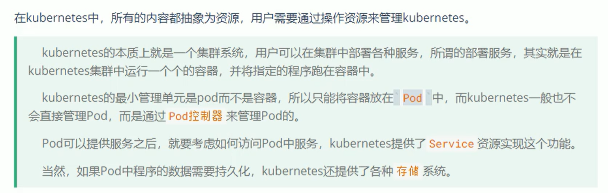
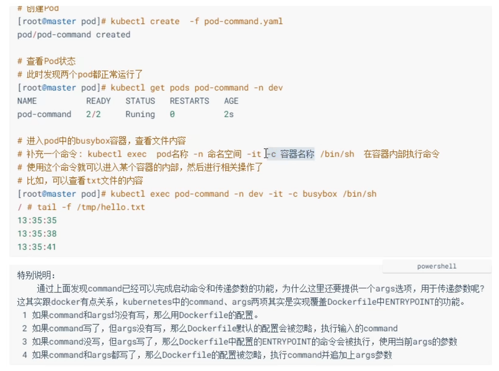
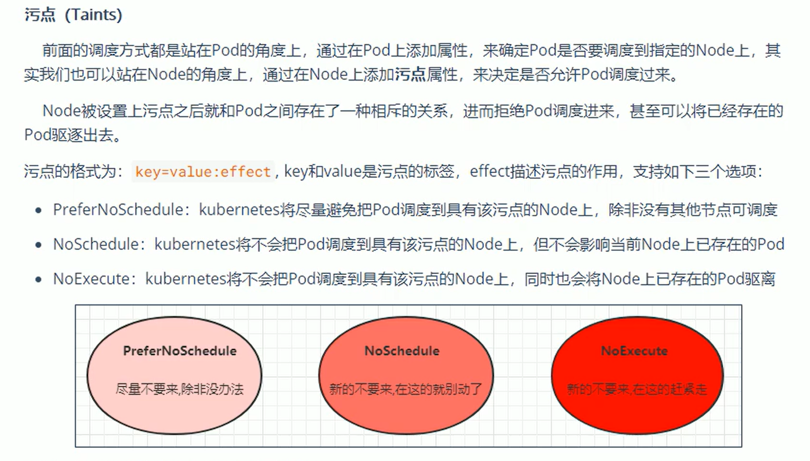
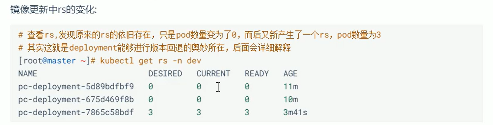
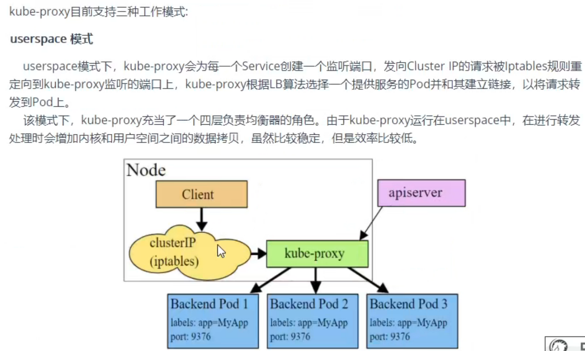

[TOC]

# 1. kubernetes介绍

## 1.1 kubernetes简介


## 1.2 组件介绍

一个k8s集群主要是由**控制节点**、**工作节点**构成，每个节点上都会安装不同的组件


## 1.3 kubernetes概念

- Master: 集群控制节点，每个集群需要至少一个master节点负责集群的管理。
- Node：工作负载节点，由master分配容器到这些node工作节点上，然后node节点上的docker负责容器的运行。
- Pod：kubernetes的最小控制单元，容器都是运行在pod中的，一个pod中可以有一个或者多个容器。
- Controller：控制器，通过它来实现对pod的管理，比如启动pod、停止pod、伸缩pod的数量等。
- Service：pod对外服务的统一入口，下面可以维护着同一类的多个pod。
- Label：标签、用于对pod进行分类，同一类pod会拥有相同的标签。
- NameSpace：命名空间，用来隔离pod的运行环境。

# 2. 集群环境搭建

## 2.1 环境规划

### 2.1.1 集群类型

kubernetes集群大体上分为两类：==一主多从和多住多从==。

- 一主多次：一台Master节点和多台Node节点，搭建简单，但是有单机故障风险，适合用于测试环境。
- 多主多从：多台Master节点和多台Node节点，搭建麻烦，安全性高，适合用于生产环境。

### 2.1.2 安装方式

kubernetes有多种部署方式，目前主流的方式有kubeadm、minikube、二进制包

- minikube：一个用于快速搭建单节点kubernetes的工具。
- kubeadm：一个用于快速搭建kubernetes集群的工具。
- 二进制包：从官网下载每个组件的二进制包，依次安装，此方式对于理解kubernetes组件更加有效

### 2.1.3 主机规划


## 2.2 环境搭建

### 2.2.1 vmware安装

dns服务器可以使用谷歌DNS服务器

- 8.8.8.8
- 8.8.4.4

阿里DNS服务器

- 223.5.5.5
- 223.6.6.6


> 子网掩码


> /etc/sysconfig/network-scripts 中的配置


### 2.2.2 环境初始化

> 操作系统版本需要7.5以上


```shell
[root@master ~]# vim /etc/sysctl.d/kubernetes.conf
net.bridge.bridge-nf-call-ip6tables = 1
net.bridge.bridge-nf-call-iptables = 1
net.ipv4.ip_forward = 1

[root@master ~]# sysctl -p
[root@master ~]# modprobe br_netfilter
[root@master ~]# lsmod | grep br_netfilter
```


```shell
cat <<EOF > /etc/sysconfig/modules/ipvs.modules
#!bin/bash
modprobe -- ip_vs
modprobe -- ip_vs_rr
modprobe -- ip_vs_wrr
modprobe -- ip_vs_sh
modprobe -- nf_conntrack_ipv4
EOF

[root@node1 ~]# chmod +x /etc/sysconfig/modules/ipvs.modules
[root@node1 ~]# /bin/bash /etc/sysconfig/modules/ipvs.modules
[root@node1 ~]# lsmod | grep -e ip_vs -e nf_conntrack_ipv4
```


### 2.2.3 安装docker


```shell
wget http://mirrors.aliyun.com/docker-ce/linux/centos/docker-ce.repo -O /etc/yum.repos.d/docker-ce.repo

yum list docker-ce --showduplicates

yum install --setopt=obsoletes=0 docker-ce-18.06.3.ce-3.el7 -y

mkdir /etc/docker
cat <<EOF > /etc/docker/daemon.json
{
  "exec-opts": ["native.cgroupdriver=systemd"],
  "registry-mirrors": ["https://kn0tbca.mirror.aliyuncs.com"]
}
EOF
```

### 2.2.4 安装kubernetes 组件


```shell
cat <<EOF > /etc/yum.repos.d/kubernetes.repo
[kubernetes]
name=Kubernetes
baseurl=https://mirrors.aliyun.com/kubernetes/yum/repos/kubernetes-el7-x86_64/
enabled=1
gpgcheck=1
repo_gpgcheck=1
gpgkey=https://mirrors.aliyun.com/kubernetes/yum/doc/yum-key.gpg https://mirrors.aliyun.com/kubernetes/yum/doc/rpm-package-key.gpg
EOF

yum install -y --nogpgchec --setopt=obsoletes=0 kubeadm-1.17.4-0 kubelet-1.17.4-0 kubectl-1.17.4-0 

cat <<EOF > /etc/sysconfig/kubelet
KUBELET_EXTRA_ARGS="--cgroup-driver=systemd"
KUBE_PROXY_MOOE="ipvs"
EOF

systemctl enable kubelet
```

### 2.2.5 准备集群镜像


```shell
images=(kube-apiserver:v1.17.17
kube-controller-manager:v1.17.17
kube-scheduler:v1.17.17
kube-proxy:v1.17.17
pause:3.1
etcd:3.4.3-0
coredns:1.6.5
)

for imageName in ${images[@]};do
	docker pull registry.cn-hangzhou.aliyuncs.com/google_containers/$imageName
    docker tag registry.cn-hangzhou.aliyuncs.com/google_containers/$imageName k8s.gcr.io/$imageName
    docker rmi registry.cn-hangzhou.aliyuncs.com/google_containers/$imageName
done
```

### 2.2.6 集群初始化


> 支持成功的标志已经node加入执行的命令


```shell
kubeadm init --kubernetes-version=v1.17.17 --pod-network-cidr=10.244.0.0/16 --service-cidr=10.96.0.0/12 --apiserver-advertise-address=172.16.8.100

  mkdir -p $HOME/.kube
  sudo cp -i /etc/kubernetes/admin.conf $HOME/.kube/config
  sudo chown $(id -u):$(id -g) $HOME/.kube/config

```


### 2.2.7 安装网络插件


```shell
wget https://raw.githubusercontent.com/coreos/flannel/master/Documentation/kube-flannel.yml
```

```yaml
---
apiVersion: policy/v1beta1
kind: PodSecurityPolicy
metadata:
  name: psp.flannel.unprivileged
  annotations:
    seccomp.security.alpha.kubernetes.io/allowedProfileNames: docker/default
    seccomp.security.alpha.kubernetes.io/defaultProfileName: docker/default
    apparmor.security.beta.kubernetes.io/allowedProfileNames: runtime/default
    apparmor.security.beta.kubernetes.io/defaultProfileName: runtime/default
spec:
  privileged: false
  volumes:
  - configMap
  - secret
  - emptyDir
  - hostPath
  allowedHostPaths:
  - pathPrefix: "/etc/cni/net.d"
  - pathPrefix: "/etc/kube-flannel"
  - pathPrefix: "/run/flannel"
  readOnlyRootFilesystem: false
  # Users and groups
  runAsUser:
    rule: RunAsAny
  supplementalGroups:
    rule: RunAsAny
  fsGroup:
    rule: RunAsAny
  # Privilege Escalation
  allowPrivilegeEscalation: false
  defaultAllowPrivilegeEscalation: false
  # Capabilities
  allowedCapabilities: ['NET_ADMIN', 'NET_RAW']
  defaultAddCapabilities: []
  requiredDropCapabilities: []
  # Host namespaces
  hostPID: false
  hostIPC: false
  hostNetwork: true
  hostPorts:
  - min: 0
    max: 65535
  # SELinux
  seLinux:
    # SELinux is unused in CaaSP
    rule: 'RunAsAny'
---
kind: ClusterRole
apiVersion: rbac.authorization.k8s.io/v1
metadata:
  name: flannel
rules:
- apiGroups: ['extensions']
  resources: ['podsecuritypolicies']
  verbs: ['use']
  resourceNames: ['psp.flannel.unprivileged']
- apiGroups:
  - ""
  resources:
  - pods
  verbs:
  - get
- apiGroups:
  - ""
  resources:
  - nodes
  verbs:
  - list
  - watch
- apiGroups:
  - ""
  resources:
  - nodes/status
  verbs:
  - patch
---
kind: ClusterRoleBinding
apiVersion: rbac.authorization.k8s.io/v1
metadata:
  name: flannel
roleRef:
  apiGroup: rbac.authorization.k8s.io
  kind: ClusterRole
  name: flannel
subjects:
- kind: ServiceAccount
  name: flannel
  namespace: kube-system
---
apiVersion: v1
kind: ServiceAccount
metadata:
  name: flannel
  namespace: kube-system
---
kind: ConfigMap
apiVersion: v1
metadata:
  name: kube-flannel-cfg
  namespace: kube-system
  labels:
    tier: node
    app: flannel
data:
  cni-conf.json: |
    {
      "name": "cbr0",
      "cniVersion": "0.3.1",
      "plugins": [
        {
          "type": "flannel",
          "delegate": {
            "hairpinMode": true,
            "isDefaultGateway": true
          }
        },
        {
          "type": "portmap",
          "capabilities": {
            "portMappings": true
          }
        }
      ]
    }
  net-conf.json: |
    {
      "Network": "10.244.0.0/16",
      "Backend": {
        "Type": "vxlan"
      }
    }
---
apiVersion: apps/v1
kind: DaemonSet
metadata:
  name: kube-flannel-ds
  namespace: kube-system
  labels:
    tier: node
    app: flannel
spec:
  selector:
    matchLabels:
      app: flannel
  template:
    metadata:
      labels:
        tier: node
        app: flannel
    spec:
      affinity:
        nodeAffinity:
          requiredDuringSchedulingIgnoredDuringExecution:
            nodeSelectorTerms:
            - matchExpressions:
              - key: kubernetes.io/os
                operator: In
                values:
                - linux
      hostNetwork: true
      priorityClassName: system-node-critical
      tolerations:
      - operator: Exists
        effect: NoSchedule
      serviceAccountName: flannel
      initContainers:
      - name: install-cni-plugin
       #image: flannelcni/flannel-cni-plugin:v1.0.1 for ppc64le and mips64le (dockerhub limitations may apply)
        image: rancher/mirrored-flannelcni-flannel-cni-plugin:v1.0.1
        command:
        - cp
        args:
        - -f
        - /flannel
        - /opt/cni/bin/flannel
        volumeMounts:
        - name: cni-plugin
          mountPath: /opt/cni/bin
      - name: install-cni
       #image: flannelcni/flannel:v0.17.0 for ppc64le and mips64le (dockerhub limitations may apply)
        image: rancher/mirrored-flannelcni-flannel:v0.17.0
        command:
        - cp
        args:
        - -f
        - /etc/kube-flannel/cni-conf.json
        - /etc/cni/net.d/10-flannel.conflist
        volumeMounts:
        - name: cni
          mountPath: /etc/cni/net.d
        - name: flannel-cfg
          mountPath: /etc/kube-flannel/
      containers:
      - name: kube-flannel
       #image: flannelcni/flannel:v0.17.0 for ppc64le and mips64le (dockerhub limitations may apply)
        image: rancher/mirrored-flannelcni-flannel:v0.17.0
        command:
        - /opt/bin/flanneld
        args:
        - --ip-masq
        - --kube-subnet-mgr
        resources:
          requests:
            cpu: "100m"
            memory: "50Mi"
          limits:
            cpu: "100m"
            memory: "50Mi"
        securityContext:
          privileged: false
          capabilities:
            add: ["NET_ADMIN", "NET_RAW"]
        env:
        - name: POD_NAME
          valueFrom:
            fieldRef:
              fieldPath: metadata.name
        - name: POD_NAMESPACE
          valueFrom:
            fieldRef:
              fieldPath: metadata.namespace
        volumeMounts:
        - name: run
          mountPath: /run/flannel
        - name: flannel-cfg
          mountPath: /etc/kube-flannel/
        - name: xtables-lock
          mountPath: /run/xtables.lock
      volumes:
      - name: run
        hostPath:
          path: /run/flannel
      - name: cni-plugin
        hostPath:
          path: /opt/cni/bin
      - name: cni
        hostPath:
          path: /etc/cni/net.d
      - name: flannel-cfg
        configMap:
          name: kube-flannel-cfg
      - name: xtables-lock
        hostPath:
          path: /run/xtables.lock
          type: FileOrCreate
```

## 2.3 服务部署


```shell
kubectl create deployment nginx --image=nginx:1.14-alpine
kubectl expose deployment nginx --port=80 --type=NodePort
```


# 3. 资源管理

## 3.1 资源管理介绍




## 3.2 YAML语言介绍


> yaml 中 三个‘-’(---)表示为两个文件

## 3.3 资源管理方式


### 3.3.1 命令式对象管理


**command 操作** 

> 通过kubectl --help查看


**资源类型**

> 通过kubectl api-resource 查看


### 3.3.2 命令式对象配置


### 3.3.3 声明式对象配置


# 4. 实战入门

## 4.1 Namespace


 

## 4.2 Pod


## 4.3 Label


## 4.4 Deployment


```shell
# 查看详细信息
kubectl describe deployment nginx -n dev
# 删除
kubectl delete deployment nginx -n dev
```


## 4.5 Service


**创建集群内部可访问的Service**


**创建集群外部可访问的Service**


```shell
#删除service
kubectl delete svc svc-nginx-1 -n dev
```


# 5. Pod详解

## 5.1 Pod介绍

### 5.1.1 Pod结构


### 5.1.2 Pod定义

```yaml
apiVersion: v1 #必选，版本号

```


## 5.2 Pod配置


### 5.2.1 基本配置

```yaml
apiVersion: v1
kind: Pod
metadata:
  name: pod-base
  namespace: dev
  labels:
    user: zhenghang
spec:
  containers:
    - name: nginx
      image: nignx:1.17.1
    - name: busybox
      image: busybox:1.30
```

### 5.2.2 镜像拉取

```yaml
apiVersion: v1
kind: Pod
metadata:
  name: pod-base
  namespace: dev
  labels:
    user: zhenghang
spec:
  containers:
    - name: nginx
      image: nignx:1.17.1
    - name: busybox
      image: busybox:1.30
```


### 5.2.3 启动命令




### 5.2.4 环境变量

```yaml
apiVersion: v1 #必选，版本号，例如v1
kind: Pod
metadata:
  name: pod-base
  namespace: dev
  labels:
    user: zhenghang
spec:
  containers:
    - name: nginx
      image: nignx:1.17.1
    - name: busybox
      image: busybox:1.30
      command:
        - "/bin/bash"
        - "-c"
        - "while true;do /bin/echo $(date +%T);sleep 60;done;"
      env:
        - name: "username"
          value: "admin"
        - name: "password"
          value: "123456"
```


### 5.2.5 端口设置


```yaml
apiVersion: v1 #必选，版本号，例如v1
kind: Pod
metadata:
  name: pod-base
  namespace: dev
  labels:
    user: zhenghang
spec:
  containers:
    - name: nginx
      image: nignx:1.17.1
      ports:
        - name: nginx-port
          containerPort: 80
          protocol: TCP
```

### 5.2.6 资源配置


```yaml
apiVersion: v1 #必选，版本号，例如v1
kind: Pod
metadata:
  name: pod-base
  namespace: dev
  labels:
    user: zhenghang
spec:
  containers:
    - name: nginx
      image: nignx:1.17.1
      resources:
        limits:
          cpu: "2" #单位是core数
          memory: "10Gi"
        requests:
          cpu: "1"
          memory : "10Mi"
```

## 5.3 Pod生命周期

pod对象从创建至终主要包括下面的过程：

- pod创建过程
- 运行初始化容器过程
- 运行主容器过程
  - 容器启动后钩子(post start)、容器终止前钩子(pre stop)
  - 容器的存活性探测(liveness probe)、就绪性探测（readliness probe)
- pod终止过程

在整个生命周期中，pod会出现五种状态（相位）：

- 挂起（Pending）：apiserver已经创建了pod资源对象，但它尚未被调度完成或者任处于下载镜像的过程中
- 运行中（Running）：pod已经被调度至某节点，并且所有容器都已经被kubelet创建完成
- 成功（Successed）：pod中的所有容器都已经成功终止并且不会被重启
- 失败（Failed）：所有容器都已经终止，但至少有一个容器终止失败，即容器返回了非0值的退出状态
- 未知（Unknown）：apiserver无法正常获取到pod对象的状态信息，通常有网络通信失败所导致


### 5.3.1 创建和终止

pod创建过程


pod终止过程


### 5.3.2 初始化容器


```yaml
# 初始化容器使用initContainer
apiVersion: v1 #必选，版本号，例如v1
kind: Pod
metadata:
  name: pod-base
  namespace: dev
  labels:
    user: zhenghang
spec:
  containers:
    - name: nginx
      image: nignx:1.17.1
      resources:
        limits:
          cpu: "2" #单位是core数
          memory: "10Gi"
        requests:
          cpu: "1"
          memory : "10Mi"
  initContainers:
    - name: test-mysql
      image: busybox:1.30
      command:
        - ['sh','-c','util ping 192.168.109.201 -c 1; do echo waitting for mysql...;sleep 2;done;']
    - name: test-redis
      image: busybox:1.30
      command:
        - ['sh','-c','util ping 192.168.109.202 -c 1; do echo waitting for mysql...;sleep 2;done;']
```

### 5.3.3 钩子函数


钩子处理器支持使用下面三种方式定义动作：

- Exec 命令：在容器内执行一次命令

  ```yaml
  lifecycle:
   postStart:
    exec:
     command:
      - cat
      - /tmp/healthy
  ```

  

- TCPSocket：在当前容器尝试访问指定的socket

  ```yaml
  lifecycle:
   postStart:
    tcpSocket:
     port: 8080
  ```

  

- HTTPGet: 在当前容器中向某URL发起http请求

  ```yaml
  lifecycle:
   postStart:
    httpGet:
     port: 80 #端口号
     path: / #URL地址
     host: 192.168.109.100 #主机地址
     scheme: HTTP #支持的协议，http或者https
  ```


### 5.3.4 容器探测


探针支持使用下面三种方式定义动作：

- Exec 命令：在容器内执行一次命令,如果命令执行的退出码为0，则认为程序正常，否则不正常。

  ```yaml
  lifecycle:
   livenessProbe:
    exec:
     command:
      - cat
      - /tmp/healthy
  ```

  

- TCPSocket：在当前容器尝试访问指定的socket，如果能够建立这条连接，则认为程序正常，否则不正常。

  ```yaml
  lifecycle:
   livenessProbe:
    tcpSocket:
     port: 8080
  ```

  

- HTTPGet: 在当前容器中向某URL发起http请求，如果返回的状态码状态在200和399之间，则认为程序正常，否则不正常。

  ```yaml
  lifecycle:
   livenessProbe:
    httpGet:
     port: 80 #端口号
     path: / #URL地址
     host: 192.168.109.100 #主机地址
     scheme: HTTP #支持的协议，http或者https
  ```


### 5.3.5 重启策略


```yaml
apiVersion: v1
kind: Pod
metadata:
  name: pod-restartpolicy
  namespace: dev
spec:
  containers:
    - name: nginx
      image: nginx:1.17.1
      ports:
        - containerPort: 80
          name: nginx-port
      livenessProbe:
        httpGet:
          port: 80
          scheme: HTTP
          path: /hello
  restartPolicy: Never
```

## 5.4 Pod调度


### 5.4.1 定向调度

定向调度，指的是利用在pod上声明nodeName或者nodeSelector，以此将pod调度到期望的node节点。注意，这里的调度是强制的，这就意味着即使要调度的目标Node不存在，也会想上面进行调度，只不多pod运行失败而已。

**NodeName**

NameNode用于强制约束将Pod调度到指定的NameNode节点。这种方式，其实是直接跳过Scheduler的调度逻辑，直接将Pod调度到指定名称的节点。

```yaml
apiVersion: v1
kind: Pod
metadata:
  name: pod-restartpolicy
  namespace: dev
spec:
  containers:
    - name: nginx
      image: nginx:1.17.1
      ports:
        - containerPort: 80
          name: nginx-port
  nodeName: node1
```

**NodeSelector**

NodeSelector用于将pod调度到添加了指定标签的node节点上。它是通过kubernetes的label-selector机制实现的，也就是说，在pod创建之前，会由scheduler使用matchNodeSelector调度策略进行label匹配，找出目标node，然后将pod调度到目标节点，该匹配则是强制约束。

1.首先分别为node节点添加标签

```shell
kubectl label nodes node1 nodeenv=pro
kubectl label nodes node1 nodeenv=test
```

2.yaml文件

```yaml
apiVersion: v1
kind: Pod
metadata:
  name: pod-restartpolicy
  namespace: dev
spec:
  containers:
    - name: nginx
      image: nginx:1.17.1
      ports:
        - containerPort: 80
          name: nginx-port
  nodeSelector: 
    nodeenv: pro
```

### 5.4.2 亲和性调度


**NodeAffinity**


```yaml
#requiredDuringSchedulingIgnoredDuringExecution
apiVersion: v1
kind: Pod
metadata:
  name: pod-restartpolicy
  namespace: dev
spec:
  containers:
    - name: nginx
      image: nginx:1.17.1
      ports:
        - containerPort: 80
          name: nginx-port
  affinity:
    nodeAffinity:
      requiredDuringSchedulingIgnoredDuringExecution:
        nodeSelectorTerms:
          - matchExpressions:
              - key: nodedev
                operator: In
                values:
                  - 'xxx'
                  - 'yyy'
```

```yaml
#preferredDuringSchedulingIgnoredDuringExecution
apiVersion: v1
kind: Pod
metadata:
  name: pod-restartpolicy
  namespace: dev
spec:
  containers:
    - name: nginx
      image: nginx:1.17.1
      ports:
        - containerPort: 80
          name: nginx-port
  affinity:
    nodeAffinity:
      preferredDuringSchedulingIgnoredDuringExecution:
        - weight: 1
          preference:
            - matchExpressions:
                - key: nodedev
                  operator: In
                  values:
                    - 'xxx'
                    - 'yyy'
```


**podAffinity**


```yaml
apiVersion: v1
kind: Pod
metadata:
  name: pod-restartpolicy
  namespace: dev
spec:
  containers:
    - name: nginx
      image: nginx:1.17.1
      ports:
        - containerPort: 80
          name: nginx-port
  affinity:
    podAffinity:
      requiredDuringSchedulingIgnoredDuringExecution:
        - labelSelector:
            matchExpressions:
              - key: poddev
                operator: In
                values:
                  - 'xxx'
                  - 'yyy'
          topologyKey: kubernetes.io/hostname
```

**podAntiAffinity**

```yaml
apiVersion: v1
kind: Pod
metadata:
  name: pod-restartpolicy
  namespace: dev
spec:
  containers:
    - name: nginx
      image: nginx:1.17.1
      ports:
        - containerPort: 80
          name: nginx-port
  affinity:
    podAntiAffinity:
      requiredDuringSchedulingIgnoredDuringExecution:
        - labelSelector:
            matchExpressions:
              - key: poddev
                operator: In
                values:
                  - 'xxx'
                  - 'yyy'
          topologyKey: kubernetes.io/hostname
```

### 5.4.3 污点和容忍



```shell
#设置污点
kubectl taint nodes node1 key=value:effect

#去除污点
kubectl taint nodes node1 key:effect-

#去除所有
kubectl taint nodes node1 key-
```

演示污点效果：

1. 准备节点node1(为了演示效果，暂停node2节点)
2. 为node1设置一个污点：`tag=zhenghang:PreferNoSchedule`;然后创建pod1（可以创建pod1）
3. 修改node1节点设置一个污点 `tag=zhenghang:NoSchedule`;然后创建pod2(pod1正常，pod2失败)
4. 修改node1节点设置一个污点 `tag=zhenghang:NoExecute`;(pod1失败，pod3失败)

> 使用kubeadm搭建的集群，默认就会给master节点添加一个污点标记，所以pod就不会调度到master节点上


# 6. Pod控制器

## 6.1 Pod控制器介绍


## 6.2 ReplicaSet(RS)


ReplicaSet的资源清单文件：


```yaml
apiVersion: apps/v1
kind: ReplicaSet
metadata:
  name: pc-replicaset
  namespace: dev
spec:
  replicas: 3
  selector:
    matchLabels:
      app: nginx-pod
  template:
    metadata:
      labels:
        app: nginx-pod
    spec:
      containers:
        - name: nginx
          image: nginx:1.17.1
```

## 6.3 Deployment(Deploy)


```yaml
apiVersion: apps/v1
kind: Deployment
metadata:
  name: pc-deployment
  namespace: dev
spec:
  replicas: 3
  selector:
    matchLabels:
      app: nginx-pod
  template:
    metadata:
      labels:
        app: nginx-pod
    spec:
      containers:
        - name: nginx
          image: nginx:1.17.1
```


> 扩缩容

```shell
# 方式1，使用命令行
kubectl scale deploy pc-deployment --replicas=5 -n dev

#方式二，修改deployment的副本数量，修改spec:replicas:4即可
kubectl edit deploy pc-deployment -n dev
```

>  镜像更新


**重建更新**

1. 编辑pc-deployment.yaml 在spec节点下添加更新策略

   ```yaml
   spec:
    startegy:
     type: Recreate
   ```

2. 创建deployment验证

   ```shell
   #变更镜像
   kubectl set image deployment pc-deployment nginx=nginx:1.17.2 -n dev
   
   #观察升级
   kubectl get pods -n dev -w
   ```

**滚动更新**

1. 编辑pc-deployment.yaml 在spec节点下添加更新策略

   ```yaml
   spec:
     strategy:
       type: RollingUpdate
       rollingUpdate:
         maxUnavailable: 25%
         maxSurge: 25%
   ```

2. 创建deployment验证

   ```shell
   #变更镜像
   kubectl set image deployment pc-deployment nginx=nginx:1.17.3 -n dev
   
   #观察升级
   kubectl get pods -n dev -w
   ```

滚动更新过程：




> 版本回退


如果使用rollout history 查看的第二行记录为`<none>`,则说明创建deployment时没有使用`--record`参数,完整命令为`kubectl deploy -f pc-deployment.yaml --record`

> 金丝雀发布


```shell
# 删除deployment
kubectl delete -f pc-deployment.yaml
```

## 6.4 Horizontal Pod Autoscaler(HPA)


1. 安装metrics-server

   metrics-server可以用来收集集群中的资源使用情况。

   ```shell
   #安装git
   yum -y install git
   #获取metrics-server，注意使用的版本
   git clone -b v0.3.6 https://github.com/kubernetes-incubator/metrics-server
   #修改deployment，注意修改的是镜像额初始化参数,这个路径为gitclone的路径
   cd /root/metrics-server/deploy/1.8+/
   #按照图中添加下面选项
   vim metrics-server-deployment.yaml
   
   hostNetwork: true #在spec中添加
   registry.cn-hangzhou.aliyuncs.com/google_containers/metrics-server-amd64:v0.3.6
   - --kubelet-insecure-tls
   - --kubelet-preferred-address-types=InternalIp,Hostname,InternalDNS,ExternalDNS,ExternalIP
   ```

   

   ```shell
   #部署应用
   [root@master 1.8+]kubectl apply -f ./
   #查看pod运行情况
   [root@master 1.8+] kubectl get pod -n kube-system
   NAME                              READY   STATUS    RESTARTS   AGE
   metrics-server-855788858b-g6nrl   1/1     Running   0          105s
   #使用kubectl top node 查看资源使用情况，需要等待一会儿再执行
   [root@master 1.8+] kubectl top node
   NAME     CPU(cores)   CPU%   MEMORY(bytes)   MEMORY%   
   master   105m         5%     1080Mi          62%       
   node1    30m          1%     440Mi           25%       
   node2    30m          1%     364Mi           21% 
   [root@master 1.8+] kubectl top pod -n kube-system
   NAME                              CPU(cores)   MEMORY(bytes)   
   coredns-6955765f44-c5fpq          3m           13Mi            
   coredns-6955765f44-zg75m          3m           18Mi            
   etcd-master                       13m          117Mi           
   kube-apiserver-master             26m          316Mi           
   kube-controller-manager-master    11m          68Mi
   ```

2. 准备deployment和service

   为了操作简单，直接使用命令

   ```shell
   #创建deployment
   [root@master 1.8+]# kubectl run nginx --image=nginx:1.17.1 --requests=cpu=100m -n dev
   #创建service
   [root@master 1.8+]# kubectl expose deployment nginx --type=NodePort --port=80 -n dev
   #查看
   [root@master 1.8+]# kubectl get deployment,pod,svc -n dev
   NAME                    READY   UP-TO-DATE   AVAILABLE   AGE
   deployment.apps/nginx   1/1     1            1           2m21s
   
   NAME                         READY   STATUS    RESTARTS   AGE
   pod/nginx-778cb5fb7b-gfjhw   1/1     Running   0          2m21s
   
   NAME            TYPE       CLUSTER-IP       EXTERNAL-IP   PORT(S)        AGE
   service/nginx   NodePort   10.107.118.164   <none>        80:32557/TCP   46s
   ```

3. 部署HPA

   创建pc-hap.yaml

   ```yaml
   apiVersion: autoscaling/v1
   kind: HorizontalPodAutoscaler
   metadata:
     name: pc-ha
     namespace: dev
   spec:
     maxReplicas: 10 #最大pod数量
     minReplicas: 1  #最小pod数量
     targetCPUUtilizationPercentage: 3 #cpu使用指标（百分值，这里指3%）
     scaleTargetRef: # 指定要控制的信息
       apiVersion: apps/v1
       kind: Deployment
       name: nginx
   ```

   ```shell
   #创建hpa
   [root@master kubernets]# kubectl apply -f pc-hap.yaml 
   #查看hpa
   [root@master kubernets]# kubectl get hpa -n dev
   NAME    REFERENCE          TARGETS   MINPODS   MAXPODS   REPLICAS   AGE
   pc-ha   Deployment/nginx   0%/3%     1         10        1          48s
   ```

4. 测试

   使用压力测试工具对service地址172.16.8.100:32557进行压力测试，然后通过控制台查看hpa和pod的变化。

## 6.5 DaemonSet(DS)


资源清单：


创建pc-daemonset.yaml，内容：

```yaml
apiVersion: apps/v1
kind: DaemonSet
metadata:
  name: pc-deamonset
  namespace: dev
spec:
  selector:
    matchLabels:
      app: nginx-pod
  template:
    metadata:
      labels:
        app: nginx-pod
    spec:
      containers:
        - name: nginx
          image: nginx:1.17.1
```

## 6.6 Job


资源清单：


创建pc-job.yaml，内容如下：

```yaml
apiVersion: batch/v1
kind: Job
metadata:
  name: pc-job
  namespace: dev
spec:
  manualSelector: true
  selector:
    matchLabels:
      app: counter-pod
  template:
    metadata:
      labels:
        app: counter-pod
    spec:
      containers:
        - name: counter
          image: busybox:1.30
          command:
            - "bin/bash"
            - "-c"
            - "for i in 9 8 7 6 5 4 3 2 1;do done echo $i;sleep 3;done"
```

## 6.7 CronJob(CJ)


cronJob资源清单：


```yaml
apiVersion: batch/v1beta1
kind: CronJob
metadata:
  name: pc-cronjob
  namespace: dev
  labels:
    controller: cronjob
spec:
  schedule: "*/1 * * * *"
  jobTemplate:
    spec:
      template:
        spec:
          restartPolicy: Never
          containers:
            - name: counter
              image: busybox:1.30
              command:
                - "bin/bash"
                - "-c"
                - "for i in 9 8 7 6 5 4 3 2 1;do done echo $i;sleep 3;done"
```

## 6.8 StatefulSet(sts)

- 无状态应用：

- - 认为Pod都是一样的。
  - 没有顺序要求。
  - 不用考虑在哪个Node节点上运行。
  - 随意进行伸缩和扩展。

- 有状态应用：

- - 有顺序的要求。
  - 认为每个Pod都是不一样的。
  - 需要考虑在哪个Node节点上运行。
  - 需要按照顺序进行伸缩和扩展。
  - 让每个Pod都是独立的，保持Pod启动顺序和唯一性。

- StatefulSet是Kubernetes提供的管理有状态应用的负载管理控制器。
- StatefulSet部署需要HeadLinessService（无头服务）。

为什么需要HeadLinessService（无头服务）？

- 在用Deployment时，每一个Pod名称是没有顺序的，是随机字符串，因此是Pod名称是无序的，但是在StatefulSet中要求必须是有序 ，每一个Pod不能被随意取代，Pod重建后pod名称还是一样的。
- 而Pod IP是变化的，所以是以Pod名称来识别。Pod名称是Pod唯一性的标识符，必须持久稳定有效。这时候要用到无头服务，它可以给每个Pod一个唯一的名称 。

-  StatefulSet常用来部署RabbitMQ集群、Zookeeper集群、MySQL集群、Eureka集群等。

```yaml
apiVersion: v1
kind: Service
metadata:
  name: service-headliness
  namespace: dev
spec:
  selector:
    app: nginx-pod
  clusterIP: None # 将clusterIP设置为None，即可创建headliness Service
  type: ClusterIP
  ports:
    - port: 80 # Service的端口
      targetPort: 80 # Pod的端口
---

apiVersion: apps/v1
kind: StatefulSet
metadata:
  name: pc-statefulset
  namespace: dev
spec:
  replicas: 3
  serviceName: service-headliness
  selector:
    matchLabels:
      app: nginx-pod
  template:
    metadata:
      labels:
        app: nginx-pod
    spec:
      containers:
        - name: nginx
          image: nginx:1.17.1
          ports:
            - containerPort: 80
```

> deployment 和statefulset的区别

- Deployment和StatefulSet的区别：Deployment没有唯一标识而StatefulSet有唯一标识。
- StatefulSet的唯一标识是根据主机名+一定规则生成的。
- StatefulSet的唯一标识是`主机名.无头Service名称.命名空间.svc.cluster.local`。

# 7.Service详解

本章节主要介绍kubernetes流量负载的组件：Service（4层）和Ingress（7层）

## 7.1 Service介绍





```shell
#搜索mode,将内容改为ipvs
[root@master ~]# kubectl edit cm kube-proxy -n kube-system
[root@master ~]# kubectl delete pod -l k8s-app=kube-proxy -n kube-system
```

## 7.2 Service详解


## 7.3 Service使用

### 7.3.1 环境准备

准备deployment.yaml

```yaml
apiVersion: apps/v1
kind: Deployment
metadata:
  name: pc-deployment
  namespace: dev
spec:
  replicas: 3
  selector:
    matchLabels:
      app: nginx-pod
  template:
    metadata:
      labels:
        app: nginx-pod
    spec:
      containers:
        - name: nginx
          image: nginx:1.17.1
          ports:
            - containerPort: 80
```

```shell
[root@master kubernets]# kubectl create -f deployment.yaml 
#查看pod详情
[root@master kubernets]# kubectl get pods -n dev -o wide --show-labels
NAME                             READY   STATUS    RESTARTS   AGE     IP            NODE    NOMINATED NODE   READINESS GATES   LABELS
nginx-778cb5fb7b-gfjhw           1/1     Running   2          4d23h   10.244.1.18   node1   <none>           <none>            pod-template-hash=778cb5fb7b,run=nginx
pc-deployment-6696798b78-2wnpw   1/1     Running   0          23s     10.244.2.8    node2   <none>           <none>            app=nginx-pod,pod-template-hash=6696798b78
pc-deployment-6696798b78-94vjm   1/1     Running   0          23s     10.244.2.9    node2   <none>           <none>            app=nginx-pod,pod-template-hash=6696798b78
pc-deployment-6696798b78-wcczb   1/1     Running   0          23s     10.244.1.20   node1   <none>           <none>            app=nginx-pod,pod-template-hash=6696798b78

#为了方便测试，修改三台Nginx的index.html页面
[root@master kubernets]# kubectl exec -it pc-deployment-6696798b78-2wnpw -n dev /bin/bash
echo "10.244.2.8" > /usr/share/nginx/html/index.html
```

### 7.3.2 ClusterIP类型的Service

创建service-clusterip.yaml文件

```yaml
apiVersion: v1
kind: Service
metadata:
  name: service-clusterip
  namespace: dev
spec:
  selector:
    app: nginx-pod
  clusterIP: 10.97.97.97
  type: ClusterIP
  ports:
    - port: 81 #Service端口，可以自定义
      targetPort: 80 #pod端口，对应pod开放的端口
```

```shell
#创建service
[root@master kubernets]# vim service-clusterip.yaml

#查看service
[root@master kubernets]# kubectl get svc -n dev -o wide
NAME                TYPE        CLUSTER-IP       EXTERNAL-IP   PORT(S)        AGE   SELECTOR
nginx               NodePort    10.107.118.164   <none>        80:32557/TCP   5d    run=nginx
service-clusterip   ClusterIP   10.97.97.97      <none>        81/TCP         59s   app=nginx-pod

#查看service的详细信息
#在这里有一个Endpoint列表，里面就是当前service可以负载的服务端口
[root@master kubernets]# kubectl describe svc service-clusterip -n dev
Name:              service-clusterip
Namespace:         dev
Labels:            <none>
Annotations:       <none>
Selector:          app=nginx-pod
Type:              ClusterIP
IP:                10.97.97.97
Port:              <unset>  81/TCP
TargetPort:        80/TCP
Endpoints:         10.244.1.20:80,10.244.2.8:80,10.244.2.9:80
Session Affinity:  None
Events:            <none>

#查看ipvs的映射规则
[root@master kubernets]# ipvsadm -Ln
TCP  10.97.97.97:81 rr
  -> 10.244.1.20:80               Masq    1      0          0         
  -> 10.244.2.8:80                Masq    1      0          0         
  -> 10.244.2.9:80                Masq    1      0          0 
  
#访问10.97.97.97:81观察效果
[root@master kubernets]# curl 10.97.97.97:81
10.244.2.9

#循环访问测试
[root@master kubernets]# while true;do curl 10.97.97.97:81;sleep 5;done;
10.244.2.8
10.244.1.20
10.244.2.9
10.244.2.8
10.244.1.20
10.244.2.9

#修改分发策略--sessionAffinity：ClusterIP
#查看IPVS规则，persistent表示持久
[root@master kubernets]# ipvsadm -Ln
TCP  10.97.97.97:81 rr  persistent 10800
  -> 10.244.1.20:80               Masq    1      0          0         
  -> 10.244.2.8:80                Masq    1      0          0         
  -> 10.244.2.9:80                Masq    1      0          0 
  
#循环访问测试
[root@master kubernets]# while true;do curl 10.97.97.97:81;sleep 5;done;
10.244.2.8
10.244.2.8
10.244.2.8

#删除service
[root@master kubernets]# kubectl delete -f service-clusterip.yaml
```


### 7.3.3 HeadLiness类型的Service


创建service-headliness.yaml

```yaml
apiVersion: v1
kind: Service
metadata:
  name: service-headliness
  namespace: dev
spec:
  selector:
    app: nginx-pod
  clusterIP: None
  type: ClusterIP
  ports:
    - port: 81 #Service端口
      targetPort: 80 #pod端口
```

```shell
[root@master kubernets]# vim service-headliness.yaml

#获取service，发现CLUSTER-IP未分配
[root@master kubernets]# kubectl get svc -n dev
NAME                TYPE        CLUSTER-IP   EXTERNAL-IP   PORT(S)   AGE
service-clusterip   ClusterIP   None         <none>        81/TCP    7s

#查看域名解析情况
[root@master kubernets]# kubectl exec -it pc-deployment-6696798b78-2wnpw -n dev /bin/bash
root@pc-deployment-6696798b78-2wnpw:/# cat /etc/resolv.conf 
nameserver 10.96.0.10
search dev.svc.cluster.local svc.cluster.local cluster.local
options ndots:5

#规则服务名.命名空间.查出的第二个信息svc.cluster.local
root@master kubernets]# dig @10.96.0.10 service-headliness.dev.svc.cluster.local
;; ANSWER SECTION:
service-headliness.dev.svc.cluster.local. 30 IN	A 10.244.2.9
service-headliness.dev.svc.cluster.local. 30 IN	A 10.244.1.20
service-headliness.dev.svc.cluster.local. 30 IN	A 10.244.2.8
```

### 7.3.4 NodePort类型的Service


创建service-nodeport.yaml

```yaml
apiVersion: v1
kind: Service
metadata:
  name: service-nodeport
  namespace: dev
spec:
  selector:
    app: nginx-pod
  type: NodePort #service类型
  ports:
    - port: 81 #Service端口
      targetPort: 80 #pod端口
      nodePort: 30002 #指定绑定的端口(默认的取值范围是30000-32767),如果不指定，会默认分配
```

```shell
#创建service
[root@master kubernets]# kubectl create -f service-nodeport.yaml 

#查看service
[root@master kubernets]# kubectl get svc -n dev
NAME                 TYPE        CLUSTER-IP      EXTERNAL-IP   PORT(S)        AGE
service-nodeport     NodePort    10.97.172.188   <none>        81:30002/TCP   4s
```

### 7.3.5 LoadBalancer类型的Service


### 7.3.6 ExternalName类型的Service


## 7.4 Ingress介绍


## 7.5 Ingress介绍

### 环境准备

```shell
#新建文件夹
[root@master kubernets]# mkdir ingress-controller && cd ingress-controller
#获取ingress-nginx，本次使用的是0.30版本
[root@master ingress-controller]# wget https://raw.githubusercontent.com/kubernetes/ingress-nginx/nginx-0.30.0/deploy/static/provider/baremetal/service-nodeport.yaml
[root@master ingress-controller]# wget https://raw.githubusercontent.com/kubernetes/ingress-nginx/nginx-0.30.0/deploy/static/mandatory.yaml

#修改mandatory.yaml中的nginx-ingress-serviceaccount镜像为国内镜像，有外网可以不用替换，国内镜像不好用时换一个
#修改quay.io/kubernetes-ingress-controller/nginx-ingress-controller:0.30.0
#为quay-mirro.qiniu.com/kubernetes-ingress-controller/nginx-ingress-controller:0.30.0

#创建ingress-nginx
[root@master ingress-controller]# kubectl apply -f ./

#查看pod
[root@master ingress-controller]# kubectl get pod -n ingress-nginx
NAME                                        READY   STATUS    RESTARTS   AGE
nginx-ingress-controller-7f74f657bd-wt7rh   1/1     Running   0          15h

#查看service
[root@master kubernets]# kubectl get svc -n ingress-nginx
NAME            TYPE       CLUSTER-IP      EXTERNAL-IP   PORT(S)                      AGE
ingress-nginx   NodePort   10.96.114.120   <none>        80:32723/TCP,443:32468/TCP   2m33s

```

mandatory.yaml

```yaml
apiVersion: v1
kind: Namespace
metadata:
  name: ingress-nginx
  labels:
    app.kubernetes.io/name: ingress-nginx
    app.kubernetes.io/part-of: ingress-nginx

---

kind: ConfigMap
apiVersion: v1
metadata:
  name: nginx-configuration
  namespace: ingress-nginx
  labels:
    app.kubernetes.io/name: ingress-nginx
    app.kubernetes.io/part-of: ingress-nginx

---
kind: ConfigMap
apiVersion: v1
metadata:
  name: tcp-services
  namespace: ingress-nginx
  labels:
    app.kubernetes.io/name: ingress-nginx
    app.kubernetes.io/part-of: ingress-nginx

---
kind: ConfigMap
apiVersion: v1
metadata:
  name: udp-services
  namespace: ingress-nginx
  labels:
    app.kubernetes.io/name: ingress-nginx
    app.kubernetes.io/part-of: ingress-nginx

---
apiVersion: v1
kind: ServiceAccount
metadata:
  name: nginx-ingress-serviceaccount
  namespace: ingress-nginx
  labels:
    app.kubernetes.io/name: ingress-nginx
    app.kubernetes.io/part-of: ingress-nginx

---
apiVersion: rbac.authorization.k8s.io/v1beta1
kind: ClusterRole
metadata:
  name: nginx-ingress-clusterrole
  labels:
    app.kubernetes.io/name: ingress-nginx
    app.kubernetes.io/part-of: ingress-nginx
rules:
  - apiGroups:
      - ""
    resources:
      - configmaps
      - endpoints
      - nodes
      - pods
      - secrets
    verbs:
      - list
      - watch
  - apiGroups:
      - ""
    resources:
      - nodes
    verbs:
      - get
  - apiGroups:
      - ""
    resources:
      - services
    verbs:
      - get
      - list
      - watch
  - apiGroups:
      - ""
    resources:
      - events
    verbs:
      - create
      - patch
  - apiGroups:
      - "extensions"
      - "networking.k8s.io"
    resources:
      - ingresses
    verbs:
      - get
      - list
      - watch
  - apiGroups:
      - "extensions"
      - "networking.k8s.io"
    resources:
      - ingresses/status
    verbs:
      - update

---
apiVersion: rbac.authorization.k8s.io/v1beta1
kind: Role
metadata:
  name: nginx-ingress-role
  namespace: ingress-nginx
  labels:
    app.kubernetes.io/name: ingress-nginx
    app.kubernetes.io/part-of: ingress-nginx
rules:
  - apiGroups:
      - ""
    resources:
      - configmaps
      - pods
      - secrets
      - namespaces
    verbs:
      - get
  - apiGroups:
      - ""
    resources:
      - configmaps
    resourceNames:
      # Defaults to "<election-id>-<ingress-class>"
      # Here: "<ingress-controller-leader>-<nginx>"
      # This has to be adapted if you change either parameter
      # when launching the nginx-ingress-controller.
      - "ingress-controller-leader-nginx"
    verbs:
      - get
      - update
  - apiGroups:
      - ""
    resources:
      - configmaps
    verbs:
      - create
  - apiGroups:
      - ""
    resources:
      - endpoints
    verbs:
      - get

---
apiVersion: rbac.authorization.k8s.io/v1beta1
kind: RoleBinding
metadata:
  name: nginx-ingress-role-nisa-binding
  namespace: ingress-nginx
  labels:
    app.kubernetes.io/name: ingress-nginx
    app.kubernetes.io/part-of: ingress-nginx
roleRef:
  apiGroup: rbac.authorization.k8s.io
  kind: Role
  name: nginx-ingress-role
subjects:
  - kind: ServiceAccount
    name: nginx-ingress-serviceaccount
    namespace: ingress-nginx

---
apiVersion: rbac.authorization.k8s.io/v1beta1
kind: ClusterRoleBinding
metadata:
  name: nginx-ingress-clusterrole-nisa-binding
  labels:
    app.kubernetes.io/name: ingress-nginx
    app.kubernetes.io/part-of: ingress-nginx
roleRef:
  apiGroup: rbac.authorization.k8s.io
  kind: ClusterRole
  name: nginx-ingress-clusterrole
subjects:
  - kind: ServiceAccount
    name: nginx-ingress-serviceaccount
    namespace: ingress-nginx

---

apiVersion: apps/v1
kind: Deployment
metadata:
  name: nginx-ingress-controller
  namespace: ingress-nginx
  labels:
    app.kubernetes.io/name: ingress-nginx
    app.kubernetes.io/part-of: ingress-nginx
spec:
  replicas: 1
  selector:
    matchLabels:
      app.kubernetes.io/name: ingress-nginx
      app.kubernetes.io/part-of: ingress-nginx
  template:
    metadata:
      labels:
        app.kubernetes.io/name: ingress-nginx
        app.kubernetes.io/part-of: ingress-nginx
      annotations:
        prometheus.io/port: "10254"
        prometheus.io/scrape: "true"
    spec:
      # wait up to five minutes for the drain of connections
      terminationGracePeriodSeconds: 300
      serviceAccountName: nginx-ingress-serviceaccount
      nodeSelector:
        kubernetes.io/os: linux
      containers:
        - name: nginx-ingress-controller
          image: quay.io/kubernetes-ingress-controller/nginx-ingress-controller:0.30.0
          args:
            - /nginx-ingress-controller
            - --configmap=$(POD_NAMESPACE)/nginx-configuration
            - --tcp-services-configmap=$(POD_NAMESPACE)/tcp-services
            - --udp-services-configmap=$(POD_NAMESPACE)/udp-services
            - --publish-service=$(POD_NAMESPACE)/ingress-nginx
            - --annotations-prefix=nginx.ingress.kubernetes.io
          securityContext:
            allowPrivilegeEscalation: true
            capabilities:
              drop:
                - ALL
              add:
                - NET_BIND_SERVICE
            # www-data -> 101
            runAsUser: 101
          env:
            - name: POD_NAME
              valueFrom:
                fieldRef:
                  fieldPath: metadata.name
            - name: POD_NAMESPACE
              valueFrom:
                fieldRef:
                  fieldPath: metadata.namespace
          ports:
            - name: http
              containerPort: 80
              protocol: TCP
            - name: https
              containerPort: 443
              protocol: TCP
          livenessProbe:
            failureThreshold: 3
            httpGet:
              path: /healthz
              port: 10254
              scheme: HTTP
            initialDelaySeconds: 10
            periodSeconds: 10
            successThreshold: 1
            timeoutSeconds: 10
          readinessProbe:
            failureThreshold: 3
            httpGet:
              path: /healthz
              port: 10254
              scheme: HTTP
            periodSeconds: 10
            successThreshold: 1
            timeoutSeconds: 10
          lifecycle:
            preStop:
              exec:
                command:
                  - /wait-shutdown

---

apiVersion: v1
kind: LimitRange
metadata:
  name: ingress-nginx
  namespace: ingress-nginx
  labels:
    app.kubernetes.io/name: ingress-nginx
    app.kubernetes.io/part-of: ingress-nginx
spec:
  limits:
  - min:
      memory: 90Mi
      cpu: 100m
    type: Container
```

service-nodeport.yaml

```yaml
apiVersion: v1
kind: Service
metadata:
  name: ingress-nginx
  namespace: ingress-nginx
  labels:
    app.kubernetes.io/name: ingress-nginx
    app.kubernetes.io/part-of: ingress-nginx
spec:
  type: NodePort
  ports:
    - name: http
      port: 80
      targetPort: 80
      protocol: TCP
    - name: https
      port: 443
      targetPort: 443
      protocol: TCP
  selector:
    app.kubernetes.io/name: ingress-nginx
    app.kubernetes.io/part-of: ingress-nginx

---
```


创建tomcat-nginx.xml

```yaml
apiVersion: apps/v1
kind: Deployment
metadata:
  name: nginx-deployment
  namespace: dev
spec:
  replicas: 3
  selector:
    matchLabels:
      app: nginx-pod
  template:
    metadata:
      labels:
        app: nginx-pod
    spec:
      containers:
        - name: nginx
          image: nginx:1.17.1
          ports:
            - containerPort: 80

---

apiVersion: apps/v1
kind: Deployment
metadata:
  name: tomcat-deployment
  namespace: dev
spec:
  replicas: 3
  selector:
    matchLabels:
      app: tomcat-pod
  template:
    metadata:
      labels:
        app: tomcat-pod
    spec:
      containers:
        - name: tomcat
          image: tomcat:8.5-jre10-slim
          ports:
            - containerPort: 8080

---

apiVersion: v1
kind: Service
metadata:
  name: nginx-service
  namespace: dev
spec:
  selector:
    app: nginx-pod
  clusterIP: None
  type: ClusterIP
  ports:
    - port: 80
      targetPort: 80

---

apiVersion: v1
kind: Service
metadata:
  name: tomcat-service
  namespace: dev
spec:
  selector:
    app: tomcat-pod
  clusterIP: None
  type: ClusterIP
  ports:
    - port: 8080
      targetPort: 8080
```

```shell
[root@master kubernets]# kubectl create -f tomcat-nginx.yaml 
deployment.apps/nginx-deployment created
deployment.apps/tomcat-deployment created
service/nginx-service created
service/tomcat-service created
[root@master kubernets]# kubectl get svc -n dev
NAME             TYPE        CLUSTER-IP   EXTERNAL-IP   PORT(S)    AGE
nginx-service    ClusterIP   None         <none>        80/TCP     9s
tomcat-service   ClusterIP   None         <none>        8080/TCP   8s

[root@master kubernets]# kubectl get pods -n dev
NAME                                 READY   STATUS    RESTARTS   AGE
nginx-deployment-6696798b78-7jpvd    1/1     Running   0          18m
nginx-deployment-6696798b78-rq97t    1/1     Running   0          18m
nginx-deployment-6696798b78-s7g5c    1/1     Running   0          18m
tomcat-deployment-58467d5474-8gklp   1/1     Running   0          18m
tomcat-deployment-58467d5474-8qsr2   1/1     Running   0          18m
tomcat-deployment-58467d5474-c5c84   1/1     Running   0          18m
```

