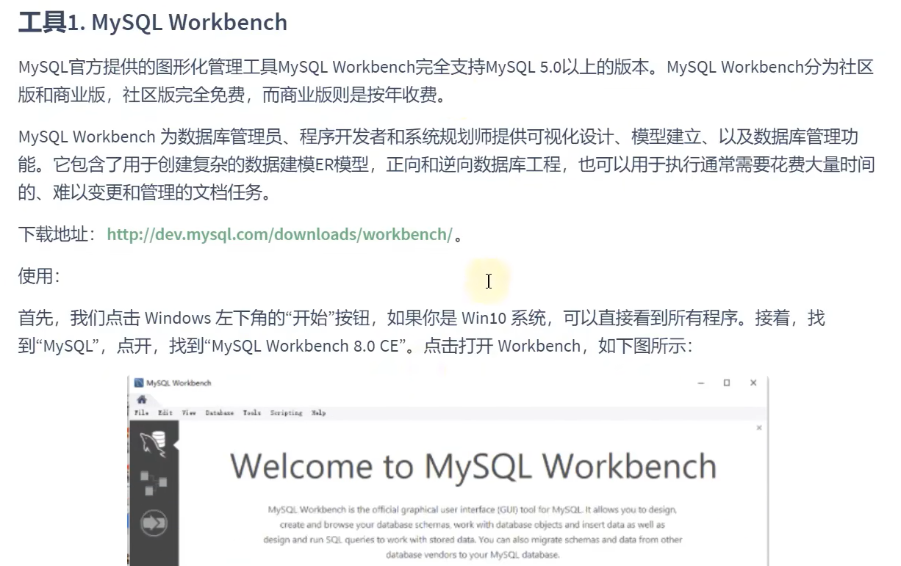

[TOC]

# 数据库概述

## 1 为什么要使用数据库

- 持久化：==把数据保存到可掉电式存储设备中以供之后使用==，大多数情况下，特别是企业级应用，==数据持久化意味着将内存中的数据保存到硬盘上加以固化==，而持久化的实现过程大多通过各种关系数据库来完成。
- 持久化的主要作用是==将内存中的数据存储在关系型数据库中==，当然也可以存储在磁盘文件、xml数据文件中。

## 2 数据库与数据库管理系统

### 2.1 数据库的相关概念

> DB: 数据库（Database)

即存储数据的仓库，本质是一个文件系统，它保存了一系列有组织的数据。

> DBMS：数据库管理系统（Database Management System）

是一种操作和管理数据库的大型软件、用于建立、使用和维护数据库，对数据库进行统一的管理和控制。用户通过数据库管理系统访问数据库中表内的数据。

> SQL ： 结构化查询语言（Structure Query Language）

专门用来与数据库通信的语言。

### 2.2 数据库与数据库管理系统的关系

数据库管理系统可以管理多个数据库，一般开发人员会针对每一个应用创建一个数据库，为保存应用中实体的数据，一般会在数据库中创建多个表，以保存程序中实体用户的数据。


## 3 关系型数据库和非关系型数据库

### 3.1 关系型数据库

> 实质

- 这种类型的数据库是**最古老**的数据库类型，关系型数据库模型是把最复杂的数据结构归结为简单的**二元关系**。
- 关系型数据库以**行(row)**和**列（column）**的形式存储数据，以便于用户理解，这一系列的行和列被称为**表**（table）， 
- 表与表之间的数据记录有关系，现实世界中的各种实体以及实体之间的关系均用**关系模型**来表示，关系型数据库就是建立在**关系模型**基础上的数据库。
- SQL就是关系型数据库的查询语言。

> 优势

- 复杂查询

  可以用SQL语句方便的在一个表以及多个表之间做非常复杂的数据查询。

- 事务支持

  使得对于安全性能很高的数据访问要求得以实现。

### 3.2 非关系型数据库

可看成传统关系型数据库的功能**阉割版本**，基于键值对存储数据，不需要经过SQL层的解析，**性能非常高**，同时，减少不常用的功能，进一步提高性能。

> 键值型数据库

键值型数据库通过Key-Value键值的方式来存储数据，其中Key和Value可以是简单的对象，也可以是复杂的对象，Key作为唯一的标识符，优点是查找速度快，在这方面明显优于关系型数据库，缺点是无法像关系型数据库一样使用条件过滤，如果你不知道去哪里找数据，就需要遍历所有的键，这样会消耗大量的计算，键值型数据库典型使用场景是作为内存缓存，Redis是最流行的键值型数据库。

> 文档型数据库


> 搜索引擎数据库


> 列式数据库


>  图形数据库


NoSQL的演变


## 4 关系型数据库设计规则


### 4.1  表、记录、字段


### 4.2 表的关联关系

- 表与表之间的数据记录有关系（relationship），现实世界中的各种实体以及实体之间的各种联系均用关系模型来表式。
- 四种：一对一关联、一对多关联、多对多关联、自我引用。

#### 4.2.1 一对一关联


#### 4.2.2 一对多关系


#### 4.2.3 多对多关系


#### 4.2.4 自我引用


# MySQL环境搭建

## 1. MySQL 卸载


## 2. MySQL的下载、安装、配置

### 2.1 MySQL的4大版本


### 2.2 MySQL下载

官网https://dev.mysql.com/downloads/

### 2.3 安装步骤


### 2.4 配置Mysql


### 2.5 配置环境变量	


### 2.6 安装失败的原因


## 3. MySQL的登录

### 3.1 服务的启动与停止


### 3.2 客户端的登录与登出


默认是root用户

>  cmd方式登录

```mysql
mysql -uroot -p123456
mysql -u root -P3306 -p123456
mysql -u root -P3306 -h127.0.0.1 -p
```

查看mysql版本


查看mysql的编码格式


## 4. MySQL 图形化管理工具

>  MySQL Workbench



> Navicat

> SQLyog

> dbeaver

## 5. MySQL 目录结构与源码

### 5.1 主要的目录结构


### 5.2 源代码获取


# 基本的SELECT语句

## 1. SQl概述

### 1.1 SQL 背景知识

​	

### 1.2 SQL语言排行榜


### 1.3 SQL分类


- DDL

  CREATE \ ALTER \ DROP \ RENAME \ TRUNCATE

- DML

  INSERT \ DELETE \ UPDATE \ SELECT

- DCL

  COMMIT \ ROLLBACK \ SAVEPOINT \ GRANT \ REVOKE

## 2. SQL语言的规则和规范

### 2.1 基本规则


### 2.2 基本规范


### 2.3 注释

```sql
单行注释：#注释文字（MySQl 特有的方式）
单行注释：-- 注释文字（--后面必须包含一个空格。）
多行注释：/* 注释文字 */
```

### 2.4 命名规则


### 2.5 数据导入指令

方式1 ： source 文件的全路径名

方式2：基于具体的图形化页面的工具

## 3. 基本的SELECT语句

```sql
-- 1. select 结构
SELECT 1;
SELECT 9/2;# 等价于 SELECT 9/2 FROM DUAL;

SELECT ... FROM ... ;

-- 2.别名
-- as:全称alias（别名），可以省略
-- 列的别名可以使用一对“”引起了
SELECT
	employee_id emp_id,
	first_name AS fnaeme,
	department_id "dept_id" 
FROM
	employees;
	
-- 3.去除重复行 DISTINCT
SELECT DISTINCT
	department_id
FROM
	employees;
	
-- 4.空值参与运算 
-- null 不等同于0,'','null'
-- 空值参与运算，结果一定为空
SELECT
	employee_id,
	salary "月工资",
	salary * ( 1 + IFNULL( commission_pct, 0 ) ) * 12 "年工资",
	commission_pct 
FROM
	employees;
	
-- 5.着重号 ``
-- 表名和列名一致时必须加

-- 6. 查询常数
SELECT
	'学习',employee_id
FROM
	employees;

-- 7.显示表结构
DESCRIBE employees;
DESC employees;
```

## 4. 过滤数据

```sql
-- SELECT ... FROM ... WHERE ... 
-- WHERE 语句需要在FROM后面
SELECT
	* 
FROM
	employees 
WHERE
	department_id = 90;
```

# 运算符

## 1. 算数运算符


## 2. 比较运算符

比较运算符用于对表达式左边的操作数和右边的操作数进行比较，比较结果为真返回1，比较结果为假返回0，其他情况返回NULL。

比较运算符经常被用来作为SELECT查询语句的条件来使用，返回符合条件的结果记录。


​	

## 3. 逻辑运算符


## 4. 位运算符


## 5. 运算符优先级


数字编号越大，优先级越高，优先级高的运算符先进行计算。可以看到，赋值运算符的优先级最低，使 用“()”括起来的表达式的优先级最高。

# 排序与分页

## 1.  排序数据

如果没有使用排序，默认情况下查询返回的数据是数据添加的顺序显示的。

```sql
-- 按照salary从高到低的顺序显示员工信息
SELECT
	employee_id,
	last_name,
	salary 
FROM
	employees 
ORDER BY
	salary DESC;
	
-- 按照salar从低到高排序ASC,如果 ORDER BY 后没有显示指定，默认按照升序排列
-- 列的别名只能在ORDER BY 中使用，不能在WHERE中使用

-- 显示员工信息，按照department_id的排序降序排列，再按照工资升序排序
SELECT
	employee_id,
	last_name,
	department_id 
FROM
	employees 
ORDER BY
	employee_id DESC, salary ASC;
```

## 2. 分页

```sql
-- mysql使用limit实现数据的分页
-- 每页显示20条记录，此时显示第1页
SELECT
	employee_id,
	last_name 
FROM
	employees 
	LIMIT 0,20;
	
-- 每页显示20条记录，此时显示第2页
SELECT
	employee_id,
	last_name 
FROM
	employees 
	LIMIT 20,20;
	
-- 每页显示pageSize条记录，此时显示第pageNo页
-- LIMIT(pageNo-1)*pageSize,pageSize;
-- LIMIT 0,条目数 等价于 LIMIT 条目数;

-- MySQL8.0新特性，LIMIT....OFFSET...
SELECT
	employee_id,
	last_name 
FROM
	employees 
	LIMIT 20 OFFSET 0;
	
```

> 拓展

在不同的 DBMS 中使用的关键字可能不同。在 MySQL、PostgreSQL、MariaDB 和 SQLite 中使用 LIMIT 关 键字，而且需要放到 SELECT 语句的最后面。 

- 如果是 SQL Server 和 Access，需要使用 TOP 关键字，比如： 

  ```sql
  SELECT TOP 5 name, hp_max FROM heros ORDER BY hp_max DESC
  ```

- 如果是 DB2，使用 FETCH FIRST 5 ROWS ONLY 这样的关键字：

  ```sql
  SELECT name, hp_max FROM heros ORDER BY hp_max DESC FETCH FIRST 5 ROWS ONLY
  ```

-  如果是 Oracle，你需要基于 ROWNUM 来统计行数： 

  ```sql
  SELECT rownum,last_name,salary FROM employees WHERE rownum < 5 ORDER BY salary DESC;
  ```
  
  需要说明的是，这条语句是先取出来前 5 条数据行，然后再按照 hp_max 从高到低的顺序进行排序。但 这样产生的结果和上述方法的并不一样。我会在后面讲到子查询，你可以使用
  
  ```
  SELECT last_name,salary
  FROM employees
  ORDER BY salary DESC)
  WHERE rownum < 10;
  ```
  
  得到与上述方法一致的结果。

# 多表查询


# 附录：建表语句以及数据

```sql
/*
SQLyog Ultimate v12.08 (64 bit)
MySQL - 5.7.28-log : Database - atguigudb
*********************************************************************
*/


/*!40101 SET NAMES utf8 */;

/*!40101 SET SQL_MODE=''*/;

/*!40014 SET @OLD_UNIQUE_CHECKS=@@UNIQUE_CHECKS, UNIQUE_CHECKS=0 */;
/*!40014 SET @OLD_FOREIGN_KEY_CHECKS=@@FOREIGN_KEY_CHECKS, FOREIGN_KEY_CHECKS=0 */;
/*!40101 SET @OLD_SQL_MODE=@@SQL_MODE, SQL_MODE='NO_AUTO_VALUE_ON_ZERO' */;
/*!40111 SET @OLD_SQL_NOTES=@@SQL_NOTES, SQL_NOTES=0 */;
CREATE DATABASE /*!32312 IF NOT EXISTS*/`atguigudb` /*!40100 DEFAULT CHARACTER SET utf8 */;

USE `atguigudb`;

/*Table structure for table `countries` */

DROP TABLE IF EXISTS `countries`;

CREATE TABLE `countries` (
  `country_id` char(2) NOT NULL,
  `country_name` varchar(40) DEFAULT NULL,
  `region_id` int(11) DEFAULT NULL,
  PRIMARY KEY (`country_id`),
  KEY `countr_reg_fk` (`region_id`),
  CONSTRAINT `countr_reg_fk` FOREIGN KEY (`region_id`) REFERENCES `regions` (`region_id`)
) ENGINE=InnoDB DEFAULT CHARSET=utf8;

/*Data for the table `countries` */

insert  into `countries`(`country_id`,`country_name`,`region_id`) values ('AR','Argentina',2),('AU','Australia',3),('BE','Belgium',1),('BR','Brazil',2),('CA','Canada',2),('CH','Switzerland',1),('CN','China',3),('DE','Germany',1),('DK','Denmark',1),('EG','Egypt',4),('FR','France',1),('HK','HongKong',3),('IL','Israel',4),('IN','India',3),('IT','Italy',1),('JP','Japan',3),('KW','Kuwait',4),('MX','Mexico',2),('NG','Nigeria',4),('NL','Netherlands',1),('SG','Singapore',3),('UK','United Kingdom',1),('US','United States of America',2),('ZM','Zambia',4),('ZW','Zimbabwe',4);

/*Table structure for table `departments` */

DROP TABLE IF EXISTS `departments`;

CREATE TABLE `departments` (
  `department_id` int(4) NOT NULL DEFAULT '0',
  `department_name` varchar(30) NOT NULL,
  `manager_id` int(6) DEFAULT NULL,
  `location_id` int(4) DEFAULT NULL,
  PRIMARY KEY (`department_id`),
  UNIQUE KEY `dept_id_pk` (`department_id`),
  KEY `dept_loc_fk` (`location_id`),
  KEY `dept_mgr_fk` (`manager_id`),
  CONSTRAINT `dept_loc_fk` FOREIGN KEY (`location_id`) REFERENCES `locations` (`location_id`),
  CONSTRAINT `dept_mgr_fk` FOREIGN KEY (`manager_id`) REFERENCES `employees` (`employee_id`)
) ENGINE=InnoDB DEFAULT CHARSET=utf8;

/*Data for the table `departments` */

insert  into `departments`(`department_id`,`department_name`,`manager_id`,`location_id`) values (10,'Administration',200,1700),(20,'Marketing',201,1800),(30,'Purchasing',114,1700),(40,'Human Resources',203,2400),(50,'Shipping',121,1500),(60,'IT',103,1400),(70,'Public Relations',204,2700),(80,'Sales',145,2500),(90,'Executive',100,1700),(100,'Finance',108,1700),(110,'Accounting',205,1700),(120,'Treasury',NULL,1700),(130,'Corporate Tax',NULL,1700),(140,'Control And Credit',NULL,1700),(150,'Shareholder Services',NULL,1700),(160,'Benefits',NULL,1700),(170,'Manufacturing',NULL,1700),(180,'Construction',NULL,1700),(190,'Contracting',NULL,1700),(200,'Operations',NULL,1700),(210,'IT Support',NULL,1700),(220,'NOC',NULL,1700),(230,'IT Helpdesk',NULL,1700),(240,'Government Sales',NULL,1700),(250,'Retail Sales',NULL,1700),(260,'Recruiting',NULL,1700),(270,'Payroll',NULL,1700);

/*Table structure for table `employees` */

DROP TABLE IF EXISTS `employees`;

CREATE TABLE `employees` (
  `employee_id` int(6) NOT NULL DEFAULT '0',
  `first_name` varchar(20) DEFAULT NULL,
  `last_name` varchar(25) NOT NULL,
  `email` varchar(25) NOT NULL,
  `phone_number` varchar(20) DEFAULT NULL,
  `hire_date` date NOT NULL,
  `job_id` varchar(10) NOT NULL,
  `salary` double(8,2) DEFAULT NULL,
  `commission_pct` double(2,2) DEFAULT NULL,
  `manager_id` int(6) DEFAULT NULL,
  `department_id` int(4) DEFAULT NULL,
  PRIMARY KEY (`employee_id`),
  UNIQUE KEY `emp_email_uk` (`email`),
  UNIQUE KEY `emp_emp_id_pk` (`employee_id`),
  KEY `emp_dept_fk` (`department_id`),
  KEY `emp_job_fk` (`job_id`),
  KEY `emp_manager_fk` (`manager_id`),
  CONSTRAINT `emp_dept_fk` FOREIGN KEY (`department_id`) REFERENCES `departments` (`department_id`),
  CONSTRAINT `emp_job_fk` FOREIGN KEY (`job_id`) REFERENCES `jobs` (`job_id`),
  CONSTRAINT `emp_manager_fk` FOREIGN KEY (`manager_id`) REFERENCES `employees` (`employee_id`)
) ENGINE=InnoDB DEFAULT CHARSET=utf8;

/*Data for the table `employees` */

insert  into `employees`(`employee_id`,`first_name`,`last_name`,`email`,`phone_number`,`hire_date`,`job_id`,`salary`,`commission_pct`,`manager_id`,`department_id`) values (100,'Steven','King','SKING','515.123.4567','1987-06-17','AD_PRES',24000.00,NULL,NULL,90),(101,'Neena','Kochhar','NKOCHHAR','515.123.4568','1989-09-21','AD_VP',17000.00,NULL,100,90),(102,'Lex','De Haan','LDEHAAN','515.123.4569','1993-01-13','AD_VP',17000.00,NULL,100,90),(103,'Alexander','Hunold','AHUNOLD','590.423.4567','1990-01-03','IT_PROG',9000.00,NULL,102,60),(104,'Bruce','Ernst','BERNST','590.423.4568','1991-05-21','IT_PROG',6000.00,NULL,103,60),(105,'David','Austin','DAUSTIN','590.423.4569','1997-06-25','IT_PROG',4800.00,NULL,103,60),(106,'Valli','Pataballa','VPATABAL','590.423.4560','1998-02-05','IT_PROG',4800.00,NULL,103,60),(107,'Diana','Lorentz','DLORENTZ','590.423.5567','1999-02-07','IT_PROG',4200.00,NULL,103,60),(108,'Nancy','Greenberg','NGREENBE','515.124.4569','1994-08-17','FI_MGR',12000.00,NULL,101,100),(109,'Daniel','Faviet','DFAVIET','515.124.4169','1994-08-16','FI_ACCOUNT',9000.00,NULL,108,100),(110,'John','Chen','JCHEN','515.124.4269','1997-09-28','FI_ACCOUNT',8200.00,NULL,108,100),(111,'Ismael','Sciarra','ISCIARRA','515.124.4369','1997-09-30','FI_ACCOUNT',7700.00,NULL,108,100),(112,'Jose Manuel','Urman','JMURMAN','515.124.4469','1998-03-07','FI_ACCOUNT',7800.00,NULL,108,100),(113,'Luis','Popp','LPOPP','515.124.4567','1999-12-07','FI_ACCOUNT',6900.00,NULL,108,100),(114,'Den','Raphaely','DRAPHEAL','515.127.4561','1994-12-07','PU_MAN',11000.00,NULL,100,30),(115,'Alexander','Khoo','AKHOO','515.127.4562','1995-05-18','PU_CLERK',3100.00,NULL,114,30),(116,'Shelli','Baida','SBAIDA','515.127.4563','1997-12-24','PU_CLERK',2900.00,NULL,114,30),(117,'Sigal','Tobias','STOBIAS','515.127.4564','1997-07-24','PU_CLERK',2800.00,NULL,114,30),(118,'Guy','Himuro','GHIMURO','515.127.4565','1998-11-15','PU_CLERK',2600.00,NULL,114,30),(119,'Karen','Colmenares','KCOLMENA','515.127.4566','1999-08-10','PU_CLERK',2500.00,NULL,114,30),(120,'Matthew','Weiss','MWEISS','650.123.1234','1996-07-18','ST_MAN',8000.00,NULL,100,50),(121,'Adam','Fripp','AFRIPP','650.123.2234','1997-04-10','ST_MAN',8200.00,NULL,100,50),(122,'Payam','Kaufling','PKAUFLIN','650.123.3234','1995-05-01','ST_MAN',7900.00,NULL,100,50),(123,'Shanta','Vollman','SVOLLMAN','650.123.4234','1997-10-10','ST_MAN',6500.00,NULL,100,50),(124,'Kevin','Mourgos','KMOURGOS','650.123.5234','1999-11-16','ST_MAN',5800.00,NULL,100,50),(125,'Julia','Nayer','JNAYER','650.124.1214','1997-07-16','ST_CLERK',3200.00,NULL,120,50),(126,'Irene','Mikkilineni','IMIKKILI','650.124.1224','1998-09-28','ST_CLERK',2700.00,NULL,120,50),(127,'James','Landry','JLANDRY','650.124.1334','1999-01-14','ST_CLERK',2400.00,NULL,120,50),(128,'Steven','Markle','SMARKLE','650.124.1434','2000-03-08','ST_CLERK',2200.00,NULL,120,50),(129,'Laura','Bissot','LBISSOT','650.124.5234','1997-08-20','ST_CLERK',3300.00,NULL,121,50),(130,'Mozhe','Atkinson','MATKINSO','650.124.6234','1997-10-30','ST_CLERK',2800.00,NULL,121,50),(131,'James','Marlow','JAMRLOW','650.124.7234','1997-02-16','ST_CLERK',2500.00,NULL,121,50),(132,'TJ','Olson','TJOLSON','650.124.8234','1999-04-10','ST_CLERK',2100.00,NULL,121,50),(133,'Jason','Mallin','JMALLIN','650.127.1934','1996-06-14','ST_CLERK',3300.00,NULL,122,50),(134,'Michael','Rogers','MROGERS','650.127.1834','1998-08-26','ST_CLERK',2900.00,NULL,122,50),(135,'Ki','Gee','KGEE','650.127.1734','1999-12-12','ST_CLERK',2400.00,NULL,122,50),(136,'Hazel','Philtanker','HPHILTAN','650.127.1634','2000-02-06','ST_CLERK',2200.00,NULL,122,50),(137,'Renske','Ladwig','RLADWIG','650.121.1234','1995-07-14','ST_CLERK',3600.00,NULL,123,50),(138,'Stephen','Stiles','SSTILES','650.121.2034','1997-10-26','ST_CLERK',3200.00,NULL,123,50),(139,'John','Seo','JSEO','650.121.2019','1998-02-12','ST_CLERK',2700.00,NULL,123,50),(140,'Joshua','Patel','JPATEL','650.121.1834','1998-04-06','ST_CLERK',2500.00,NULL,123,50),(141,'Trenna','Rajs','TRAJS','650.121.8009','1995-10-17','ST_CLERK',3500.00,NULL,124,50),(142,'Curtis','Davies','CDAVIES','650.121.2994','1997-01-29','ST_CLERK',3100.00,NULL,124,50),(143,'Randall','Matos','RMATOS','650.121.2874','1998-03-15','ST_CLERK',2600.00,NULL,124,50),(144,'Peter','Vargas','PVARGAS','650.121.2004','1998-07-09','ST_CLERK',2500.00,NULL,124,50),(145,'John','Russell','JRUSSEL','011.44.1344.429268','1996-10-01','SA_MAN',14000.00,0.40,100,80),(146,'Karen','Partners','KPARTNER','011.44.1344.467268','1997-01-05','SA_MAN',13500.00,0.30,100,80),(147,'Alberto','Errazuriz','AERRAZUR','011.44.1344.429278','1997-03-10','SA_MAN',12000.00,0.30,100,80),(148,'Gerald','Cambrault','GCAMBRAU','011.44.1344.619268','1999-10-15','SA_MAN',11000.00,0.30,100,80),(149,'Eleni','Zlotkey','EZLOTKEY','011.44.1344.429018','2000-01-29','SA_MAN',10500.00,0.20,100,80),(150,'Peter','Tucker','PTUCKER','011.44.1344.129268','1997-01-30','SA_REP',10000.00,0.30,145,80),(151,'David','Bernstein','DBERNSTE','011.44.1344.345268','1997-03-24','SA_REP',9500.00,0.25,145,80),(152,'Peter','Hall','PHALL','011.44.1344.478968','1997-08-20','SA_REP',9000.00,0.25,145,80),(153,'Christopher','Olsen','COLSEN','011.44.1344.498718','1998-03-30','SA_REP',8000.00,0.20,145,80),(154,'Nanette','Cambrault','NCAMBRAU','011.44.1344.987668','1998-12-09','SA_REP',7500.00,0.20,145,80),(155,'Oliver','Tuvault','OTUVAULT','011.44.1344.486508','1999-11-23','SA_REP',7000.00,0.15,145,80),(156,'Janette','King','JKING','011.44.1345.429268','1996-01-30','SA_REP',10000.00,0.35,146,80),(157,'Patrick','Sully','PSULLY','011.44.1345.929268','1996-03-04','SA_REP',9500.00,0.35,146,80),(158,'Allan','McEwen','AMCEWEN','011.44.1345.829268','1996-08-01','SA_REP',9000.00,0.35,146,80),(159,'Lindsey','Smith','LSMITH','011.44.1345.729268','1997-03-10','SA_REP',8000.00,0.30,146,80),(160,'Louise','Doran','LDORAN','011.44.1345.629268','1997-12-15','SA_REP',7500.00,0.30,146,80),(161,'Sarath','Sewall','SSEWALL','011.44.1345.529268','1998-11-03','SA_REP',7000.00,0.25,146,80),(162,'Clara','Vishney','CVISHNEY','011.44.1346.129268','1997-11-11','SA_REP',10500.00,0.25,147,80),(163,'Danielle','Greene','DGREENE','011.44.1346.229268','1999-03-19','SA_REP',9500.00,0.15,147,80),(164,'Mattea','Marvins','MMARVINS','011.44.1346.329268','2000-01-24','SA_REP',7200.00,0.10,147,80),(165,'David','Lee','DLEE','011.44.1346.529268','2000-02-23','SA_REP',6800.00,0.10,147,80),(166,'Sundar','Ande','SANDE','011.44.1346.629268','2000-03-24','SA_REP',6400.00,0.10,147,80),(167,'Amit','Banda','ABANDA','011.44.1346.729268','2000-04-21','SA_REP',6200.00,0.10,147,80),(168,'Lisa','Ozer','LOZER','011.44.1343.929268','1997-03-11','SA_REP',11500.00,0.25,148,80),(169,'Harrison','Bloom','HBLOOM','011.44.1343.829268','1998-03-23','SA_REP',10000.00,0.20,148,80),(170,'Tayler','Fox','TFOX','011.44.1343.729268','1998-01-24','SA_REP',9600.00,0.20,148,80),(171,'William','Smith','WSMITH','011.44.1343.629268','1999-02-23','SA_REP',7400.00,0.15,148,80),(172,'Elizabeth','Bates','EBATES','011.44.1343.529268','1999-03-24','SA_REP',7300.00,0.15,148,80),(173,'Sundita','Kumar','SKUMAR','011.44.1343.329268','2000-04-21','SA_REP',6100.00,0.10,148,80),(174,'Ellen','Abel','EABEL','011.44.1644.429267','1996-05-11','SA_REP',11000.00,0.30,149,80),(175,'Alyssa','Hutton','AHUTTON','011.44.1644.429266','1997-03-19','SA_REP',8800.00,0.25,149,80),(176,'Jonathon','Taylor','JTAYLOR','011.44.1644.429265','1998-03-24','SA_REP',8600.00,0.20,149,80),(177,'Jack','Livingston','JLIVINGS','011.44.1644.429264','1998-04-23','SA_REP',8400.00,0.20,149,80),(178,'Kimberely','Grant','KGRANT','011.44.1644.429263','1999-05-24','SA_REP',7000.00,0.15,149,NULL),(179,'Charles','Johnson','CJOHNSON','011.44.1644.429262','2000-01-04','SA_REP',6200.00,0.10,149,80),(180,'Winston','Taylor','WTAYLOR','650.507.9876','1998-01-24','SH_CLERK',3200.00,NULL,120,50),(181,'Jean','Fleaur','JFLEAUR','650.507.9877','1998-02-23','SH_CLERK',3100.00,NULL,120,50),(182,'Martha','Sullivan','MSULLIVA','650.507.9878','1999-06-21','SH_CLERK',2500.00,NULL,120,50),(183,'Girard','Geoni','GGEONI','650.507.9879','2000-02-03','SH_CLERK',2800.00,NULL,120,50),(184,'Nandita','Sarchand','NSARCHAN','650.509.1876','1996-01-27','SH_CLERK',4200.00,NULL,121,50),(185,'Alexis','Bull','ABULL','650.509.2876','1997-02-20','SH_CLERK',4100.00,NULL,121,50),(186,'Julia','Dellinger','JDELLING','650.509.3876','1998-06-24','SH_CLERK',3400.00,NULL,121,50),(187,'Anthony','Cabrio','ACABRIO','650.509.4876','1999-02-07','SH_CLERK',3000.00,NULL,121,50),(188,'Kelly','Chung','KCHUNG','650.505.1876','1997-06-14','SH_CLERK',3800.00,NULL,122,50),(189,'Jennifer','Dilly','JDILLY','650.505.2876','1997-08-13','SH_CLERK',3600.00,NULL,122,50),(190,'Timothy','Gates','TGATES','650.505.3876','1998-07-11','SH_CLERK',2900.00,NULL,122,50),(191,'Randall','Perkins','RPERKINS','650.505.4876','1999-12-19','SH_CLERK',2500.00,NULL,122,50),(192,'Sarah','Bell','SBELL','650.501.1876','1996-02-04','SH_CLERK',4000.00,NULL,123,50),(193,'Britney','Everett','BEVERETT','650.501.2876','1997-03-03','SH_CLERK',3900.00,NULL,123,50),(194,'Samuel','McCain','SMCCAIN','650.501.3876','1998-07-01','SH_CLERK',3200.00,NULL,123,50),(195,'Vance','Jones','VJONES','650.501.4876','1999-03-17','SH_CLERK',2800.00,NULL,123,50),(196,'Alana','Walsh','AWALSH','650.507.9811','1998-04-24','SH_CLERK',3100.00,NULL,124,50),(197,'Kevin','Feeney','KFEENEY','650.507.9822','1998-05-23','SH_CLERK',3000.00,NULL,124,50),(198,'Donald','OConnell','DOCONNEL','650.507.9833','1999-06-21','SH_CLERK',2600.00,NULL,124,50),(199,'Douglas','Grant','DGRANT','650.507.9844','2000-01-13','SH_CLERK',2600.00,NULL,124,50),(200,'Jennifer','Whalen','JWHALEN','515.123.4444','1987-09-17','AD_ASST',4400.00,NULL,101,10),(201,'Michael','Hartstein','MHARTSTE','515.123.5555','1996-02-17','MK_MAN',13000.00,NULL,100,20),(202,'Pat','Fay','PFAY','603.123.6666','1997-08-17','MK_REP',6000.00,NULL,201,20),(203,'Susan','Mavris','SMAVRIS','515.123.7777','1994-06-07','HR_REP',6500.00,NULL,101,40),(204,'Hermann','Baer','HBAER','515.123.8888','1994-06-07','PR_REP',10000.00,NULL,101,70),(205,'Shelley','Higgins','SHIGGINS','515.123.8080','1994-06-07','AC_MGR',12000.00,NULL,101,110),(206,'William','Gietz','WGIETZ','515.123.8181','1994-06-07','AC_ACCOUNT',8300.00,NULL,205,110);

/*Table structure for table `job_grades` */

DROP TABLE IF EXISTS `job_grades`;

CREATE TABLE `job_grades` (
  `grade_level` varchar(3) DEFAULT NULL,
  `lowest_sal` int(11) DEFAULT NULL,
  `highest_sal` int(11) DEFAULT NULL
) ENGINE=InnoDB DEFAULT CHARSET=utf8;

/*Data for the table `job_grades` */

insert  into `job_grades`(`grade_level`,`lowest_sal`,`highest_sal`) values ('A',1000,2999),('B',3000,5999),('C',6000,9999),('D',10000,14999),('E',15000,24999),('F',25000,40000);

/*Table structure for table `job_history` */

DROP TABLE IF EXISTS `job_history`;

CREATE TABLE `job_history` (
  `employee_id` int(6) NOT NULL,
  `start_date` date NOT NULL,
  `end_date` date NOT NULL,
  `job_id` varchar(10) NOT NULL,
  `department_id` int(4) DEFAULT NULL,
  PRIMARY KEY (`employee_id`,`start_date`),
  UNIQUE KEY `jhist_emp_id_st_date_pk` (`employee_id`,`start_date`),
  KEY `jhist_job_fk` (`job_id`),
  KEY `jhist_dept_fk` (`department_id`),
  CONSTRAINT `jhist_dept_fk` FOREIGN KEY (`department_id`) REFERENCES `departments` (`department_id`),
  CONSTRAINT `jhist_emp_fk` FOREIGN KEY (`employee_id`) REFERENCES `employees` (`employee_id`),
  CONSTRAINT `jhist_job_fk` FOREIGN KEY (`job_id`) REFERENCES `jobs` (`job_id`)
) ENGINE=InnoDB DEFAULT CHARSET=utf8;

/*Data for the table `job_history` */

insert  into `job_history`(`employee_id`,`start_date`,`end_date`,`job_id`,`department_id`) values (101,'1989-09-21','1993-10-27','AC_ACCOUNT',110),(101,'1993-10-28','1997-03-15','AC_MGR',110),(102,'1993-01-13','1998-07-24','IT_PROG',60),(114,'1998-03-24','1999-12-31','ST_CLERK',50),(122,'1999-01-01','1999-12-31','ST_CLERK',50),(176,'1998-03-24','1998-12-31','SA_REP',80),(176,'1999-01-01','1999-12-31','SA_MAN',80),(200,'1987-09-17','1993-06-17','AD_ASST',90),(200,'1994-07-01','1998-12-31','AC_ACCOUNT',90),(201,'1996-02-17','1999-12-19','MK_REP',20);

/*Table structure for table `jobs` */

DROP TABLE IF EXISTS `jobs`;

CREATE TABLE `jobs` (
  `job_id` varchar(10) NOT NULL DEFAULT '',
  `job_title` varchar(35) NOT NULL,
  `min_salary` int(6) DEFAULT NULL,
  `max_salary` int(6) DEFAULT NULL,
  PRIMARY KEY (`job_id`),
  UNIQUE KEY `job_id_pk` (`job_id`)
) ENGINE=InnoDB DEFAULT CHARSET=utf8;

/*Data for the table `jobs` */

insert  into `jobs`(`job_id`,`job_title`,`min_salary`,`max_salary`) values ('AC_ACCOUNT','Public Accountant',4200,9000),('AC_MGR','Accounting Manager',8200,16000),('AD_ASST','Administration Assistant',3000,6000),('AD_PRES','President',20000,40000),('AD_VP','Administration Vice President',15000,30000),('FI_ACCOUNT','Accountant',4200,9000),('FI_MGR','Finance Manager',8200,16000),('HR_REP','Human Resources Representative',4000,9000),('IT_PROG','Programmer',4000,10000),('MK_MAN','Marketing Manager',9000,15000),('MK_REP','Marketing Representative',4000,9000),('PR_REP','Public Relations Representative',4500,10500),('PU_CLERK','Purchasing Clerk',2500,5500),('PU_MAN','Purchasing Manager',8000,15000),('SA_MAN','Sales Manager',10000,20000),('SA_REP','Sales Representative',6000,12000),('SH_CLERK','Shipping Clerk',2500,5500),('ST_CLERK','Stock Clerk',2000,5000),('ST_MAN','Stock Manager',5500,8500);

/*Table structure for table `locations` */

DROP TABLE IF EXISTS `locations`;

CREATE TABLE `locations` (
  `location_id` int(4) NOT NULL DEFAULT '0',
  `street_address` varchar(40) DEFAULT NULL,
  `postal_code` varchar(12) DEFAULT NULL,
  `city` varchar(30) NOT NULL,
  `state_province` varchar(25) DEFAULT NULL,
  `country_id` char(2) DEFAULT NULL,
  PRIMARY KEY (`location_id`),
  UNIQUE KEY `loc_id_pk` (`location_id`),
  KEY `loc_c_id_fk` (`country_id`),
  CONSTRAINT `loc_c_id_fk` FOREIGN KEY (`country_id`) REFERENCES `countries` (`country_id`)
) ENGINE=InnoDB DEFAULT CHARSET=utf8;

/*Data for the table `locations` */

insert  into `locations`(`location_id`,`street_address`,`postal_code`,`city`,`state_province`,`country_id`) values (1000,'1297 Via Cola di Rie','00989','Roma',NULL,'IT'),(1100,'93091 Calle della Testa','10934','Venice',NULL,'IT'),(1200,'2017 Shinjuku-ku','1689','Tokyo','Tokyo Prefecture','JP'),(1300,'9450 Kamiya-cho','6823','Hiroshima',NULL,'JP'),(1400,'2014 Jabberwocky Rd','26192','Southlake','Texas','US'),(1500,'2011 Interiors Blvd','99236','South San Francisco','California','US'),(1600,'2007 Zagora St','50090','South Brunswick','New Jersey','US'),(1700,'2004 Charade Rd','98199','Seattle','Washington','US'),(1800,'147 Spadina Ave','M5V 2L7','Toronto','Ontario','CA'),(1900,'6092 Boxwood St','YSW 9T2','Whitehorse','Yukon','CA'),(2000,'40-5-12 Laogianggen','190518','Beijing',NULL,'CN'),(2100,'1298 Vileparle (E)','490231','Bombay','Maharashtra','IN'),(2200,'12-98 Victoria Street','2901','Sydney','New South Wales','AU'),(2300,'198 Clementi North','540198','Singapore',NULL,'SG'),(2400,'8204 Arthur St',NULL,'London',NULL,'UK'),(2500,'Magdalen Centre, The Oxford Science Park','OX9 9ZB','Oxford','Oxford','UK'),(2600,'9702 Chester Road','09629850293','Stretford','Manchester','UK'),(2700,'Schwanthalerstr. 7031','80925','Munich','Bavaria','DE'),(2800,'Rua Frei Caneca 1360 ','01307-002','Sao Paulo','Sao Paulo','BR'),(2900,'20 Rue des Corps-Saints','1730','Geneva','Geneve','CH'),(3000,'Murtenstrasse 921','3095','Bern','BE','CH'),(3100,'Pieter Breughelstraat 837','3029SK','Utrecht','Utrecht','NL'),(3200,'Mariano Escobedo 9991','11932','Mexico City','Distrito Federal,','MX');

/*Table structure for table `order` */

DROP TABLE IF EXISTS `order`;

CREATE TABLE `order` (
  `order_id` int(11) DEFAULT NULL,
  `order_name` varchar(15) DEFAULT NULL
) ENGINE=InnoDB DEFAULT CHARSET=utf8;

/*Data for the table `order` */

insert  into `order`(`order_id`,`order_name`) values (1,'shkstart'),(2,'tomcat'),(3,'dubbo');

/*Table structure for table `regions` */

DROP TABLE IF EXISTS `regions`;

CREATE TABLE `regions` (
  `region_id` int(11) NOT NULL,
  `region_name` varchar(25) DEFAULT NULL,
  PRIMARY KEY (`region_id`),
  UNIQUE KEY `reg_id_pk` (`region_id`)
) ENGINE=InnoDB DEFAULT CHARSET=utf8;

/*Data for the table `regions` */

insert  into `regions`(`region_id`,`region_name`) values (1,'Europe'),(2,'Americas'),(3,'Asia'),(4,'Middle East and Africa');

/*Table structure for table `emp_details_view` */

DROP TABLE IF EXISTS `emp_details_view`;

/*!50001 DROP VIEW IF EXISTS `emp_details_view` */;
/*!50001 DROP TABLE IF EXISTS `emp_details_view` */;

/*!50001 CREATE TABLE  `emp_details_view`(
 `employee_id` int(6) ,
 `job_id` varchar(10) ,
 `manager_id` int(6) ,
 `department_id` int(4) ,
 `location_id` int(4) ,
 `country_id` char(2) ,
 `first_name` varchar(20) ,
 `last_name` varchar(25) ,
 `salary` double(8,2) ,
 `commission_pct` double(2,2) ,
 `department_name` varchar(30) ,
 `job_title` varchar(35) ,
 `city` varchar(30) ,
 `state_province` varchar(25) ,
 `country_name` varchar(40) ,
 `region_name` varchar(25) 
)*/;

/*View structure for view emp_details_view */

/*!50001 DROP TABLE IF EXISTS `emp_details_view` */;
/*!50001 DROP VIEW IF EXISTS `emp_details_view` */;

/*!50001 CREATE ALGORITHM=UNDEFINED DEFINER=`root`@`localhost` SQL SECURITY DEFINER VIEW `emp_details_view` AS select `e`.`employee_id` AS `employee_id`,`e`.`job_id` AS `job_id`,`e`.`manager_id` AS `manager_id`,`e`.`department_id` AS `department_id`,`d`.`location_id` AS `location_id`,`l`.`country_id` AS `country_id`,`e`.`first_name` AS `first_name`,`e`.`last_name` AS `last_name`,`e`.`salary` AS `salary`,`e`.`commission_pct` AS `commission_pct`,`d`.`department_name` AS `department_name`,`j`.`job_title` AS `job_title`,`l`.`city` AS `city`,`l`.`state_province` AS `state_province`,`c`.`country_name` AS `country_name`,`r`.`region_name` AS `region_name` from (((((`employees` `e` join `departments` `d`) join `jobs` `j`) join `locations` `l`) join `countries` `c`) join `regions` `r`) where ((`e`.`department_id` = `d`.`department_id`) and (`d`.`location_id` = `l`.`location_id`) and (`l`.`country_id` = `c`.`country_id`) and (`c`.`region_id` = `r`.`region_id`) and (`j`.`job_id` = `e`.`job_id`)) */;

/*!40101 SET SQL_MODE=@OLD_SQL_MODE */;
/*!40014 SET FOREIGN_KEY_CHECKS=@OLD_FOREIGN_KEY_CHECKS */;
/*!40014 SET UNIQUE_CHECKS=@OLD_UNIQUE_CHECKS */;
/*!40111 SET SQL_NOTES=@OLD_SQL_NOTES */;
```


