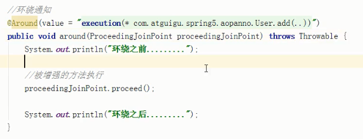

[TOC]

# Spring 框架概述

1. Spring框架是轻量级的开源的JavaEE框架。

2. Spring可以解决企业应用开发的复杂性。

3. Spring有两个核心部分：IOC和Aop

   - IOC : 控制反转，把创建对象过程交给Spring进行管理。
   - Aop : 面向切面，不修改源码进行功能增强。

4. Spring框架的特点：

   - 方便解耦，简化开发。
   - Aop编程支持。
   - 方便程序测试。
   - 方便集成其他框架。
   - 方便事务操作。
   - 方便API开发难度。


# IOC 容器

## IOC 概念和原理

1. 什么是IOC

   - 控制反转，把对象创建和对象之间的调用过程，交给Spring进行管理。
   - 使用IOC目的：为了降低耦合度。

2. IOC底层原理

   - xml解析、工厂模式、反射

3. IOC过程 进一步降低耦合度

   ```java
   //第一步 xml配置文件，配置创建的对象
   <bean id = "dao" class = "com.bonc.UserDao"></bean>
   //第二步，有service类和到类，创建工厂类
   class UserFactory{
       public static UserDao getDao(){
           String classValue = class属性值;//xml解析
           Class clazz = Class.forName(classValue);//2.通过反射创建对象
           return (UserDao)clazz.newInstance();
       }
   }
   ```

4. bean xml文件

   ```xml
   <?xml version="1.0" encoding="UTF-8"?>
   <beans xmlns="http://www.springframework.org/schema/beans"
          xmlns:xsi="http://www.w3.org/2001/XMLSchema-instance"
          xsi:schemaLocation="http://www.springframework.org/schema/beans http://www.springframework.org/schema/beans/spring-beans.xsd">
   
   </beans>
   ```

   
## IOC 接口

   - IOC思想基于IOC容器完成，IOC容器底层就是对象工厂。

   - Spring提供IOC容器实现的两种方式：（两个接口）

     - BeanFactory:IOC容器基本实现，是Spring内部的使用的接口，不提供给开发人员使用。、

       > 加载配置文件时不会创建对象，在获取(使用)对象时才创建对象。

     - ApplicationContext：BeanFactory的子接口，提供了更多更强大的功能，一般由开发人员使用。

       > 加载配置文件时候就会把配置文件对象进行创建。

   - ApplicationContext的实现类

     

     - FileSystemXmlApplicationContext 绝对路径
     - ClassPathXmlApplicationContext 相对路径

## IOC 操作(Bean管理) - xml

1. 什么是Bean管理

   Bean管理指的是两个操作：

   - 1.1 Spring创建对象
   - 1.2 Spring注入属性

2. Bean管理操作有两种操作方式

   - 1.1 基于xml配置文件方式实现
   - 1.2 基于注解方式实现

### 基于xml方式管理

1. 基于xml方式创建对象

   ```xml
   <bean id="user" class="com.bonc.User"></bean>
   ```

   - 1.1 在spring配置文件中，使用bean标签，在标签里面添加对于属性，就可以实现对象创建。
   - 1.2 在bean标签有很多属性，介绍常用的属性。
     - id属性：唯一标识

     - class属性：类全路径（包类路径）

     - name属性：与id属性相同，其中可以加一些特殊符号
   - 1.3 创建对象时，默认也是执行无参数构造方法完成对象创建。

2. 基于xml方式注入属性

   1. DI:依赖注入，是IOC中的一种具体实现

      - 使用set方法注入

        ```java
        //1.创建属性并创建构造方法
        public class Book{
            private String bname;
            private String bauthor;
            public void setBname(String bname){
                this.bname = bname;
            }
                public void setBauthor(String bauthor){
                this.bauthor = bauthor;
            }
        }
        ```

        

        ```xml
        <!--2.set方法注入属性-->
        <bean id="book" class="com.bonc.Book">
            <property name="bname" value="天龙八部"></property>
                <property name="bauthor" value="金庸"></property>
        </bean>

      - 使用构造器方法注入

        ```java
        //1.创建属性和构造方法
        public class Order {
            private String oname;
            private String address;
        
            public Order(String oname, String address) {
                this.oname = oname;
                this.address = address;
            }
        }
        ```

        ```xml
            <!-- 2.构造器注入属性   -->
            <bean id="order" class="com.bonc.Order">
                <constructor-arg name="oname" value="abc"></constructor-arg>
                <constructor-arg name="address" value="China"></constructor-arg>
            </bean>
        ```

        ```java
        //测试
        @Test
            public void test1(){
                ApplicationContext context = new ClassPathXmlApplicationContext("bean.xml");
                Order order = context.getBean("order", Order.class);
                System.out.println(order);
            }
        ```

3. p名称空间注入

   - 使用p名称空间注入，可以简化基于xml配置方式。

     添加p名称空间在配置文件中

     ```xml
     <beans xmlns="http://www.springframework.org/schema/beans"
            xmlns:xsi="http://www.w3.org/2001/XMLSchema-instance"
            xmlns:p="http://www.springframework.org/schema/p"
            xsi:schemaLocation="http://www.springframework.org/schema/beans http://www.springframework.org/schema/beans/spring-beans.xsd">
     ```

4. IOC操作Bean管理(xml注入其他类型属性)

   - 4.1字面量
     
     - null 值 `<null/>`标签
     
       ```xml
      <bean id="order1" class="com.bonc.Order">
        <constructor-arg name="oname">
            <null/>
        </constructor-arg>
        <constructor-arg name="address" value="China"></constructor-arg>
      </bean>
       ```
     
     - 属性值包含特殊符号 带特殊符号的内容写到CDATA中
     
       ``` xml
         <bean id="order2" class="com.bonc.Order">
             <constructor-arg name="oname">
                 <value><![CDATA[<<南京>>]]></value>
             </constructor-arg>
             <constructor-arg name="address" value="China"></constructor-arg>
         </bean>
       ```
     
   - 4.2 注入属性-外部bean

     - 创建两个类service类和dao类

     - 在service调用dao里面的方法

       ```java
       package com.bonc.service;
       
       import dao.UserDao;
       
       public class UserService {
       
           private UserDao userDao;
       
           public void setUserDao(UserDao userDao) {
               this.userDao = userDao;
           }
       
           public void add(){
               System.out.println("service add...");
               userDao.update();
           }
       }
       //------
       package com.bonc.dao;
       public interface UserDao {
       
           public void update();
       }
       
       //-----
       package com.bonc.dao;
       
       public class UserDaoImpl implements UserDao {
           @Override
           public void update() {
               System.out.println("userDao update...");
           }
       }
       
       
       
       ```

       ```xml
       <bean id="aaa" class="com.bonc.service.UserService" >
           <property name = "userDao" ref="bbb"></property>
       </bean>
       
       <bean id="bbb" class="com.bonc.dao.UserDaoImpl"></bean>
       ```

   - 4.3 注入属性-内部bean

     - 一对多关系：部门和员工

     - 在实体类中表示一对多关系

       ```xml
       <bean id="emp" class="com.bonc.Emp">
           <property name="ename" value="lucy"></property>
           <property name="gender" value="女"></property>
           <property name="dept">
               <bean id="dept1" class="com.bonc.Dept">
                   <property name="dname" value="安保部"></property>
               </bean>
           </property>
       </bean>
       ```

   - 4.4 注入属性-级联赋值

     ```xml
     <bean id="emp" class="com.bonc.Emp">
         <property name="ename" value="lucy"></property>
         <property name="gender" value="女"></property>
         <!--级联赋值-->
         <property name="dept" ref="dept"></property>
     </bean>
     <bean id="dept" class="com.bonc.Dept">
         <property name="dname" value="安保部"></property>
     </bean>
     ```

   - 4.5 注入集合属性

     ```xml
     <!--集合类型属性注入-->
     <bean id="stu" class="com.bonc.Stu">
         <!--数组类型-->
         <property name="arrays">
             <array>
                 <value>java课程</value>
                 <value>数据库课程</value>
             </array>
         </property>
         <!--list类型-->
         <property name="list">
             <list>
                 <value>张三</value>
                 <value>李四</value>
             </list>
         </property>
         <!--map类型注入-->
         <property name="maps">
             <map>
                 <entry key="JAVA" value="java"></entry>
                 <entry key="PHP" value="php"></entry>
             </map>
         </property>
         <!--set类型注入-->
         <property name="sets">
             <set>
                 <value>mysql</value>
                 <value>oracle</value>
             </set>
         </property>
     </bean>
     ```

     在集合中注入对象

     ```xml
     <!--集合类型属性注入-->
     <bean id="stu" class="com.bonc.Stu">
         <!--注入list类型，值是对象-->
         <property name="courseList">
             <list>
                 <ref bean="course1"></ref>
                 <ref bean="course2"></ref>
             </list>
         </property>
     </bean>
     
     <bean id="course1" class="com.bonc.Course">
         <property name="cname" value="spring5"></property>
     </bean>
     <bean id="course2" class="com.bonc.Course">
         <property name="cname" value="spring6"></property>
     </bean>
     ```

     把集合注入部分提取出来作为公共部分

     (1)引入util命令空间

     ```xml
     <?xml version="1.0" encoding="UTF-8"?>
     <beans xmlns="http://www.springframework.org/schema/beans"
            xmlns:xsi="http://www.w3.org/2001/XMLSchema-instance"
            xmlns:util="http://www.springframework.org/schema/util"
            xsi:schemaLocation="http://www.springframework.org/schema/beans http://www.springframework.org/schema/beans/spring-beans.xsd
                                http://www.springframework.org/schema/util http://www.springframework.org/schema/util/spring-util.xsd">
         <!--提取list集合类型属性注入-->
         <util:list id="bookList">
             <value>易筋经</value>
             <value>九阳神功</value>
             <value>九阴真经</value>
         </util:list>
         
         <bean id="stu1" class="com.bonc.Stu">
         	<property name="list" ref="bookList"></property>
     	</bean>
     </beans>
     ```

   - 4.6 FactoryBean

     - Spring中有两种bean,一种为普通bean,一种为工厂bean。

     - 普通bean:在配置文件中定义bean类型就是返回类型。

     - 工厂bean:在配置文件中定义bean类型可以和返回类型不一样。

       1. 创建类让这个类作为工厂bean,实现接口FactoryBean接口。
       2. 实现接口里面的方法，在实现的方法中定义返回的bean类型。

       ```java
       package com.bonc;
       
       import org.springframework.beans.factory.FactoryBean;
       
       /**
        * @author ZhengHang
        * @create 2021-09-16 14:29
        */
       public class TestFactoryBean implements FactoryBean<Order> {
           @Override
           public Order getObject() throws Exception {
               return new Order("111", "2222");
           }
       
           @Override
           public Class<?> getObjectType() {
               return null;
           }
       
           @Override
           public boolean isSingleton() {
               return false;
           }
       }
          /** 
          <bean id="stu1" class="com.bonc.TestFactoryBean"></bean>
       	*/
       ```

### Bean的作用域

- 在Spring里面可以设置创建bean实例是但实例还是多实例。

- 在Spring里面，默认是单实例。

- 在spring配置文件bean标签里面有属性(scope)用于设置单实例还是多实例。

- scope值有多个，常用的值有两个

  - (1) 默认值，singleton，表示是单实例对象。
  - (2) prototype，表示是多实例对象。
  - request && session

- singleton和prototype区别：

  - (1) singleton单实例，prototype多实例。

  - (2) 设置scope值是singleton时候，加载spring配置文件时会创建单实例对象。

     设置scope值是prototype的时候，不是在加载spring配置文件的时候创建对象，在调用getBean方法时候创建。

### Bean的生命周期

1. 生命周期

   从对象创建到对象销毁的过程。

2. bean生命周期

   - 2.1 通过构造器创建bean实例（无参数构造）。
   - 2.2 为bean的属性设置和对其他bean引用（调用set方法）。
   - 2.3 调用bean的初始化方法（需要进行配置）。
   - 2.4 bean可以使用获取。
   - 2.5 当容器关闭时候，调用bean的销毁的方法（需要进行配置销毁的方法）。

3. bean的后置处理器，bean的生命周期有七步

   - 2.1 通过构造器创建bean实例（无参数构造）。
   - 2.2 为bean的属性设置和对其他bean引用（调用set方法）。
   - 2.3 ==把bean的实例传递给bean后置处理器的postProcessBeforeInitialization方法。==
   - 2.4 调用bean的初始化方法（需要进行配置）。
   - 2.5 ==把bean实例传递给bean后置处理器的postProcessAfterInitialization方法。==
   - 2.6 bean可以使用获取。
   - 2.7 当容器关闭时候，调用bean的销毁的方法（需要进行配置销毁的方法）。

### Bean自动装配

1. 自动装配

   根据指定装配规则（属性名称或者属性类型），spring自动将匹配的属性值进行注入。

2. autowire属性常用两个值：

   - byName根据属性名称注入，注入值bean的id值和类属性名称一样。
   - byType根据属性类型注入。

### 外部属性文件

1. 直接配置属性文件信息

   

2. 引入外部属性文件配置

   

   (2)引入命名空间

   

   

## IOC 操作(Bean管理) - 注解

1. 注解

   注解是代码中特殊标记，格式@注解名称(属性名称=属性值,属性名称=属性值),使用注解为了简化xml配置。

2. Spring针对Bean管理中创建对象提供注解。

   - @Component
   - @Service
   - @Controller
   - @Repository

   上边的四个注解功能是一样的，都可以用来创建bean实例。

3. 基于注解实现对象创建

   - 开启组件扫描

   ```xml
   <?xml version="1.0" encoding="UTF-8"?>
   <beans xmlns="http://www.springframework.org/schema/beans"
          xmlns:xsi="http://www.w3.org/2001/XMLSchema-instance"
          xmlns:context="http://www.springframework.org/schema/context"
          xsi:schemaLocation="http://www.springframework.org/schema/beans http://www.springframework.org/schema/beans/spring-beans.xsd
                              http://www.springframework.org/schema/context http://www.springframework.org/schema/context/spring-context.xsd">
   
       <!--
       1. 如果扫描多个包，多个包使用逗号隔开。
       2. 或者扫描包的上次目录
       -->
       <context:component-scan base-package="com.bonc.mapper,com.bonc.dao"></context:component-scan>
   
   </beans>
   ```

   - 在类加上注解

     

   - 测试

     

4. 组件扫描中的配置

   

   
   
5. 基于注解实现属性注入
  
  - @AutoWired: 根据属性类型自动装配
  - @Qualifier: 根据属性名称进行注入。需要和@AutoWired一起使用。
  - @Resource: 可以根据类型注入，可以根据名称注入，javax.annotation.Resource，不是Spring中的注解。
  - @Value: 注入基本类型属性
  
6. 完全注解开发

   - (1) 创建配置类，为了替代配置文件。

     

   - (2) 测试类

     

# AOP 面向切面编程

1. 什么是AOP

   - AOP是面向切面(方面)编程，利用AOP可以对业务逻辑的各个部分进行隔离，从而使得业务逻辑各部分之间的耦合度降低，提高程序的可重用性，同时提高了开发效率。
   - 通俗描述：在不修改源代码的情况下，在主干功能里面添加新功能。

2. 底层原理

   - AOP底层使用动态代理

     - 有接口情况，使用JDK中动态代理

       

     - 没有接口情况，使用CGLIB动态代理

       

3. JDK动态代理实现

   - 使用jdk动态代理，使用Proxy类里面的方法创建代理对象。

     

     方法有三个参数：

     - 第一个参数：类加载器；
     - 第二个参数：增强方法所在类实现的接口，支持多个接口；
     - 第三个参数：实现InvacationHandler接口，创建代理对象，写增强的方法。

4. AOP操作术语

   - 连接点

     类中可以被增强的方法，这些方法被称为连接点。

   - 切入点

     实际被增强的方法被称为切入点。

   - 通知(增强)

     实际增强的逻辑部分称为通知(增强)

     通知有多种类型：

     - 前置通知
     - 后置通知
     - 环绕通知
     - 异常通知
     - 最终通知

   - 切面

     是一个动作，指的是把通知应用到切入点的过程。

5. AOP操作(准备)

   - Spring框架中一般基于AspectJ实现AOP操作

     AspectJ不是Spring组成部分，独立的AOP框架，一般把AspectJ和Spring框架一起使用，进行AOP操作。

   - pom依赖

     ```xml
     <dependency>
         <groupId>org.springframework</groupId>
         <artifactId>spring-aop</artifactId>
         <version>${spring.version}</version>
     </dependency>
     
     <!--aspectJ依赖-->
     <dependency>
         <groupId>org.aspectj</groupId>
         <artifactId>aspectjweaver</artifactId>
         <version>${aspectj.version}</version>
     </dependency>
     <dependency>
         <groupId>org.aspectj</groupId>
         <artifactId>aspectjrt</artifactId>
         <version>${aspectj.version}</version>
     </dependency>
     ```

   - 基于AspectJ实现AOP操作

     (1)基于xml配置文件实现

     (2)基于注解方式实现

   - 切入点表达式

     (1)切入点表达式作用：对指定类中的指定方法进行增强。

     (2)语法结构：

     - `execution([权限修饰符][返回类型][类全路径][方法名称][参数列表])`

     - 示例：对com.bonc.TestSpring类中add方法增强

       `execution(* com.bonc.TestSpring.add(..))`权限修饰符可以省略，*代表所有类型，..表示所有参数。

6. 基于AspectJ注解实现

   - 开启注解扫描

   - 使用创建原始类和增强类

   - 在增强类上加@Aspect注解

   - 在spring配置文件中开启aspectj生成代理对象

     

   - 配置不同类型的通知

     在增强类中作为通知方法上面添加通知类型的注解，在注解中添加切入点表达式。

     注解类型：

     - @Before

     - @After

     - @AfterReturning

     - @AfterThrowing

     - @Around

       

   - 对相同的切入点进行抽取

     

   - 有多个增强类增强同一个方法，设置增强类优先级

     在增强类上添加Order注解，Order注解的value值是数值类型，值越小优先级越高，从0开始。

7. 基于AspectJ配置文件实现

   

8. 完全使用注解开发

   

# 事务操作

1. 事务的概念

   事务是数据库操作最基本单元，逻辑上的一组操作，要么都成功，要么度失败。

2. 事务的四个特性(ACID)

   - 原子性
   - 一致性
   - 隔离性
   - 持久性

3. 事务管理

   - 3.1 Spring进行事务管理的两种方式
     - 编程式事务管理
     - 声明式事务管理(常用)
   - 3.2 声明式事务管理两种方式
     - 基于注解方式(常用)
     - 基于xml配置文件方式
   - 3.3 在Spring进行声明式事务管理，底层使用AOP原理
   - 

