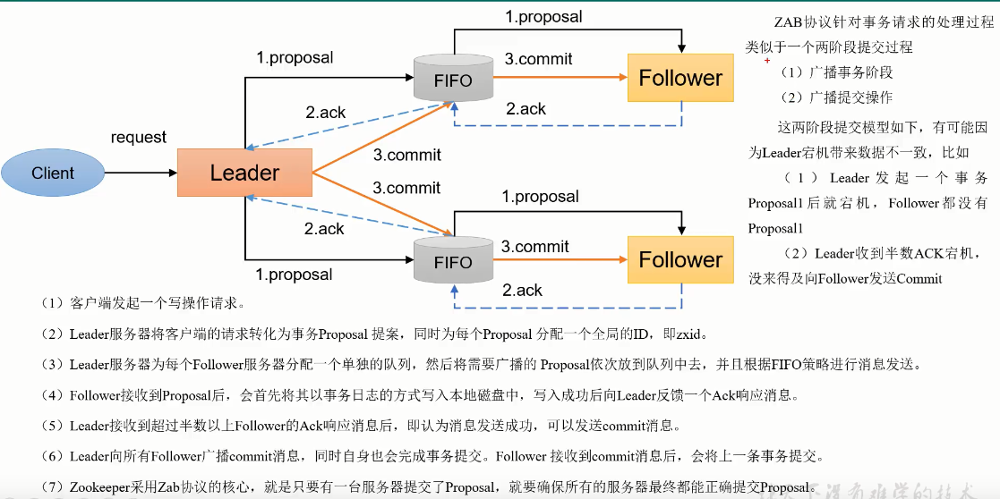

[TOC]

# 1.Zookeeper入门

## 1.1 概述

Zookeeper是一个开源的分布式的，为分布式框架提供服务的Apache项目。

Zookeeper工作机制：zookeeper是设计模式角度来理解：是一个基于观察者模式设计的分布式服务管理框架，它**负责存储和管理大家都关心的数据**，然后**接受观察者的注册**，一旦这些数据的状态发生变化，Zookeeper就将**负责通知已经在Zookeeper上注册的那些观察者**做出相应的反应。

Zookeeper相当于文件系统+通知机制。

## 1.2 特定

- Zookeeper：一个Leader和多个Follower组成的集群。
- 集群中只要有半数以上节点存活，Zookeeper集群就能正常服务。所以Zookeeper适合安装奇数台服务器。
- 全局数据一致：每个Server保存一份相同的数据副本，Client无论连接到哪个Server，数据都是一致的。
- 更新请求顺序执行，来自同一个Client的更新请求按照其发送顺序依次执行。
- 数据更新原子性，一次数据更新要么成功，要么失败。
- 实时性，在一定时间范围内，Client能读到最新数据。

## 1.3 数据结构

Zookeeper数据模型的结构与Unix文件系统很类似，整体上可以看作一棵树，每个节点称做一个ZNode。每一个ZNode默认能够存储1MB的数据，每个ZNode都可以**通过其路径唯一标识**。

## 1.4 应用场景

提供的服务包括：统一命名服务，统一配置管理，统一集群管理，服务器节点动态上下线，软负载均衡等。

- 统一命名服务

  

- 统一配置管理

  

- 统一集群管理

  

- 服务器动态上下线

  

- 软负载均衡

  


# 2.搭建集群

- 下载地址

  `https://archive.apache.org/dist/zookeeper/`

## 2.1 配置参数解读

- tickTime = 2000：通信心跳时间，Zookeeper服务器与客户端心跳时间，单位毫秒

- initLimit = 10：LF初始通信时限。Leader和Follower初始连接时能容忍的最多心跳数(tickTime的数量)

- syncLimit = 5：LF同步通信时限。Leader和Follower之间通信时间，如果超过syncLimit*tickTime ,从服务器列表中删除Follower。

- dataDir：保存Zookeeper中的数据

  默认为tmp目录，容易被Linux系统定期删除，所以一般不用默认目录。

- clientPort = 2181：客户端连接端口，通常不做修改。

## 2.2 集群安装

- 解压安装，假设安装路径为`/mnt/disk1/zookeeper/`

- 配置服务器编号

  ```shell
  #在目录下创建ZkData
  cd /mnt/disk1/zookeeper/
  mkdir zkData
  #在zkData目录下创建一个myid的文件
  vi myid (或者 echo "1" >myid)
  #文件中添加与server对应的编号，上下不要有空行，
  #左右不要有空格，其他的myid按顺序增长即可(2,3)
  ```

- 配置zoo.cfg

  ```shell
  #复制zoo_sample.cfg为zoo.cfg
  cp zoo_sample.cfg zoo.cfg
  #打开zoo.cfg文件，配置存储路径
  vim zoo.cfg
  dataDir=/mnt/disk1/zookeeper/zkData
  server.1=hadoop101:2888:3888
  server.2=hadoop102:2888:3888
  server.3=hadoop103:2888:3888
  ```

- server.A=B:C:D解读

  - A是一个数字，表示这个是第几号服务器；

    集群模式下配置一个文件myid，这个文件在dataDir目录下，这个文件里边有一个数据就是A的值，**Zookeeper启动时读取此文件，拿到里面的数据与zoo.cfg里面的配置信息比较，从而判断到底是哪个server**。

  - B是这个服务器的地址；

  - C是这个服务器Follower与集群中的Leader服务器交换信息的端口；

  - D是Leader服务器挂了之后，选举Leader用的端口号；

- 启动服务器

  ```shell
  bin/zkServer.sh start
  ```

## 2.3 选举机制

- Zookeeper第一次启动

  

- Zookeeper非第一次启动

  

# 3.zk操作

```shell
# 连接hadoop102集群
bin/zkCli.sh -server hadoop102:2181

# 查看节点
ls /

# 获取数据
get -s /
#cZxid Zookeeper为节点分配的Id
#cTime 节点创建时间
#mZxid 修改后的id
#mtime 修改时间
#pZxid 子节点id
#cversion 子节点的version
#dataVersion 当前节点数据的版本号
#aclVersion 权限Version
#dataLength 数据长度
#numChildren 子节点个数

# 创建节点
create /sanguo "111"

# 修改数据
set /sanguo "123"

# 删除一个节点
delete /sanguo/jin
# 递归删除节点
deleteall /sanguo
```

## 3.1 节点类型

持久(Persistent):客户端和服务器断开连接后，创建的节点不删除。

短暂(Ephemeral):客户端和服务器断开连接后，创建的节点自己删除。

- 持久化目录节点

  客户端与Zookeeper断开连接后，该节点依旧存在。

- 持久化顺序编号目录节点

  客户端与Zookeeper断开连接后，该节点依旧存在，只是Zookeeper给该节点名称进行顺序编号

- 临时目录节点

  客户端与Zookeeper断开连接后，该节点被删除。

- 临时顺序编号目录节点

  客户端与Zookeeper断开连接后，该节点被删除，只是Zookeeper给该节点名称进行顺序编号

> 说明：创建ZNode是设置顺序标识，ZNode名称后会附加一个值，顺序号是一个单调递增的计数器，由父节点维护。
>
> ==注意：在分布式系统中，顺序号可以被用于为所有的事件进行全局排序，这样客户端可以通过顺序号判断事件的顺序。==

## 3.2 监听器原理

1. 监听器原理

   - 首先要有一个main()线程
   - 在main()线程中创建Zookeeper客户端，这时就会创建两个线程，一个负责网络通信，一个负责监听。
   - 通过connect线程将注册的监听事件发送给Zookeeper
   - 在Zookeeper的注册监听器列表中将注册的监听事件添加到列表中。
   - Zookeeper监听到有数据或路径变化，就会将这个消息发送给listener线程。
   - listener线程内部调用process()方法

2. 常见的监听

   - 监听节点数据的变化

     get path [watch]

   - 监听子节点增减的变化

     ls path [watch]

3. 命令

   ```shell
   # 监听数据值的变化，只监听一次数据变化，
   get -w /sanguo
   # 监听路径变化
   ls -w /sanguo
   ```

## 3.3 api接口

```xml
<depedency>
    <groupId>org.apache.zookeeper</groupId>
    <artifactId>zookeeper</artifactId>
    <version>3.5.7</version>
</depedency>
```

创建客户端


## 3.4 写数据原理

- 请求发送给leader


zookeeper超过半数便可以相应client应答

- 请求发送给follower


# 4.Zookeeper分布式锁案例

Curator框架实现分布式锁

1. 原生的Java API开发存在的问题

   - 会话连接是异步的，需要自己去处理
   - Watch需要重复注册，不然就不能生效
   - 开发的复杂性比较高
   - 不支持多节点删除和创建，需要自己去递归实现

2. Curator是一个专门解决分布式锁的框架，解决了原生Java API开发分布式遇到的问题。

   - 官方文档地址`https://curator.apache.org/index.html`

3. 依赖

   ```xml
   <dependency>
       <groupId>org.apache.curator</groupId>
       <artifactId>curator-framework</artifactId>
       <version>4.3.0</version>
   </dependency>
   <dependency>
       <groupId>org.apache.curator</groupId>
       <artifactId>curator-recipes</artifactId>
       <version>4.3.0</version>
   </dependency>
   <dependency>
       <groupId>org.apache.curator</groupId>
       <artifactId>curator-client</artifactId>
       <version>4.3.0</version>
   </dependency>
   ```

4. Curator的使用

   

# 5.Zookeeper源码

## 5.1 算法基础

### 5.1.1 Paxos算法

解决的问题：


算法描述：


存在的问题：

系统中有一个以上的Proposer式，多个Proposers互相争夺Acceptor，造成无法达到一致的情况，即活锁。针对这种情况，一种改进的Paxos算法被提出：从系统中选出一个节点作为Leader，只有Leader能够发起提案。

### 5.1.2 Zab协议

Zab协议借鉴了Paxos算法，是特别为Zookeeper设计的支持崩溃恢复的原子广播协议。基于该协议，Zookeeper设计为只有一台客户端Leader负责处理外部的写事务请求，然后Leader客户端将数据同步到其他Follower节点。即Zookeeper只有一个Leader可以发起提案。Zab协议包括两种基本模式：==消息广播、崩溃恢复==。

消息广播



崩溃恢复

- 异常情况


- Leader选举


- 数据恢复


### 5.1.3 CAP理论


## 5.2 辅助源码

### 5.2.1 持久化源码

Leader和Follower中的数据会在内存和磁盘中各保存一份。所以需要将内存中的数据持久化到磁盘中。

在org.apache.zookeeper.server.persistence包下的相关类中都是序列化相关代码。


### 5.2.2 序列化源码

zookeeper-jute代码是关于Zookeeper序列化相关源码。


## 5.3 服务端初始化源码


## 5.4 服务端加载数据源码


## 5.5 选举源码


选举准备


zk选举


## 5.6 Leader和Follower状态同步


## 5.7 Leader&&Follower启动

leader启动


follower启动


## 5.8 客户端启动


