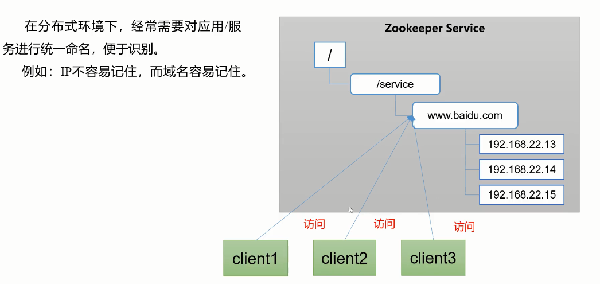
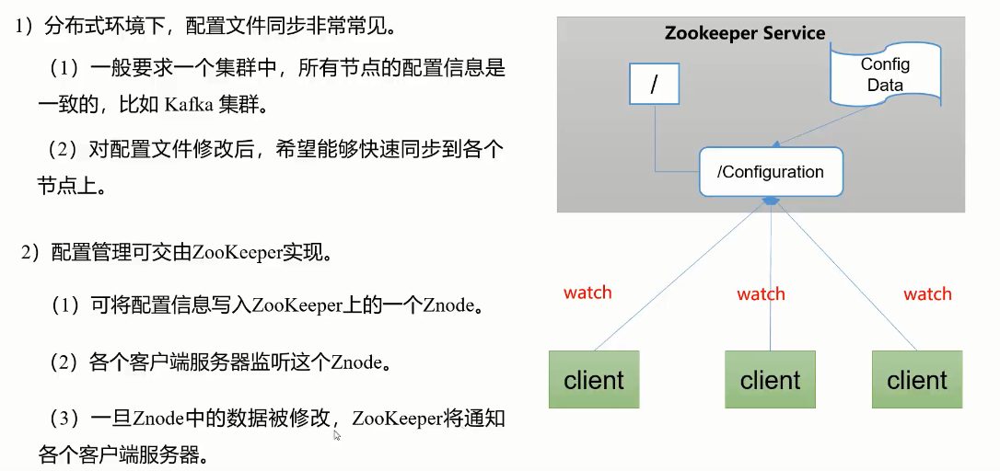
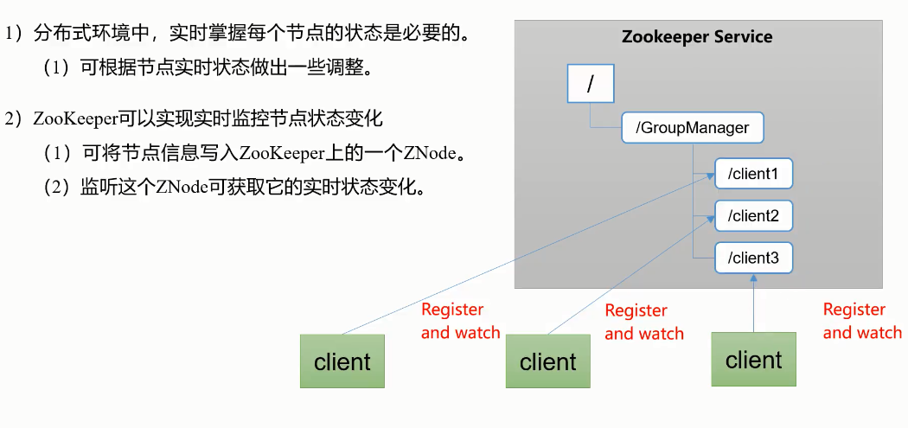
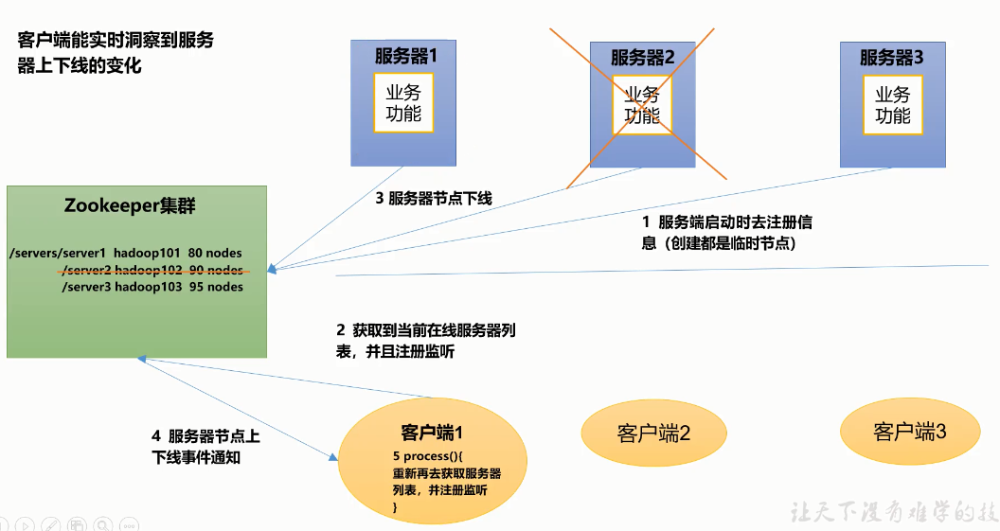
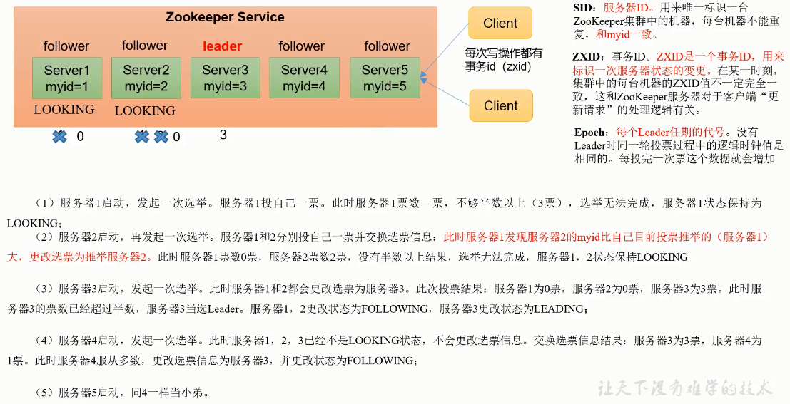

[TOC]

# 1.Zookeeper入门

## 1.1 概述

Zookeeper是一个开源的分布式的，为分布式框架提供服务的Apache项目。

Zookeeper工作机制

zookeeper是设计模式角度来理解：是一个基于观察者模式设计的分布式服务管理框架，它**负责存储和管理大家都关心的数据**，然后**接受观察者的注册**，一旦这些数据的状态发生变化，Zookeeper就将**负责通知已经在Zookeeper上注册的那些观察者**做出相应的反应。

Zookeeper相当于文件系统+通知机制。

## 1.2 特定

- Zookeeper：一个Leader和多个Follower组成的集群。
- 集群中只要有半数以上节点存活，Zookeeper集群就能正常服务。所以Zookeeper适合安装奇数台服务器。
- 全局数据一致：每个Server保存一份相同的数据副本，Client无论连接到哪个Server，数据都是一致的。
- 更新请求顺序执行，来自同一个Client的更新请求按照其发送顺序依次执行。
- 数据更新原子性，一次数据更新要么成功，要么失败。
- 实时性，在一定时间范围内，Client能读到最新数据。

## 1.3 数据结构

Zookeeper数据模型的结构与Unix文件系统很类似，整体上可以看作一棵树，每个节点称做一个ZNode。每一个ZNode默认能够存储1MB的数据，每个ZNode都可以**通过其路径唯一标识**。

## 1.4 应用场景

提供的服务包括：统一命名服务，统一配置管理，统一集群管理，服务器节点动态上下线，软负载均衡等。

- 统一命名服务

  

- 统一配置管理

  

- 统一集群管理

  

- 服务器动态上下线

  

- 软负载均衡

  


# 2.搭建集群

- 下载地址

  `https://archive.apache.org/dist/zookeeper/`

## 2.1 配置参数解读

- tickTime = 2000：通信心跳时间，Zookeeper服务器与客户端心跳时间，单位毫秒

- initLimit = 10：LF初始通信时限。Leader和Follower初始连接时能容忍的最多心跳数(tickTime的数量)

- syncLimit = 5：LF同步通信时限。Leader和Follower之间通信时间，如果超过syncLimit*tickTime ,从服务器列表中删除Follower。

- dataDir：保存Zookeeper中的数据

  默认为tmp目录，容易被Linux系统定期删除，所以一般不用默认目录。

- clientPort = 2181：客户端连接端口，通常不做修改。

## 2.2 集群安装

- 解压安装，假设安装路径为`/mnt/disk1/zookeeper/`

- 配置服务器编号

  ```shell
  #在目录下创建ZkData
  cd /mnt/disk1/zookeeper/
  mkdir zkData
  #在zkData目录下创建一个myid的文件
  vi myid (或者 echo "1" >myid)
  #文件中添加与server对应的编号，上下不要有空行，
  #左右不要有空格，其他的myid按顺序增长即可(2,3)
  ```

- 配置zoo.cfg

  ```shell
  #复制zoo_sample.cfg为zoo.cfg
  cp zoo_sample.cfg zoo.cfg
  #打开zoo.cfg文件，配置存储路径
  vim zoo.cfg
  dataDir=/mnt/disk1/zookeeper/zkData
  server.1=hadoop101:2888:3888
  server.2=hadoop101:2888:3888
  server.3=hadoop101:2888:3888
  ```

- server.A=B:C:D解读

  - A是一个数字，表示这个是第几号服务器；

    集群模式下配置一个文件myid，这个文件在dataDir目录下，这个文件里边有一个数据就是A的值，**Zookeeper启动时读取此文件，拿到里面的数据与zoo.cfg里面的配置信息比较，从而判断到底是哪个server**。

  - B是这个服务器的地址；

  - C是这个服务器Follower与集群中的Leader服务器交换信息的端口；

  - D是Leader服务器挂了之后，选举Leader用的端口号；

- 启动服务器

  ```shell
  bin/zkServer.sh start
  ```

## 2.3 选举机制

- Zookeeper第一次启动

  

- 

