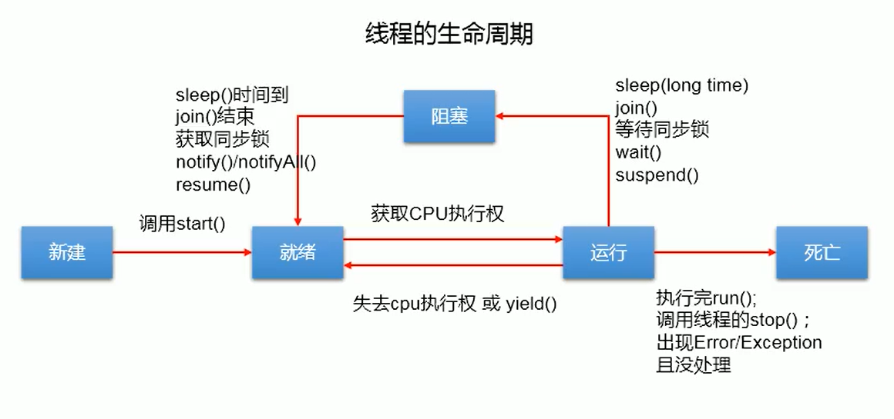

[toc]
---

### 一进程和多线程简介
#### 1.1相关概念

>**何为进程？**

==进程是程序的一次执行过程==，是系统运行程序的基本单位，因此进程是动态的。==系统运行一个程序即是一个进程从创建，运行到消亡的过程==。简单来说，==一个进程就是一个执行中的程序==，它在计算机中一个指令接着一个指令地执行着，同时每个进程还占有某些系统资源如CPU时间，内存空间，文件，输入输出设备的使用权等等，换句话说，当程序在执行时，将会被操作系统载入存中。

>**何为线程？**

线程与进程类似，但是线程是一个比进程更小的执行单位。一个进程在执行器执行的过程中可以产生多个线程。与进程不同的是同类的==多个线程共享同一个内存空间和一组系统资源，所以系统在产生一个线程，后者在各个线程之间做切换工作时，负担要比进程小得多==，也正因为如此，==线程也被称为轻量级进程。==

#### 1.2多线程

>**何为多线程？**

多线程就是几乎同时执行的多个线程(一个处理器在某一个时间点上永远都只能是一个线程！即使这个处理器是多核的，除非有多个处理器才能实现多个线程同时运行。)。几乎同时是因为实际上多线程程序中的多个线程实际上是一个线程执行一会儿然后其他线程再执行，并不是同时执行。

>**为什么多线程是必要的？**

1.使用线程可以把占据长时间的程序中的任务放到后台去处理。
2.用户界面可以更加吸引人，这样比如用户点击一个按钮去除法某些事件的处理可以弹出一个进度条来显示处理的速度。
3.程序的运行速度可能加快。

#### 1.3并行与并发
并行：多个CPU实例或者多台机器同时执行一段处理逻辑，是真正的同时。

并发：通过CPU调度算法，让用户看上去同时执行，实际上从CPU操作层面不是真正的同时。比昂发旺旺在场景中占有公共的资源，那么针对这个公用的资源往往产生瓶颈，我们会用TPS或者QPS来反映这个系统的处理能力。
>QPS：QueriesPerSecond意思是“每秒查询率”，是一台服务器每秒能够相应的查询次数，是对一个特定的查询服务器在规定时间内所处理流量多少的衡量标准。

>TPS：是TransactionsPerSecond的缩写，也就是事务数/秒。它是软件测试结果的测量单位。一个事务是指一个客户机向服务器发送请求然后服务器做出反应的过程。客户机在发送请求时开始计时，收到服务器响应后结束计时，以此来计算使用的时间和完成的事务个数。

#### 1.4线程安全
线程安全：经常用来描绘一段代码，指在并发的情况下，改代码经过多线程的使用，线程的调度顺序不影响任何结果。这时候使用多线程，我们只需要关注系统的内存，CPU是不是够用即可。反过来，线程不安全就意味着线程的调度顺序会影响最终结果，如不加事务转账的代码：

```java
voidtransferMoney(Userfrom,Userto,floatamount){
to.setMoney(to.getBalance()+amount);
from.setMoney(from.getBalance()-amount);
}
```
#### 1.5同步
同步：java中的同步指的是通过人为的控制和调度，保证共享的多线程访问成为线程安全，来保证结果的准确。如上边简单加入synchronized关键字。在保证结果准确的同时，提高性能，才是优秀的程序。线程安全的优先级高于性能。
### 二使用多线程
#### 2.1继承Thread类

```java
publicclassMyThreadextendsThread{
	@Override
	publicvoidrun(){
		super.run();
		System.out.println("MyThread");
	}
}

publicclassTestMain{
	publicstaticvoidmain(String[]args){
		MyThreadmythread=newMyThread();
		mythread.start();
		System.out.println("运行结束");
	}
}
/*
*运行结果：
运行结束
MyThread
*/
```
从上面的运行结果可以看出：==线程是一个子任务，CPU以不确定的方式，或者说是以随机的时间来调用线程中的run方法。==

#### 2.2实现Runnable接口
==推荐实现Runnable接口方式开发多线程，因为Java单继承但是可以实现多个接口==

```java
publicclassMyRunnableimplementsRunnable{
	@Override
	publicvoidrun(){
		System.out.println("MyRunnable");
	}
}

publicclassTestMain{
	publicstaticvoidmain(String[]args){
		Runnablerunnable=newMyRunnable();
		Threadthread=newThread(runnable);
		thread.start();
		System.out.println("运行结束！");
	}
}
/*
*运行结果：
运行结束
MyRunnable
*/
```
#### 2.3直接声明线程并使用

```java
publicclassTestMain{
	publicstaticvoidmain(String[]args){
	newThread(newRunnable(){
			@Override
			publicvoidrun(){
				//TODOAuto-generatedmethodstub
				System.out.print("TestThread");
			}
		}).start();
	System.out.println("运行结束");
	}
}
/*
*运行结果：
运行结束
TestThread
*/
```
### 三实例变量和线程安全
定义线程类中的实例变量针对其他线程可以有共享和不共享之分

#### 3.1不共享数据的情况

```java
publicclassMyThreadextendsThread{

	privateintcount=5;

	publicMyThread(Stringname){
		super();
		this.setName(name);
	}

	@Override
	publicvoidrun(){
		super.run();
		while(count>0){
			count--;
			System.out.println("由"+MyThread.currentThread().getName()
					+"计算，count="+count);
		}
	}
}

publicclassTestMain{
	publicstaticvoidmain(String[]args){
		MyThreada=newMyThread("A");
		MyThreadb=newMyThread("B");
		MyThreadc=newMyThread("C");
		a.start();
		b.start();
		c.start();
	}
}

/*
*运行结果：
由A计算，count=4
由A计算，count=3
由A计算，count=2
由A计算，count=1
由A计算，count=0
由C计算，count=4
由B计算，count=4
由B计算，count=3
由B计算，count=2
由B计算，count=1
由B计算，count=0
由C计算，count=3
由C计算，count=2
由C计算，count=1
由C计算，count=0
*/
```
#### 3.2共享数据的情况

```java
publicclassMyThreadextendsThread{

	privateintcount=5;

	@Override
	publicvoidrun(){
		super.run();
		count--;
		System.out.println("由"+MyThread.currentThread().getName()+"计算，count="+count);
	}
}

publicclassTestMain{

	publicstaticvoidmain(String[]args){
		MyThreadmythread=newMyThread();
//下列线程都是通过mythread对象创建的
		Threada=newThread(mythread,"A");
		Threadb=newThread(mythread,"B");
		Threadc=newThread(mythread,"C");
		Threadd=newThread(mythread,"D");
		Threade=newThread(mythread,"E");
		a.start();
		b.start();
		c.start();
		d.start();
		e.start();
	}
}
/*
*运行结果：
由A计算，count=4
由B计算，count=2
由D计算，count=1
由C计算，count=2
由E计算，count=0
*/
```
可以看出这里已经出现了错误，我们想要的是依次递减的结果。为什么呢？

因为在大多数jvm中，count--的操作分为如下下三步：

1.取得原有count值
2.计算i-1
3.对i进行赋值

所以多个线程同时访问时出现问题就是难以避免的了。

那么有没有什么解决办法呢？
==在run方法前加上synchronized关键字即可得到正确答案。==
>多线程的同步机制对资源进行加锁，使得在同一个时间，只有一个线程可以进行操作，同步用以解决多个线程同时访问时可能出现的问题。
>同步机制可以使用synchronized关键字实现。
>==当synchronized关键字修饰一个方法的时候，该方法叫做同步方法。==
>当synchronized方法执行完或发生异常时，会自动释放锁。

>**说明:**
>如果一个对象有多个synchronized方法，某一时刻某个线程已经进入到了某个synchronized方法，那么在该方法没有执行完毕前，其他线程是无法访问该对象的任何synchronized方法的。
>
>**结论:**
>当synchronized关键字修饰一个方法的时候，该方法叫做同步方法。
>
>Java中的每个对象都有一个锁（lock），或者叫做监视器（monitor），当一个线程访问某个对象的synchronized方法时，==将该对象上锁，其他任何线程都无法再去访问该对象的synchronized方法了（这里是指所有的同步方法，而不仅仅是同一个方法）==，直到之前的那个线程执行方法完毕后（或者是抛出了异常），才将该对象的锁释放掉，其他线程才有可能再去访问该对象的synchronized方法。
>
>注意这时候是==给对象上锁==，如果是不同的对象，则各个对象之间没有限制关系。
>==尝试在代码中构造第二个线程对象时传入一个新的Example对象，则两个线程的执行之间没有什么制约关系。==

>当一个synchronized关键字修饰的方法同时又被static修饰，之前说过，非静态的同步方法会将对象上锁，但是静态方法不属于对象，而是属于类，==它会将这个方法所在的类的Class对象上锁==
>
>==所以如果是静态方法的情况（execute()和execute2()都加上static关键字），即便是向两个线程传入不同的Example对象，这两个线程仍然是互相制约的，必须先执行完一个，再执行下一个。==
>
>**结论:**
>如果某个synchronized方法是static的，那么当线程访问该方法时，它锁的并不是synchronized方法所在的对象，而是synchronized方法所在的类所对应的Class对象。Java中，无论一个类有多少个对象，这些对象会对应唯一一个Class对象，因此当线程分别访问同一个类的两个对象的两个static，synchronized方法时，它们的执行顺序也是顺序的，也就是说一个线程先去执行方法，执行完毕后另一个线程才开始。


```java
publicclassMyThreadextendsThread{

	privateintcount=5;

	@Override
	publicsynchronizedvoidrun(){
		super.run();
		count--;
		System.out.println("由"+MyThread.currentThread().getName()+"计算，count="+count);
		}
}
/*
*运行结果：
由A计算，count=4
由D计算，count=3
由C计算，count=2
由B计算，count=1
由E计算，count=0
*/
```
###  四一些常用的方法

#### 4.1currentThread()
返回对当前正在执行的线程对象的引用。
#### 4.2getId()
返回此线程的标识符
#### 4.3getName()
返回此线程的名称
#### 4.4getPriority()
返回此线程的优先级
#### 4.5isAlive()
测试这个线程是否还处于活动状态。
==什么是活动状态呢？==
活动状态就是线程已经启动且尚未终止。线程处于正在运行或准备运行的状态。
#### 4.6sleep(longmillis)
使当前正在执行的线程以指定的毫秒数“休眠”（暂时停止执行），具体取决于系统定时器和调度程序的精度和准确性。
#### 4.7interrupt()
中断这个线程。
#### 4.8interrupted()和isInterrupted()
interrupted()：测试当前线程是否已经是中断状态，执行后具有将状态标志清除为false的功能
isInterrupted()：测试线程Thread对相关是否已经是中断状态，但部清楚状态标志
#### 4.9setName(Stringname)
将此线程的名称更改为等于参数name。
#### 4.10isDaemon()
测试这个线程是否是守护线程。
#### 4.11setDaemon(booleanon)
将此线程标记为daemon线程或用户线程。
#### 4.12join()
在很多情况下，主线程生成并起动了子线程，如果子线程里要进行大量的耗时的运算，主线程往往将于子线程之前结束，但是如果主线程处理完其他的事务后，需要用到子线程的处理结果，也就是==主线程需要等待子线程执行完成之后再结束，这个时候就要用到join()方法了。==
join()的作用是：“==等待该线程终止==”，这里需要理解的就是该线程是指的主线程等待子线程的终止。也就是在子线程调用了join()方法后面的代码，只有等到子线程结束了才能执行
#### 4.13yield()
yield()方法的作用是放弃当前的CPU资源，将它让给其他的任务去占用CPU时间。注意：放弃的时间不确定，可能一会就会重新获得CPU时间片。
#### 4.14setPriority(intnewPriority)
更改此线程的优先级
### 五停止一个线程
#### 5.1interrupted()
interrupted()方法判断线程是否停止;

break退出循环：
```java
publicclassMyThreadextendsThread{
	@Override
	publicvoidrun(){
		super.run();
		for(inti=0;i<500000;i++){
			if(this.interrupted()){
				System.out.println("已经是停止状态了!我要退出了!");
				break;
			}
			System.out.println("i="+(i+1));
		}
		System.out.println("看到这句话说明线程并未终止------");
		//可以用来释放资源
	}
}
publicclassTestMain{

	publicstaticvoidmain(String[]args){
		try{
			MyThreadthread=newMyThread();
			thread.start();
			Thread.sleep(2000);
			thread.interrupt();
		}catch(InterruptedExceptione){
			System.out.println("maincatch");
			e.printStackTrace();
		}
		System.out.println("end!");
	}

}
```
设置旗标flag退出循环
原理上与break相同，使用volatile说明可以被其他线程修改
```java
	privatevolatilebooleanflag=false;
	while(flag){
	//run()函数逻辑主体
	}
	//释放资源的位置;
```
### 六线程优先级
每个线程都具有各自的优先级，==线程的优先级可以在程序中表明该线程的重要性，如果有很多线程处于就绪状态，系统会根据优先级来决定首先使哪个线程进入运行状态==。但这个并不意味着低优先级的线程得不到运行，而只是它运行的几率比较小，如垃圾回收机制线程的优先级就比较低。所以很多垃圾得不到及时的回收处理。

==线程优先级具有继承特性==比如A线程启动B线程，则B线程的优先级和A是一样的。

==线程优先级具有随机性==也就是说线程优先级高的不一定每一次都先执行完。
### 七JAVA多线程分类
#### 7.1多线程分类
==用户线程==：运行在前台，执行具体的任务如程序的主线程、连接网络的子线程等都是用户线程。

==守护线程==：运行在后台，为其他前台服务，也可以说守护线程是JVM中非守护线程的"佣人"。

特点：一旦所有用户线程都结束运行，守护线程会随JVM一起结束工作。

应用：数据库连接池中的检测线程，JVM虚拟机启动后的检测线程。

==最常见的守护线程==：垃圾回收线程。

#### 7.2如何设置守护线程？
通过调用==Thread类的setDaemon(true)方法==设置当前的线程为守护线程。

注意事项:
>
>1.setDaemon(true)必须在start（）方法前执行，否则会抛出IllegalThreadStateException异常
>2.在守护线程中产生的新线程也是守护线程
>3.不是所有的任务都可以分配给守护线程来执行，比如读写操作或者计算逻辑

### 八线程间状态转换



#### 8.1synchronized,wait,notify

任何对象都具有的同步工具。

synchronized在获锁的过程中是不能被中断的。
**monitor**
Java中的每个对象都有一个监视器，来监测并发代码的重入。在非多线程编码时该监视器不发挥作用，反之如果在synchronized范围内，监视器发挥作用。

wait/notify必须存在于synchronized块中。并且，这三个关键字针对的是同一个监视器（某对象的监视器）。这意味着wait之后，其他线程可以进入同步块执行。

>notify唤醒沉睡的线程后，线程会接着上次的执行继续往下执行。所以在进行条件判断时候，可以先把wait语句忽略不计来进行考虑；显然，要确保程序一定要执行，并且要保证程序直到满足一定的条件再执行，要使用while进行等待，直到满足条件才继续往下执行。

#### 8.2volatile

多线程的内存模型：mainmemory(主存)、workingmemory(线程栈)，在处理数据时，线程会把值从主存load到本地栈，完成操作或再save回去(volatile关键词的作用：每次针对该变量的操作都激发一次loadandsave)。

针对多线程使用的变量如果不是volatile或者final修饰的，很有可能产生不可预知的结果(另一个线程修改了这个值，但是之后再某线程看到的还是修改之前的值)。其实道理上讲同一实例的同一属性本身只有一个副本。但是多线程是会缓存值的，本质上，VOLATILE就是不去缓存，直接取值。在线程安全的情况下加volatile会牺牲性能。

### 九高级多线程控制类

#### 9.1ThreadLocal类

用处：保存线程的独立变量。对一个线程类（继承自Thread)

当使用ThreadLocal维护变量时，ThreadLocal为每个使用该变量的线程提供独立的变量副本，所以每一个线程都可以独立地改变自己的副本，而不会影响其它线程所对应的副本。常用于用户登录控制，如记录session信息。

实现：每个ThreadLocalMap类型的变量（该类是一个轻量级的Map,功能与map一样，区别是桶里放的是entry而不是entry的链表。功能还是一个map）以本身为key，以目标位value。

主要方法是：get()和set(Ta)，set之后再map里维护一个threadLocal->a,get时将a返回。threadLocal是一个特殊的容器。

#### 9.2原子类（AtomicInteger,AtomicBoolean......）

如果使用atomicwrapperclass如atomicInteger,或者使用自己保证原子的操作，则等同于synchronized

**AtomicRefernce**
对于AtomicReference来讲，也许对象会出现属性丢失的情况，即oldObject.getPropertyA!=current.getPropertyA。这时候,AtomicStampedReference就要派上用场了。这也是一个常见的思路，即加上版本号。

#### 9.3Lock类

llock:在java,util.concurrent包内，共有三个实现:
-ReentrantLock
-ReentrantReadWriteLock.ReadLock
-ReentrantReadWriteLock.WriteLock

主要目的是和synchronized一样，两者都是为了解决同步问题，处理资源争端而产生的技术。功能类似但是有一些区别。

区别如下：
-lock更灵活，可以自由定义多把锁的加锁和解锁顺序(synchronized要按照先加后解的顺序)
-提供多种加锁方案,lock阻塞式，trylock无阻塞式，lockInterruptily可打断式，还有trylock的带超时时间版本。
-本质上和监视器锁(即synchronized是一样的)
能力越大，责任越大，必须控制好加锁和解锁，否则会导致灾难。
-和condition类结合。
-lock性能更高。

**ReentrantLock**
可重入的意义在于持有锁的线程可以继续持有，并且要释放对等的次数后才真正释放该锁。
使用方法：

```
//1.先new一个实例
staticReentrantLockr=newReentrantLock();
//2.加锁
r.lock()或r.lockInterruptibly();
//此处也是个不同，后者可被打断。当a线程lock后，b线程阻塞，此时如果是lockInterruptibly,那么在调用b.interrupt()之后，b线程退出阻塞，并放弃对资源的争抢，进入catch块（如果使用后者，必须throwinterruptableexception或者catch）
//3.释放锁
r.unlock()
```

**ReentrantReadWriteLock**
可重入读写锁(读写锁的一个实现)

```
ReentranReadWriteLocklock=newReentrantReadWriteLock();
ReadLockr=lock.readLock();
WriteLockw=lock.writeLock();
//两者都有lock,unlock方法。写写，写读互斥；读读不互斥。可以实现并发读的高效线程安全代码。
```

#### 9.4容器类

**BlockingQueue**
阻塞队列。该类是java.util.concurrent包下重要类，通过对Queue的学习可知，这个queue是单向队列，可以在队列头添加元素和在队尾删除或取出元素。类似一个管道，特别适用于先进先出策略的一些应用场景。普通的queue接口主要实现由PriorityQueue(优先队列)，有兴趣可以研究BlockingQueue在队列的基础上添加了多线程协作的功能：

|||Throwsexception|Specialvalue|Blocks|Timesout||
|----|-------|----------------|-------------|--------------|------------------|----|
||Insert|add(e)|offer(e)|put(e)|offer(e,time,unit)||
||Remove|remove(e)|poll()|take()|poll(time,unit)||
||Examine|element()|peek()|notapplicable|notapplicable||


除了传统的queue功能（表格左边两列）之外，还提供了阻塞接口put和take，带超时功能的阻塞接口offer和poll。put会在队列满的时候阻塞，知道有空间时被唤醒；take在队列空的时候阻塞，直到有东西拿时才被唤醒。用于生产者和消费者模型很好用。
```
常见的阻塞队列：
ArrayListBlockingQueue
LinkedListBlockingQueue
DelayQueue
SynchronousQueue
```
**ConcurrentHashMap**高效的线程安全hashmap。

