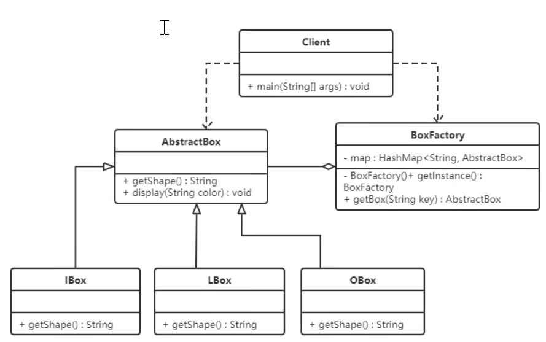

[toc]

# 1. 设计原则

**使用设计模式的目的**

- 代码重用性
- 可读性
- 可扩展性
- 可靠性
- 符合低内聚、高耦合的特性

## 1.1 单一职责原则

  一个类应该只负责一项职责。

**单一职责原则注意事项**

1. 降低类的复杂度
2. 降低类的可读性，可维护性
3. 降低变更引起的风险
4. 通常情况下应该遵守单一职责原则。只有类中方法数量足够少，可以在方法级别保持单一职责原则。

## 1.2 接口隔离原则

  客户端不应该依赖他不需要的接口，即一个类对另一个类的依赖应该建立在最小的接口上。

## 1.3 依赖倒置原则

1. 高层模块不应该依赖底层模块，二者都应该依赖其抽象。
2. 抽象不应该依赖细节，细节应该依赖抽象。
3. 依赖倒置的中心思想是面向接口编程。
4. 依赖倒置原则是基于这样的设计理念：对于细节的多变性，抽象的东西要稳定很多，以抽象为基础搭建的架构比以细节为基础的架构要稳定得多。在Java中，抽象指的是接口或抽象类，细节就是具体实现类。
5. 使用接口或抽象类的目的是制定规范，而不涉及任何具体的操作，把展现细节的任务交给实现类。

## 1.4 里氏替换

  应用程序中任何父类对象出现的地方，我们都可以用其子类的对象来替换，并且可以保证原有程序的逻辑行为和正确性。

1. 尽量不要重写父类方法，子类只能通过新添加方法来扩展功能。
2. 如果继承是为了多态，那么应该将父类定义为抽象类，并定义抽象方法，让子类重新实现父类。

## 1.5 开闭原则

1. 一个软件实体如类，模块和函数应该对扩展开放，对修改关闭。用抽象构建框架，用实现拓展细节。
2. 软件需要变化时，尽量通过扩展实体行为来实现变化，而不是通过修改已有的代码来实现变化。

## 1.6 迪米特法则

  一个类对自己依赖的类知道得越少越好。对于被依赖的类不管多么复杂，都尽量将逻辑封装在类的内部。陌生变量最好不要以局部变量的方式出现在类的内部。

> 迪米特法则不希望类之间建立直接的联系。如果真的有需要建立联系，也希望能通过它的友元类来转达。因此，应用迪米特法则有可能造成的一个后果就是：系统中存在大量的中介类，这些类之所以存在完全是为了传递类之间的相互调用关系——这在一定程度上增加了系统的复杂度。

## 1.7 合成复用原则

尽量使用合成/聚合的方式，而不是使用继承。

# 2 设计模式分类

1. **创建型模式**：单例模式、抽象工厂模式、原型模式、建造者模式、工厂模式。
2. **结构型模式**：适配器模式、桥接模式、装饰模式、组合模式、外观模式、享元模式、代理模式。
3. **行为型模式**：模板方法模式、命令模式、访问者模式、迭代器模式、观察者模式、中介者模式、备忘录模式、解释器模式（Interpreter模式）、状态模式、策略模式、责任链模式。

# 3 创建型模式

## 3.1 单例模式

  单例设计模式就是采用一定的方法保证整个的软件系统中，对某个类只能存在一个对象实例。

1. 饿汉式（静态常量）:

   

   ```java
   package singleton;
   
   public class Singleton {
   
       private final static Singleton instance = new Singleton();
   
       private Singleton() {
   
       }
   
       public static Singleton getInstance() {
           return instance;
       }
   }
   
   ```

2. 饿汉式(静态代码块)

   

   ```java
   package singleton;
   
   public class Singleton1 {
   
       private static final Singleton1 instance;
   
       private Singleton1() {
   
       }
   
       static {
           instance = new Singleton1();
       }
   
       public static Singleton1 getInstance() {
           return instance;
       }
   }
   
   
   ```

3. 懒汉式(线程不安全)

   

   ```java
   package singleton;
   
   public class Singleton2 {
       private static Singleton2 instance;
   
       public Singleton2() {
       }
   
       public static Singleton2 getInstance(){
           if (instance == null){
               return instance = new Singleton2();
           }
           return instance;
       }
   }
   ```

4. 懒汉式(线程安全，同步方法)

   

   ```java
   package singleton;
   
   public class Singleton3 {
       private static Singleton3 instance;
   
       public Singleton3() {
       }
   
       public static synchronized Singleton3 getInstance(){
           if (instance == null){
               return instance = new Singleton3();
           }
           return instance;
       }
   }
   ```

5. 懒汉式（双重检查）

   

   ```java
   package singleton;
   
   public class Singleton4 {
       private static Singleton4 instance;
   
       public Singleton4() {
       }
   
       public static Singleton4 getInstance(){
           if (instance == null){
               synchronized (Singleton4.class) {
                   if (instance == null) {
                       return instance = new Singleton4();
                   }
               }
           }
           return instance;
       }
   }
   ```

6. 静态内部类

   

   ```java
   package singleton;
   
   public class Singleton5 {
       private Singleton5() {
       }
   
       private static class SingleInstance {
           private static final Singleton5 instance = new Singleton5();
       }
   
       public static Singleton5 getInstance() {
           return SingleInstance.instance;
       }
   }
   ```

7. 枚举类

   

   ```java
   package singleton;
   
   public enum Singleton6 {
       INSTANCE;
   
       public void whateverMethod() {
       }
   }
   ```


## 3.2 工厂模式

### 3.2.1 简单工厂模式


```java
package factory.simple;

public class SimpleFactory {

    public Pizza createPizza(String type) {
         Pizza pizza = null;
         switch (type){
             case "cheese":
                 pizza = new CheesePizza(type);
                 break;
             case "greek":
                 pizza = new GreekPizza(type);
                 break;
             default:
                 break;
         }
         return pizza;
    }
}

---
package factory.simple;

public abstract class Pizza {

    protected  String name;

    public Pizza(String name) {
        this.name = name;
    }

    public abstract void prepare();
    public void bake(){
        System.out.println(name+"baking;");
    }
    public void cut(){
        System.out.println(name+"cutting;");
    }
    public void box(){
        System.out.println(name+"boxing;");
    }

    public void print(){
        prepare();
        bake();
        cut();
        box();
    }
}

---
package factory.simple;

public class GreekPizza extends Pizza {
    public GreekPizza(String name) {
        super(name);
    }

    public void prepare() {
        System.out.println("给希腊pizza准备原材料");
    }
}
---
package factory.simple;

public class CheesePizza extends Pizza {
    public CheesePizza(String name) {
        super(name);
    }

    public void prepare() {
        System.out.println("给奶酪pizza准备原材料");
    }
}
---
package factory.simple;

public class OrderPisa {
    public static void main(String[] args) {
        SimpleFactory simpleFactory = new SimpleFactory();
        simpleFactory.createPizza("cheese").print();
        simpleFactory.createPizza("greek").print();
    }
}
```

> 简单工厂模式可以设置成静态的。

### 3.2.2 抽象工厂模式


```java
package factory.abstracted;

import factory.simple.Pizza;

public interface AbstractFactory {
    Pizza createPizza(String type);
}
---
package factory.abstracted;

import factory.simple.Pizza;

public class BJFactory implements AbstractFactory {
    @Override
    public Pizza createPizza(String type) {
        Pizza pizza = null;
        switch (type){
            case "cheese":
                pizza = new BJCheesePizza(type);
                break;
            case "greek":
                pizza = new BJGreekPizza(type);
                break;
            default:
                break;
        }
        return pizza;
    }
}
---
package factory.abstracted;

import factory.simple.Pizza;

public class LDFactory implements AbstractFactory {
    @Override
    public Pizza createPizza(String type) {
        Pizza pizza = null;
        switch (type){
            case "cheese":
                pizza = new LDCheesePizza(type);
                break;
            case "greek":
                pizza = new LDGreekPizza(type);
                break;
            default:
                break;
        }
        return pizza;
    }
}
---
package factory.abstracted;

import factory.simple.Pizza;

public class LDCheesePizza extends Pizza {
    public LDCheesePizza(String name) {
        super(name);
    }

    @Override
    public void prepare() {
        System.out.println("准备伦敦奶酪pizza");
    }
}
---
package factory.abstracted;

import factory.simple.Pizza;

public class LDGreekPizza extends Pizza {
    public LDGreekPizza(String name) {
        super(name);
    }

    @Override
    public void prepare() {
        System.out.println("准备伦敦希腊pizza");
    }
}

---
package factory.abstracted;

import factory.simple.Pizza;

public class BJGreekPizza extends Pizza {
    public BJGreekPizza(String name) {
        super(name);
    }

    @Override
    public void prepare() {
        System.out.println("准备北京希腊pizza");
    }
}
---
package factory.abstracted;

import factory.simple.Pizza;

public class BJCheesePizza extends Pizza {
    public BJCheesePizza(String name) {
        super(name);
    }

    @Override
    public void prepare() {
        System.out.println("准备北京奶酪pizza");
    }
}
---
package factory.abstracted;

public class OrderPizza {
    public static void main(String[] args) {
        AbstractFactory abstractFactory = new BJFactory();
        AbstractFactory abstractFactory1 = new LDFactory();
        abstractFactory.createPizza("cheese").print();
        abstractFactory.createPizza("greek").print();
        abstractFactory1.createPizza("cheese").print();
        abstractFactory1.createPizza("greek").print();
    }
}

```

## 3.3 克隆模式


```java
package propotype;

public class Sheep implements Cloneable {
    private String name;
    private String color;
    private int age;

    public Sheep() {
    }

    public Sheep(String name, String color, int age) {
        this.name = name;
        this.color = color;
        this.age = age;
    }

    public String getName() {
        return name;
    }

    public void setName(String name) {
        this.name = name;
    }

    public String getColor() {
        return color;
    }

    public void setColor(String color) {
        this.color = color;
    }

    public int getAge() {
        return age;
    }

    public void setAge(int age) {
        this.age = age;
    }

    @Override
    public String toString() {
        return "Sheep{" +
                "name='" + name + '\'' +
                ", color='" + color + '\'' +
                ", age=" + age +
                '}';
    }

    @Override
    protected Sheep clone() {
        try {
            return (Sheep) super.clone();
        } catch (CloneNotSupportedException e) {
            return null;
        }
    }
}
```

> java实现要点：实现Cloneable接口，重写clone方法。存在深拷贝和浅拷贝的问题。

## 3.4 建造者模式

  建造者模式（Builder Pattern）使用多个简单的对象一步一步构建成一个复杂的对象。这种类型的设计模式属于创建型模式，它提供了一种创建对象的最佳方式。在一些基本部件不会变，而其组合经常变化的时候使用。

  与工厂模式的区别是：建造者模式更加关注与零件装配的顺序。


**案例：**


```java
package builder;

public abstract class Builder {
    protected Bike bike = new Bike();
    public abstract void builderFrame();
    public abstract void builderSeat();
    public abstract Bike createBike();
}
---

package builder;

public class Bike {
    private String frame;
    private String seat;

    public String getFrame() {
        return frame;
    }

    public void setFrame(String frame) {
        this.frame = frame;
    }

    public String getSeat() {
        return seat;
    }

    public void setSeat(String seat) {
        this.seat = seat;
    }
}
---    
package builder;

public class MobileBuilder extends Builder {

    @Override
    public void builderFrame() {
        bike.setFrame("碳纤维车架");
    }

    @Override
    public void builderSeat() {
        bike.setSeat("真皮车座");
    }

    @Override
    public Bike createBike() {
        return bike;
    }
}
 
---
package builder;

public class OfoBuilder extends Builder {

    @Override
    public void builderFrame() {
        bike.setFrame("路合金车架");
    }

    @Override
    public void builderSeat() {
        bike.setSeat("橡胶车座");
    }

    @Override
    public Bike createBike() {
        return bike;
    }
}

---
package builder;

public class Director {
    private final Builder builder;

    public Director(Builder builder) {
        this.builder = builder;
    }

    public Bike construct(){
        builder.builderFrame();
        builder.builderSeat();
        return builder.createBike();
    }
}

---
package builder;

public class Client {
    public static void main(String[] args) {
        Director director = new Director(new MobileBuilder());
        Bike bike = director.construct();
        System.out.println(bike.getFrame());
        System.out.println(bike.getSeat());
    }
}
```


建造者模式除了上面的用途外，在开发中还有一个常用的使用方式，当一个类的构造器需要传入很多参数时，如果构建这个类的实例可读性会非常差，而且容易引入错误，此时可以使用建造者模式重构。

## 3.5 总结


# 4 结构型模式


## 4.1 代理模式


### 4.1.1 静态代理


### 4.1.2 JDK动态代理


```java
package proxy.jdkproxy;

import proxy.staticproxy.SellTickets;
import proxy.staticproxy.TrainStation;

import java.lang.reflect.InvocationHandler;
import java.lang.reflect.Method;
import java.lang.reflect.Proxy;

public class ProxyFactory {

    private final TrainStation trainStation = new TrainStation();

    public SellTickets getProxyObject() {
        SellTickets proxyObject = (SellTickets) Proxy.newProxyInstance(
                trainStation.getClass().getClassLoader(),
                trainStation.getClass().getInterfaces(),
                new InvocationHandler() {
                    /**
                     * @param proxy 代理对象，和proxyObject是同一个对象，invoke方法基本不用
                     * @param method 对接口中方法进行封装的method对象
                     * @param args 调用方法的实际参数
                     * @return 方法的返回值
                     * @throws Throwable 异常
                     */
                    @Override
                    public Object invoke(Object proxy, Method method, Object[] args) throws Throwable {
                        System.out.println("invoke方法执行了");
                        System.out.println("代收点收取费用");
                        return method.invoke(trainStation, args);
                    }
                });
        return proxyObject;
    }
}
```

### 4.1.3 CGLIB动态代理


```java
package proxy.cglibproxy;


import net.sf.cglib.proxy.Enhancer;
import net.sf.cglib.proxy.MethodInterceptor;
import net.sf.cglib.proxy.MethodProxy;

import java.lang.reflect.Method;

public class ProxyFactory implements MethodInterceptor {

    private final TrainStation trainStation = new TrainStation();

    public TrainStation getProxyObject() {
        //创建Enhancer对象，类似JDK代理中的Proxy
        Enhancer enhancer = new Enhancer();
        //设置父类的字节码对象
        enhancer.setSuperclass(TrainStation.class);
        //设置回调函数
        enhancer.setCallback(this);
        //创建代理对象
        TrainStation trainStationObject = (TrainStation) enhancer.create();
        return trainStationObject;
    }

    @Override
    public Object intercept(Object o, Method method, Object[] objects, MethodProxy methodProxy) throws Throwable {
        System.out.println("方法执行了");
        if ("sell".equals(method.getName()))
            System.out.println("代售点收取一定费用");
        //要调用目标对象的方法
        Object obj = method.invoke(trainStation, objects);
        return obj;
    }
}
```

  **对这个对象所有非final方法的调用都会转发给`MethodInterceptor.intercept()`方法**，在`intercept()`方法里我们可以加入任何逻辑，比如修改方法参数，加入日志功能、安全检查功能等；通过调用`MethodProxy.invokeSuper()`方法，我们将调用转发给原始对象，具体到本例，就是`HelloConcrete`的具体方法。

> 注意：对于从Object中继承的方法，CGLIB代理也会进行代理，如`hashCode()`、`equals()`、`toString()`等，但是`getClass()`、`wait()`等方法不会，因为它是final方法，CGLIB无法代理。

### 4.1.4 三种代理的对比


### 4.1.5 优缺点


### 4.1.6 使用场景


## 4.2 适配器模式


### 4.2.1 类适配器模式

实现方式：定义一个适配器类来实现当前系统的业务接口，同时又继承现有的组件库中已经存在的组件。


```java
package adapter.classadapter;

public interface SDCard {
    String readSD();
    void writeSD(String context);
}
---
package adapter.classadapter;

public class SDCardImpl implements SDCard {
    @Override
    public String readSD() {
        return "SDCard read msg: hello SDCard";
    }

    @Override
    public void writeSD(String context) {
        System.out.println("SDCard write msg:" + context);
    }
}
---
package adapter.classadapter;

public interface TFCard {
    String readTF();
    void writeTF(String context);
}
---
package adapter.classadapter;

public class TFCardImpl implements TFCard {
    @Override
    public String readTF() {
        return "TFCard read msg: hello TFCard";
    }

    @Override
    public void writeTF(String context) {
        System.out.println("TFCard write msg:" + context);
    }
}
---
package adapter.classadapter;

public class SDAdapterTF extends TFCardImpl implements SDCard {
    @Override
    public String readSD() {
        System.out.println("adapter read TFCard");
        return super.readTF();
    }

    @Override
    public void writeSD(String context) {
        System.out.println("adapter write TFCard");
        super.writeTF(context);
    }
}
---    
package adapter.classadapter;

public class Computer {

    public String readSD(SDCard sdCard) {
        if (sdCard == null) {
            System.out.println("SDCard 不能为空");
            return null;
        }
        return sdCard.readSD();
    }

}
---    
package adapter.classadapter;

public class Client {
    public static void main(String[] args) {
        Computer computer = new Computer();
        System.out.println(computer.readSD(new SDCardImpl()));
        System.out.println("------");
        System.out.println(computer.readSD(new SDAdapterTF()));
    }
}

```


  类适配器违背了合成复用原则。类适配器是客户类有一个接口规范的情况下可用，反之不可用。

### 4.2.2 对象适配器模式


```java
package adapter.objectadapter;

import adapter.classadapter.SDCard;
import adapter.classadapter.TFCard;

public class SDAdapterTF implements SDCard {

    private final TFCard tfCard;

    public SDAdapterTF(TFCard tfCard) {
        this.tfCard = tfCard;
    }

    @Override
    public String readSD() {
        System.out.println("adapter read TFCard");
        return tfCard.readTF();
    }

    @Override
    public void writeSD(String context) {
        System.out.println("adapter write TFCard");
        tfCard.writeTF(context);
    }
}
```

> 注意：还有一个适配器模式是接口适配器。当不希望实现一个接口中所有方法时，可以创建一个Adapter,实现所有方法，我们此时只需要继承该抽象类即可。

### 4.2.3 应用场景


## 4.3 装饰者模式

定义：指在不改变现有对象结构的情况下，动态地给对象增加一些职责(即增加其额外功能)的模式。


### 4.3.1 案例


```java
package decorator;

public abstract class FastFood {
    private float price;
    private String desc;

    public FastFood() {
    }

    public FastFood(float price, String desc) {
        this.price = price;
        this.desc = desc;
    }

    public float getPrice() {
        return price;
    }

    public void setPrice(float price) {
        this.price = price;
    }

    public String getDesc() {
        return desc;
    }

    public void setDesc(String desc) {
        this.desc = desc;
    }

    abstract float cost();
}
---
package decorator;

public class FriedRice extends FastFood {

    public FriedRice() {
        super(10, "炒饭");
    }

    @Override
    float cost() {
        return getPrice();
    }
}
---
package decorator;

public class FriedNoodles extends FastFood {

    public FriedNoodles() {
        super(12, "炒面");
    }

    @Override
    float cost() {
        return getPrice();
    }
}
---
package decorator;

public class Egg extends Garnish {

    public Egg(FastFood fastFood) {
        super(fastFood, 1, "鸡蛋");
    }

    @Override
    float cost() {
        return getPrice() + getFastFood().cost();
    }

    @Override
    public String getDesc() {
        return super.getDesc() + getFastFood().getDesc();
    }
}
---
package decorator;

public class Bacon extends Garnish {

    public Bacon(FastFood fastFood) {
        super(fastFood, 2, "培根");
    }

    @Override
    float cost() {
        return getPrice() + getFastFood().cost();
    }

    @Override
    public String getDesc() {
        return super.getDesc() + getFastFood().getDesc();
    }
}
---
package decorator;

public abstract class Garnish extends FastFood {
    private FastFood fastFood;

    public Garnish(FastFood fastFood, float price, String desc) {
        super(price, desc);
        this.fastFood = fastFood;
    }

    public FastFood getFastFood() {
        return fastFood;
    }

    public void setFastFood(FastFood fastFood) {
        this.fastFood = fastFood;
    }
}
---
package decorator;

public class Client {
    public static void main(String[] args) {
        FastFood food = new FriedRice();
        System.out.println(food.getDesc() + ":" + food.cost());
        System.out.println("-------");
        food = new Egg(food);
        System.out.println(food.getDesc() + ":" + food.cost());
        System.out.println("--------");
        food = new Egg(food);
        System.out.println(food.getDesc() + ":" + food.cost());
        System.out.println("--------");
        food = new Bacon(food);
        System.out.println(food.getDesc() + ":" + food.cost());
    }
}


```


### 4.3.2 使用场景


### 4.3.3 代理和装饰者的区别


## 4.4 桥接模式

  将抽象与实现分离，使他们可以独立变化。它是用组合关系代替继承关系来实现，从而降低了抽象和实现这两个可变维度的耦合度。


```java
package brige;

public interface VideoFile {
    void decode(String fileName);
}
---
package brige;

public class AviFile implements VideoFile {
    @Override
    public void decode(String fileName) {
        System.out.println("avi视频文件：" + fileName);
    }
}
---
package brige;

public class RmvFile implements VideoFile {
    @Override
    public void decode(String fileName) {
        System.out.println("rmv视频文件：" + fileName);
    }
}
---
package brige;

public abstract class OperationSystem {

    protected VideoFile videoFile;

    public OperationSystem(VideoFile videoFile) {
        this.videoFile = videoFile;
    }

    public abstract void play(String fileName);
}
---
package brige;

public class Windows extends OperationSystem {

    public Windows(VideoFile videoFile) {
        super(videoFile);
    }

    @Override
    public void play(String fileName) {
        videoFile.decode(fileName);
    }
}
---
package brige;

public class Mac extends OperationSystem {

    public Mac(VideoFile videoFile) {
        super(videoFile);
    }

    @Override
    public void play(String fileName) {
        videoFile.decode(fileName);
    }
}
---
package brige;

public class Client {
    public static void main(String[] args) {
        OperationSystem system = new Mac(new AviFile());
        system.play("1234");
    }
}
```


**使用场景**


## 4.5 外观模式


```java
package facade;

public class TV {

    public void on(){
        System.out.println("打开电视机....");
    }

    public void off(){
        System.out.println("关闭电视机....");
    }
}
---
package facade;

public class Light {

    public void on(){
        System.out.println("打开电灯....");
    }

    public void off(){
        System.out.println("关闭电灯....");
    }
}
---
package facade;

public class AirCondition {

    public void on(){
        System.out.println("打开空调....");
    }

    public void off(){
        System.out.println("关闭空调....");
    }
}
---
package facade;

public class SmartApplianceFacade {

    private Light light;
    private TV tv;
    private AirCondition airCondition;

    public SmartApplianceFacade() {
        this.light = new Light();
        this.tv = new TV();
        this.airCondition = new AirCondition();
    }

    public void say(String msg){
        if (msg.contains("打开")){
            on();
        }else if (msg.contains("关闭")){
            off();
        }else {
            System.out.println("我还听不懂你说些什么。");
        }
    }

    private void on(){
        light.on();
        tv.on();
        airCondition.on();
    }

    private void off(){
        light.off();
        tv.off();
        airCondition.off();
    }
}
---
package facade;

public class Client {

    public static void main(String[] args) {
        SmartApplianceFacade facade = new SmartApplianceFacade();
        facade.say("打开家电");
        System.out.println("----");
        facade.say("关闭家电");
    }
}
```


**Tomcat中使用到的位置**


## 4.6 组合模式


## 4.7 享元模式





# 5 行为型模式


## 5.1 模板方法模式

  定义一个操作的算法骨架，而将算法的一些步骤延迟到子类中，使得子类可以不改变该算法结构的情况下重新定义该算法的某些特定步骤。


## 5.2 策略模式

  该模式定义了一系列算法，并将每个算法封装起来，使它们可以互相替换，且算法的变化不会影响使用算法的客户。策略模式属于对象行为模式，他通过对算法进行封装，把使用算法的责任和算法的实现分割开来，并委派给不同的对象对这些算法进行管理。


## 5.3 命令模式

  将一个请求封装为一个对象，使发出请求的责任和执行请求的责任分割开。这样两者之间通过命令对象进行沟通，这样方便将命令对象进行存储，传递，调用，增加和管理。


## 5.4 责任链模式

  又名责任链模式，为了避免请求发送者与多个请求者耦合在一起，将所有请求的处理者通过前一对象记住其下一个对象的引用而连成一条链；当有请求发生时，可将请求沿着这条链传递，直到有对象处理它为止。


## 5.5 状态模式

  对有状态的对象，把复杂的判断逻辑提取到不同的状态对象中，允许状态对象在其内部状态发生变化时改变其行为。


## 5.6 观察者模式

  又被称为发布-订阅模式，它定义了一种一对多的依赖，让多个观察者对象同时监听某一个主题对象。这个主题对象在状态变化时，会通知所有的观察者对象，使他们能够自动更新自己。


## 5.7 中介者模式

  又叫调停模式，定义一个中介角色来封装一系列对象之间的交互，使原有对象之间的松散耦合，使原有对象之间的耦合松散，且可以独立地改变他们之间的交互。


## 5.8 迭代器模式

  提供一个对象来顺序访问聚合对象中的一系列数据，而不暴露聚合对象的内部表示。


## 5.9 访问者模式

  封装一些作用于某种数据结构中的各元素的操作，它可以在不改变这个数据结构的前提下定义作用于这些元素的新的操作。


## 5.10 备忘录模式

  又叫快照模式，在不破坏封装性的前提下，捕获一个对象的内部状态，并在该对象之外保存这个状态，以便以后需要时能够将该对象恢复到原先保存的状态。


## 5.11 解释器模式

  给定一个语言，定义它的文法表示，并定义一个解释器，这个解释器使用该标识来解释语言中的语句。


